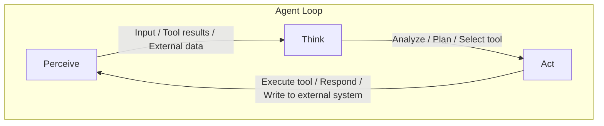

## はじめに

AIエージェントは、単なるチャットボットとは異なり、**自律的に判断し、行動し、結果を観察する**ことで目標を達成するシステムです。この章では、エージェントの核となるアーキテクチャ、推論パターン、そして主要フレームワークの違いを理解していきます。

エージェントを正しく設計するためには、「エージェントがどのように考え、動くのか」という根本的な仕組みを押さえることが不可欠です。

---

## エージェントアーキテクチャ: Perceive-Think-Act

エージェントの基本構造は、古典的AI研究から受け継がれた **Perceive-Think-Act（知覚-思考-行動）** のループで説明できます。

### 3つのフェーズ



それぞれのフェーズを具体的に見ていきましょう。

**Perceive（知覚）** は、エージェントが外部から情報を受け取る段階です。ユーザーからの指示、ツール実行の結果、APIからの応答など、あらゆる入力がここに含まれます。LLMベースのエージェントでは、これらの情報はすべてテキスト（メッセージ）として処理されます。

**Think（思考）** は、LLMが中心的な役割を果たすフェーズです。受け取った情報を解釈し、「次に何をすべきか」を推論します。ツールを呼ぶべきか、ユーザーに回答すべきか、追加情報が必要かといった判断がここで行われます。

**Act（行動）** は、思考の結果を実行に移すフェーズです。ツールの呼び出し、ファイルの操作、APIリクエストの送信などの具体的なアクションを実行します。

### なぜループが重要なのか

エージェントの本質は、この3フェーズを **繰り返す** ことにあります。1回の思考と行動だけでは解決できない複雑なタスクでも、ループを回すことで段階的に目標に近づいていけます。

例えば「プロジェクトのバグを修正して」という指示を受けた場合、エージェントは以下のようにループを回します。

1. ファイル一覧を取得する（Act） → 結果を観察する（Perceive）
2. エラーの原因を推測する（Think） → 該当ファイルを読む（Act）
3. コードの問題箇所を特定する（Think） → 修正を適用する（Act）
4. テストを実行する（Act） → 結果を確認する（Perceive）
5. 成功を確認し、ユーザーに報告する（Think → Act）

---

## ReActパターン

### ReActとは

**ReAct（Reasoning + Acting）** は、2022年にYaoらによって提案されたパターンで、LLMに「推論の過程を言語化させながら行動させる」アプローチです。現在のほぼすべてのエージェントフレームワークが、このパターンを基盤としています。

ReActの核心は、**思考（Thought）** → **行動（Action）** → **観察（Observation）** のサイクルを明示的に行う点にあります。

### ReActの具体的な流れ

```
ユーザー: 「東京とニューヨークの現在の気温を比較して」

Thought 1: 東京とニューヨークの気温を知る必要がある。
           まず東京の天気情報を取得しよう。
Action 1:  get_weather(city="Tokyo")
Observation 1: {"city": "Tokyo", "temp_c": 22, "condition": "晴れ"}

Thought 2: 東京は22°C。次にニューヨークの情報を取得しよう。
Action 2:  get_weather(city="New York")
Observation 2: {"city": "New York", "temp_c": 15, "condition": "曇り"}

Thought 3: 両都市の気温が分かった。比較して回答しよう。
           東京22°C、ニューヨーク15°C。東京が7°C高い。
Action 3:  最終回答を返す

最終回答: 現在、東京は22°C（晴れ）、ニューヨークは15°C（曇り）です。
         東京のほうが7°C高くなっています。
```

### なぜReActが効果的なのか

ReActが単純なChain-of-Thought（CoT）やゼロショット行動よりも優れている理由は3つあります。

1. **推論の透明性**: 思考過程が言語化されるため、なぜその行動を選んだのかが追跡できます。デバッグや品質改善に直結します
2. **動的な計画修正**: 観察結果に基づいて次の行動を柔軟に変えられます。事前に全手順を決める必要がありません
3. **幻覚の抑制**: 推測で回答するのではなく、ツールを使って事実を確認してから回答するため、誤情報のリスクが低減します

### ReActをコードで表現する

ReActパターンの骨格を、擬似的なPythonコードで見てみましょう。

```python
def react_loop(user_message: str, tools: list, llm) -> str:
    """ReActパターンの基本ループ"""
    messages = [{"role": "user", "content": user_message}]

    while True:
        # Think: LLMが思考し、次の行動を決定
        response = llm.generate(messages, tools=tools)

        # 最終回答の場合はループ終了
        if response.is_final_answer:
            return response.text

        # Act: ツールを実行
        for tool_call in response.tool_calls:
            result = execute_tool(tool_call.name, tool_call.args)

            # Perceive: 実行結果を観察として追加
            messages.append({"role": "tool", "content": result})

        # ループを継続して次のThinkへ
```

このシンプルなループこそが、エージェントの心臓部です。フレームワークによってAPIや抽象度は異なりますが、この構造は共通しています。

---

## 主要フレームワーク比較

2025-2026年現在、AIエージェント開発で主に使われるフレームワークは **LangChain**、**LlamaIndex**、**Claude Agent SDK** の3つです。それぞれの設計思想と得意分野を見ていきましょう。

### LangChain / LangGraph

**設計思想**: コンポーザブルなビルディングブロック

LangChainは、LLM呼び出し、プロンプト、ツール、メモリといった要素を **独立した部品（コンポーネント）** として提供し、それらを自由に組み合わせてアプリケーションを構築するフレームワークです。

```python
from langchain_anthropic import ChatAnthropic
from langchain.agents import AgentExecutor, create_tool_calling_agent
from langchain.tools import tool
from langchain_core.prompts import ChatPromptTemplate

# ツール定義
@tool
def search_web(query: str) -> str:
    """Webを検索して結果を返す"""
    return f"'{query}' の検索結果: ..."

# LLM + プロンプト + ツール を組み合わせてエージェント構築
llm = ChatAnthropic(model="claude-sonnet-4-20250514")
prompt = ChatPromptTemplate.from_messages([
    ("system", "あなたは有能なアシスタントです。"),
    ("human", "{input}"),
    ("placeholder", "{agent_scratchpad}")
])

agent = create_tool_calling_agent(llm, [search_web], prompt)
executor = AgentExecutor(agent=agent, tools=[search_web], verbose=True)
result = executor.invoke({"input": "最新のAIニュースを教えて"})
```

**LangGraph** は、LangChainの上に構築されたオーケストレーションレイヤーで、**状態を持つグラフ構造**でエージェントのワークフローを定義します。条件分岐、ループ、並列実行など複雑なフローを宣言的に記述できるのが強みです。

**適しているケース**:
- 既存ツールやインテグレーションを豊富に活用したい場合
- 複雑な条件分岐を持つワークフローを構築する場合
- LangSmithによる本番監視・トレーシングが必要な場合

### LlamaIndex

**設計思想**: データ接続とインデックス構築に特化

LlamaIndexは、さまざまなデータソース（PDF、データベース、API、Webページなど）をLLMに接続するためのフレームワークです。**RAG（Retrieval-Augmented Generation）** のパイプライン構築に最も強みを持ちます。

```python
from llama_index.core import VectorStoreIndex, SimpleDirectoryReader
from llama_index.core.agent import ReActAgent
from llama_index.core.tools import QueryEngineTool, ToolMetadata
from llama_index.llms.anthropic import Anthropic

# ドキュメントの読み込みとインデックス構築
documents = SimpleDirectoryReader("./data").load_data()
index = VectorStoreIndex.from_documents(documents)

# クエリエンジンをツールとしてラップ
query_tool = QueryEngineTool(
    query_engine=index.as_query_engine(),
    metadata=ToolMetadata(
        name="knowledge_base",
        description="社内ドキュメントを検索して回答を取得する"
    )
)

# ReActエージェントとして構築
llm = Anthropic(model="claude-sonnet-4-20250514")
agent = ReActAgent.from_tools(
    tools=[query_tool],
    llm=llm,
    verbose=True
)
response = agent.chat("直近の売上レポートの要点を教えて")
```

**適しているケース**:
- 大量のドキュメントに対するQ&Aシステムを構築する場合
- 構造化・非構造化データを横断的に検索する必要がある場合
- RAGパイプラインの品質を細かくチューニングしたい場合

### Claude Agent SDK

**設計思想**: 最小限の抽象化と完全な制御

Anthropicが提供する公式SDKで、**フレームワークの魔法に頼らず、エージェントループの全ステップを開発者がコントロール**できることが最大の特徴です。MCP（Model Context Protocol）とのネイティブ統合も強みです。

```python
import anthropic

client = anthropic.Anthropic()

tools = [
    {
        "name": "read_file",
        "description": "ファイルの内容を読み取る",
        "input_schema": {
            "type": "object",
            "properties": {
                "path": {"type": "string", "description": "ファイルパス"}
            },
            "required": ["path"]
        }
    }
]

def run_agent(user_message: str) -> str:
    messages = [{"role": "user", "content": user_message}]

    while True:
        response = client.messages.create(
            model="claude-sonnet-4-20250514",
            max_tokens=4096,
            system="あなたはファイル操作エージェントです。",
            tools=tools,
            messages=messages
        )

        # 最終回答ならループ終了
        if response.stop_reason == "end_turn":
            return "".join(
                b.text for b in response.content if hasattr(b, "text")
            )

        # ツール呼び出しを処理
        tool_results = []
        for block in response.content:
            if block.type == "tool_use":
                result = execute_tool(block.name, block.input)
                tool_results.append({
                    "type": "tool_result",
                    "tool_use_id": block.id,
                    "content": result
                })

        messages.append({"role": "assistant", "content": response.content})
        messages.append({"role": "user", "content": tool_results})
```

**適しているケース**:
- エージェントの挙動を細部まで制御したい場合
- MCPサーバーと連携するエージェントを構築する場合
- フレームワークの依存を最小限に抑えたい場合
- プロトタイプを最速で作りたい場合

### 3フレームワーク比較表

| 観点 | LangChain / LangGraph | LlamaIndex | Claude Agent SDK |
|------|----------------------|------------|-----------------|
| **設計思想** | コンポーザブルな部品 | データ接続特化 | 最小限の抽象化 |
| **得意領域** | 汎用エージェント・複雑なワークフロー | RAG・ドキュメント検索 | カスタムエージェント |
| **学習曲線** | 中〜高 | 中 | 低 |
| **カスタマイズ性** | 高 | 中 | 最高 |
| **エコシステム** | 最大（ツール・連携が豊富） | RAG関連が充実 | MCP統合 |
| **依存パッケージ数** | 多い（20+） | 中程度（10+） | 最小（1） |
| **マルチエージェント** | LangGraph経由で対応 | 基本的な対応 | 手動実装 |
| **本番運用** | LangSmithで監視 | 独自の評価ツール | 自前で構築 |
| **コミュニティ** | 最大 | 大きい | 成長中 |
| **LLMプロバイダー** | マルチプロバイダー | マルチプロバイダー | Anthropic専用 |

---

## エージェントループの仕組み

ここまでの概念を統合して、エージェントループの具体的な仕組みを見ていきましょう。

### ループの全体フロー

エージェントループは次の手順で動作します。

1. ユーザーの入力を `messages` 配列に追加する
2. `messages` をLLM APIに送信する
3. レスポンスの `stop_reason` を確認する
4. `end_turn` なら最終回答を返してループ終了
5. `tool_use` ならツールを実行し、結果を `messages` に追加して手順2へ戻る

### messagesの変遷を追う

エージェントループの理解で最も重要なのは、**messages配列がどのように変化していくか**を把握することです。

```python
# ターン1: ユーザーの入力
messages = [
    {"role": "user", "content": "data.csvの行数を教えて"}
]
# → LLMがtool_useを返す → assistantの応答をmessagesに追加

# ターン1: ツール実行結果を追加
messages = [
    {"role": "user", "content": "data.csvの行数を教えて"},
    {"role": "assistant", "content": [
        {"type": "tool_use", "id": "call_1",
         "name": "read_file", "input": {"path": "data.csv"}}
    ]},
    {"role": "user", "content": [
        {"type": "tool_result", "tool_use_id": "call_1",
         "content": "id,name,value\n1,Alice,100\n2,Bob,200\n..."}
    ]}
]
# → 再度LLMに送信 → stop_reason == "end_turn" でループ終了
```

### ループの安全装置

実用的なエージェントには、無限ループや暴走を防ぐ安全装置が必要です。以下の3つは必ず組み込みましょう。

- **最大ターン数の制限**: `for turn in range(MAX_TURNS)` でループ回数を制限します
- **ツールエラー回数の制限**: エラーが `MAX_TOOL_ERRORS` 回を超えたら中断します
- **タイムアウト**: 長時間実行を検知して停止します

```python
MAX_TURNS = 20
MAX_TOOL_ERRORS = 3

for turn in range(MAX_TURNS):
    response = client.messages.create(...)
    if response.stop_reason == "end_turn":
        return extract_text(response)

    for block in response.content:
        if block.type == "tool_use":
            try:
                result = execute_tool(block.name, block.input)
            except Exception as e:
                error_count += 1
                if error_count >= MAX_TOOL_ERRORS:
                    return "エラーが続いたため中断しました。"
```

---

## まとめ

| 項目 | ポイント |
|------|---------|
| **Perceive-Think-Act** | エージェントは知覚→思考→行動のループで動作します |
| **ReActパターン** | 推論を言語化しながら行動することで、透明性と精度が向上します |
| **LangChain** | エコシステム最大。複雑なワークフローにはLangGraphと組み合わせます |
| **LlamaIndex** | RAGとデータ接続に特化。ドキュメント検索に強みがあります |
| **Claude Agent SDK** | 最小依存で完全制御。MCP統合とプロトタイピングに最適です |
| **エージェントループ** | messages配列の変遷を理解することが設計の鍵です |
| **安全装置** | 最大ターン数・エラー上限・タイムアウトを必ず組み込みます |
| **フレームワーク選定** | タスクの複雑さに合った最小限の抽象度を選ぶのが原則です |

---

## やってみよう！

以下の実践課題に取り組んで、この章の内容を手を動かして確認してみましょう。

**課題1: ReActの手動トレース（15分）**
紙やメモ帳を使って、「天気予報APIとカレンダーAPIを使って、明日の外出予定に傘が必要か判断する」タスクのReActトレース（Thought → Action → Observation）を5ステップ分手書きしてみましょう。エージェントの思考の流れを体感できます。

**課題2: 最小エージェントの実装（30分）**
Claude Agent SDKを使って、ファイルの読み書きができるエージェントを実装してみましょう。上記のコード例をベースに、`read_file`と`write_file`の2つのツールを実装し、「ファイルを読んで要約を別ファイルに書き出す」タスクを実行させてみてください。

**課題3: フレームワーク選定の判断（20分）**
以下の3つのシナリオについて、LangChain・LlamaIndex・Claude Agent SDKのどれが最適か、理由とともに考えてみましょう。
- シナリオA: 100本のPDF論文を横断検索するQ&Aボット
- シナリオB: GitHubのIssueを自動トリアージするエージェント
- シナリオC: 承認フロー付きのレポート自動生成パイプライン
