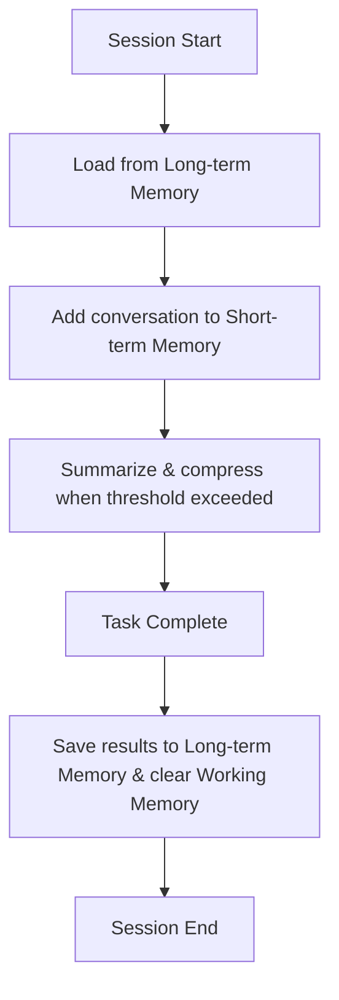

AIエージェントが「賢く」振る舞うために欠かせない要素、それが**メモリシステム**です。人間が会話の文脈を覚え、過去の経験から学ぶように、エージェントにも記憶の仕組みが必要です。

この章では、エージェントのメモリを**短期メモリ**・**作業メモリ**・**長期メモリ**の3層に分けて理解し、それぞれの実装パターンとメモリ管理戦略を学んでいきます。

## メモリがないとどうなるか

まず、メモリを持たないエージェントの問題を確認しましょう。

**メモリなしエージェント:**

| Turn | Input | Output | |
|------|-------|--------|-|
| 1 | 「私の名前は田中です」 | 「こんにちは田中さん」 | |
| 2 | 「私の名前は？」 | 「わかりません」 | 忘れている |

**メモリありエージェント:**

| Turn | Input | Output | |
|------|-------|--------|-|
| 1 | 「私の名前は田中です」 | 「こんにちは田中さん」 | 記憶に保存 |
| 2 | 「私の名前は？」 | 「田中さんですね」 | 記憶を参照 |

LLM単体はステートレスです。毎回のリクエストは独立しており、前のやり取りを覚えていません。エージェントが文脈を保持するには、明示的なメモリの設計が不可欠です。

## メモリの3層構造

エージェントのメモリは、人間の記憶モデルに対応させると理解しやすくなります。

| 層 | 人間の記憶 | エージェントでの実体 | 寿命 |
|---|---|---|---|
| 短期メモリ | 短期記憶（会話の流れ） | 会話履歴バッファ | 1セッション |
| 作業メモリ | ワーキングメモリ（暗算中の一時保持） | タスクの中間結果・計画 | 1タスク |
| 長期メモリ | 長期記憶（経験・知識） | ベクトルDB・ファイル | 永続 |

それでは、各層の詳細と実装パターンを順に見ていきます。

## 短期メモリ（会話履歴）

短期メモリは、現在のセッション内の会話履歴を管理します。最もシンプルな実装は、全メッセージをリストに格納する**会話バッファ**です。

```python
class ConversationBufferMemory:
    """最もシンプルな短期メモリ: 全履歴を保持"""

    def __init__(self):
        self.messages = []

    def add(self, role: str, content: str):
        self.messages.append({"role": role, "content": content})

    def get_context(self) -> list:
        return self.messages.copy()

    def clear(self):
        self.messages = []
```

この方法は単純ですが、会話が長くなるとメッセージ数が際限なく増えてしまいます。LLMにはコンテキストウィンドウの上限があるため、全履歴を渡し続けるとすぐに限界に達します。

この問題を解決するために、後述の**スライディングウィンドウ**や**要約メモリ**といった管理戦略が必要になります。

## 作業メモリ

作業メモリは、1つのタスクを遂行する間だけ使う一時的な記憶領域です。人間が暗算をする際に中間結果を頭の中に保持するのと同じ役割を果たします。

```python
class WorkingMemory:
    """タスク遂行中の中間結果を管理"""

    def __init__(self):
        self.scratchpad = {}   # 中間結果の保存先
        self.plan_steps = []   # タスクの実行計画
        self.current_step = 0

    def set(self, key: str, value):
        self.scratchpad[key] = value

    def get(self, key: str, default=None):
        return self.scratchpad.get(key, default)

    def clear(self):
        """タスク完了時にクリア"""
        self.scratchpad.clear()
        self.plan_steps = []
        self.current_step = 0
```

ReActやPlan-and-Executeパターンでエージェントが「考えた内容」を一時的に保持するために使われます。タスクが完了したら `clear()` でリセットし、重要な結果だけを長期メモリに移行させます。

## 長期メモリ（ベクトルDB）

長期メモリは、セッションをまたいで永続的に情報を保持する仕組みです。実現の鍵となるのが**RAG（Retrieval-Augmented Generation）**と**ベクトルDB**です。

### RAGの仕組み

RAGは、外部の知識ストアから関連情報を検索し、LLMの生成に組み合わせるアーキテクチャです。

```
1. 保存フェーズ（オフライン）
テキスト → チャンク分割 → 埋め込みモデル → ベクトルDBに格納

2. 検索・生成フェーズ（オンライン）
ユーザーの質問 → 埋め込みモデル → ベクトルDBで類似検索
                                        ↓
                検索結果 + 質問 → LLM → 回答を生成
```

### ベクトルDBを使った長期メモリの実装

以下は ChromaDB を使った実装例です。

```python
from sentence_transformers import SentenceTransformer
import chromadb
import uuid

class RAGMemory:
    """ベクトルDBによる長期メモリ"""

    def __init__(self, collection_name: str = "agent_memory"):
        self.embedder = SentenceTransformer("all-MiniLM-L6-v2")
        self.client = chromadb.PersistentClient(path="./memory_db")
        self.collection = self.client.get_or_create_collection(
            name=collection_name,
            metadata={"hnsw:space": "cosine"}
        )

    def store(self, text: str, metadata: dict = None):
        """テキストをベクトル化して保存"""
        embedding = self.embedder.encode(text).tolist()
        self.collection.add(
            ids=[str(uuid.uuid4())],
            embeddings=[embedding],
            documents=[text],
            metadatas=[metadata or {}]
        )

    def retrieve(self, query: str, top_k: int = 5) -> list[str]:
        """クエリに類似した記憶を検索"""
        query_embedding = self.embedder.encode(query).tolist()
        results = self.collection.query(
            query_embeddings=[query_embedding],
            n_results=top_k
        )
        return results["documents"][0]
```

`store()` でテキストをベクトル化して保存し、`retrieve()` で意味的に近い記憶を検索します。「FastAPIが好き」と保存しておけば、「Webフレームワークの好みは？」という質問でも検索にヒットします。これがセマンティック検索の強みです。

### チャンキング戦略

長文をベクトルDBに保存する際は、適切なサイズに分割（チャンキング）する必要があります。チャンクサイズの目安は **300〜800トークン** です。小さすぎると文脈が失われ、大きすぎるとノイズが混入します。

```python
def chunk_by_tokens(text: str, chunk_size: int = 500,
                     overlap: int = 50) -> list[str]:
    """トークン数ベースのチャンク化（オーバーラップ付き）"""
    words = text.split()
    chunks = []
    for i in range(0, len(words), chunk_size - overlap):
        chunk = " ".join(words[i:i + chunk_size])
        if chunk.strip():
            chunks.append(chunk)
    return chunks
```

`overlap` を設定することで、チャンク境界での情報の断絶を防ぎます。

### ベクトルDBの選び方

| ストア | 特徴 | 適した規模 |
|---|---|---|
| ChromaDB | セットアップ不要、組み込み型 | プロトタイプ〜小規模 |
| PostgreSQL + pgvector | 既存DBを活用可能 | 小〜中規模の本番 |
| Pinecone | フルマネージド、高スケーラビリティ | 大規模の本番 |
| Weaviate / Milvus | セルフホスト可能 | オンプレミス本番 |

## メモリ管理戦略

短期メモリが膨張する問題に対処するための、代表的な管理戦略を紹介します。

### スライディングウィンドウ

直近N件のメッセージだけを保持し、古いものを切り捨てるシンプルな方法です。

```python
class SlidingWindowMemory:
    def __init__(self, window_size: int = 20):
        self.messages = []
        self.window_size = window_size

    def add(self, role: str, content: str):
        self.messages.append({"role": role, "content": content})
        if len(self.messages) > self.window_size:
            self.messages = self.messages[-self.window_size:]
```

メモリ使用量が一定に保たれるメリットがある一方、ウィンドウから外れた古い情報が完全に失われるデメリットがあります。

### 要約メモリ

古い会話履歴をLLMで要約し、圧縮して保持する方法です。

```python
class SummaryMemory:
    def __init__(self, llm, max_tokens: int = 2000):
        self.llm = llm
        self.summary = ""
        self.recent_messages = []
        self.max_tokens = max_tokens

    def add(self, role: str, content: str):
        self.recent_messages.append({"role": role, "content": content})
        if self._count_tokens() > self.max_tokens:
            self._compress()

    def _compress(self):
        old_messages = self.recent_messages[:-4]
        prompt = f"以下の会話を200字以内で要約: {old_messages}"
        self.summary = self.llm.generate(prompt)
        self.recent_messages = self.recent_messages[-4:]

    def get_context(self) -> list:
        context = []
        if self.summary:
            context.append({"role": "system",
                            "content": f"会話の要約: {self.summary}"})
        context.extend(self.recent_messages)
        return context
```

情報の圧縮率が高い一方、要約の過程で重要な詳細が失われるリスクがあります。

### ハイブリッド方式（推奨）

実用的には、スライディングウィンドウと要約を組み合わせた**ハイブリッド方式**が最も効果的です。要約・重要な事実・直近のメッセージの3つを組み合わせてコンテキストを構築します。

```python
class HybridMemory:
    def __init__(self, llm, window_size: int = 10):
        self.llm = llm
        self.window_size = window_size
        self.summary = ""
        self.messages = []
        self.important_facts = []

    def add(self, role: str, content: str):
        self.messages.append({"role": role, "content": content})
        if role == "user":
            self._extract_facts(content)
        if len(self.messages) > self.window_size:
            overflow = self.messages[:-self.window_size]
            self._update_summary(overflow)
            self.messages = self.messages[-self.window_size:]

    def get_context(self) -> list:
        context = []
        if self.summary:
            context.append({"role": "system",
                            "content": f"会話の要約: {self.summary}"})
        if self.important_facts:
            facts = "\n".join(f"- {f}" for f in self.important_facts)
            context.append({"role": "system",
                            "content": f"重要な事実:\n{facts}"})
        context.extend(self.messages)
        return context
```

### 管理戦略の比較

| 戦略 | メモリ使用量 | 文脈保持 | LLMコスト | 適した場面 |
|---|---|---|---|---|
| 全履歴バッファ | 高（線形増加） | 完全 | 高 | 短い会話のみ |
| スライディングウィンドウ | 固定 | 直近のみ | 中 | 一般的な対話 |
| 要約メモリ | 低 | 要約で圧縮 | 中（要約コスト） | 長時間の会話 |
| ハイブリッド | 中 | 要約+直近 | 中 | バランス重視（推奨） |

## 統合メモリシステムの実装パターン

実践的なエージェントでは、短期・作業・長期メモリを統合して使います。

```python
class IntegratedMemory:
    """短期 + 作業 + 長期を統合したメモリシステム"""

    def __init__(self, llm, rag_memory: RAGMemory):
        self.short_term = HybridMemory(llm)
        self.working = {}
        self.long_term = rag_memory

    def add_conversation(self, role: str, content: str):
        self.short_term.add(role, content)

    def set_working(self, key: str, value):
        self.working[key] = value

    def get_context(self, current_query: str) -> dict:
        """現在の文脈を統合して返す"""
        return {
            "conversation": self.short_term.get_context(),
            "relevant_memories": self.long_term.retrieve(
                current_query, top_k=3),
            "working_data": self.working
        }

    def end_task(self, task_summary: str):
        """タスク終了: 結果を長期メモリに保存、作業メモリをクリア"""
        self.long_term.store(task_summary,
                             metadata={"type": "task_result"})
        self.working.clear()
```

### メモリのライフサイクル

統合メモリシステムでは、以下のライフサイクルでメモリが管理されます。



## よくあるアンチパターン

メモリシステムの設計でよくある失敗を3つ紹介します。

**1. 無制限の会話履歴をそのままLLMに渡す**

全履歴を渡すとコンテキスト超過エラーになります。`HybridMemory` のような圧縮戦略を必ず適用してください。

**2. 長期メモリの全件をプロンプトに含める**

全記憶をプロンプトに入れるのではなく、RAGでクエリに関連する記憶だけを `top_k` 件検索して含めます。

**3. 同じ情報を毎ターン重複保存する**

保存前に既存の記憶を検索し、変更があった場合のみ保存するようにします。重複排除の仕組みがないと、メモリが急速に肥大化します。

## まとめ

| 項目 | 内容 |
|---|---|
| 3層構造 | 短期（セッション）・作業（タスク）・長期（永続）の3層で記憶を管理する |
| 短期メモリ | 会話履歴を保持する。バッファ / ウィンドウ / 要約 / ハイブリッドの4パターン |
| 作業メモリ | タスク遂行中の中間結果・計画を一時保持し、完了後にクリアする |
| 長期メモリ | ベクトルDB + RAGでセマンティック検索を実現し、セッション横断の記憶を持つ |
| 管理戦略 | 要約メモリとスライディングウィンドウのハイブリッドが実用的 |
| チャンキング | 300〜800トークン + オーバーラップが目安 |
| 核心原則 | 全記憶を渡すのではなく、関連する記憶だけを効率的に取得する |

## やってみよう！

- [ ] `ConversationBufferMemory` を実装し、10ターンの会話を記録してみましょう
- [ ] `SlidingWindowMemory` でウィンドウサイズを5に設定し、古いメッセージが消える挙動を確認しましょう
- [ ] ChromaDB をインストールし、`RAGMemory` クラスで5件の事実を保存・検索してみましょう
- [ ] 短期メモリと長期メモリを組み合わせた `IntegratedMemory` を構築し、セッション終了時に重要情報が長期メモリに移行されることを確認しましょう
- [ ] 要約メモリを実装し、20ターンの会話を圧縮してコンテキストサイズがどれだけ削減されるか測定してみましょう
