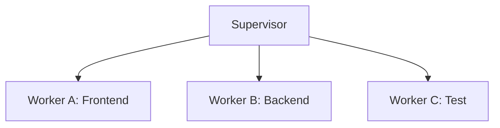
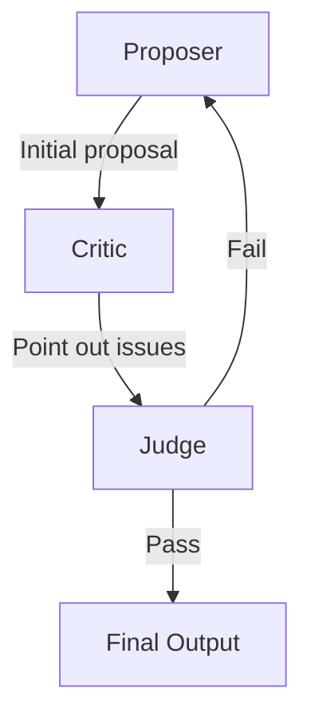
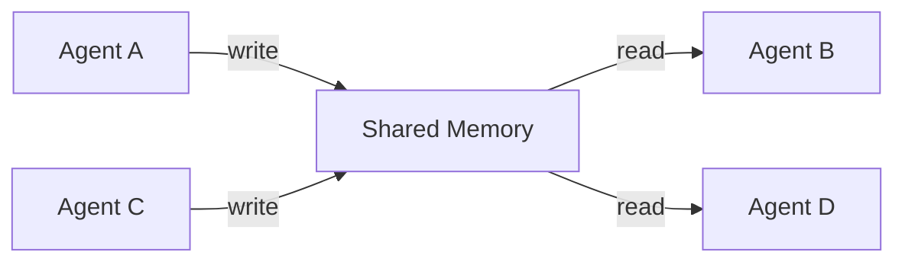
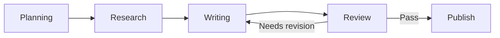

## マルチエージェントアーキテクチャとは

AIエージェント開発において、1つのエージェントでは対処しきれない複雑なタスクに直面することがあります。マルチエージェントアーキテクチャは、複数のエージェントがそれぞれの専門性を持ち、協調してタスクを遂行する設計手法です。

```
シングルエージェントの限界:
  "Webアプリを設計・実装・テストしてほしい"
  → 1つのLLMが全てを担当 → コンテキスト溢れ・専門性不足

マルチエージェント:
  [アーキテクト] → 設計を担当
  [コーダー]     → 実装を担当
  [テスター]     → テストを担当
  → 各エージェントが得意分野に集中し、品質が向上する
```

マルチエージェントを導入するかどうかは、以下の観点で判断します。

- **必要なスキル領域が3つ以上**ある
- 推定ステップ数が**20ステップを超える**
- **並行処理**で高速化できる余地がある
- コンテキストウィンドウの**溢れリスク**がある

これらの条件に複数当てはまる場合、マルチエージェント構成を検討する価値があります。


## 3大パターン: Supervisor / Swarm / Debate

マルチエージェントシステムには、大きく分けて3つのパターンがあります。

### Supervisor（委任）パターン

Supervisorパターンは、1つの管理エージェント（Supervisor）がタスクを分解し、専門ワーカーに委任する階層型の構成です。



Supervisorの役割は3つあります。

1. タスクを適切な粒度に**分解**する
2. 各ワーカーの専門性を考慮して**割り当て**る
3. ワーカーの結果を**統合**して最終成果物を作成する

```python
import anthropic, json

class SupervisorSystem:
    """Supervisorパターンの基本実装"""

    def __init__(self):
        self.client = anthropic.Anthropic()
        self.workers: dict[str, dict] = {}

    def add_worker(self, name: str, skills: list[str], system_prompt: str):
        self.workers[name] = {"skills": skills, "system_prompt": system_prompt}

    def run(self, goal: str) -> dict:
        # 1. Supervisorがタスクを分解・割り当て
        plan = self._create_plan(goal)
        # 2. 各ワーカーが担当タスクを実行
        results = {}
        for assignment in plan:
            worker = self.workers[assignment["worker"]]
            response = self.client.messages.create(
                model="claude-sonnet-4-20250514",
                max_tokens=4096,
                system=worker["system_prompt"],
                messages=[{"role": "user", "content": assignment["task"]}]
            )
            results[assignment["worker"]] = response.content[0].text
        # 3. Supervisorが結果を統合
        return self._integrate(goal, results)
```

ポイントは、Supervisorが「何を誰に任せるか」を決定し、ワーカーは自分の専門領域だけに集中できる点です。ソフトウェア開発やデータ分析パイプラインなど、タスクを明確に分割できるケースに適しています。

### Swarm（協調）パターン

Swarmパターンは、対等なエージェントがパイプライン的に連携する構成です。各エージェントが前段階の出力を受け取り、自分の処理を加えて次に渡します。

```
[リサーチャー] → [アナリスト] → [ライター]
   情報収集        分析・洞察      レポート作成
```

Supervisorパターンとの大きな違いは、**管理者がいない**点です。各エージェントは対等な立場で、決められた順序に従って処理を進めます。

```python
class SwarmSystem:
    """Swarm（協調パイプライン）パターン"""

    def __init__(self):
        self.client = anthropic.Anthropic()
        self.pipeline: list[dict] = []

    def add_agent(self, name: str, role: str, system_prompt: str):
        self.pipeline.append({"name": name, "role": role, "system_prompt": system_prompt})

    def run(self, task: str) -> str:
        current_output = task
        for agent in self.pipeline:
            response = self.client.messages.create(
                model="claude-sonnet-4-20250514",
                max_tokens=4096,
                system=agent["system_prompt"],
                messages=[{"role": "user", "content": f"""
元のタスク: {task}
前段階の出力: {current_output}
あなたの役割（{agent['role']}）に基づいて処理してください。"""}]
            )
            current_output = response.content[0].text
        return current_output
```

研究レポート作成やコンテンツ制作など、「調査 → 分析 → 執筆」のように工程が直列に並ぶケースに適しています。

### Debate（議論）パターン

Debateパターンは、提案者・批判者・審判者の3つの役割で議論を回し、回答品質を反復的に向上させるパターンです。



```python
class DebateSystem:
    """Debateパターン: 提案→批判→判定の反復"""

    def __init__(self, max_rounds: int = 3):
        self.client = anthropic.Anthropic()
        self.max_rounds = max_rounds

    def run(self, question: str) -> dict:
        proposal = self._call("論理的で包括的な回答を提示してください。", question)

        for round_num in range(self.max_rounds):
            criticism = self._call(
                "提案の弱点を建設的に指摘してください。",
                f"質問: {question}\n提案: {proposal}"
            )
            judgment = self._call(
                "提案の品質を判定してください。PASS または FAIL で回答。",
                f"質問: {question}\n提案: {proposal[:1000]}\n批判: {criticism[:1000]}"
            )
            if "PASS" in judgment.upper():
                return {"result": proposal, "rounds": round_num + 1}
            proposal = self._call(
                "批判を踏まえて提案を改善してください。",
                f"質問: {question}\n前回の提案: {proposal}\n批判: {criticism}"
            )
        return {"result": proposal, "rounds": self.max_rounds}

    def _call(self, system: str, content: str) -> str:
        r = self.client.messages.create(
            model="claude-sonnet-4-20250514", max_tokens=4096,
            system=system, messages=[{"role": "user", "content": content}]
        )
        return r.content[0].text
```

コードレビューや意思決定支援など、**複数の視点から品質を検証したい**場面に効果を発揮します。


## タスク分解と委譲

マルチエージェントシステムの成否は、タスクをどう分解するかにかかっています。

### 分解の3原則

1. **専門性で分ける**: 必要なスキルが異なるタスクを分離します
2. **依存関係を明示する**: どのタスクがどのタスクの完了を前提とするかを定義します
3. **粒度を揃える**: 1つのタスクが大きすぎても小さすぎても非効率です

```
良い分解の例（ユーザー認証機能）:
  タスク1: DB設計（テーブル定義）        → 依存なし
  タスク2: API実装（認証エンドポイント） → タスク1に依存
  タスク3: フロントUI（ログイン画面）    → 依存なし
  タスク4: 結合テスト                    → タスク2, 3に依存

悪い分解の例:
  タスク1: "認証機能を全部作る"          → 粒度が大きすぎる
  タスク2: "変数名を決める"              → 粒度が小さすぎる
```

### 依存関係とスケジューリング

タスク間の依存関係を解決して実行順序を決定する仕組みが必要です。依存関係がないタスクは並列実行でき、処理時間を短縮できます。

```python
def schedule_tasks(assignments: list[dict]) -> list[list[dict]]:
    """依存関係を解決して実行バッチを生成する"""
    completed, remaining, batches = set(), list(range(len(assignments))), []
    while remaining:
        batch = [i for i in remaining
                 if all(d in completed for d in assignments[i].get("depends_on", []))]
        if not batch:
            raise ValueError("循環依存を検出しました")
        batches.append([assignments[i] for i in batch])
        completed.update(batch)
        remaining = [i for i in remaining if i not in completed]
    return batches
```


## エージェント間通信

エージェント同士がどのように情報をやり取りするかは、システムの柔軟性と拡張性に大きく影響します。

### 直接通信

最もシンプルな方式です。エージェントAの出力をエージェントBの入力に直接渡します。2〜3エージェントの小規模な構成に適しています。

### ブラックボード（共有メモリ）

全エージェントがアクセスできる共有データストアを用意し、各エージェントが必要なデータを読み書きします。



```python
from threading import Lock

class Blackboard:
    """エージェント間の共有メモリ"""
    def __init__(self):
        self._data, self._lock = {}, Lock()

    def write(self, agent: str, key: str, value):
        with self._lock:
            self._data[key] = {"value": value, "author": agent}

    def read(self, key: str):
        with self._lock:
            entry = self._data.get(key)
            return entry["value"] if entry else None
```

### メッセージキュー

非同期処理に適した方式です。エージェントがメッセージをキューに投入し、対象のエージェントがキューから取り出して処理します。スケーラビリティが高く、大規模システムに向いています。

### 通信方式の選び方

| 方式 | 適した構成 | メリット | デメリット |
|------|-----------|---------|-----------|
| 直接通信 | 2〜3エージェント | 実装がシンプル | スケールしにくい |
| ブラックボード | 状態共有が必要 | 柔軟なデータ参照 | 競合制御が必要 |
| メッセージキュー | 大規模・非同期 | 高いスケーラビリティ | 実装が複雑 |


## ワークフロー設計

マルチエージェントの処理フローをどう設計するかは、信頼性と保守性に直結します。

### DAGベースのフロー

ワークフローをDAG（有向非巡回グラフ）として設計すると、処理が必ず終了することが保証されます。各ノードがエージェントの処理に対応し、エッジが処理の流れを表します。



### LangGraphでの実装例

LangGraphを使うと、状態管理付きのワークフローをグラフとして定義できます。

```python
from langgraph.graph import StateGraph, END
from typing import TypedDict, Annotated
import operator

class WorkflowState(TypedDict):
    task: str
    draft: str
    review: str
    iteration: int
    messages: Annotated[list[str], operator.add]

def writer(state: WorkflowState) -> dict:
    return {"draft": "...", "messages": ["[Writer] 完了"]}

def reviewer(state: WorkflowState) -> dict:
    return {
        "review": "...",
        "iteration": state.get("iteration", 0) + 1,
        "messages": ["[Reviewer] 完了"]
    }

def should_continue(state: WorkflowState) -> str:
    if state.get("iteration", 0) >= 3:
        return "end"
    if state.get("review") and "合格" in state["review"]:
        return "end"
    return "revise"

workflow = StateGraph(WorkflowState)
workflow.add_node("writer", writer)
workflow.add_node("reviewer", reviewer)
workflow.set_entry_point("writer")
workflow.add_edge("writer", "reviewer")
workflow.add_conditional_edges(
    "reviewer", should_continue, {"revise": "writer", "end": END}
)
app = workflow.compile()
```

### 設計上の注意点

- **最大反復回数を必ず設定する**: ループの上限がないと無限ループになります
- **エラー情報を握りつぶさない**: 前段の失敗を次のエージェントに正しく伝えないと、連鎖的に品質が低下します
- **エージェント数を最小限にする**: 2〜3エージェントで済むなら、それが最適です


## アンチパターンに注意する

マルチエージェント開発でよくある失敗を押さえておきましょう。

**エージェント数の膨張**: 役割が重複するエージェントを大量に作ると、コストと調整の手間が増えるだけです。「リサーチャー」「データ収集」「情報分析」は1つの「リサーチャー」にまとめられます。

**無限ループ**: Debateパターンで終了条件を設けないと、提案と批判が永遠に繰り返されます。必ず `max_rounds` を設定してください。

**暗黙の依存関係**: グローバル変数を介してエージェント間でデータを共有すると、実行順序の前提が暗黙的になり、バグの温床になります。依存関係は明示的に定義しましょう。


## まとめ

| 項目 | ポイント |
|------|---------|
| Supervisorパターン | 管理エージェントがタスクを分解し、専門ワーカーに委任する |
| Swarmパターン | 対等なエージェントがパイプラインで順次処理する |
| Debateパターン | 提案→批判→判定の反復で回答品質を向上させる |
| タスク分解 | 専門性で分け、依存関係を明示し、粒度を揃える |
| エージェント間通信 | 直接通信・ブラックボード・メッセージキューから規模に応じて選択 |
| ワークフロー設計 | DAGベースで設計し、最大反復回数を必ず設定する |
| エージェント数 | 2〜3体で十分なケースがほとんど。増やすよりツールを充実させる |
| コスト意識 | エージェント数 x ステップ数でAPIコストが増大する |


## やってみよう！

以下の演習に取り組んで、マルチエージェントパターンの理解を深めましょう。

1. **Supervisorパターンを実装する**: 「ブログ記事を書く」というゴールに対して、リサーチャー・ライター・編集者の3ワーカーを持つSupervisorシステムを構築してみてください

2. **Debateパターンで品質を検証する**: 「Pythonでのエラーハンドリングのベストプラクティス」というテーマでDebateシステムを動かし、ラウンドごとに回答がどう改善されるか観察してください

3. **通信方式を比べてみる**: 同じタスクを直接通信とブラックボード方式の両方で実装し、コードの複雑さとデバッグのしやすさを比較してみてください

4. **コストを計測する**: 各パターンで同じタスクを実行し、APIの呼び出し回数とトークン消費量を記録して、コスト効率を比較してみてください
