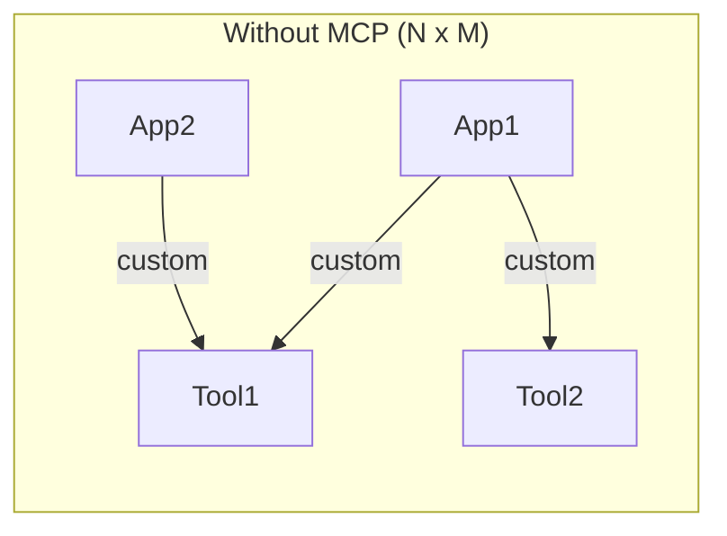
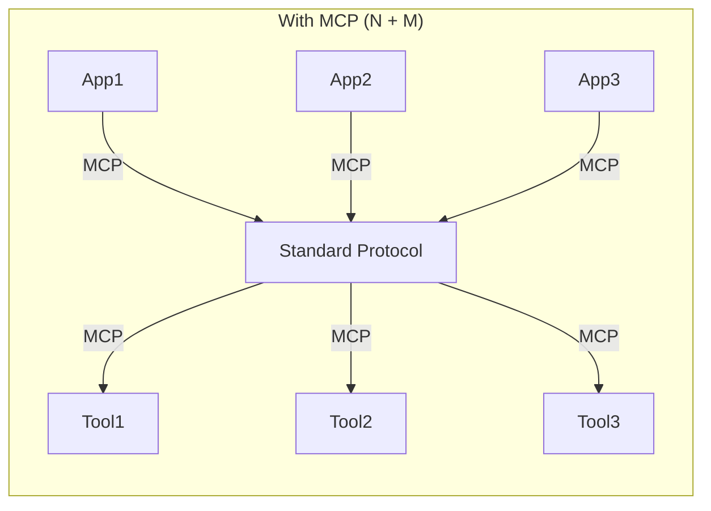
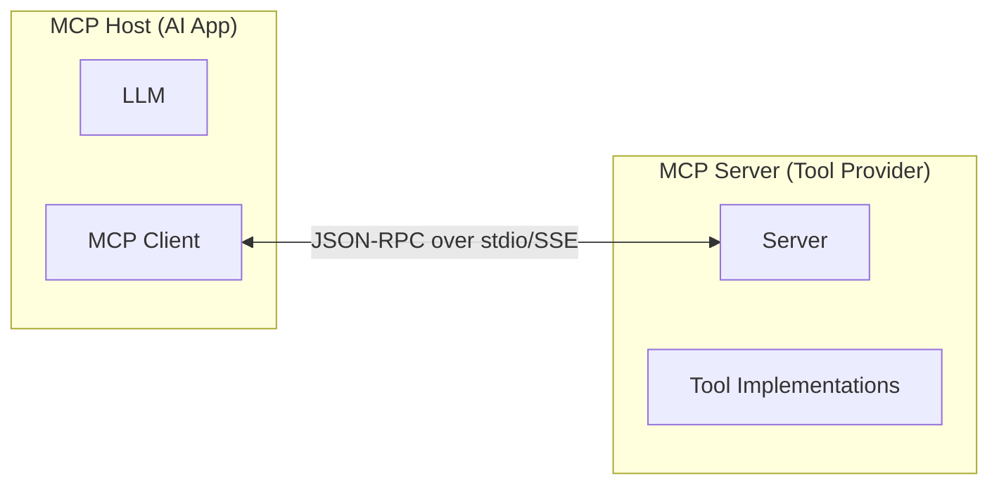

## この章で学ぶこと

前章までで LangChain / LangGraph によるエージェント構築を学びました。この章では、Anthropic が提唱する **MCP（Model Context Protocol）** と **Claude Agent SDK** を使い、AI とツールを標準プロトコルで接続する方法を解説します。

---

## 11.1 MCPとは何か

MCP（Model Context Protocol）は、**AI アプリケーションとツール/データソースを接続するためのオープン標準プロトコル** です。Anthropic が提唱しました。

従来、AI アプリごとにツール連携を個別実装する必要がありました（N x M 問題）。MCP は「USB のような標準規格」でこれを解決します。





MCP サーバーを一度作れば、Claude Desktop・Claude Code・Cursor など MCP 対応のあらゆるホストから利用できます。

### アーキテクチャ

MCP は **クライアント / サーバーモデル** を採用しています。通信は **JSON-RPC 2.0** で行われ、トランスポートには **stdio**（ローカル）と **SSE**（リモート）があります。



### 4つの機能カテゴリ

| カテゴリ | 説明 | 選択主体 | 例 |
|---------|------|---------|-----|
| **Tools** | LLM が呼び出せるアクション | LLM が判断 | DB 検索、API 呼び出し |
| **Resources** | 文脈として提供するデータ | ユーザー/アプリ | ドキュメント、設定 |
| **Prompts** | 再利用可能なテンプレート | ユーザーが選択 | コードレビュー |
| **Sampling** | サーバーから LLM への呼び出し | サーバー | 再帰的処理 |

最もよく使われるのは **Tools** です。LLM が「このツールを使うべきだ」と自律的に判断し、実行します。

---

## 11.2 MCPサーバーの実装

MCP サーバーは Python SDK（`mcp` パッケージ）で実装できます。

```python
from mcp.server import Server
from mcp.types import Tool, TextContent
from mcp.server.stdio import stdio_server
import json, asyncio

app = Server("my-tools")

@app.list_tools()
async def list_tools() -> list[Tool]:
    return [
        Tool(
            name="search_users",
            description="ユーザーをキーワードで検索します。",
            inputSchema={
                "type": "object",
                "properties": {
                    "keyword": {"type": "string", "description": "検索キーワード"},
                    "limit": {"type": "integer", "default": 10}
                },
                "required": ["keyword"]
            }
        )
    ]

@app.call_tool()
async def call_tool(name: str, arguments: dict) -> list[TextContent]:
    if name == "search_users":
        results = [{"id": 1, "name": "田中太郎"}, {"id": 2, "name": "田中花子"}]
        return [TextContent(type="text", text=json.dumps(results, ensure_ascii=False))]
    return [TextContent(type="text", text=f"不明なツール: {name}")]

async def main():
    async with stdio_server() as (read, write):
        await app.run(read, write)

if __name__ == "__main__":
    asyncio.run(main())
```

実装のポイントは 3 つです。

1. **`@app.list_tools()`** でツールの名前・説明・入力スキーマを宣言します
2. **`@app.call_tool()`** で実際の処理を実装します
3. **`stdio_server()`** で標準入出力を通じて通信します

---

## 11.3 MCPサーバーの設定

実装したサーバーは、設定ファイルに登録するだけで使えます。

```json
{
  "mcpServers": {
    "my-tools": {
      "command": "python",
      "args": ["mcp_server.py"],
      "env": { "DATABASE_URL": "sqlite:///data.db" }
    },
    "github": {
      "command": "npx",
      "args": ["-y", "@modelcontextprotocol/server-github"],
      "env": { "GITHUB_PERSONAL_ACCESS_TOKEN": "ghp_xxx" }
    }
  }
}
```

公式・コミュニティの MCP サーバーも豊富に用意されています。

| サーバー | パッケージ名 | 機能 |
|---------|-------------|------|
| Filesystem | `@modelcontextprotocol/server-filesystem` | ファイル読み書き |
| GitHub | `@modelcontextprotocol/server-github` | Issue, PR 操作 |
| PostgreSQL | `@modelcontextprotocol/server-postgres` | DB クエリ |
| Slack | `@modelcontextprotocol/server-slack` | メッセージ送受信 |
| Brave Search | `@modelcontextprotocol/server-brave-search` | Web 検索 |

---

## 11.4 Claude Agent SDKの基本

Claude Agent SDK は `anthropic` パッケージそのものです。追加フレームワークは不要です。

```bash
pip install anthropic
```

エージェントを構築する核心は「**ツール呼び出しのループ**」です。

```python
import anthropic, json

client = anthropic.Anthropic()

TOOLS = [{
    "name": "get_weather",
    "description": "指定された都市の天気を取得します。",
    "input_schema": {
        "type": "object",
        "properties": {"city": {"type": "string", "description": "都市名"}},
        "required": ["city"]
    }
}]

def execute_tool(name: str, input_data: dict) -> str:
    if name == "get_weather":
        return json.dumps({"city": input_data["city"], "weather": "晴れ", "temp": 22})
    return f"不明なツール: {name}"

def agent_loop(user_message: str, max_steps: int = 10) -> str:
    messages = [{"role": "user", "content": user_message}]

    for step in range(max_steps):
        response = client.messages.create(
            model="claude-sonnet-4-20250514",
            max_tokens=4096,
            tools=TOOLS,
            messages=messages
        )

        if response.stop_reason == "end_turn":
            return next(
                (b.text for b in response.content if hasattr(b, "text")), ""
            )

        tool_results = []
        for block in response.content:
            if block.type == "tool_use":
                result = execute_tool(block.name, block.input)
                tool_results.append({
                    "type": "tool_result",
                    "tool_use_id": block.id,
                    "content": result
                })

        messages.append({"role": "assistant", "content": response.content})
        messages.append({"role": "user", "content": tool_results})

    return "最大ステップ数に達しました。"
```

ループの流れは以下のとおりです。

1. ユーザーメッセージを送信します
2. LLM がツールの使用を判断します（`stop_reason == "tool_use"`）
3. ツールを実行し、結果を `tool_result` として返します
4. LLM が結果を見て、次のアクションか最終回答を決めます
5. `stop_reason == "end_turn"` になるまでループします

---

## 11.5 MCPツール統合

MCP サーバーのツールを Claude Agent SDK のエージェントに統合します。

```python
from mcp import ClientSession, StdioServerParameters
from mcp.client.stdio import stdio_client
import anthropic

async def run_mcp_agent(user_message: str) -> str:
    server_params = StdioServerParameters(
        command="python", args=["mcp_server.py"]
    )

    async with stdio_client(server_params) as (read, write):
        async with ClientSession(read, write) as session:
            await session.initialize()

            # MCPツールをAnthropic API形式に変換
            tools_response = await session.list_tools()
            anthropic_tools = [
                {
                    "name": t.name,
                    "description": t.description,
                    "input_schema": t.inputSchema
                }
                for t in tools_response.tools
            ]

            client = anthropic.Anthropic()
            messages = [{"role": "user", "content": user_message}]

            while True:
                response = client.messages.create(
                    model="claude-sonnet-4-20250514",
                    max_tokens=4096,
                    tools=anthropic_tools,
                    messages=messages
                )

                if response.stop_reason == "end_turn":
                    return next(
                        (b.text for b in response.content if hasattr(b, "text")), ""
                    )

                tool_results = []
                for block in response.content:
                    if block.type == "tool_use":
                        result = await session.call_tool(block.name, block.input)
                        tool_results.append({
                            "type": "tool_result",
                            "tool_use_id": block.id,
                            "content": result.content[0].text
                        })

                messages.append({"role": "assistant", "content": response.content})
                messages.append({"role": "user", "content": tool_results})
```

統合のポイントは 2 つです。

- MCP の `list_tools()` で取得したツール定義を Anthropic API 形式に変換します
- ツール実行は `session.call_tool()` で MCP サーバーに委譲します

---

## 11.6 実装のベストプラクティス

### ツール説明を具体的に書く

```python
# NG: 曖昧すぎてLLMが正しく使えない
Tool(name="search", description="検索する", ...)

# OK: 何を、どう検索するか明確
Tool(name="search_employees",
     description="社員データベースを名前・部署で検索します。部分一致に対応。", ...)
```

### エラーを握りつぶさない

```python
# NG
except Exception:
    return [TextContent(type="text", text="")]

# OK: LLMにエラー内容を伝えて次の判断を促す
except ValueError as e:
    return [TextContent(type="text", text=f"入力エラー: {e}")]
```

### stdout に出力しない

stdio トランスポートでは標準出力が通信チャネルです。ログは **stderr** に出力してください。

```python
import sys, logging
logging.basicConfig(stream=sys.stderr, level=logging.DEBUG)
```

### レスポンスサイズを制限する

ツール結果が巨大だと LLM のコンテキストを圧迫します。件数上限を設け、全体件数をメタ情報として添えましょう。

---

## 11.7 デバッグ

MCP サーバーの動作確認には **MCP Inspector** が便利です。

```bash
npx @modelcontextprotocol/inspector python mcp_server.py
```

ブラウザ上でツール一覧の確認、テスト実行、リソース読み取りを LLM を介さずに行えます。開発初期段階で非常に役立ちます。

---

## まとめ

| 項目 | 内容 |
|------|------|
| MCP とは | AI とツール間の標準接続プロトコル（Anthropic 提唱） |
| 解決する問題 | N x M のツール統合を N + M に削減 |
| 4 つの機能 | Tools, Resources, Prompts, Sampling |
| 通信方式 | stdio（ローカル）/ SSE（リモート） |
| サーバー実装 | Python / TypeScript SDK でツールを定義 |
| Claude Agent SDK | `anthropic` パッケージでエージェントループを構築 |
| MCP 統合 | `list_tools()` で取得 → API 形式に変換 → `call_tool()` で実行 |
| デバッグ | MCP Inspector で対話的にテスト |
| 注意点 | ツール説明は具体的に、エラーは明示的に、stdout 禁止 |

---

## やってみよう！

1. **MCP サーバーを作ってみる**: 好きな API（天気、ニュースなど）をラップした MCP サーバーを Python で実装し、MCP Inspector で動作確認してみましょう。

2. **Claude Desktop に接続する**: 作ったサーバーを設定ファイルに登録し、自然言語で操作してみましょう。「今日の天気は？」と話しかけるだけでツールが自動的に呼び出されます。

3. **エージェントループを実装する**: Claude Agent SDK で MCP ツールを活用するエージェントを構築し、`stop_reason` によるループ制御が正しく動くことを確認してください。

4. **複数サーバーを統合する**: GitHub サーバーと Filesystem サーバーを同時に設定し、「README.md を読んで Issue を作って」のようなクロスツール操作を試してみましょう。
