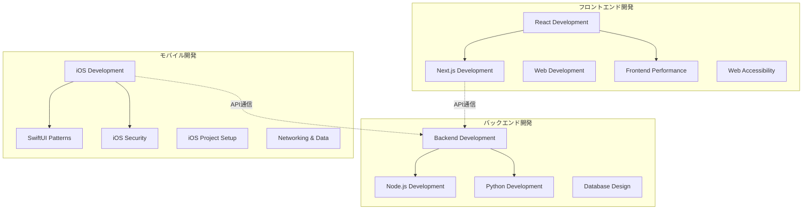

# Claude Code Skillsの基礎 - 529万字の知識体系

## この章で学ぶこと

- 26個のSkillsの全体像と設計思想
- カテゴリ別の分類と役割
- Skills間の関係性と学習パス
- 529万字という圧倒的な規模感
- 実際のSkillsファイル構造と活用方法

## 26個のSkills - 圧倒的な知識体系

Claude Code Skillsは、**26個の専門スキル**と**529万字**（約2,650ページ相当）の実践的知識で構成されています。これは一般的な技術書の約80-100冊分に相当する規模です。

### なぜこの規模が必要だったのか

プロダクション環境での開発は、単一の技術領域だけでは完結しません。フロントエンド、バックエンド、モバイル、品質保証、DevOps、ドキュメント管理まで、すべてが有機的に連携して初めて価値あるプロダクトが生まれます。

Claude Code Skillsは、この現実を反映した**包括的な知識体系**として設計されました。

## Skillsの全体構成

### カテゴリ別一覧

```
Claude Code Skills (26 Skills / 529万字)
├── フロントエンド開発 (5 Skills / 63万字)
├── バックエンド開発 (4 Skills / 102万字)
├── モバイル開発 (5 Skills / 71万字)
├── 品質保証 (3 Skills / 73万字)
├── DevOps (3 Skills / 46万字)
├── ナレッジ管理 (3 Skills / 29万字)
├── ツール開発 (3 Skills / 36万字)
└── その他 (1 Skill / 109万字)
```

### 文字数統計の詳細

| カテゴリ | スキル数 | 合計文字数 | 技術書換算 | 主な対象者 |
|---------|---------|-----------|-----------|-----------|
| **フロントエンド** | 5 | 約63万字 | 約15冊分 | フロントエンドエンジニア |
| **バックエンド** | 4 | 約102万字 | 約25冊分 | バックエンドエンジニア |
| **モバイル** | 5 | 約71万字 | 約18冊分 | iOSエンジニア |
| **品質保証** | 3 | 約73万字 | 約18冊分 | QA/テストエンジニア |
| **DevOps** | 3 | 約46万字 | 約12冊分 | DevOpsエンジニア |
| **ナレッジ管理** | 3 | 約29万字 | 約7冊分 | 全エンジニア |
| **ツール開発** | 3 | 約36万字 | 約9冊分 | 自動化エンジニア |
| **その他** | 1 | 約109万字 | 約27冊分 | 全エンジニア |
| **合計** | **26** | **約529万字** | **約130冊分** | - |

> **注**: 技術書1冊を平均4万字（約200ページ）として換算

## 1. フロントエンド開発 (5 Skills)

### React Development (React開発)
**文字数**: 約12万字

React 18+とTypeScript 5+を使った実践的な開発ガイド。

**主な内容**:
- Hooks完全マスターガイド（useState, useEffect, useRef, Custom Hooks）
- コンポーネント設計パターン
- 状態管理（Context API, Zustand, Redux Toolkit）
- パフォーマンス最適化（useMemo, useCallback, React.memo）
- TypeScript型安全なReactアプリケーション

**実際のファイル例**:
```
frontend/react-development/
├── guides/
│   ├── hooks-mastery.md (42,482文字)
│   ├── component-patterns.md
│   ├── state-management.md
│   └── performance-optimization.md
└── README.md
```

### Next.js Development (Next.js開発)
**文字数**: 約15万字

Next.js App Routerを使った本格的なWebアプリケーション開発。

**主な内容**:
- App Router完全ガイド（Server Components, Client Components）
- データフェッチング戦略（Streaming, PPR, ISR）
- SEO最適化とメタデータ管理
- Vercelデプロイメント戦略
- Next.js 15+最新機能

### Web Development (Web開発)
**文字数**: 約13万字

モダンWeb開発の基礎から実践まで。

**主な内容**:
- HTML5セマンティックマークアップ
- CSS設計（BEM, CSS Modules, Tailwind CSS）
- JavaScript/TypeScript基礎
- Webパフォーマンス最適化
- ブラウザAPI活用

### Frontend Performance (フロントエンド最適化)
**文字数**: 約11万字

Core Web Vitalsを意識した本格的なパフォーマンス最適化。

**主な内容**:
- Core Web Vitals改善（LCP, FID, CLS）
- バンドルサイズ削減戦略
- 画像最適化（WebP, AVIF, レスポンシブ画像）
- コード分割とLazy Loading
- パフォーマンス測定とモニタリング

### Web Accessibility (Webアクセシビリティ)
**文字数**: 約12万字

WCAG 2.1準拠のアクセシブルなWebアプリケーション開発。

**主な内容**:
- WCAG 2.1ガイドライン完全対応
- ARIA属性の正しい使用方法
- キーボードナビゲーション実装
- スクリーンリーダー対応
- アクセシビリティテスト戦略

## 2. バックエンド開発 (4 Skills)

### Backend Development (バックエンド開発)
**文字数**: 約35万字

堅牢なバックエンドシステム構築の完全ガイド。

**主な内容**:
- RESTful API設計原則
- GraphQL実装パターン
- 認証・認可戦略（JWT, OAuth 2.0, OIDC）
- エラーハンドリングとログ管理
- セキュリティベストプラクティス
- データベーストランザクション管理

**実装例**:
```typescript
// 型安全なAPI設計
interface ApiResponse<T> {
  success: boolean
  data?: T
  error?: ApiError
  metadata: ResponseMetadata
}

// エラーハンドリング
class ApiError extends Error {
  constructor(
    public code: string,
    message: string,
    public statusCode: number
  ) {
    super(message)
  }
}
```

### Node.js Development (Node.js開発)
**文字数**: 約25万字

Node.jsを使った高性能なサーバーサイドアプリケーション開発。

**主な内容**:
- Express.js, Fastify, NestJSフレームワーク比較
- 非同期処理完全ガイド（Promise, async/await, Stream）
- ミドルウェアパターン
- WebSocket/Server-Sent Events
- パフォーマンス最適化（クラスタリング、ワーカースレッド）

### Python Development (Python開発)
**文字数**: 約22万字

Python 3.11+を使った実践的なアプリケーション開発。

**主な内容**:
- FastAPI/Django/Flask比較と選定基準
- 型ヒント完全活用（Pydantic, mypy）
- 非同期処理（asyncio, aiohttp）
- データ処理パイプライン（pandas, polars）
- Pythonパフォーマンス最適化

### Database Design (データベース設計)
**文字数**: 約20万字

効率的で保守性の高いデータベース設計。

**主な内容**:
- 正規化理論と実践（1NF～BCNF）
- インデックス設計と最適化
- リレーション設計パターン
- SQL最適化テクニック
- マイグレーション戦略
- Prisma/TypeORM実践活用

## 3. モバイル開発 (5 Skills)

### iOS Development (iOS開発)
**文字数**: 約25万字

iOS 17+対応の実践的なiOSアプリケーション開発。

**主な内容**:
- Swift 5.9+言語仕様完全ガイド
- MVVM/Clean Architectureパターン
- UIKit/SwiftUI実践活用
- Combine/async-await非同期処理
- Core Data/SwiftDataデータ永続化
- よくあるトラブルと解決方法集

**実際のファイル例**:
```
mobile/ios-development/
├── guides/
│   ├── swift-basics.md
│   ├── swiftui-fundamentals.md
│   ├── architecture-patterns.md
│   ├── combine-async-await.md
│   └── troubleshooting.md
└── README.md
```

### SwiftUI Patterns (SwiftUIパターン)
**文字数**: 約15万字

SwiftUIを使ったモダンなUI開発パターン集。

**主な内容**:
- 状態管理（@State, @Binding, @ObservedObject, @StateObject）
- ナビゲーションパターン
- カスタムビューとモディファイア
- アニメーション実装パターン
- パフォーマンス最適化テクニック

### iOS Security (iOSセキュリティ)
**文字数**: 約12万字

セキュアなiOSアプリケーション開発の実践。

**主な内容**:
- 認証・認可実装（OAuth 2.0, Biometric）
- データ暗号化（AES, RSA）
- Keychain活用法
- 証明書ピンニング
- App Transport Security設定
- 脱獄検知・難読化

### iOS Project Setup (iOSプロジェクト構成)
**文字数**: 約10万字

新規iOSプロジェクトの初期セットアップ完全ガイド。

**主な内容**:
- フォルダ構成ベストプラクティス
- Xcodeプロジェクト設定最適化
- Swift Package Manager活用
- ビルド設定の最適化
- チーム開発環境構築

### Networking & Data (ネットワーク通信・データ永続化)
**文字数**: 約9万字

iOSにおけるネットワーク通信とデータ管理の実践。

**主な内容**:
- URLSessionを使ったAPI通信
- WebSocket/Server-Sent Events
- データキャッシュ戦略
- Core Data実践活用
- Realm/UserDefaults/Keychain使い分け

## 4. 品質保証 (3 Skills)

### Testing Strategy (テスト戦略)
**文字数**: 約30万字

包括的なテスト戦略の構築と実践。

**主な内容**:
- テストピラミッドの実装
- Unit/Integration/E2Eテスト戦略
- TDD/BDDアプローチ
- テストカバレッジ目標設定
- モック・スタブ戦略
- CI/CD統合テスト

**実装例**:
```typescript
// テストピラミッド
describe('UserService', () => {
  // Unit Test (70%)
  describe('createUser', () => {
    it('正常系: ユーザーを作成できる', async () => {
      const user = await userService.createUser(validUserData)
      expect(user).toMatchObject(validUserData)
    })

    it('異常系: バリデーションエラーを返す', async () => {
      await expect(
        userService.createUser(invalidUserData)
      ).rejects.toThrow(ValidationError)
    })
  })

  // Integration Test (20%)
  describe('with database', () => {
    it('データベースにユーザーが保存される', async () => {
      const user = await userService.createUser(validUserData)
      const saved = await db.users.findById(user.id)
      expect(saved).toBeDefined()
    })
  })
})

// E2E Test (10%)
describe('User Registration Flow', () => {
  it('新規ユーザー登録が完了する', async () => {
    await page.goto('/signup')
    await page.fill('[name="email"]', 'test@example.com')
    await page.fill('[name="password"]', 'SecurePass123!')
    await page.click('button[type="submit"]')
    await expect(page).toHaveURL('/dashboard')
  })
})
```

### Quality Assurance (品質保証)
**文字数**: 約23万字

ソフトウェア品質を確保するための実践的手法。

**主な内容**:
- テスト計画書作成
- 品質メトリクス定義と測定
- バグ管理プロセス
- リリース判定基準
- 探索的テスト実践
- ユーザビリティテスト

### Code Review (コードレビュー)
**文字数**: 約20万字

効果的なコードレビューの実施方法と文化醸成。

**主な内容**:
- コードレビュー観点チェックリスト
- 建設的なフィードバック技術
- セルフレビュー手法
- 自動化ツール活用（ESLint, Prettier, SonarQube）
- レビュープロセス最適化

## 5. DevOps (3 Skills)

### CI/CD Automation (CI/CD自動化)
**文字数**: 約18万字

GitHub Actions/Fastlane/Bitriseを活用した完全自動化。

**主な内容**:
- GitHub Actions実践ガイド
- 自動ビルド・テスト実行
- コード署名自動化
- TestFlight/App Store自動配信
- 環境別デプロイメント戦略

**実装例（GitHub Actions）**:
```yaml
name: iOS CI/CD
on:
  push:
    branches: [main, develop]
  pull_request:
    branches: [main]

jobs:
  test:
    runs-on: macos-latest
    steps:
      - uses: actions/checkout@v4
      - name: Run Tests
        run: |
          xcodebuild test \
            -workspace MyApp.xcworkspace \
            -scheme MyApp \
            -destination 'platform=iOS Simulator,name=iPhone 15'

  build:
    needs: test
    if: github.ref == 'refs/heads/main'
    runs-on: macos-latest
    steps:
      - uses: actions/checkout@v4
      - name: Build and Upload to TestFlight
        env:
          MATCH_PASSWORD: ${{ secrets.MATCH_PASSWORD }}
        run: bundle exec fastlane beta
```

### Git Workflow (Git運用)
**文字数**: 約15万字

Git運用・ブランチ戦略・コミット規約の完全ガイド。

**主な内容**:
- ブランチ戦略（Git Flow, GitHub Flow, Trunk Based Development）
- コミットメッセージ規約（Conventional Commits）
- コンフリクト解決テクニック
- Git hooks活用（pre-commit, pre-push）
- リベース vs マージの判断基準

### Dependency Management (依存関係管理)
**文字数**: 約13万字

依存関係の効率的な管理方法。

**主な内容**:
- Swift Package Manager完全ガイド
- CocoaPods/Carthage比較
- npm/yarn/pnpm使い分け
- バージョン管理戦略
- セキュリティアップデート
- ライセンス管理

## 6. ナレッジ管理 (3 Skills)

### Incident Logger (インシデント記録)
**文字数**: 約10万字

開発中の問題を即座に記録・管理するシステム。

**主な内容**:
- インシデント記録フォーマット
- 重要度判定基準
- 記録タイミングのベストプラクティス
- インシデントDB構築方法

### Lessons Learned (教訓管理)
**文字数**: 約9万字

インシデントから抽出した教訓の体系的管理。

**主な内容**:
- 教訓抽出方法
- ベストプラクティス文書化
- ナレッジベース構築
- 継続的学習プロセス

### Documentation (ドキュメント)
**文字数**: 約10万字

読みやすく保守しやすい技術ドキュメント作成。

**主な内容**:
- README.md作成ガイド
- API仕様書フォーマット
- アーキテクチャ図作成（Mermaid, PlantUML）
- ドキュメント保守戦略

## 7. ツール開発 (3 Skills)

### CLI Development (CLIツール開発)
**文字数**: 約13万字

プロフェッショナルなCLIツール開発。

**主な内容**:
- Node.js CLI開発（Commander, Inquirer）
- Python CLI開発（Click, Typer）
- 引数パース設計
- インタラクティブUI実装
- 配布・インストール戦略

### Script Development (スクリプト開発)
**文字数**: 約11万字

効率的な自動化スクリプト開発。

**主な内容**:
- Shell/Python/Node.jsスクリプト
- 自動化ベストプラクティス
- バッチ処理パターン
- 環境変数管理
- エラーハンドリング

### MCP Development (MCP開発)
**文字数**: 約12万字

Model Context Protocol Server開発の完全ガイド。

**主な内容**:
- MCP仕様理解
- Claude Desktop統合
- ツール・リソース・プロンプト実装
- セキュリティ考慮事項
- デバッグ・テスト戦略

## 8. その他 (1 Skill)

### API Cost Skill (APIコスト管理)
**文字数**: 約109万字

LLM APIのコスト最適化とモニタリング。

**主な内容**:
- トークン数計算と最適化
- プロンプト設計でコスト削減
- キャッシュ戦略
- コスト監視とアラート
- バッチ処理による最適化

> **注**: API Cost Skillは、LLMを活用したプロダクション環境での実践的な知見を集約したため、単一Skillとしては最大のボリュームになっています。

## Skills間の関係性

### Mermaid関連図の読み方

SKILLS-MAP.mdには、26個のSkills全体の関連図が記載されています。



### 主な関係パターン

#### 1. 基礎→応用の関係
- **React** → **Next.js** → **Frontend Performance**
- **iOS Development** → **SwiftUI Patterns** → **iOS Project Setup**

#### 2. 横断的な適用
- **Testing Strategy** → すべての開発スキル
- **CI/CD Automation** → デプロイ対象（Next.js, Backend, iOS）
- **Documentation** → すべてのスキル

#### 3. 統合関係
- **Frontend** ← API通信 → **Backend**
- **Mobile** ← API通信 → **Backend**

## 学習推奨パス

### パス1: フロントエンドエンジニア向け

```
所要時間: 約4-6ヶ月（業務と並行）

1. Web Development (基礎)
   ↓ 1-2週間
2. React Development (Core)
   ↓ 2-3週間
3. Next.js Development (フレームワーク)
   ↓ 2-3週間
4. Frontend Performance (最適化)
   ↓ 1-2週間
5. Web Accessibility (アクセシビリティ)
   ↓ 1週間
6. Testing Strategy (品質保証)
```

### パス2: バックエンドエンジニア向け

```
所要時間: 約5-7ヶ月（業務と並行）

1. Backend Development (基礎)
   ↓ 3-4週間
2. Node.js Development or Python Development
   ↓ 2-3週間
3. Database Design (データ設計)
   ↓ 2-3週間
4. Testing Strategy (品質保証)
   ↓ 2週間
5. CI/CD Automation (自動化)
```

### パス3: iOSエンジニア向け

```
所要時間: 約4-6ヶ月（業務と並行）

1. iOS Development (基礎)
   ↓ 3-4週間
2. SwiftUI Patterns (UI実装)
   ↓ 2-3週間
3. iOS Project Setup (プロジェクト構成)
   ↓ 1週間
4. Networking & Data (通信・永続化)
   ↓ 1-2週間
5. iOS Security (セキュリティ)
   ↓ 1-2週間
6. Testing Strategy (品質保証)
```

### パス4: フルスタックエンジニア向け

```
所要時間: 約8-12ヶ月（業務と並行）

1. Backend Development
2. Database Design
3. React Development
4. Next.js Development
5. Testing Strategy
6. CI/CD Automation
7. Git Workflow
```

### パス5: DevOpsエンジニア向け

```
所要時間: 約3-4ヶ月（業務と並行）

1. Git Workflow
2. Dependency Management
3. CI/CD Automation
4. Script Development
5. CLI Development
```

## Skillsファイルの実際の構造

### ディレクトリ構成

```
claude-code-skills/
├── frontend/
│   ├── react-development/
│   │   ├── guides/
│   │   │   ├── hooks-mastery.md (42,482文字)
│   │   │   ├── component-patterns.md
│   │   │   ├── state-management.md
│   │   │   └── performance-optimization.md
│   │   └── README.md
│   ├── nextjs-development/
│   └── web-development/
├── backend/
│   ├── backend-development/
│   ├── nodejs-development/
│   └── python-development/
├── mobile/
│   ├── ios-development/
│   │   ├── guides/
│   │   │   ├── swift-basics.md
│   │   │   ├── swiftui-fundamentals.md
│   │   │   └── architecture-patterns.md
│   │   └── README.md
│   ├── swiftui-patterns/
│   └── ios-security/
├── quality/
│   ├── testing-strategy/
│   ├── quality-assurance/
│   └── dependency-management/
├── cicd/
│   └── ci-cd-automation/
├── version-control/
│   └── git-workflow/
├── knowledge/
│   ├── incident-logger/
│   ├── lessons-learned/
│   └── documentation/
├── automation/
│   ├── cli-development/
│   ├── script-development/
│   └── mcp-development/
└── api-cost-skill/
```

### 各Skillの標準構成

各Skillは以下の構造を持っています：

```
{skill-name}/
├── README.md              # Skill概要と目次
├── guides/                # ガイド集
│   ├── basics/           # 基礎編
│   ├── advanced/         # 応用編
│   └── troubleshooting/  # トラブルシューティング
├── examples/             # サンプルコード
└── templates/            # テンプレート
```

## Claude Codeでの活用方法

### 1. Skillの呼び出し

Claude Code CLIで、特定のSkillを呼び出すことができます：

```bash
# React開発のスキルを使う
claude-code --skill react-development "Hooksの使い方を教えて"

# Next.jsのスキルを使う
claude-code --skill nextjs-development "App Routerでの認証実装方法は?"

# iOS開発のスキルを使う
claude-code --skill ios-development "SwiftUIで非同期データを表示したい"
```

### 2. 複数Skillの組み合わせ

プロダクション開発では、複数のSkillを組み合わせて活用します：

```bash
# React + Testing Strategy
claude-code --skills react-development,testing-strategy \
  "Reactコンポーネントのテスト方法を教えて"

# Backend + Database Design
claude-code --skills backend-development,database-design \
  "ユーザー認証システムの設計を手伝って"

# iOS + CI/CD
claude-code --skills ios-development,ci-cd-automation \
  "iOSアプリのTestFlight自動配信を設定したい"
```

### 3. プロジェクト全体での活用

プロジェクトのルートに`.claude-skills`設定ファイルを置くことで、デフォルトのSkillsを指定できます：

```json
{
  "defaultSkills": [
    "react-development",
    "nextjs-development",
    "backend-development",
    "testing-strategy",
    "git-workflow"
  ],
  "projectType": "fullstack-web-app"
}
```

## 529万字の価値

### 一般的な技術書との比較

| 書籍タイプ | 平均文字数 | 相当冊数 |
|----------|-----------|---------|
| 入門書 | 約3万字 | 176冊分 |
| 実践書 | 約4万字 | 132冊分 |
| リファレンス | 約6万字 | 88冊分 |
| **平均** | **約4万字** | **約130冊分** |

### カバー範囲の広さ

Claude Code Skillsは、単一の技術領域ではなく、**プロダクション開発に必要なすべての領域**をカバーしています：

1. **フロントエンド**: React, Next.js, Performance, Accessibility
2. **バックエンド**: Node.js, Python, Database, API設計
3. **モバイル**: iOS, SwiftUI, セキュリティ
4. **品質保証**: テスト戦略, QA, コードレビュー
5. **DevOps**: CI/CD, Git, 依存関係管理
6. **ナレッジ**: ドキュメント, インシデント管理
7. **ツール**: CLI, スクリプト, MCP開発

この包括性こそが、Claude Code Skillsの最大の価値です。

## 実際の開発フローでの活用

### ケーススタディ1: 新規フィーチャー開発

```
1. 設計フェーズ
   使用Skill: Backend Development, Database Design
   「ユーザー通知機能の設計をレビューして」

2. 実装フェーズ
   使用Skill: React Development, Backend Development
   「通知コンポーネントの実装を手伝って」

3. テストフェーズ
   使用Skill: Testing Strategy
   「通知機能のテストケースをレビューして」

4. デプロイフェーズ
   使用Skill: CI/CD Automation
   「GitHub Actionsの設定をチェックして」

5. ドキュメント化
   使用Skill: Documentation
   「通知機能のドキュメントを作成して」
```

### ケーススタディ2: パフォーマンス改善

```
1. 分析
   使用Skill: Frontend Performance
   「Core Web Vitalsを改善したい」

2. 実装
   使用Skill: React Development, Next.js Development
   「バンドルサイズを削減する方法は?」

3. 検証
   使用Skill: Testing Strategy
   「パフォーマンステストのベストプラクティスは?」
```

## まとめ

この章では、Claude Code Skillsの全体像を見てきました：

- **26個のSkills**が有機的に連携
- **529万字**（技術書約130冊分）の実践的知識
- **7つのカテゴリ**で体系的に整理
- **5つの学習パス**で段階的に習得可能

次の章では、これらのSkillsを実際のプロダクション開発でどう活用するか、具体的なユースケースを見ていきます。

## 参考リンク

- [SKILLS-MAP.md](https://github.com/Gaku52/claude-code-skills/blob/main/docs/SKILLS-MAP.md) - Skills関連図
- [INDEX.md](https://github.com/Gaku52/claude-code-skills/blob/main/INDEX.md) - 検索可能なインデックス
- [NAVIGATION.md](https://github.com/Gaku52/claude-code-skills/blob/main/NAVIGATION.md) - ナビゲーションガイド
