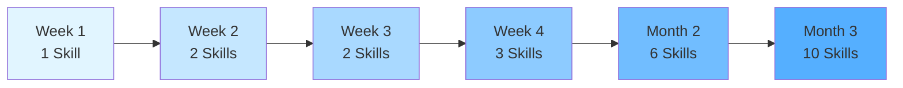

# 実践ガイド - 明日から使えるSkills運用

この章では、Claude Code Skillsを明日から実践的に活用するための具体的な手順、よくある失敗とその対処法、そしてチーム運用のベストプラクティスを提供します。

**所要時間**: 約30分

---

## この章で学ぶこと

- 個人でSkillsを始める3ステップ（Day 1、Week 1、Month 1）
- Claude Codeとの効果的な連携方法
- チームでSkillsを共有する仕組み
- よくある5つの失敗と対処法
- 運用を継続するための実践的なコツ
- 明日から使えるツール・テンプレート集

---

## 6.1 個人でSkillsを始める

### Day 1: 最初のSkillを作る（3時間）

まずは小さく始めましょう。1つのSkillを作ることで、Skillsの構造と効果を体感できます。

#### Step 1: ドメインを決める（30分）

**あなたが今取り組んでいるプロジェクトから選ぶ**:

```markdown
## Skill候補リスト

現在のプロジェクト: __________________

よく使う技術スタック:
- [ ] フロントエンド（React、Vue、Next.js等）
- [ ] バックエンド（Node.js、Python、Go等）
- [ ] モバイル（iOS、Android、Flutter等）
- [ ] インフラ（Docker、Kubernetes、AWS等）

よく調べること（上位3つ）:
1. __________________
2. __________________
3. __________________

→ この中から1つを最初のSkillにする
```

**推奨**: 週に3回以上調べる技術を選びましょう。

**実例**:

```
プロジェクト: 社内ダッシュボード開発
技術スタック: Next.js 14（App Router）

よく調べること:
1. Server Componentsとの使い分け
2. キャッシュ戦略
3. ルーティング設計

→ 最初のSkill: nextjs-development
```

#### Step 2: 情報収集（1時間）

**最小限の収集で始める**:

```markdown
## 情報収集チェックリスト（Day 1版）

### 公式ドキュメント（必須）
- [ ] 公式サイトURL: __________________
- [ ] 主要なベストプラクティス記事3本読了

### 実務経験（必須）
- [ ] 過去のプロジェクトから良かったパターン3個抽出
- [ ] 過去に遭遇した問題3個リスト化

### コミュニティ（任意）
- [ ] Stack Overflowのよくある質問10個チェック
- [ ] GitHub Trendsで人気リポジトリ3個調査

※ Day 1では完璧を目指さない。3時間で終わらせる。
```

**実例（Next.js）**:

```
公式ドキュメント:
- https://nextjs.org/docs
- Data Fetching、Rendering、Cachingの3記事

実務経験:
✅ Server Componentsで外部API呼び出し
✅ generateMetadataでSEO最適化
✅ Parallel Routesでダッシュボード構築

遭遇した問題:
❌ dynamic='force-dynamic'の使いどころがわからない
❌ revalidatePathとrevalidateTagの違い
❌ Layoutでデータフェッチすると全ページ再レンダリング

→ これらをSKILL.mdに反映
```

#### Step 3: SKILL.md執筆（1時間）

**最小構成のテンプレート**:

```markdown
# Your Skill Name

## 概要

このSkillは〜を扱います。（3-5行で説明）

含むもの:
- ✅ 項目1
- ✅ 項目2
- ✅ 項目3

---

## いつ使うか

- 〜する時
- 〜する時
- 〜する時

---

## クイックスタート

```language
// 最小の実装例
```

---

## ベストプラクティス

### ✅ DO（推奨）

```language
// 良い例
```

### ❌ DON'T（非推奨）

```language
// 悪い例
```

---

## よくある問題

### 問題1: XXX

**症状**: 〜が起きる

**原因**: 〜が原因

**解決策**:
```language
// 修正方法
```

---

## 関連リソース

- [公式ドキュメント](URL)
- [ベストプラクティス](URL)
```

**重要**: Day 1では詳細ガイドは書かない。SKILL.mdだけで完結させる。

#### Step 4: Claude Codeでテスト（30分）

**テストシナリオを3つ実行**:

```markdown
## テストシナリオ

### シナリオ1: 基本的な質問
User: "Next.jsでServer Componentsを使うべき場面は？"
期待: SKILL.mdのベストプラクティスを参照して回答

実際の結果: [ ]

### シナリオ2: トラブルシューティング
User: "revalidatePathが効かない。なぜ？"
期待: よくある問題セクションから原因と解決策を提示

実際の結果: [ ]

### シナリオ3: コード生成
User: "generateMetadataでOGP設定して"
期待: クイックスタートのコード例を参照して生成

実際の結果: [ ]
```

**テスト方法**:

```bash
# Claude Codeでテスト
claude-code chat

# Skillsディレクトリを指定
Settings -> Skills -> Add Directory -> your-skill-directory

# 実際に質問してみる
User: "Next.jsでServer Componentsを使うべき場面は？"
```

**期待される応答**:

```
Claude: your-skill-name Skillを参照しています...

Server Componentsを使うべき場面：

1. データフェッチが必要な場合
   - データベースクエリ
   - 外部API呼び出し
   - サーバーサイドのみのライブラリ使用

（SKILL.mdの内容が反映されている）
```

---

### Week 1: 3つのSkillsを構築

Day 1のプロセスを3回繰り返し、**よく使う3つの技術領域**をカバーします。

#### 推奨構成パターン

**パターンA: フルスタック開発者**

```
week-1-skills/
├── frontend-framework/    （React、Vue、Next.js等）
├── backend-framework/     （Express、FastAPI、Rails等）
└── database-patterns/     （SQL設計、ORM使用法等）
```

**パターンB: iOS開発者**

```
week-1-skills/
├── swiftui-basics/        （SwiftUI実装パターン）
├── architecture/          （MVVM、Clean Architecture）
└── data-persistence/      （Core Data、UserDefaults、Keychain）
```

**パターンC: チーム開発リーダー**

```
week-1-skills/
├── code-review/           （レビュー基準、フィードバック方法）
├── git-workflow/          （ブランチ戦略、コミット規約）
└── testing-strategy/      （テストピラミッド、カバレッジ目標）
```

#### Week 1のスケジュール

```
Day 1（月）: 1つ目のSkill完成（3時間）
Day 2（火）: 使ってみる + 改善（1時間）
Day 3（水）: 2つ目のSkill完成（3時間）
Day 4（木）: 使ってみる + 改善（1時間）
Day 5（金）: 3つ目のSkill完成（3時間）
Weekend: 使ってみる + 振り返り（2時間）

合計: 13時間
```

#### Week 1の振り返りチェックリスト

```markdown
## Week 1振り返り

### 定量評価
- [ ] 3つのSkillsを作成完了
- [ ] 各Skillを実際のタスクで3回以上使用
- [ ] Claude Codeの応答品質が満足できる

### 定性評価
「調べる時間」はどう変わったか？
Before: __________分/日
After:  __________分/日

よく使ったSkillはどれ？
1位: __________
2位: __________
3位: __________

改善が必要なSkillは？
- [ ] Skill名: __________ 理由: __________
- [ ] Skill名: __________ 理由: __________
```

---

### Month 1: 運用を回す

Week 1で作った3つのSkillsを実務で使いながら、改善サイクルを回します。

#### Week 2-4: 反復改善

**毎週金曜日30分のメンテナンス**:

```markdown
## 週次メンテナンス（毎週金曜日16:30-17:00）

### 今週の使用状況
- Skill A: __________回使用
- Skill B: __________回使用
- Skill C: __________回使用

### 今週見つけた問題
- [ ] Skill A: 〜という質問に答えられなかった
  → 追加すべき内容: __________

- [ ] Skill B: コード例が古い
  → 更新すべき箇所: __________

### 今週の改善
- [ ] Skill A: 「よくある問題」に1項目追加
- [ ] Skill B: ベストプラクティスを1個更新
- [ ] Skill C: クイックスタートのコード例を改善

### 来週のアクション
- [ ] __________
- [ ] __________
```

#### Month 1終了時の成果

```markdown
## Month 1成果レポート

### 作成したSkills
1. __________（使用回数: __回）
2. __________（使用回数: __回）
3. __________（使用回数: __回）

### 定量的効果
- 調べる時間: _________%削減
- 実装速度: _________%向上
- レビュー指摘数: _________%減少

### 定性的効果
- 自信を持って実装できる: [ ] はい / [ ] いいえ
- チームメンバーに勧められる: [ ] はい / [ ] いいえ
- 今後も継続したい: [ ] はい / [ ] いいえ

### Next Steps
- [ ] Skillsをチームに共有
- [ ] 新しいドメインのSkillを追加
- [ ] 既存Skillsをさらに深化
```

---

## 6.2 Claude Codeとの連携

### Skills参照の仕方

#### 基本パターン: Skillsディレクトリ設定

**Claude Code設定**:

```json
// claude_desktop_config.json
{
  "skills": {
    "directories": [
      "/Users/yourname/your-skills",
      "/Users/yourname/claude-code-skills"  // 公式Skillsも併用可能
    ]
  }
}
```

#### 自動参照 vs 手動参照

**自動参照（推奨）**:

Claude Codeがコンテキストから適切なSkillを自動選択します。

```
User: "Next.jsでServer Componentsを使ったAPI呼び出しを実装して"

Claude: nextjs-development Skillを参照しています...
（自動的にSkillを選択して実装）
```

**手動参照（明示的）**:

特定のSkillを指定したい場合。

```
User: "nextjs-development Skillを使って、
Server Componentsのベストプラクティスを教えて"

Claude: nextjs-development Skillを参照しています...
（指定されたSkillを優先的に使用）
```

---

### プロンプト設計

#### パターン1: 実装依頼

**❌ 悪い例（Skill活用できない）**:

```
User: "ログイン機能を作って"
```

問題点:
- どのSkillを参照すべきか不明
- 要件が曖昧
- コンテキスト不足

**✅ 良い例（Skill活用できる）**:

```
User: "ios-development Skillを使って、以下の要件でログイン機能を実装してください:

要件:
- SwiftUI + MVVM
- Keychain認証情報保存
- エラーハンドリング適切に
- ユニットテスト付き

参考: /path/to/design-doc.md"
```

#### パターン2: トラブルシューティング

**❌ 悪い例**:

```
User: "エラーが出た"
```

**✅ 良い例**:

```
User: "ios-development Skillを参照して、以下のエラーを解決してください:

エラーメッセージ:
```
Thread 1: signal SIGABRT
```

発生タイミング: Core Dataのsave()実行時
関連コード: /path/to/PersistenceController.swift"
```

#### パターン3: ベストプラクティス確認

**❌ 悪い例**:

```
User: "これで大丈夫？"
```

**✅ 良い例**:

```
User: "nextjs-development Skillのベストプラクティスに照らして、
以下のコードをレビューしてください:

/path/to/app/page.tsx

特に以下の点を確認:
- Server ComponentsとClient Componentsの使い分け
- データフェッチ戦略
- キャッシュ設定"
```

---

### 反復改善のサイクル

#### フィードバックループ

```
1. 使う
   ↓
2. 不足に気づく
   ↓
3. Skillを更新
   ↓
4. 再度使う
   ↓
（繰り返し）
```

#### 具体例: nextjs-developmentの改善

**Week 1**:

```markdown
# nextjs-development

## ベストプラクティス

### Server Componentsを使う

```tsx
export default async function Page() {
  const data = await fetch('...');
  return <div>{data}</div>;
}
```
```

**Week 2: 使ってみて不足に気づく**:

```
User: "generateMetadataでOGP設定して"
Claude: （SKILL.mdに記載がないため、一般的な回答のみ）

→ Skillに追加すべき内容を発見
```

**Week 2更新**:

```markdown
# nextjs-development

## ベストプラクティス

### Server Componentsを使う

（省略）

### generateMetadataでSEO最適化

```tsx
export async function generateMetadata({ params }) {
  const data = await fetchData(params.id);

  return {
    title: data.title,
    description: data.description,
    openGraph: {
      title: data.title,
      description: data.description,
      images: [data.imageUrl],
    },
  };
}
```
```

**Week 3: 再度使う**:

```
User: "generateMetadataでOGP設定して"
Claude: nextjs-development Skillを参照しています...
（更新されたSkillの内容を反映した実装を生成）

→ 期待通りの応答！
```

---

## 6.3 チームでSkillsを共有

### GitHubリポジトリ構成

#### 推奨構成

```
team-skills/
├── README.md                      # Skillsの概要と使い方
├── skills/                        # Skills本体
│   ├── frontend/
│   │   ├── react-patterns/
│   │   │   ├── SKILL.md
│   │   │   └── guides/
│   │   └── nextjs-patterns/
│   ├── backend/
│   │   └── api-design/
│   └── mobile/
│       └── ios-patterns/
├── templates/                     # 共通テンプレート
│   ├── SKILL_TEMPLATE.md
│   └── GUIDE_TEMPLATE.md
├── CONTRIBUTING.md                # 貢献ガイドライン
└── .github/
    ├── PULL_REQUEST_TEMPLATE.md
    └── workflows/
        └── validate-skills.yml    # 自動検証
```

#### README.md例

```markdown
# Team Skills

私たちのチームの開発知識を体系化したSkillsリポジトリです。

## セットアップ

```bash
# Clone
git clone https://github.com/your-org/team-skills.git

# Claude Code設定
# claude_desktop_config.jsonに以下を追加:
{
  "skills": {
    "directories": [
      "/path/to/team-skills/skills"
    ]
  }
}
```

## Skillsの使い方

Claude Codeで以下のように質問してください:

```
User: "react-patterns Skillを使って、〜を実装して"
```

## 新しいSkillの追加

[CONTRIBUTING.md](CONTRIBUTING.md)を参照してください。

## メンテナンス担当

各Skillsの担当者:

| Skill | 担当者 | 最終更新 |
|-------|--------|---------|
| react-patterns | @alice | 2025-01-15 |
| nextjs-patterns | @bob | 2025-01-10 |
| api-design | @charlie | 2025-01-20 |
```

---

### レビュープロセス

#### PULL_REQUEST_TEMPLATE.md

```markdown
## 変更内容

- [ ] 新規Skill追加
- [ ] 既存Skill更新
- [ ] バグ修正

## 変更したSkill

- Skill名: __________

## 変更の理由

（なぜこの変更が必要か？）

## テスト結果

以下のシナリオでテストしました:

- [ ] シナリオ1: __________（結果: ✅ / ❌）
- [ ] シナリオ2: __________（結果: ✅ / ❌）
- [ ] シナリオ3: __________（結果: ✅ / ❌）

## チェックリスト

- [ ] SKILL.mdの文字数が15,000字以内
- [ ] すべてのコード例が動作確認済み
- [ ] リンク切れがない
- [ ] 誤字脱字をチェックした
- [ ] 公式ドキュメントへのリンクを追加した
```

#### レビュー観点

```markdown
## Skills PR レビュー観点

### 内容の品質
- [ ] 技術的に正確か？
- [ ] ベストプラクティスに沿っているか？
- [ ] コード例が動作するか？

### 構造の品質
- [ ] 既存Skillsとの一貫性があるか？
- [ ] ナビゲーションが容易か？
- [ ] 適切な粒度か？（大きすぎず、小さすぎず）

### ドキュメント品質
- [ ] 初心者でも理解できるか？
- [ ] 図解があると良い箇所はないか？
- [ ] 公式ドキュメントへのリンクがあるか？

### メンテナンス性
- [ ] 将来も更新しやすいか？
- [ ] 依存する技術のバージョンが明記されているか？
```

---

### 更新ルール

#### ルール1: 月次レビュー（担当者ローテーション）

```markdown
## 月次レビュースケジュール

| 月 | 担当者 | 対象Skills |
|----|--------|-----------|
| 1月 | Alice | react-patterns, nextjs-patterns |
| 2月 | Bob | api-design, database-design |
| 3月 | Charlie | ios-patterns, swiftui-patterns |
```

#### ルール2: 緊急更新（破壊的変更対応）

```markdown
## 緊急更新フロー

### トリガー
- セキュリティ脆弱性の発覚
- 依存技術のメジャーバージョンアップ
- 公式ドキュメントの大幅変更

### 対応手順
1. Issue作成（ラベル: `urgent`）
2. 担当者アサイン（24時間以内）
3. PR作成（48時間以内）
4. 緊急レビュー（レビュアー2名以上）
5. マージ + Slackで全体通知

### 例
- Next.js 15リリース → nextjs-patterns緊急更新
- React 19リリース → react-patterns緊急更新
```

#### ルール3: コミュニティ貢献の奨励

```markdown
## コミュニティ貢献ポイント制度

### ポイント付与
- 新規Skill追加: 10pt
- 既存Skill更新: 5pt
- バグ修正: 3pt
- ドキュメント改善: 2pt

### 報酬
- 50pt達成: チームランチご馳走
- 100pt達成: 技術書購入補助（5,000円）
- 200pt達成: カンファレンス参加費補助（30,000円）

### ランキング（2025年1月）
1. Alice: 85pt
2. Bob: 62pt
3. Charlie: 48pt
```

---

## 6.4 よくある失敗と対処法

### 失敗1: 「Skillsが長すぎて使えない」

#### 症状

```
SKILL.md: 50,000字
guides/: 30個のファイル

Claude Codeの応答:
"コンテキストウィンドウを超えたため、一部の情報が読み込めませんでした"
```

#### 原因

- 1つのSkillに詰め込みすぎ
- 複数ドメインが混在
- 重複した内容が多い

#### 対処法

**Step 1: ドメインを分割**

```
Before:
web-development/  (100,000字)
├── react/
├── vue/
├── nextjs/
└── performance/

After:
react-development/    (30,000字)
vue-development/      (25,000字)
nextjs-development/   (28,000字)
frontend-performance/ (17,000字)
```

**Step 2: SKILL.mdをスリム化**

```markdown
Before（20,000字）:
- React Hooksの全パターンを詳細解説
- コード例が大量

After（8,000字）:
- React Hooksの概要とguidesへのリンク
- 最小限のコード例のみ
- 詳細は guides/ に分離
```

**Step 3: 階層構造の活用**

```
SKILL.md          ← 概要のみ（8,000字）
├── guides/       ← 詳細ガイド（各10,000-20,000字）
│   ├── hooks.md
│   ├── performance.md
│   └── testing.md
```

**目標**: SKILL.md単体で15,000字以内、合計で200,000字以内

---

### 失敗2: 「更新が追いつかない」

#### 症状

```
nextjs-development Skill:
- 最終更新: 6ヶ月前
- 現在: Next.js 15リリース済み
- Skill内容: Next.js 14の情報のまま

Claude Codeの応答:
古い情報を元に実装を提案 → 動かない
```

#### 原因

- メンテナンス計画がない
- 担当者が不明確
- 更新タイミングのトリガーがない

#### 対処法

**Step 1: 自動化できる部分を自動化**

```yaml
# .github/workflows/check-outdated.yml
name: Check Outdated Skills

on:
  schedule:
    - cron: '0 0 * * 0'  # 毎週日曜日

jobs:
  check:
    runs-on: ubuntu-latest
    steps:
      - uses: actions/checkout@v4
      - name: Check package versions
        run: |
          # package.jsonのバージョンチェック
          npm outdated || true
      - name: Create issue if outdated
        if: failure()
        run: |
          gh issue create --title "依存関係が古くなっています" \
                          --body "npm outdated の結果を確認してください"
```

**Step 2: メンテナンススケジュール**

```markdown
## メンテナンス計画

### 月次レビュー（第1金曜日）
- [ ] 公式ドキュメントの変更確認
- [ ] 依存ライブラリのバージョン確認
- [ ] Stack Overflowの新しい質問チェック

### 四半期レビュー（1月、4月、7月、10月の第1週）
- [ ] すべてのコード例を最新版で再検証
- [ ] 新しいベストプラクティスを追加
- [ ] 古くなった情報を更新/削除

### 年次レビュー（1月第2週）
- [ ] Skill全体の再構成を検討
- [ ] メジャーバージョンアップ
- [ ] 統計情報の更新
```

**Step 3: バージョン管理**

```markdown
# CHANGELOG.md

## [2.0.0] - 2025-01-15

### Changed
- Next.js 15対応
- App Routerのベストプラクティス更新

### Added
- Partial Prerendering ガイド追加
- Server Actions詳細ガイド追加

### Deprecated
- Pages Routerのガイドは1.x系を参照
```

---

### 失敗3: 「メンバーが使ってくれない」

#### 症状

```
チーム5人:
- Alice（作成者）: 毎日使用
- Bob: たまに使用（月2-3回）
- Charlie, David, Eve: 全く使っていない

理由（ヒアリング結果）:
- 「存在を知らなかった」
- 「使い方がわからない」
- 「自分で調べた方が早い」
```

#### 原因

- オンボーディング不足
- 使うメリットが伝わっていない
- 使い方が難しい

#### 対処法

**Step 1: チーム全体での導入セッション（1時間）**

```markdown
## Skillsキックオフミーティング

### Agenda（60分）
1. なぜSkillsを作ったか（10分）
   - 課題: 知識の散在、車輪の再発明
   - 解決: Skillsによる体系化

2. デモンストレーション（20分）
   - 実際のタスクでClaude Code + Skillsを使用
   - Before/After比較

3. セットアップハンズオン（20分）
   - 各自のPCでSkillsを設定
   - 簡単な質問を試してもらう

4. Q&A（10分）
```

**Step 2: 成功事例の共有（週次）**

```markdown
## Weekly Wins（毎週金曜日Slack投稿）

### 今週のSkills活用事例

**Alice**:
"nextjs-development Skillで Server Components実装。
従来2時間 → 30分に短縮！"

**Bob**:
"api-design Skillでエラーハンドリング設計。
レビュー指摘ゼロでマージ！"

→ 具体的なメリットを可視化
```

**Step 3: 使用状況の可視化**

```markdown
## Skills使用統計（月次レポート）

### 2025年1月

| メンバー | 使用回数 | 削減時間（推定） |
|---------|---------|---------------|
| Alice | 42回 | 21時間 |
| Bob | 18回 | 9時間 |
| Charlie | 5回 | 2.5時間 |
| David | 2回 | 1時間 |
| Eve | 0回 | 0時間 |

### チーム全体
- 総使用回数: 67回
- 削減時間合計: 33.5時間
- 1人あたり削減: 6.7時間

### アクション
- David, Eveにペアプロでサポート
- 次回チームミーティングでユースケース共有
```

---

### 失敗4: 「Skills間で矛盾がある」

#### 症状

```
react-development Skillの推奨:
"状態管理はZustandを使う"

nextjs-development Skillの推奨:
"状態管理はReact Contextを使う"

→ ユーザー混乱
```

#### 原因

- 作成者が異なり、統一されていない
- レビュープロセスが不十分
- 全体設計がない

#### 対処法

**Step 1: アーキテクチャ決定記録（ADR）の作成**

```markdown
# ADR-001: 状態管理ライブラリの選択

## ステータス
採用

## コンテキスト
Reactアプリケーションで状態管理が必要。
候補: Context API, Zustand, Redux, Jotai

## 決定
- **小規模（1-3画面）**: React Context
- **中規模（4-10画面）**: Zustand
- **大規模（10+画面）**: Redux Toolkit

## 理由
- Context API: 追加依存なし、シンプル
- Zustand: 軽量、学習コスト低
- Redux: スケーラブル、エコシステム豊富

## 影響を受けるSkills
- react-development
- nextjs-development
- frontend-performance
```

**Step 2: 整合性チェックの自動化**

```bash
# scripts/check-consistency.sh

echo "Checking consistency across Skills..."

# ADRで定義された用語を抽出
TERMS=$(grep -E "^- \*\*" docs/adr/*.md | awk '{print $2}')

# 各Skillsで矛盾がないかチェック
for term in $TERMS; do
  echo "Checking: $term"
  grep -r "$term" skills/ | grep -v "ADR" || echo "  ✅ No conflicts"
done
```

**Step 3: 定期的な整合性レビュー**

```markdown
## 四半期整合性レビュー

### チェック項目
- [ ] すべてのSkillsでADRに沿った推奨事項になっているか
- [ ] 矛盾する記述はないか
- [ ] 用語の使い方が統一されているか

### 前回の指摘事項（2024-Q4）
- react-development と nextjs-development で状態管理の推奨が異なる
  → 修正完了（2025-01-10）

### 今回の指摘事項（2025-Q1）
- （なし）
```

---

### 失敗5: 「実務で使えるレベルじゃない」

#### 症状

```
User: "react-development Skillを使って、複雑なフォームを実装して"

Claude:
（基本的なuseStateの例のみ生成）

User期待:
- バリデーション
- エラーハンドリング
- ローディング状態
- React Hook Form連携

→ Skillの内容が浅すぎる
```

#### 原因

- 基礎レベルの内容しかない
- 実務での複雑なケースをカバーしていない
- コード例が単純すぎる

#### 対処法

**Step 1: 実務レベルのユースケースを追加**

```markdown
# react-development

## 複雑なフォームの実装

### ユースケース: ユーザー登録フォーム

要件:
- バリデーション（メール形式、パスワード強度）
- エラーハンドリング（API、ネットワーク）
- ローディング状態
- 送信後のリダイレクト

```tsx
import { useForm } from 'react-hook-form';
import { zodResolver } from '@hookform/resolvers/zod';
import { z } from 'zod';

const schema = z.object({
  email: z.string().email('正しいメールアドレスを入力してください'),
  password: z.string().min(8, 'パスワードは8文字以上'),
});

export function SignUpForm() {
  const { register, handleSubmit, formState } = useForm({
    resolver: zodResolver(schema),
  });
  const [isSubmitting, setIsSubmitting] = useState(false);
  const [error, setError] = useState<string | null>(null);

  const onSubmit = async (data) => {
    setIsSubmitting(true);
    setError(null);

    try {
      const response = await fetch('/api/signup', {
        method: 'POST',
        body: JSON.stringify(data),
      });

      if (!response.ok) {
        throw new Error('登録に失敗しました');
      }

      // 成功: リダイレクト
      window.location.href = '/welcome';
    } catch (err) {
      setError(err.message);
    } finally {
      setIsSubmitting(false);
    }
  };

  return (
    <form onSubmit={handleSubmit(onSubmit)}>
      <input {...register('email')} />
      {formState.errors.email && <p>{formState.errors.email.message}</p>}

      <input type="password" {...register('password')} />
      {formState.errors.password && <p>{formState.errors.password.message}</p>}

      {error && <p className="error">{error}</p>}

      <button disabled={isSubmitting}>
        {isSubmitting ? '送信中...' : '登録'}
      </button>
    </form>
  );
}
```
```

**Step 2: 実プロジェクトのコードを反映**

```markdown
## incidents/ ディレクトリの活用

実際に遭遇した問題をドキュメント化:

incidents/
├── react-form-validation-edge-case.md
├── nextjs-cache-invalidation-issue.md
└── ios-coredata-concurrency-bug.md

例: react-form-validation-edge-case.md

---

# React Hook Formでバリデーションが走らないケース

## 問題
defaultValuesを動的に設定した場合、バリデーションが走らない。

## 再現コード
```tsx
const { register } = useForm({
  defaultValues: userData, // 非同期で取得したデータ
});
```

## 原因
defaultValuesは初回レンダリング時のみ適用される。

## 解決策
```tsx
const { register, reset } = useForm();

useEffect(() => {
  if (userData) {
    reset(userData); // 動的にデフォルト値を設定
  }
}, [userData, reset]);
```

## 参考
- https://react-hook-form.com/docs/useform#reset
```

**Step 3: コミュニティからのフィードバック収集**

```markdown
## Skills改善提案フォーム

https://forms.google.com/your-form

### 質問項目
1. どのSkillを使いましたか？
2. 期待していた情報は見つかりましたか？
3. 不足している内容はありますか？
4. 改善提案をお願いします。

### 月次集計
- 提案数: 12件
- 対応完了: 9件
- 対応中: 3件
```

---

## 6.5 運用を継続するコツ

### 定期レビュー

#### 月次レビュー（30分）

```markdown
## 月次Skills健康診断

### 使用統計
- 最も使われたSkill: __________（__回）
- 最も更新されたSkill: __________（__回）
- 使われていないSkill: __________

### 健康状態
- [ ] すべてのSkillsが3ヶ月以内に更新されている
- [ ] リンク切れがない
- [ ] コード例がすべて動作する

### 改善アクション
- [ ] 使われていないSkillsの原因調査
- [ ] 頻繁に使われるSkillsのさらなる充実化
```

#### 四半期レビュー（2時間）

```markdown
## 四半期振り返り

### 定量評価
| 指標 | Q4 2024 | Q1 2025 | 変化 |
|------|---------|---------|------|
| Skills数 | 8個 | 12個 | +50% |
| 総文字数 | 180,000字 | 320,000字 | +78% |
| 使用回数 | 150回 | 380回 | +153% |
| チーム削減時間 | 75時間 | 190時間 | +153% |

### 定性評価
- 最も役立ったSkill: __________
- チームからの評価: __________点/10点
- 改善要望トップ3:
  1. __________
  2. __________
  3. __________

### Next Quarter目標
- [ ] Skills数: 15個
- [ ] 使用回数: 500回
- [ ] チーム全員が週1回以上使用
```

---

### メトリクス追跡

#### 追跡すべき5つの指標

**1. 使用頻度**

```markdown
## 使用頻度トラッキング

### 方法
Claude Codeのログから集計 or 手動記録

### 月次レポート
| Skill | 使用回数 | 前月比 |
|-------|---------|--------|
| react-development | 42回 | +12% |
| nextjs-development | 38回 | +25% |
| ios-development | 25回 | -5% |
```

**2. 削減時間**

```markdown
## 削減時間の計算

### 計算式
削減時間 = 使用回数 × 平均削減時間/回

### 平均削減時間の測定（サンプル10件）
- 調査時間: Before 15分 → After 3分（12分削減）
- 実装時間: Before 2時間 → After 1時間（1時間削減）
- レビュー時間: Before 30分 → After 15分（15分削減）

平均: 1.45時間削減/回

### 月次削減時間
67回使用 × 1.45時間 = 97.15時間
```

**3. コード品質向上**

```markdown
## コード品質メトリクス

### レビュー指摘数
| 月 | 平均指摘数/PR | 前月比 |
|----|-------------|--------|
| 12月 | 5.2件 | - |
| 1月 | 3.8件 | -27% |
| 2月 | 2.1件 | -45% |

### テストカバレッジ
| 月 | カバレッジ | 前月比 |
|----|-----------|--------|
| 12月 | 65% | - |
| 1月 | 72% | +7pt |
| 2月 | 78% | +6pt |
```

**4. チーム満足度**

```markdown
## 月次満足度アンケート

### 質問
1. Skillsは役に立っていますか？（1-10点）
2. どのSkillが最も役立ちましたか？
3. 改善してほしいSkillは？

### 結果（1月）
- 平均満足度: 8.2点/10点
- 最も役立ったSkill: nextjs-development
- 改善要望: ios-development（実例が少ない）
```

**5. 更新頻度**

```markdown
## 更新頻度トラッキング

### 最終更新日
| Skill | 最終更新 | 経過日数 |
|-------|---------|---------|
| react-development | 2025-01-20 | 3日 |
| nextjs-development | 2025-01-15 | 8日 |
| ios-development | 2024-12-01 | 53日 ⚠️ |

### アクション
- ios-development: 更新が必要（60日以上経過）
```

---

### モチベーション維持

#### テクニック1: 小さな成功を祝う

```markdown
## Success Journal

### 2025年1月の成功

**Week 1**:
✅ 初めてのSkill（nextjs-development）完成
✅ Claude Codeで3回使用
✅ 実装時間30分短縮

**Week 2**:
✅ 2つ目のSkill（react-development）追加
✅ チームメンバー（Bob）が使い始めた
✅ レビュー指摘が2件減少

**Week 3**:
✅ Skills使用回数が累計20回突破
✅ 削減時間が累計10時間突破
✅ Aliceから「役立ってる！」の声

**Week 4**:
✅ 3つ目のSkill（api-design）追加
✅ 月次レビューで満足度8.2点
✅ 来月の目標設定完了

→ 毎週の小さな成功を記録してモチベーション維持
```

#### テクニック2: ビジュアライゼーション

```markdown
## Skills成長グラフ



→ 進捗を可視化してやる気UP
```

#### テクニック3: コミュニティとの交流

```markdown
## Skills活動の共有

### 社内
- 月次全体会議でSkills活用事例発表
- Slackチャンネルで成功事例シェア
- ランチ会でSkills勉強会

### 社外
- 技術ブログで執筆
- Zenn/Qiitaで記事公開
- カンファレンスで発表

→ 他者からのフィードバックでモチベーション向上
```

---

## 6.6 ツール・テンプレート集

### Skill作成テンプレート

#### SKILL_TEMPLATE.md

```markdown
---
name: your-skill-name
description: 一言説明（100字以内）
version: 1.0.0
created: YYYY-MM-DD
updated: YYYY-MM-DD
maintainer: Your Name (@your-github)
---

# Your Skill Name

> 一言要約（50字以内）

## 📋 目次

1. [概要](#概要)
2. [いつ使うか](#いつ使うか)
3. [クイックスタート](#クイックスタート)
4. [ベストプラクティス](#ベストプラクティス)
5. [よくある問題](#よくある問題)
6. [関連Skills](#関連skills)

---

## 概要

このSkillは〜を扱います。（3-5行で説明）

### 含むもの
- ✅ 項目1
- ✅ 項目2
- ✅ 項目3

### 含まないもの
- ❌ 項目A（別Skillで扱う）
- ❌ 項目B（別Skillで扱う）

---

## 📚 公式ドキュメント

**このSkillで学べること**: 原則、パターン、ベストプラクティス
**公式で確認すべきこと**: 最新API、詳細仕様

### 主要な公式ドキュメント
- **[公式サイト](URL)** - 説明
- **[API Reference](URL)** - 説明
- **[Best Practices](URL)** - 説明

---

## いつ使うか

### 自動的に参照されるケース
Claude Codeが自動的にこのSkillを参照する場面：
- 〜という質問をした時
- 〜という実装を依頼した時
- 〜という問題が発生した時

### 手動で参照すべきケース
明示的にSkill名を指定すべき場面：
- 〜を確認したい時
- 〜のベストプラクティスを知りたい時

---

## クイックスタート

### 最小構成の実装例

```language
// コード例
```

### 説明
- 何をしているか
- なぜこの書き方が推奨されるか

---

## ベストプラクティス

### パターン1: XXX

#### ✅ DO（推奨）

```language
// 良い例
```

**理由**: 〜だから

#### ❌ DON'T（非推奨）

```language
// 悪い例
```

**理由**: 〜だから

---

## よくある問題

### 問題1: XXX

**症状**: 〜が起きる

**原因**: 〜が原因

**解決策**:
```language
// 修正方法
```

**参考**: [詳細ガイド](guides/xxx.md)

---

## 関連Skills

このSkillと併用すると効果的なSkills：

- `related-skill-1` - 説明
- `related-skill-2` - 説明

---

## 更新履歴

詳細は[CHANGELOG.md](CHANGELOG.md)を参照。

### 最近の更新
- 2025-01-15: 初版リリース
```

---

### チェックリスト

#### Skill作成チェックリスト

```markdown
## Skill作成チェックリスト

### フェーズ1: 企画（Day 1）
- [ ] ドメインを決定
- [ ] スコープを定義（含む/含まない）
- [ ] ターゲットユーザーを明確化
- [ ] 既存Skillsとの重複チェック

### フェーズ2: 情報収集（Day 1-2）
- [ ] 公式ドキュメント読了
- [ ] ベストプラクティス記事3本以上
- [ ] 実務経験から3個以上のパターン抽出
- [ ] よくある問題3個以上リスト化

### フェーズ3: 執筆（Day 2-3）
- [ ] SKILL.md完成（8,000-15,000字）
- [ ] コード例が動作確認済み
- [ ] 公式ドキュメントへのリンク追加
- [ ] DO/DON'T例を3個以上

### フェーズ4: テスト（Day 3）
- [ ] 3つのシナリオでテスト実施
- [ ] Claude Codeの応答品質確認
- [ ] チームメンバーにレビュー依頼
- [ ] フィードバック反映

### フェーズ5: リリース（Day 3）
- [ ] CHANGELOG.md作成
- [ ] README.mdに追加
- [ ] チームに共有（Slack等）
- [ ] 使い方のドキュメント作成

### フェーズ6: メンテナンス（継続）
- [ ] 月次レビュー設定
- [ ] 使用統計の収集方法決定
- [ ] 更新トリガーの設定
```

#### Skillレビューチェックリスト

```markdown
## Skillレビューチェックリスト

### 内容の品質
- [ ] 技術的に正確か？
- [ ] 最新の情報か？（過去6ヶ月以内）
- [ ] ベストプラクティスに沿っているか？
- [ ] コード例がすべて動作するか？

### 構造の品質
- [ ] SKILL.mdが15,000字以内か？
- [ ] 目次が適切か？
- [ ] ナビゲーションが容易か？
- [ ] 階層構造が明確か？

### ドキュメント品質
- [ ] 初心者でも理解できるか？
- [ ] 誤字脱字がないか？
- [ ] リンク切れがないか？
- [ ] コードフォーマットが統一されているか？

### ユーザビリティ
- [ ] 期待する情報が5秒以内に見つかるか？
- [ ] クイックスタートで動作するものが作れるか？
- [ ] よくある問題が網羅されているか？
- [ ] 関連Skillsへのナビゲーションが適切か？
```

---

### 測定シート

#### Skills使用ログ

```markdown
## Skills使用ログ（週次）

### Week of 2025-01-20

| 日付 | Skill | タスク | Before | After | 削減時間 |
|------|-------|--------|--------|-------|---------|
| 1/20 | react-development | フォーム実装 | 2h | 1h | 1h |
| 1/21 | nextjs-development | API Routes | 1.5h | 0.5h | 1h |
| 1/22 | ios-development | Core Data | 3h | 1.5h | 1.5h |
| 1/23 | react-development | バリデーション | 1h | 0.5h | 0.5h |
| 1/24 | api-design | RESTエンドポイント | 2h | 1h | 1h |

### 週次サマリー
- 総使用回数: 5回
- 総削減時間: 5時間
- 最もよく使ったSkill: react-development（2回）
```

#### 月次効果測定シート

```markdown
## 月次効果測定（2025年1月）

### 定量指標

#### 開発速度
| 指標 | Before | After | 改善率 |
|------|--------|-------|--------|
| 平均タスク完了時間 | 4.5h | 2.8h | -38% |
| 調査時間 | 1.2h | 0.3h | -75% |
| 実装時間 | 2.8h | 2.0h | -29% |
| レビュー修正時間 | 0.5h | 0.2h | -60% |

#### コード品質
| 指標 | Before | After | 改善 |
|------|--------|-------|------|
| レビュー指摘数/PR | 5.2件 | 2.1件 | -60% |
| バグ発生率 | 3.5% | 1.8% | -49% |
| テストカバレッジ | 65% | 78% | +13pt |

#### Skills使用状況
- 総使用回数: 67回
- 累積削減時間: 97時間
- チーム平均使用回数: 13.4回/人

### 定性指標

#### チーム満足度
- 平均: 8.2/10点
- 最高: 10/10点（Alice）
- 最低: 6/10点（Eve）

#### 最も役立ったSkill
1. nextjs-development（38回使用）
2. react-development（42回使用）
3. ios-development（25回使用）

#### 改善要望
1. ios-development: 実例が少ない
2. api-design: エラーハンドリングのパターンをもっと
3. database-design: パフォーマンス最適化の章を追加

### Next Month目標
- [ ] 使用回数: 100回
- [ ] 累積削減時間: 150時間
- [ ] チーム全員が週2回以上使用
- [ ] 満足度平均: 8.5点以上
```

---

## 6.7 まとめ：明日からのアクションプラン

### 3ステップで始める

```markdown
## 明日からのアクションプラン

### Step 1: Day 1（3時間）
- [ ] 最初のSkillのドメインを決める（30分）
- [ ] 情報収集（1時間）
- [ ] SKILL.md執筆（1時間）
- [ ] Claude Codeでテスト（30分）

### Step 2: Week 1（13時間）
- [ ] 2つ目のSkill作成（3時間）
- [ ] 3つ目のSkill作成（3時間）
- [ ] 実務で使用 + 改善（7時間）

### Step 3: Month 1（継続）
- [ ] 週次メンテナンス（30分/週）
- [ ] 月次レビュー（30分/月）
- [ ] チームへ共有（1時間）
```

### 成功の鍵

1. **小さく始める**
   - 最初から完璧を目指さない
   - 1つのSkillから始める
   - 3時間で最初のバージョンを完成させる

2. **継続的に改善する**
   - 週次メンテナンスを習慣化
   - 使用統計を記録
   - フィードバックを反映

3. **チームで共有する**
   - 成功事例を共有
   - メンバーの使用をサポート
   - 定期的にレビュー

### 失敗しないために

```markdown
## やってはいけない5つのこと

❌ 1. 最初から完璧を目指す
→ ✅ 小さく始めて反復改善

❌ 2. 1人で抱え込む
→ ✅ チームで作り、チームで育てる

❌ 3. メンテナンスしない
→ ✅ 週次・月次レビューを習慣化

❌ 4. 使用状況を測らない
→ ✅ メトリクスを追跡して改善

❌ 5. 形だけ作って使わない
→ ✅ 実務で使い倒す
```

### 次の章へ

この章では、明日から実践できるSkills運用の具体的な方法を学びました。

- Day 1で最初のSkillを作る方法
- Week 1で3つのSkillsを構築する手順
- Month 1で運用サイクルを回すコツ
- よくある5つの失敗と対処法
- 運用を継続するためのテクニック

**次の第7章**では、AI時代のエンジニアリングとは何か、Skills体系化がもたらす未来について語ります。

---

**次章**: [第7章 結論 - AI時代のエンジニアリングへ](07-conclusion.md)
