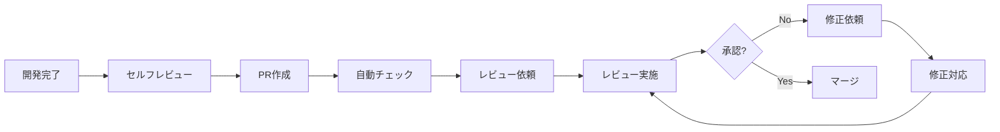

# 第2章 レビュープロセスとワークフロー

本章では、コードレビューの標準的なプロセスとワークフローを詳しく解説します。セルフレビューからPR作成、レビュー実施、フィードバック対応までの一連の流れを学びます。

## 標準的なレビューフロー



## Step 1: セルフレビュー

PR作成前に、自分自身でコードをレビューすることが重要です。

### セルフレビューチェックリスト

```typescript
// scripts/self-review.ts
interface SelfReviewItem {
  category: string;
  questions: string[];
  automatable: boolean;
}

const selfReviewChecklist: SelfReviewItem[] = [
  {
    category: 'コード品質',
    automatable: false,
    questions: [
      '命名は適切で意図が明確か？',
      '関数は単一責任を持っているか？',
      '重複コードはないか？',
      'マジックナンバーを避けているか？',
      'エッジケースを考慮しているか？',
    ],
  },
  {
    category: 'テスト',
    automatable: true,
    questions: [
      '新機能のユニットテストを追加したか？',
      'エッジケースのテストがあるか？',
      '全てのテストが成功するか？',
      'カバレッジが低下していないか？',
    ],
  },
  {
    category: 'セキュリティ',
    automatable: false,
    questions: [
      'SQLインジェクション対策はあるか？',
      'XSS対策はあるか？',
      '機密情報をハードコードしていないか？',
      '入力バリデーションを実装したか？',
    ],
  },
  {
    category: 'パフォーマンス',
    automatable: false,
    questions: [
      'N+1クエリはないか？',
      '不要なループはないか？',
      'メモリリークの可能性はないか？',
    ],
  },
  {
    category: 'ドキュメント',
    automatable: false,
    questions: [
      'READMEを更新したか？',
      'APIドキュメントを更新したか？',
      'CHANGELOGを更新したか？',
      'コメントは適切か？',
    ],
  },
];
```

### 差分確認のポイント

```typescript
// 差分確認時のチェックポイント
const diffReviewPoints = {
  beforeCommit: [
    'デバッグ用のconsole.logを削除したか',
    'コメントアウトされたコードを削除したか',
    'TODOコメントに担当者と期限があるか',
    '不要なimportを削除したか',
  ],
  logicalReview: [
    '意図した変更のみが含まれているか',
    '無関係なファイルの変更はないか',
    'フォーマット変更だけのファイルはないか',
  ],
};

// Git diffで確認
async function reviewDiff() {
  // ステージングエリアの確認
  await exec('git diff --cached');

  // 行数の確認
  const stats = await exec('git diff --stat --cached');
  console.log(stats);

  // 1ファイルずつ確認
  const files = await getChangedFiles();
  for (const file of files) {
    console.log(`\n=== ${file} ===`);
    await exec(`git diff --cached ${file}`);
    const shouldInclude = await prompt('この変更を含めますか? (y/n): ');
    if (shouldInclude !== 'y') {
      await exec(`git reset HEAD ${file}`);
    }
  }
}
```

## Step 2: PR作成

### PRテンプレートの活用

```markdown
<!-- .github/pull_request_template.md -->
## 概要
<!-- このPRの目的を1-2文で簡潔に説明 -->

## 変更内容
<!-- 主な変更点をリスト形式で -->
-
-
-

## 種類
<!-- 該当するものにチェック -->
- [ ] ✨ 新機能 (feature)
- [ ] 🐛 バグ修正 (bugfix)
- [ ] ♻️  リファクタリング (refactor)
- [ ] ⚡ パフォーマンス改善 (performance)
- [ ] 📝 ドキュメント更新 (docs)
- [ ] ✅ テスト追加 (test)
- [ ] 🎨 スタイル修正 (style)

## テスト
### 実施したテスト
- [ ] Unit tests
- [ ] Integration tests
- [ ] Manual testing

### テスト手順
<!-- 手動テストの手順があれば記載 -->
1.
2.
3.

## 影響範囲
<!-- この変更が影響する範囲 -->
- [ ] フロントエンド
- [ ] バックエンド
- [ ] データベース
- [ ] インフラ

## Breaking Changes
<!-- 破壊的変更がある場合 -->
- [ ] 破壊的変更あり

### 詳細
<!-- 破壊的変更の詳細とマイグレーションパス -->

## セルフレビューチェックリスト
- [ ] コードを自分で確認した
- [ ] 命名が適切
- [ ] テストを追加した
- [ ] ドキュメントを更新した
- [ ] デバッグコードを削除した
- [ ] コメントアウトしたコードを削除した

## スクリーンショット
<!-- UI変更がある場合、Before/Afterのスクリーンショット -->

### Before

### After

## 関連Issue
<!-- 関連するIssueをリンク -->
Closes #
Related to #

## レビュー観点
<!-- レビュワーに特に見てほしいポイント -->
-
-

## 補足
<!-- その他、レビュワーに伝えたいこと -->
```

### PRサイズの管理

```typescript
// PRサイズの推奨値
const prSizeGuidelines = {
  ideal: {
    linesChanged: 200,
    filesChanged: 5,
    reviewTime: '15-30分',
  },
  maximum: {
    linesChanged: 400,
    filesChanged: 10,
    reviewTime: '30-60分',
  },
  toolarge: {
    linesChanged: 400, // これを超えたら分割を検討
    action: 'PRの分割を強く推奨',
  },
};

// PRサイズチェックスクリプト
function checkPRSize(additions: number, deletions: number, files: number) {
  const totalChanges = additions + deletions;

  if (totalChanges < prSizeGuidelines.ideal.linesChanged) {
    console.log('✅ PRサイズ: 理想的（レビューしやすい）');
  } else if (totalChanges < prSizeGuidelines.maximum.linesChanged) {
    console.log('⚠️  PRサイズ: やや大きい（分割を検討してください）');
  } else {
    console.error('❌ PRサイズ: 大きすぎます（必ず分割してください）');
    console.error(`   現在: ${totalChanges}行, 推奨: ${prSizeGuidelines.maximum.linesChanged}行以下`);
    process.exit(1);
  }
}
```

参考: [Google Engineering Practices - Small CLs](https://google.github.io/eng-practices/review/developer/small-cls.html)

## Step 3: 自動チェック

PR作成後、自動チェックが実行されます。

### CI/CDパイプライン例

```yaml
# .github/workflows/pr-checks.yml
name: PR Checks

on:
  pull_request:
    types: [opened, synchronize, reopened]

jobs:
  lint:
    name: Lint
    runs-on: ubuntu-latest
    steps:
      - uses: actions/checkout@v4
      - uses: actions/setup-node@v4
        with:
          node-version: '20'
      - run: npm ci
      - run: npm run lint

  test:
    name: Test
    runs-on: ubuntu-latest
    steps:
      - uses: actions/checkout@v4
      - uses: actions/setup-node@v4
        with:
          node-version: '20'
      - run: npm ci
      - run: npm test
      - name: Upload coverage
        uses: codecov/codecov-action@v3

  type-check:
    name: Type Check
    runs-on: ubuntu-latest
    steps:
      - uses: actions/checkout@v4
      - uses: actions/setup-node@v4
        with:
          node-version: '20'
      - run: npm ci
      - run: npm run type-check

  build:
    name: Build
    runs-on: ubuntu-latest
    steps:
      - uses: actions/checkout@v4
      - uses: actions/setup-node@v4
        with:
          node-version: '20'
      - run: npm ci
      - run: npm run build
```

## Step 4: レビュー実施

### レビュワーのワークフロー

```typescript
// レビュー実施のステップ
class ReviewWorkflow {
  async review(pr: PullRequest): Promise<Review> {
    // Step 1: コンテキストの理解（5-10分）
    await this.understandContext(pr);

    // Step 2: 全体像の把握（5分）
    await this.getOverview(pr);

    // Step 3: 詳細レビュー（20-40分）
    const issues = await this.detailedReview(pr);

    // Step 4: フィードバック作成（10-15分）
    const feedback = await this.createFeedback(issues);

    // Step 5: 総合判断（5分）
    const decision = await this.makeDecision(feedback);

    return { feedback, decision };
  }

  private async understandContext(pr: PullRequest) {
    console.log('📖 Step 1: コンテキストの理解');

    // PR説明を読む
    console.log(`  Title: ${pr.title}`);
    console.log(`  Description:\n${pr.description}`);

    // 関連Issueを確認
    if (pr.linkedIssues.length > 0) {
      console.log(`  Linked Issues: ${pr.linkedIssues.join(', ')}`);
      for (const issue of pr.linkedIssues) {
        const details = await this.fetchIssue(issue);
        console.log(`    #${issue}: ${details.title}`);
      }
    }

    // CI/CDの結果を確認
    const checks = await pr.getCheckRuns();
    const failed = checks.filter(c => c.status === 'failure');
    if (failed.length > 0) {
      console.warn(`  ⚠️  ${failed.length}件のチェックが失敗しています`);
      return;
    }
  }

  private async getOverview(pr: PullRequest) {
    console.log('\n📊 Step 2: 全体像の把握');

    // 統計情報
    const stats = {
      files: pr.changedFiles.length,
      additions: pr.additions,
      deletions: pr.deletions,
      total: pr.additions + pr.deletions,
    };

    console.log(`  Files: ${stats.files}`);
    console.log(`  +${stats.additions} -${stats.deletions}`);

    // ファイルツリーを表示
    console.log('\n  Changed files:');
    const tree = this.buildFileTree(pr.changedFiles);
    this.printTree(tree);

    // 影響範囲の分析
    const impact = this.analyzeImpact(pr.changedFiles);
    console.log(`\n  Impact: ${impact.join(', ')}`);
  }

  private async detailedReview(pr: PullRequest): Promise<Issue[]> {
    console.log('\n🔬 Step 3: 詳細レビュー');

    const issues: Issue[] = [];

    // 優先度順にレビュー
    const priorities = ['critical', 'high', 'medium', 'low'];

    for (const priority of priorities) {
      console.log(`\n  Reviewing ${priority} aspects...`);
      const priorityIssues = await this.reviewPriority(pr, priority);
      issues.push(...priorityIssues);
    }

    return issues;
  }
}
```

### レビュー時間の管理

```typescript
// レビュー時間のトラッキング
class ReviewTimer {
  private startTime: Date;
  private checkpoints: Map<string, Date> = new Map();

  start() {
    this.startTime = new Date();
    this.checkpoint('start');
  }

  checkpoint(name: string) {
    this.checkpoints.set(name, new Date());
  }

  getElapsedTime(from: string, to?: string): number {
    const start = this.checkpoints.get(from);
    const end = to ? this.checkpoints.get(to) : new Date();

    if (!start || !end) return 0;

    return (end.getTime() - start.getTime()) / 1000 / 60; // minutes
  }

  report() {
    console.log('\n⏱️  Review Time Report:');

    const phases = [
      { name: 'Context', from: 'start', to: 'overview' },
      { name: 'Overview', from: 'overview', to: 'detailed' },
      { name: 'Detailed', from: 'detailed', to: 'feedback' },
      { name: 'Feedback', from: 'feedback', to: 'decision' },
    ];

    let total = 0;
    for (const phase of phases) {
      const time = this.getElapsedTime(phase.from, phase.to);
      console.log(`  ${phase.name}: ${time.toFixed(1)}分`);
      total += time;
    }

    console.log(`  Total: ${total.toFixed(1)}分`);

    // 推奨時間との比較
    if (total > 60) {
      console.warn('  ⚠️  レビュー時間が長すぎます。休憩を取ることをお勧めします。');
    }
  }
}
```

## Step 5: フィードバック対応

### 作成者のワークフロー

```typescript
// フィードバックへの対応
class FeedbackHandler {
  async handleFeedback(pr: PullRequest, comments: Comment[]) {
    // コメントを分類
    const categorized = this.categorizeComments(comments);

    console.log('💬 Feedback Summary:');
    console.log(`  Critical: ${categorized.critical.length}`);
    console.log(`  High: ${categorized.high.length}`);
    console.log(`  Medium: ${categorized.medium.length}`);
    console.log(`  Low/Nit: ${categorized.low.length}`);

    // Critical から対応
    for (const comment of categorized.critical) {
      await this.addressComment(comment, 'critical');
    }

    // High を対応
    for (const comment of categorized.high) {
      await this.addressComment(comment, 'high');
    }

    // Medium以下は判断して対応
    for (const comment of [...categorized.medium, ...categorized.low]) {
      const shouldAddress = await this.shouldAddressComment(comment);
      if (shouldAddress) {
        await this.addressComment(comment, 'optional');
      }
    }
  }

  private async addressComment(
    comment: Comment,
    urgency: 'critical' | 'high' | 'optional'
  ) {
    console.log(`\n${this.getUrgencyEmoji(urgency)} ${comment.body}`);

    // 対応方法を選択
    const options = [
      '1. 修正する',
      '2. 説明する（修正不要と判断）',
      '3. 議論する（同期ミーティング）',
      '4. あとで対応（TODOとして記録）',
    ];

    console.log('対応方法:');
    options.forEach(opt => console.log(`  ${opt}`));

    const choice = await prompt('選択 (1-4): ');

    switch (choice) {
      case '1':
        await this.fixIssue(comment);
        await this.replyComment(comment, '修正しました。ご確認ください。');
        break;
      case '2':
        await this.explainDecision(comment);
        break;
      case '3':
        await this.scheduleMeeting(comment);
        break;
      case '4':
        await this.createTodo(comment);
        break;
    }
  }

  private getUrgencyEmoji(urgency: string): string {
    const emojis = {
      critical: '🚨',
      high: '⚠️',
      optional: '💡',
    };
    return emojis[urgency] || '📝';
  }
}
```

## Step 6: 再レビューと承認

### 再レビューのポイント

```typescript
// 再レビュー時のチェック
async function reReview(pr: PullRequest, previousReview: Review) {
  console.log('🔄 Re-reviewing changes...');

  // 前回からの変更を確認
  const newCommits = await pr.getCommitsSince(previousReview.timestamp);

  console.log(`  New commits: ${newCommits.length}`);

  for (const commit of newCommits) {
    console.log(`    - ${commit.sha.slice(0, 7)}: ${commit.message}`);
  }

  // 前回のコメントへの対応を確認
  const unresolvedComments = previousReview.comments.filter(
    c => !c.isResolved
  );

  if (unresolvedComments.length > 0) {
    console.log(`\n  未解決コメント: ${unresolvedComments.length}件`);
    for (const comment of unresolvedComments) {
      console.log(`    - ${comment.body.substring(0, 50)}...`);
    }
  }

  // 変更差分のみレビュー
  const diff = await pr.getDiffSince(previousReview.timestamp);
  const newIssues = await reviewDiff(diff);

  return {
    newIssues,
    unresolvedComments,
    recommendation: newIssues.length === 0 && unresolvedComments.length === 0
      ? 'approve'
      : 'request-changes',
  };
}
```

## まとめ

本章では、コードレビューの具体的なプロセスを学びました。

- **セルフレビュー**: PR作成前に自分でチェック
- **PR作成**: テンプレートを活用し、適切なサイズを維持
- **自動チェック**: CI/CDで機械的なチェックを自動化
- **レビュー実施**: 段階的に理解を深めながらレビュー
- **フィードバック対応**: 優先度を考慮して効率的に対応
- **再レビュー**: 変更差分を中心に確認

次章では、実際のレビューで使用する具体的なチェックリストについて詳しく見ていきます。
