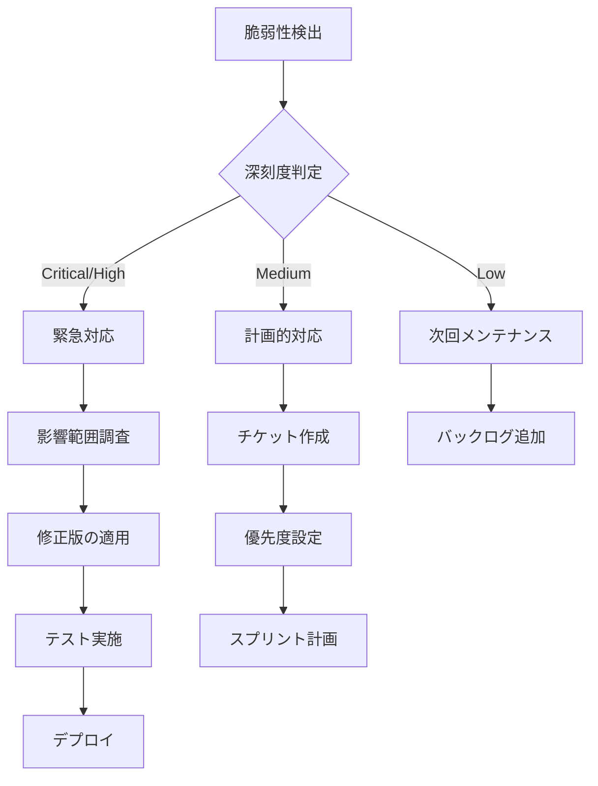

# セキュリティ脆弱性スキャン

## セキュリティの重要性

依存関係のセキュリティ管理は、アプリケーション全体のセキュリティにおいて極めて重要です。オープンソースライブラリは便利ですが、脆弱性のリスクも伴います。

### セキュリティリスク

#### 依存関係の脆弱性

サードパーティライブラリに存在する既知の脆弱性が、アプリケーション全体のセキュリティリスクとなる可能性があります。

#### 主な脆弱性タイプ

- **Remote Code Execution (RCE)**: 遠隔からのコード実行
- **Cross-Site Scripting (XSS)**: クロスサイトスクリプティング
- **SQL Injection**: SQLインジェクション
- **Prototype Pollution**: プロトタイプ汚染
- **Denial of Service (DoS)**: サービス拒否攻撃
- **Path Traversal**: パストラバーサル
- **CSRF**: クロスサイトリクエストフォージェリ

### CVSSスコア

Common Vulnerability Scoring System（CVSS）は、脆弱性の深刻度を評価する標準的な指標です。

```
CVSS Score 範囲:
0.0       : None（なし）
0.1-3.9   : Low（低）
4.0-6.9   : Medium（中）
7.0-8.9   : High（高）
9.0-10.0  : Critical（深刻）
```

## npm audit

npm auditは、npmに組み込まれた脆弱性スキャンツールです。

### 基本コマンド

```bash
# 脆弱性スキャン
npm audit

# 出力例
# found 3 vulnerabilities (1 moderate, 2 high)
#   run `npm audit fix` to fix them, or `npm audit` for details

# 詳細情報を表示
npm audit --json
npm audit --json | jq .

# 特定の深刻度以上のみ表示
npm audit --audit-level=moderate
npm audit --audit-level=high
npm audit --audit-level=critical

# プロダクション依存関係のみスキャン
npm audit --production
npm audit --omit=dev
```

### 自動修正

```bash
# 自動修正（互換性のある範囲で）
npm audit fix

# メジャーバージョン更新を含む修正（破壊的変更あり）
npm audit fix --force

# Dry run（実際には変更しない）
npm audit fix --dry-run

# 特定のパッケージのみ修正
npm update <package-name>
```

### 脆弱性の詳細確認

```bash
# 脆弱性の詳細をJSON形式で取得
npm audit --json > audit-report.json

# 特定の脆弱性の詳細
npm audit --json | jq '.vulnerabilities'

# 影響を受けるパッケージのリスト
npm audit --json | jq '.vulnerabilities | keys'
```

### package.jsonでの設定

```json
{
  "scripts": {
    "audit": "npm audit",
    "audit:fix": "npm audit fix",
    "audit:check": "npm audit --audit-level=high",
    "postinstall": "npm audit --audit-level=critical || true"
  }
}
```

## GitHub Dependabot

Dependabotは、GitHubに統合された依存関係更新・脆弱性スキャンツールです。

### Dependabot設定

```yaml
# .github/dependabot.yml
version: 2
updates:
  # npm依存関係
  - package-ecosystem: "npm"
    directory: "/"
    schedule:
      interval: "daily"
      time: "09:00"
      timezone: "Asia/Tokyo"

    # ラベルの設定
    labels:
      - "dependencies"
      - "security"

    # PR数の制限
    open-pull-requests-limit: 10

    # 自動マージ設定（patch/minorのみ）
    versioning-strategy: increase

    # グループ化
    groups:
      dev-dependencies:
        dependency-type: "development"
        update-types:
          - "minor"
          - "patch"

  # GitHub Actions
  - package-ecosystem: "github-actions"
    directory: "/"
    schedule:
      interval: "weekly"
```

### セキュリティアップデートの自動化

```yaml
# .github/dependabot.yml
version: 2
updates:
  - package-ecosystem: "npm"
    directory: "/"
    schedule:
      interval: "daily"

    # セキュリティアップデートのみ
    open-pull-requests-limit: 5

    # 自動マージ設定
    target-branch: "main"

    # コミットメッセージのカスタマイズ
    commit-message:
      prefix: "chore(deps)"
      include: "scope"

    # レビュアー設定
    reviewers:
      - "security-team"
    assignees:
      - "maintainer"
```

### Dependabot Alerts

GitHubリポジトリの設定で有効化:

1. Settings → Security → Dependabot alerts → Enable
2. Settings → Security → Dependabot security updates → Enable

## Snyk

Snykは、包括的なセキュリティスキャンツールです。

### インストール

```bash
# グローバルインストール
npm install -g snyk

# プロジェクトローカル
npm install --save-dev snyk

# 認証
snyk auth
```

### 基本コマンド

```bash
# プロジェクトをスキャン
snyk test

# 詳細レポート
snyk test --severity-threshold=high
snyk test --json > snyk-report.json

# 自動修正
snyk wizard

# プロジェクトを監視（継続的スキャン）
snyk monitor

# Dockerイメージのスキャン
snyk container test node:18-alpine

# IaC（Infrastructure as Code）のスキャン
snyk iac test terraform/
```

### .snyk設定ファイル

```yaml
# .snyk
version: v1.22.1

# 特定の脆弱性を無視
ignore:
  'SNYK-JS-LODASH-567746':
    - lodash:
        reason: '修正版がまだリリースされていない'
        expires: '2026-12-31T00:00:00.000Z'
        created: '2026-01-24T00:00:00.000Z'

  'SNYK-JS-AXIOS-6124857':
    - axios > follow-redirects:
        reason: '低リスク、次回メンテナンスで対応'
        expires: '2026-06-30T00:00:00.000Z'

# パッチ適用
patch:
  'SNYK-JS-MINIMIST-559764':
    - minimist:
        patched: '2024-01-01T00:00:00.000Z'
```

### CI/CDでの統合

```yaml
# .github/workflows/security.yml
name: Security Scan

on:
  push:
    branches: [main, develop]
  pull_request:
    branches: [main]
  schedule:
    - cron: '0 2 * * 1'  # 毎週月曜2時

jobs:
  snyk:
    runs-on: ubuntu-latest
    steps:
      - uses: actions/checkout@v4

      - uses: actions/setup-node@v4
        with:
          node-version: '20'
          cache: 'npm'

      - run: npm ci

      - name: Run Snyk test
        run: npx snyk test --severity-threshold=high
        env:
          SNYK_TOKEN: ${{ secrets.SNYK_TOKEN }}
        continue-on-error: true

      - name: Upload Snyk report
        uses: github/codeql-action/upload-sarif@v2
        with:
          sarif_file: snyk.sarif
```

## OWASP Dependency-Check

OWASP Dependency-Checkは、既知の脆弱性を検出するツールです。

### インストール

```bash
# Homebrewでインストール
brew install dependency-check

# または、npmパッケージ
npm install -g owasp-dependency-check
```

### 基本使用

```bash
# プロジェクトをスキャン
dependency-check --project "MyApp" --scan ./

# レポート形式を指定
dependency-check --project "MyApp" --scan ./ --format HTML
dependency-check --project "MyApp" --scan ./ --format JSON
dependency-check --project "MyApp" --scan ./ --format XML

# 出力先を指定
dependency-check --project "MyApp" --scan ./ --out ./reports

# 特定のディレクトリを除外
dependency-check --project "MyApp" --scan ./ --exclude "**/test/**"
```

### CI/CD統合

```yaml
# .github/workflows/owasp.yml
name: OWASP Dependency Check

on:
  schedule:
    - cron: '0 3 * * 0'  # 毎週日曜3時
  workflow_dispatch:

jobs:
  dependency-check:
    runs-on: ubuntu-latest
    steps:
      - uses: actions/checkout@v4

      - name: Run OWASP Dependency-Check
        uses: dependency-check/Dependency-Check_Action@main
        with:
          project: 'MyApp'
          path: '.'
          format: 'HTML'
          args: >
            --failOnCVSS 7
            --suppression suppression.xml

      - name: Upload results
        uses: actions/upload-artifact@v3
        with:
          name: dependency-check-report
          path: reports/
```

## CI/CDでの自動スキャン

### GitHub Actions統合

```yaml
# .github/workflows/security.yml
name: Security Scan

on:
  push:
    branches: [main, develop]
  pull_request:
    branches: [main]
  schedule:
    - cron: '0 2 * * 1'  # 毎週月曜2時

jobs:
  npm-audit:
    name: NPM Audit
    runs-on: ubuntu-latest
    steps:
      - uses: actions/checkout@v4

      - uses: actions/setup-node@v4
        with:
          node-version: '20'
          cache: 'npm'

      - run: npm ci

      - name: Run npm audit
        run: npm audit --audit-level=moderate
        continue-on-error: true

      - name: Create audit report
        if: failure()
        run: |
          npm audit --json > audit-report.json
          cat audit-report.json

  snyk-scan:
    name: Snyk Security Scan
    runs-on: ubuntu-latest
    steps:
      - uses: actions/checkout@v4

      - uses: snyk/actions/node@master
        env:
          SNYK_TOKEN: ${{ secrets.SNYK_TOKEN }}
        with:
          args: --severity-threshold=high

  codeql:
    name: CodeQL Analysis
    runs-on: ubuntu-latest
    permissions:
      security-events: write
    steps:
      - uses: actions/checkout@v4

      - uses: github/codeql-action/init@v2
        with:
          languages: javascript

      - uses: github/codeql-action/autobuild@v2

      - uses: github/codeql-action/analyze@v2
```

### マルチツールスキャン

```yaml
# .github/workflows/multi-scan.yml
name: Multi-tool Security Scan

on:
  schedule:
    - cron: '0 3 * * 0'  # 毎週日曜3時

jobs:
  security-scan:
    runs-on: ubuntu-latest
    strategy:
      matrix:
        tool: [npm-audit, snyk, owasp]
    steps:
      - uses: actions/checkout@v4

      - uses: actions/setup-node@v4
        with:
          node-version: '20'
          cache: 'npm'

      - run: npm ci

      - name: Run ${{ matrix.tool }}
        run: |
          case "${{ matrix.tool }}" in
            npm-audit)
              npm audit --audit-level=high
              ;;
            snyk)
              npx snyk test --severity-threshold=high
              ;;
            owasp)
              dependency-check --project "MyApp" --scan ./
              ;;
          esac
        continue-on-error: true
```

## 脆弱性対応フロー

### 検出から対応までのフロー



### 対応優先度

| 深刻度 | 対応期限 | 対応方法 |
|--------|---------|---------|
| **Critical** | 24時間以内 | 即座にパッチ適用・緊急リリース |
| **High** | 1週間以内 | パッチ適用・次回リリース |
| **Medium** | 1ヶ月以内 | 計画的な対応・通常リリース |
| **Low** | 次回メンテナンス | バックログに追加 |

### 対応手順

```bash
# 1. 脆弱性の確認
npm audit

# 2. 影響範囲の調査
npm audit --json | jq '.vulnerabilities | to_entries[] | select(.value.severity == "high")'

# 3. 修正版の適用
npm audit fix

# 4. テスト実行
npm test

# 5. 手動確認が必要な場合
npm update <package-name>@latest

# 6. 修正できない場合は一時的に無視（.snyk）
# ただし、期限を設定して定期的にチェック
```

## セキュリティスキャンのベストプラクティス

### チェックリスト

- [ ] CI/CDで自動スキャンを実施する
- [ ] 定期的なスキャン（週次・月次）を設定する
- [ ] 脆弱性の深刻度に応じた対応フローを定義する
- [ ] Dependabotを有効化する
- [ ] 複数のツールで多層的にスキャンする
- [ ] スキャン結果を記録・追跡する
- [ ] 脆弱性を無視する場合は理由と期限を明記する
- [ ] 本番環境への影響を最小化するため、ステージング環境でテストする

### 推奨設定

```yaml
# .github/workflows/security.yml
name: Security

on:
  push:
  pull_request:
  schedule:
    - cron: '0 2 * * 1'

jobs:
  audit:
    runs-on: ubuntu-latest
    steps:
      - uses: actions/checkout@v4
      - uses: actions/setup-node@v4
        with:
          node-version: '20'
          cache: 'npm'
      - run: npm ci
      - run: npm audit --audit-level=moderate

  snyk:
    runs-on: ubuntu-latest
    steps:
      - uses: actions/checkout@v4
      - uses: snyk/actions/node@master
        env:
          SNYK_TOKEN: ${{ secrets.SNYK_TOKEN }}
```

```yaml
# .github/dependabot.yml
version: 2
updates:
  - package-ecosystem: "npm"
    directory: "/"
    schedule:
      interval: "daily"
    labels:
      - "dependencies"
      - "security"
    open-pull-requests-limit: 10
```

## まとめ

セキュリティ脆弱性スキャンは、アプリケーションの安全性を保つために不可欠です。複数のツールを組み合わせ、CI/CDに統合し、定期的なスキャンと迅速な対応を行うことが重要です。

主要なポイント:
- **自動化**: CI/CDでスキャンを自動実行
- **多層防御**: npm audit、Snyk、Dependabotを組み合わせる
- **迅速な対応**: 深刻度に応じた対応フローを確立
- **継続的な監視**: 定期スキャンと依存関係の最新化

次章では、依存関係更新戦略について解説します。

## 参考文献

- [npm audit documentation](https://docs.npmjs.com/cli/v10/commands/npm-audit)
- [GitHub Dependabot documentation](https://docs.github.com/en/code-security/dependabot)
- [Snyk documentation](https://docs.snyk.io/)
- [OWASP Dependency-Check](https://owasp.org/www-project-dependency-check/)
- [CVSS Scoring System](https://www.first.org/cvss/)
- [National Vulnerability Database (NVD)](https://nvd.nist.gov/)
