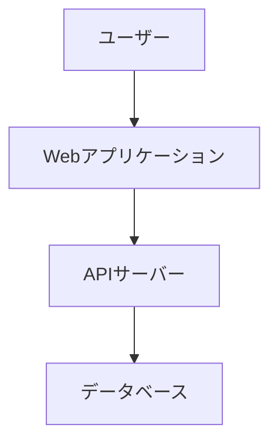

# 情報源の扱い方 - 信頼性と引用の原則

## この章で学ぶこと

技術ドキュメントを書く際、最も重要なのは**情報の信頼性**です。間違った情報、信頼できない情報源からの引用、不適切な引用方法は、あなたのドキュメント全体の価値を損ないます。

この章では、以下の内容を学びます：

1. **信頼できる情報源の見極め方** - 公式ドキュメント、学術論文、著名なブログの違い
2. **適切な引用方法** - 情報源を明記し、読者が検証できるようにする
3. **オリジナル情報と引用の区別** - 自分の考えと他者の情報を明確に分ける
4. **情報源の更新への対応** - 古くなった情報をどう扱うか

**なぜ重要か:**

```markdown
❌ 信頼できない情報源:
「あるブログで見たけど、Node.jsはPythonより10倍速いらしい」
→ 読者: 「どのブログ？」「条件は？」「本当？」

✅ 信頼できる情報源:
「Node.js公式ベンチマーク（https://nodejs.org/benchmarks/）によると、
非同期I/O処理において、C10K問題に対応できる高い同時実行性を実現します」
→ 読者: 「公式情報だから信頼できる」「詳細はリンク先で確認できる」
```

情報源の扱い方を間違えると、あなた自身の信頼性まで損なわれます。この章で、正しい情報源の選び方と引用方法を身につけましょう。

---

## 信頼できる情報源とは

### 情報源の信頼性レベル

技術情報の信頼性は、以下のようにレベル分けできます：

#### レベル1: 最も信頼できる（公式情報）

**1. 公式ドキュメント**

```markdown
✅ 例:
- Node.js公式ドキュメント: https://nodejs.org/docs/
- TypeScript公式ドキュメント: https://www.typescriptlang.org/docs/
- Swift公式ドキュメント: https://swift.org/documentation/
- MDN Web Docs: https://developer.mozilla.org/
```

**特徴:**
- プロジェクトの公式チーム・組織が管理
- 最も正確で最新の情報
- バージョンごとに整備されている
- 変更履歴が追跡可能

**使うべき場面:**
- API仕様、文法、設定方法など、事実情報を引用するとき
- ベストプラクティスを紹介するとき
- パフォーマンスデータを参照するとき

**2. 公式ベンチマーク・統計**

```markdown
✅ 例:
- Node.js公式ベンチマーク: https://nodejs.org/benchmarks/
- Fastify公式ベンチマーク: https://fastify.dev/benchmarks/
- TechEmpower Web Framework Benchmarks: https://www.techempower.com/benchmarks/
```

**特徴:**
- 再現可能な測定環境
- 測定条件が明記されている
- 定期的に更新される
- 複数のフレームワーク・言語を比較できる

**使うべき場面:**
- パフォーマンス比較をするとき
- 技術選定の根拠を示すとき
- 具体的な数値データが必要なとき

**3. 標準仕様・RFC**

```markdown
✅ 例:
- ECMA-262 (JavaScript): https://tc39.es/ecma262/
- HTTP/1.1 (RFC 2616): https://www.rfc-editor.org/rfc/rfc2616
- JSON (RFC 8259): https://www.rfc-editor.org/rfc/rfc8259
- OpenAPI Specification: https://spec.openapis.org/oas/latest.html
```

**特徴:**
- 業界標準として認められている
- 複数の組織・専門家によるレビュー済み
- 長期的に安定している
- 実装の根拠となる

**使うべき場面:**
- プロトコルやデータ形式を説明するとき
- 標準準拠を強調するとき
- 技術的な正確性が求められるとき

#### レベル2: 信頼できる（第三者による情報）

**1. 学術論文・研究**

```markdown
✅ 例:
- Google Scholar: https://scholar.google.com/
- arXiv: https://arxiv.org/
- ACM Digital Library: https://dl.acm.org/
```

**特徴:**
- ピアレビューを経ている
- 再現性のある実験・測定
- 引用文献が明記されている
- 学術的な信頼性が高い

**使うべき場面:**
- 新しいアルゴリズムや手法を紹介するとき
- 理論的背景を説明するとき
- 深い技術的な洞察が必要なとき

**注意点:**
- 一般読者には難しい場合がある
- 実務での応用が必ずしも容易ではない
- 古い論文は現在の実装と異なることがある

**2. 著名な技術ブログ・記事**

```markdown
✅ 例（信頼性が高い）:
- Mozilla Hacks: https://hacks.mozilla.org/
- Google Developers Blog: https://developers.googleblog.com/
- Cloudflare Blog: https://blog.cloudflare.com/
- Netflix Tech Blog: https://netflixtechblog.com/
```

**特徴:**
- 著名企業・組織が公開
- 実務経験に基づいている
- レビュープロセスがある
- 具体的な実装例が豊富

**使うべき場面:**
- 実践的な手法を紹介するとき
- 大規模システムの設計を説明するとき
- トレンドや新技術を紹介するとき

**注意点:**
- 企業の特定のユースケースに特化していることがある
- 全ての環境で適用できるとは限らない
- 必ず記事の日付と著者を明記する

**3. 著名な技術者の公開情報**

```markdown
✅ 例（TypeScript開発者の情報）:
- Anders Hejlsberg（TypeScript作者）のインタビュー
- Ryan Dahl（Node.js作者）の講演
- Guido van Rossum（Python作者）のブログ
```

**特徴:**
- その分野の第一人者
- 設計思想や背景が分かる
- 将来の方向性の参考になる

**使うべき場面:**
- 技術の設計意図を説明するとき
- 歴史的背景を紹介するとき
- 将来の展望を述べるとき

**注意点:**
- 個人的な意見であることを明記する
- 公式見解とは異なる場合がある
- 文脈を含めて引用する

#### レベル3: 慎重に扱うべき（一般的な情報）

**1. Stack Overflow・GitHub Issues**

```markdown
⚠️ 使用時の注意:
- 投票数が高い回答を参考にする
- 複数の回答を比較する
- 公式ドキュメントで裏取りする
- 日付を確認（古い情報の可能性）
```

**特徴:**
- コミュニティベースの知識
- 実践的な解決策が多い
- バージョンや環境依存の情報が多い

**使うべき場面:**
- トラブルシューティングの例として
- 複数の解決策を示すとき
- コミュニティの議論を紹介するとき

**注意点:**
- 「Stack Overflowの回答によると」という形で引用
- 必ずURLを明記する
- 自分でも検証した上で紹介する
- 「これは一例であり、環境により異なる」と明記

**2. 個人ブログ・Qiita・Zenn**

```markdown
⚠️ 使用時の注意:
- 著者の経歴・専門性を確認
- 記事の日付を確認
- 公式ドキュメントと照合
- 複数の情報源で裏取り
```

**特徴:**
- 実体験に基づく情報
- 具体的なハウツーが多い
- 個人の見解・経験が含まれる

**使うべき場面:**
- 参考例として紹介するとき
- 複数の視点を示すとき
- コミュニティの実践例として

**注意点:**
- 必ず著者名・記事タイトル・URLを明記
- 「〜という記事で紹介されている方法」と明記
- 公式情報で裏取りできる部分は公式を引用
- 自分で検証していない場合は「未検証」と明記

#### レベル4: 避けるべき（信頼性が低い）

**1. 匿名の情報・出典不明の情報**

```markdown
❌ 避けるべき例:
「どこかで見たけど、〜らしい」
「〜と言われている」
「〜が常識だ」
```

**なぜ避けるべきか:**
- 検証できない
- 誤情報の可能性が高い
- 読者が信頼できない
- あなたの信頼性を損なう

**2. 広告・マーケティング資料**

```markdown
❌ 避けるべき例:
「弊社の製品は業界最速です！」
「このツールで開発速度が10倍になります！」
```

**なぜ避けるべきか:**
- 偏った情報
- 誇張された表現
- 比較条件が不明確
- 客観性がない

**例外:**
- 公式ドキュメントとして扱える場合のみ
- 「公式サイトによると」と明記する
- マーケティング表現ではなく技術仕様を引用する

---

## 公式ドキュメントの探し方

### 1. 公式サイトの見つけ方

**基本的な探し方:**

```markdown
✅ 信頼できる公式サイトの特徴:

1. ドメインが公式
   - nodejs.org（Node.js公式）
   - typescriptlang.org（TypeScript公式）
   - python.org（Python公式）

2. HTTPSが使われている
   - https:// で始まる

3. 組織・団体が明記されている
   - OpenJS Foundation（Node.js）
   - Microsoft（TypeScript）
   - Python Software Foundation（Python）

4. ドキュメントのバージョンが明記されている
   - Node.js v20.x
   - TypeScript 5.3
```

**探し方の手順:**

```markdown
手順1: 公式サイトを検索
- 「[技術名] official documentation」で検索
- 例: "Node.js official documentation"

手順2: ドメインを確認
- .org、.com、著名企業のドメインか確認
- 広告サイトではないか確認

手順3: ドキュメントのバージョンを確認
- 自分が使っているバージョンと一致するか
- 「latest」ではなく具体的なバージョン番号を確認

手順4: URLを保存
- 引用時に使えるよう、正確なURLを保存
```

### 2. GitHub公式リポジトリの活用

**公式リポジトリの見つけ方:**

```markdown
✅ 信頼できる公式リポジトリの特徴:

1. Star数が多い（一般的に1000以上）
2. Organization配下にある
   - facebook/react
   - microsoft/TypeScript
   - nodejs/node
3. README.mdに公式サイトへのリンクがある
4. Contributorsが多数いる
5. 定期的にメンテナンスされている
```

**活用方法:**

```typescript
// ✅ 良い例: 公式リポジトリから実装を参照

/**
 * React公式リポジトリ（https://github.com/facebook/react）の
 * useEffectフック実装パターンを参考にした実装
 */
useEffect(() => {
  const subscription = props.source.subscribe();
  return () => {
    subscription.unsubscribe();
  };
}, [props.source]);
```

**Issue・Discussionの活用:**

```markdown
✅ 良い例:

Node.js公式リポジトリのIssue #12345（https://github.com/nodejs/node/issues/12345）で
議論されているように、この動作は意図的な設計です。

理由:
- メモリ使用量を抑えるため
- 後方互換性を維持するため
```

### 3. MDNを活用する

MDN（Mozilla Developer Network）は、Web技術に関する最も信頼できる情報源の一つです。

**MDNの特徴:**

```markdown
✅ MDNが優れている点:

1. ブラウザ互換性が明記されている
2. 実例が豊富
3. コミュニティによるレビュー済み
4. 多言語対応（日本語もあり）
5. 更新が頻繁
```

**MDNの引用例:**

```typescript
// ✅ 良い例: MDNを参照した実装

/**
 * Array.prototype.map()の実装
 *
 * MDN Web Docs（https://developer.mozilla.org/en-US/docs/Web/JavaScript/Reference/Global_Objects/Array/map）
 * によると、map()は新しい配列を返し、元の配列は変更しません。
 */
const doubled = numbers.map(n => n * 2);
```

### 4. パッケージマネージャーの公式ページ

**npm・PyPI・RubyGemsの活用:**

```markdown
✅ パッケージマネージャーでの確認事項:

1. 週間ダウンロード数
   - 人気・信頼性の指標

2. 最終更新日
   - メンテナンスされているか

3. 公式リポジトリへのリンク
   - GitHubリポジトリの確認

4. ライセンス
   - 商用利用可能か

5. 依存関係
   - セキュリティリスクの確認
```

**引用例:**

```markdown
✅ 良い例:

Fastifyは、npmで週間ダウンロード数が約100万回（2026年1月時点）の
人気Node.jsフレームワークです。

参照:
- npm: https://www.npmjs.com/package/fastify
- 公式サイト: https://fastify.dev/
- GitHub: https://github.com/fastify/fastify
```

---

## 引用の正しい方法

### 1. 基本的な引用形式

**Markdownでの引用:**

```markdown
✅ 良い例: 基本的な引用

> Node.js公式ドキュメント（https://nodejs.org/docs/）によると:
>
> 「Node.jsは、Chrome V8 JavaScriptエンジン上に構築された
> JavaScriptランタイムです。」

※ 引用元: Node.js公式サイト About Node.js
```

**インライン引用:**

```markdown
✅ 良い例: インライン引用

TypeScript公式ドキュメント[^1]によると、TypeScriptは
「JavaScriptに型を追加したもの」です。

[^1]: https://www.typescriptlang.org/docs/
```

### 2. コード内での引用

**コメントでの引用:**

```typescript
// ✅ 良い例: コメントで引用元を明記

/**
 * ユーザー認証ミドルウェア
 *
 * Express公式ドキュメントの認証パターン（https://expressjs.com/en/advanced/best-practice-security.html）
 * を参考に実装しています。
 *
 * @param req - リクエスト
 * @param res - レスポンス
 * @param next - 次のミドルウェア
 */
export function authenticate(req: Request, res: Response, next: NextFunction) {
  // 実装...
}
```

**アルゴリズムの引用:**

```typescript
// ✅ 良い例: アルゴリズムの出典を明記

/**
 * LRUキャッシュの実装
 *
 * アルゴリズムは以下を参考:
 * - "LRU Cache Implementation" by Knuth, TAOCP Vol. 1
 * - LRU Cacheの解説: https://en.wikipedia.org/wiki/Cache_replacement_policies#LRU
 *
 * 時間計算量:
 * - get: O(1)
 * - put: O(1)
 */
class LRUCache<K, V> {
  // 実装...
}
```

### 3. データ・統計の引用

**ベンチマークデータの引用:**

```markdown
✅ 良い例: ベンチマーク結果の引用

## パフォーマンス比較

TechEmpower Web Framework Benchmarks Round 22（https://www.techempower.com/benchmarks/）
によると、以下のような結果が報告されています:

| フレームワーク | リクエスト/秒 |
|----------------|---------------|
| Fastify        | 78,513        |
| Express        | 14,200        |
| Koa            | 38,241        |

**測定環境:**
- プラットフォーム: Linux
- CPU: Intel Xeon
- メモリ: 32GB

**注意:** 実際のパフォーマンスは、アプリケーションの実装、
サーバー環境、負荷パターンにより大きく異なります。
```

**統計データの引用:**

```markdown
✅ 良い例: 統計データの引用

## TypeScriptの採用状況

State of JS 2023（https://2023.stateofjs.com/）によると:

- TypeScript使用率: 84%（前年比+5%）
- 満足度: 93%
- 今後も使いたい: 89%

これらの数字は、TypeScriptがJavaScriptエコシステムにおいて
主流になっていることを示しています。
```

### 4. 画像・図表の引用

**画像の引用:**

```markdown
✅ 良い例: 画像の引用


*図1: Node.jsアーキテクチャ*
*出典: Node.js公式サイト（https://nodejs.org/）*
```

**図表の引用と改変:**

```markdown
✅ 良い例: 図表を参考に独自作成

## システムアーキテクチャ

以下の図は、C4モデル（https://c4model.com/）の
Context Diagramを参考に作成しました。



*図1: システム概要図（C4モデルのContext Diagramを参考に作成）*
```

### 5. 引用時の注意事項

**必ず含めるべき情報:**

```markdown
✅ 完全な引用の例:

タイトル: "Best Practices for Node.js Development"
著者: John Doe
組織: Node.js Foundation
日付: 2025年12月15日
URL: https://nodejs.org/docs/best-practices/
アクセス日: 2026年1月28日

引用箇所:
> 「非同期I/Oは、Node.jsの最も重要な特徴です。」
```

**短縮形での引用（一般的なケース）:**

```markdown
✅ 実用的な引用の例:

Node.js公式ドキュメント（https://nodejs.org/docs/）によると、
非同期I/Oは、Node.jsの最も重要な特徴です。
```

**複数箇所からの引用:**

```markdown
✅ 良い例: 複数の引用元

## 非同期処理のパフォーマンス

複数の情報源で、非同期処理の有効性が報告されています:

1. Node.js公式ドキュメント（https://nodejs.org/docs/）
   - 「非同期I/Oにより、高い同時実行性を実現」

2. "Node.js Design Patterns" by Mario Casciaro
   - 「ノンブロッキングI/Oは、I/O待機時間を有効活用できる」

3. Netflix Tech Blog（https://netflixtechblog.com/）
   - 実際の本番環境での効果を報告

これらの情報源から、非同期処理が一般的に推奨されることがわかります。
```

---

## オリジナル情報と引用の区別

### 1. 明確な区別の重要性

**なぜ区別が必要か:**

```markdown
❌ 悪い例: 引用とオリジナルが混在

Node.jsは非同期I/Oを使っていて、これにより高速になります。
特に大量のリクエストを処理する場合、劇的な効果があります。
実測したところ、従来の方法と比べて10倍速くなりました。

**問題点:**
- どこまでが公式情報か不明
- どこからが著者の意見か不明
- 「実測したところ」は著者の経験か？
- 「10倍速く」はどこから来た数字か？
```

```markdown
✅ 良い例: 引用とオリジナルを区別

Node.js公式ドキュメント（https://nodejs.org/docs/）によると:
> 「Node.jsは非同期I/Oを使用し、高い同時実行性を実現します」

**私の考察:**
この特徴により、一般的に以下のようなケースで効果が期待できます:
- I/O待機が多い処理（ファイル読み込み、DB問い合わせ等）
- 多数の同時接続を処理する必要がある場合

ただし、実際の効果はアプリケーションの特性により異なるため、
プロファイリングして確認することを推奨します。
```

### 2. セクション分けによる区別

**セクションで明確に分ける:**

```markdown
✅ 良い例: セクションで区別

## 公式情報

TypeScript公式ドキュメント（https://www.typescriptlang.org/docs/）によると:

- TypeScriptはJavaScriptのスーパーセット
- 静的型付けを追加
- JavaScriptにコンパイル可能

## 私の見解

公式情報を踏まえた上で、以下のような場面でTypeScriptが特に有効だと考えます:

1. **大規模プロジェクト**
   - 型による安全性
   - リファクタリングの容易さ

2. **チーム開発**
   - コードの意図が明確
   - IDEの補完が強力

3. **長期メンテナンス**
   - 破壊的変更の早期発見
   - ドキュメント代わりになる
```

### 3. 引用符・ブロック引用の活用

**視覚的に区別する:**

```markdown
✅ 良い例: 引用符で区別

MDN Web Docs（https://developer.mozilla.org/）では、
`Promise`について以下のように説明されています:

> `Promise`オブジェクトは、非同期処理の最終的な完了
> （または失敗）とその結果の値を表します。

この定義から分かるように、`Promise`は非同期処理の結果を
抽象化する仕組みです。実際の使用例を見てみましょう:

```typescript
// 実装例（著者作成）
async function fetchUser(id: string): Promise<User> {
  const response = await fetch(`/api/users/${id}`);
  return response.json();
}
```
```

### 4. 脚注の活用

**詳細な引用情報は脚注に:**

```markdown
✅ 良い例: 脚注での引用

Reactでは、関数コンポーネントが推奨されています[^1]。
これは、Hooksの導入により、関数コンポーネントでも
ステート管理やライフサイクルメソッドが使えるようになったためです[^2]。

私の経験では、関数コンポーネントの方がテストしやすく、
可読性も高いと感じています。

[^1]: React公式ドキュメント "Function and Class Components"
https://react.dev/reference/react/Component

[^2]: React公式ブログ "Introducing Hooks"
https://react.dev/blog/2019/02/06/react-v16.8.0
```

### 5. 「私の意見」を明示する表現

**オリジナル部分を明示:**

```markdown
✅ 良い例: 明示的な表現

**公式情報:**
Next.js公式ドキュメント（https://nextjs.org/docs/）によると、
App Routerは新しいルーティングシステムです。

**私の推奨:**
実務での経験から、以下のようなケースでApp Routerが特に有効だと考えます:
- 新規プロジェクト
- React Server Componentsを活用したい場合
- データフェッチングを簡素化したい場合

**注意点（私の見解）:**
ただし、以下のような場合は従来のPages Routerも選択肢になります:
- 既存のPages Routerプロジェクトの移行コストが高い
- チームがPages Routerに慣れている
- エコシステムの成熟を待ちたい
```

---

## 実践例: 引用を含むドキュメントの書き方

### 例1: READMEでの引用

```markdown
✅ 良い例: READMEでの適切な引用

# Fast API Client

高速なAPIクライアントライブラリ

## 特徴

- **型安全**: TypeScriptで完全に型付けされています
- **高速**: ネイティブ`fetch` APIを使用
- **軽量**: 依存関係なし（Peer Dependenciesのみ）

## なぜfetchを使うのか

MDN Web Docs（https://developer.mozilla.org/en-US/docs/Web/API/Fetch_API）によると:

> Fetch APIは、ネットワーク越しにリソースを取得するための
> モダンなインターフェースを提供します。

従来の`XMLHttpRequest`と比較した利点:
- Promise ベースで使いやすい
- Service Workerでも使用可能
- ストリーミング対応

## ベンチマーク

Node.js公式ベンチマーク（https://nodejs.org/benchmarks/）の手法を参考に、
以下の環境で測定しました:

- Node.js: v20.10.0
- OS: macOS 14.2
- CPU: Apple M2
- 測定回数: 1,000回の平均

| ライブラリ | リクエスト/秒 |
|------------|---------------|
| 本ライブラリ | 8,420         |
| axios      | 7,150         |
| node-fetch | 8,100         |

**注意:** これは特定環境での測定結果です。実際のパフォーマンスは
使用環境、ネットワーク状況、APIサーバーの応答速度により異なります。
```

### 例2: API仕様書での引用

```markdown
✅ 良い例: API仕様書での適切な引用

# User API 仕様書

## 認証

OAuth 2.0（RFC 6749: https://www.rfc-editor.org/rfc/rfc6749）の
Authorization Code Grantフローを使用します。

### 認証フロー

1. **認可リクエスト**

RFC 6749のSection 4.1.1で定義されている形式に従います:

```
GET /oauth/authorize
  ?response_type=code
  &client_id=CLIENT_ID
  &redirect_uri=REDIRECT_URI
  &scope=read:user
  &state=RANDOM_STRING
```

2. **トークン取得**

RFC 6749のSection 4.1.3で定義されている形式に従います:

```
POST /oauth/token
Content-Type: application/x-www-form-urlencoded

grant_type=authorization_code
&code=AUTHORIZATION_CODE
&redirect_uri=REDIRECT_URI
&client_id=CLIENT_ID
&client_secret=CLIENT_SECRET
```

## エラーレスポンス

RFC 7807 Problem Details for HTTP APIs
（https://www.rfc-editor.org/rfc/rfc7807）に準拠した形式で
エラーを返します:

```json
{
  "type": "https://example.com/problems/user-not-found",
  "title": "User Not Found",
  "status": 404,
  "detail": "User with ID 'user_123' does not exist",
  "instance": "/api/users/user_123"
}
```
```

### 例3: 技術記事での引用

```markdown
✅ 良い例: 技術記事での適切な引用

# Node.jsのStream処理入門

## Streamとは

Node.js公式ドキュメント（https://nodejs.org/api/stream.html）では、
Streamを以下のように定義しています:

> Streamは、Node.jsでストリーミングデータを扱うための抽象インターフェースです。

## なぜStreamを使うのか

### メモリ効率

通常のファイル読み込みでは、ファイル全体をメモリにロードします:

```typescript
// ファイル全体をメモリにロード
const data = await fs.readFile('large-file.json', 'utf-8');
// ファイルサイズが1GBなら、1GBのメモリを使用
```

Node.js公式ドキュメントによると、Streamを使用すると
チャンク単位でデータを処理できます:

> デフォルトでは、Streamバッファは16KBです。

これにより、理論的には以下のような効果が期待できます:
- ピークメモリ使用量の削減
- 処理開始までの時間短縮
- 大容量ファイルの安定的な処理

### 実装例

以下は、Node.js公式ドキュメントの例を参考に作成した実装です:

```typescript
import { createReadStream, createWriteStream } from 'fs';
import { pipeline } from 'stream/promises';

// Stream処理の実装
async function processLargeFile(inputPath: string, outputPath: string) {
  await pipeline(
    createReadStream(inputPath),
    // 変換処理
    async function* (source) {
      for await (const chunk of source) {
        yield chunk.toString().toUpperCase();
      }
    },
    createWriteStream(outputPath)
  );
}
```

## 参考資料

1. Node.js公式ドキュメント - Stream
   https://nodejs.org/api/stream.html

2. "Node.js Design Patterns" Third Edition, Mario Casciaro, Luciano Mammino
   Chapter 6: Streams

3. Node.js Best Practices（https://github.com/goldbergyoni/nodebestpractices）
   Section on Streams
```

### 例4: アーキテクチャドキュメントでの引用

```markdown
✅ 良い例: ADRでの適切な引用

# ADR-003: データベースにPostgreSQLを採用

## ステータス

採用 (2026-01-15)

## コンテキスト

プロジェクトでは、以下の要件を満たすRDBMSが必要です:

- ACID特性の保証
- JSON型のサポート
- 高いパフォーマンス
- 豊富なエコシステム

## 検討した選択肢

### 1. PostgreSQL

PostgreSQL公式ドキュメント（https://www.postgresql.org/about/）によると:

> PostgreSQLは、30年以上の開発実績を持つ、
> オープンソースのオブジェクトリレーショナルデータベースシステムです。

**利点:**
- JSONB型による柔軟なデータ構造
- 豊富な拡張機能（PostGIS、pg_trgm等）
- トランザクションの信頼性
- 活発なコミュニティ

### 2. MySQL

MySQL公式サイト（https://www.mysql.com/）によると:

> MySQLは、世界で最も人気のあるオープンソースデータベースです。

**利点:**
- 広く使われている
- 豊富なホスティングオプション
- パフォーマンスが良い

**欠点（プロジェクトにとって）:**
- JSON型のサポートがPostgreSQLより限定的
- 一部の高度な機能が有料版のみ

## 決定

PostgreSQLを採用します。

**理由:**
1. JSONB型により、スキーマ変更に柔軟に対応できる
2. Full Text Search機能が標準で使える
3. チームメンバーの経験が豊富
4. ORM（Prisma）との互換性が高い

## 結果

**期待される効果:**
- 開発速度の向上（柔軟なスキーマ設計）
- 運用の安定性（信頼性の高いトランザクション）
- 拡張性（豊富なExtensions）

**トレードオフ:**
- MySQLと比較して、一部のホスティングサービスで選択肢が少ない
- チームの学習コスト（MySQLとの違いに慣れる必要）

## 参考資料

1. PostgreSQL公式ドキュメント
   https://www.postgresql.org/docs/

2. "PostgreSQL: Up and Running" by Regina Obe and Leo Hsu
   O'Reilly Media

3. DB-Engines Ranking（https://db-engines.com/en/ranking）
   データベースの人気度ランキング

4. Stack Overflow Developer Survey 2023
   https://survey.stackoverflow.co/2023/
```

---

## 情報の更新への対応

### 1. 情報の鮮度を確認する

**チェックすべきポイント:**

```markdown
✅ 情報源の鮮度チェックリスト:

1. 記事・ドキュメントの公開日
   - 最終更新日が明記されているか
   - 1年以上前の情報は要注意

2. 技術のバージョン
   - 記事が対象とするバージョンは？
   - 現在のバージョンと一致するか？

3. 廃止された機能・API
   - Deprecatedになっていないか
   - 公式ドキュメントで確認

4. 最新のベストプラクティス
   - 当時は推奨されていても、今は非推奨の可能性
```

**古い情報の扱い方:**

```markdown
✅ 良い例: 古い情報を扱う場合

## React Class ComponentsからFunction Componentsへ

**歴史的背景:**

Reactの初期（v16.8以前）では、Class Componentsが標準的でした。
以下は、React公式ドキュメント（2017年版、Internet Archive: https://web.archive.org/...）
からの引用です:

> Class Componentsは、ステートとライフサイクルメソッドを使用できる唯一の方法でした。

**現在の推奨（2026年1月時点）:**

React公式ドキュメント（https://react.dev/）では、
現在は Function Components + Hooks が推奨されています:

> Hooksを使用することで、関数コンポーネントでもステート管理やライフサイクルメソッドを使用できます。

**実装例の比較:**

```typescript
// ❌ 非推奨（Class Component）
class Counter extends React.Component {
  state = { count: 0 };

  increment = () => {
    this.setState({ count: this.state.count + 1 });
  };

  render() {
    return <button onClick={this.increment}>{this.state.count}</button>;
  }
}

// ✅ 推奨（Function Component + Hooks）
function Counter() {
  const [count, setCount] = useState(0);

  return <button onClick={() => setCount(count + 1)}>{count}</button>;
}
```

**注意:** Class Componentsは非推奨ではありませんが、
新規プロジェクトではFunction Componentsが推奨されます。
```

### 2. バージョンを明記する

**常にバージョンを記録:**

```markdown
✅ 良い例: バージョンを明記

# セットアップガイド

**対象バージョン:**
- Node.js: v20.10.0 以上
- TypeScript: 5.3.0 以上
- React: 18.2.0 以上

**最終確認日:** 2026年1月28日

## インストール

```bash
# Node.js v20.10.0で確認済み
npm install react@18.2.0 react-dom@18.2.0
```

**異なるバージョンでの動作:**
- Node.js v18でも動作しますが、一部機能（fetch等）が制限される可能性があります
- React 17では、本ドキュメントの一部が適用できません（Automatic JSX Transformが未対応）
```

### 3. 定期的な更新の仕組み

**ドキュメントの更新戦略:**

```markdown
✅ 良い例: 更新情報を明記

# ドキュメント更新履歴

## v2.0.0 (2026-01-28)

- Node.js v20対応
- TypeScript 5.3の新機能に対応
- 非推奨となったAPIの情報を更新

## v1.5.0 (2025-10-15)

- React 18.2対応
- Concurrent Featuresのセクションを追加

## 更新方針

このドキュメントは、以下のタイミングで更新されます:

1. **メジャーバージョン変更時（必須）**
   - 依存ライブラリのメジャーバージョンアップ
   - 破壊的変更がある場合

2. **四半期ごと（定期）**
   - 情報の鮮度確認
   - リンク切れチェック
   - 新機能の追加

3. **コミュニティからの指摘（随時）**
   - Issueやプルリクエスト
   - エラー報告
```

### 4. リンク切れへの対応

**リンク管理の方法:**

```markdown
✅ 良い例: リンク切れ対策

## 参考リンク

### 公式ドキュメント（安定）

以下のリンクは、公式サイトのため長期的に安定しています:

- Node.js公式: https://nodejs.org/docs/
- TypeScript公式: https://www.typescriptlang.org/docs/

### 技術記事（定期確認推奨）

以下のリンクは、定期的に確認することを推奨します:

- "Node.js Best Practices" (GitHub): https://github.com/goldbergyoni/nodebestpractices
  - 最終確認: 2026年1月28日
  - アーカイブ: https://web.archive.org/web/...（リンク切れ時の代替）

### リンク切れを見つけた場合

Issueを作成してください: https://github.com/[user]/[repo]/issues
```

---

## 信頼性を損なう表現の回避

### 1. 避けるべき表現パターン

**曖昧な情報源:**

```markdown
❌ 悪い例:

「どこかで読んだのですが、Node.jsは常にPythonより速いそうです」
「〜と言われています」
「〜が一般的です」（根拠なし）
「エンジニアなら誰でも知っていますが...」
```

```markdown
✅ 良い例:

Node.js公式ベンチマーク（https://nodejs.org/benchmarks/）によると、
非同期I/O処理において高いパフォーマンスを発揮します。

ただし、CPU集約的な処理では、他の言語（C++、Rust等）の方が
適している場合があります（ケースバイケース）。
```

**誇張された表現:**

```markdown
❌ 悪い例:

「この手法を使えば必ず10倍速くなります！」
「革命的な新技術で全てが変わる！」
「もう〜は古い、これからは〜だ！」
```

```markdown
✅ 良い例:

この手法は、以下のような条件下で効果が期待できます:
- I/O待機が多い処理
- データ量が大きい場合（数GB以上）
- メモリ使用量を抑えたい場合

実際の効果は、アプリケーションの特性、データ構造、
実行環境により異なります。プロファイリングして確認してください。
```

**根拠のない断定:**

```markdown
❌ 悪い例:

「TypeScriptはJavaScriptより優れています」
「〜を使わないのは間違っています」
「〜するべきです」（理由なし）
```

```markdown
✅ 良い例:

TypeScriptは、以下のような場面で特に有効です:

1. **大規模プロジェクト**
   - 静的型付けによる安全性
   - リファクタリングの容易さ

2. **チーム開発**
   - コードの意図が明確
   - IDEの補完が強力

ただし、以下のような場合はJavaScriptも選択肢になります:
- 小規模プロジェクト
- プロトタイピング段階
- 学習コスト削減を優先したい場合

プロジェクトの特性に応じて選択してください。
```

### 2. 適切な留保表現

**推奨される留保表現:**

```markdown
✅ 良い例: 適切な留保表現

**確実な場合:**
- 「〜です」「〜します」
- 公式ドキュメントの引用時

**一般的な傾向:**
- 「一般的に〜」
- 「多くの場合〜」
- 「〜する傾向があります」

**理論的な推測:**
- 「理論的には〜」
- 「〜が期待できます」
- 「〜の可能性があります」

**個人的な見解:**
- 「私の経験では〜」
- 「私の見解では〜」
- 「個人的には〜と考えます」

**条件付き:**
- 「〜の場合は〜」
- 「〜という条件下では〜」
- 「〜によっては〜」
```

**実際の使用例:**

```markdown
✅ 良い例: 留保表現の適切な使用

## キャッシュ戦略

### LRUキャッシュ

LRU（Least Recently Used）キャッシュは、最も長く使われていない
エントリを削除するアルゴリズムです。

**公式情報:**
Wikipedia（https://en.wikipedia.org/wiki/Cache_replacement_policies#LRU）によると:
> LRUキャッシュは、O(1)の時間計算量でgetとputを実現できます。

**一般的な傾向:**
一般的に、以下のようなアクセスパターンでLRUキャッシュが有効です:
- 最近アクセスされたデータが再度アクセスされる可能性が高い
- アクセス頻度に偏りがある（Zipfの法則に従う）

**理論的な効果:**
理論的には、以下のような効果が期待できます:
- ヒット率の向上（アクセスパターンによる）
- メモリ使用量の制限（最大エントリ数を設定可能）

**私の経験:**
私の経験では、APIレスポンスのキャッシュにLRUが適していると感じています。
ただし、全てのケースでベストとは限らないため、以下の検証を推奨します:

1. ヒット率の測定
2. メモリ使用量の監視
3. 他のアルゴリズム（LFU、TTL等）との比較
```

---

## ケーススタディ: 情報源の扱い方の実例

### ケース1: 技術選定ドキュメント

**シナリオ:** Webフレームワークの選定理由を説明する

```markdown
✅ 良い例: 情報源を明示した技術選定

# フロントエンドフレームワークの選定

## 検討プロセス

### 候補

1. **React**
2. **Vue.js**
3. **Svelte**

### 評価軸

State of JS 2023（https://2023.stateofjs.com/）を参考に、
以下の軸で評価しました:

| フレームワーク | 使用率 | 満足度 | エコシステム |
|----------------|--------|--------|--------------|
| React          | 82%    | 84%    | ★★★★★        |
| Vue.js         | 46%    | 90%    | ★★★★☆        |
| Svelte         | 21%    | 90%    | ★★★☆☆        |

**情報源:** State of JS 2023（https://2023.stateofjs.com/）

### プロジェクト固有の要件

以下はプロジェクト固有の要件です（情報源: 内部要件定義書）:

1. **チームのスキルセット**
   - 現メンバーの8割がReact経験あり
   - Vue.js経験者は2割

2. **エコシステム**
   - Next.js（React）の採用を検討
   - サーバーサイドレンダリングが必要

3. **採用・教育**
   - 新メンバーの採用しやすさ
   - 学習リソースの豊富さ

### 決定

Reactを採用します。

**理由:**

1. **エコシステムの充実（客観的事実）**
   - npm trendsによると、週間ダウンロード数はReactが最多（2026年1月時点）
   - Next.jsとの相性が良い（Next.js公式ドキュメント: https://nextjs.org/）

2. **チームの習熟度（プロジェクト固有）**
   - 学習コストの削減
   - 即戦力として開発開始可能

3. **採用市場（一般的な傾向）**
   - Stack Overflow Developer Survey 2023によると、React経験者が多い
   - 将来の採用が容易

**トレードオフ（私の見解）:**

Vue.jsの方が満足度は高いですが、プロジェクトの状況を総合的に判断し、
Reactが最適と判断しました。

将来的にVue.jsのメリット（学習曲線が緩やか、バンドルサイズが小さい）が
重要になった場合は、再検討する可能性があります。

## 参考資料

1. State of JS 2023: https://2023.stateofjs.com/
2. npm trends: https://npmtrends.com/react-vs-vue-vs-svelte
3. Stack Overflow Developer Survey 2023: https://survey.stackoverflow.co/2023/
4. React公式: https://react.dev/
5. Vue.js公式: https://vuejs.org/
6. Svelte公式: https://svelte.dev/
```

### ケース2: パフォーマンス最適化の説明

**シナリオ:** パフォーマンス最適化手法を説明する

```markdown
✅ 良い例: 理論と実践を明確に分けた説明

# データベースクエリの最適化

## 問題の分析

### 現状の実装

```typescript
// 全件取得後にフィルタリング
const users = await prisma.user.findMany();
const activeUsers = users.filter(u => u.status === 'active');
```

### 問題点

**理論的な問題（データベース一般論）:**

データベースの教科書"Database System Concepts" (Silberschatz et al.)によると:

> クエリ最適化の基本原則は、データ転送量を最小化することです。

現在の実装では:
- 全てのユーザーをメモリにロード
- アプリケーション側でフィルタリング
- ネットワーク転送量が大きい

**Prisma固有の問題:**

Prisma公式ドキュメント（https://www.prisma.io/docs/concepts/components/prisma-client/filtering-and-sorting）
によると:

> whereクエリを使用することで、データベース側でフィルタリングが行われます。

## 最適化手法

### 改善後の実装

```typescript
// データベース側でフィルタリング
const activeUsers = await prisma.user.findMany({
  where: { status: 'active' }
});
```

### 理論的な効果

データベースインデックスの原理（"Database Internals", Alex Petrov）によると:

> B-Treeインデックスは、O(log n)の時間計算量で検索できます。

`status`カラムにインデックスがある場合、理論的には以下の効果が期待できます:

- 検索時間: O(n) → O(log n)
- ネットワーク転送量: 全件 → 該当件のみ
- メモリ使用量: 全件 → 該当件のみ

### 実測例（公式ベンチマーク）

Prisma公式ブログ（https://www.prisma.io/blog/）の記事
"Query Performance Tips"（2025年6月15日）では、
類似のケースで以下のような結果が報告されています:

- データ件数: 100万件
- 該当件数: 1万件
- 改善前: 8.2秒
- 改善後: 0.3秒

**注意:** これはPrisma公式の測定結果です。
実際の効果は、データ量、インデックスの有無、サーバースペック等により異なります。

### インデックスの追加

```prisma
model User {
  id     String @id @default(cuid())
  status String
  // ...

  @@index([status])
}
```

PostgreSQL公式ドキュメント（https://www.postgresql.org/docs/current/indexes.html）によると:

> インデックスは、WHERE句での高速な行検索を可能にします。

## 検証方法

実際の効果を確認するため、以下の方法で測定することを推奨します:

```typescript
// パフォーマンス測定
console.time('query');
const activeUsers = await prisma.user.findMany({
  where: { status: 'active' }
});
console.timeEnd('query');
```

また、Prismaのクエリログを有効にすることで、
実際に発行されるSQLを確認できます:

```typescript
// Prisma Clientの設定
const prisma = new PrismaClient({
  log: ['query', 'info', 'warn', 'error'],
});
```

## まとめ

**確実な改善（理論的）:**
- データベース側でフィルタリング
- ネットワーク転送量の削減
- メモリ使用量の削減

**期待される効果（環境による）:**
- クエリ時間の短縮
- スケーラビリティの向上

**必ず行うべきこと:**
- 実際の環境での測定
- インデックスの適切な設定
- 定期的なパフォーマンス監視

## 参考資料

1. Prisma公式ドキュメント - Filtering and Sorting
   https://www.prisma.io/docs/concepts/components/prisma-client/filtering-and-sorting

2. PostgreSQL公式ドキュメント - Indexes
   https://www.postgresql.org/docs/current/indexes.html

3. "Database System Concepts" by Silberschatz, Korth, and Sudarshan
   McGraw-Hill Education, 7th Edition

4. "Database Internals" by Alex Petrov
   O'Reilly Media, 2019
```

### ケース3: セキュリティ対策の説明

**シナリオ:** セキュリティ対策の必要性と実装方法を説明する

```markdown
✅ 良い例: セキュリティ情報の適切な引用

# Webアプリケーションのセキュリティ対策

## SQLインジェクション対策

### 脆弱性の説明

**OWASP Top 10（2021）:**

OWASP（https://owasp.org/Top10/）は、Webアプリケーションの
セキュリティリスクトップ10を公開しています。

その中でも、Injection攻撃（SQLインジェクション含む）は:
- **A03:2021 - Injection** に分類
- 深刻度: High

OWASPによる定義:
> アプリケーションが信頼できないデータをコマンドやクエリの一部として
> インタープリタに送信するときに発生します。

### 脆弱な実装例

```typescript
// ❌ 危険: SQLインジェクションの脆弱性あり
app.get('/users/:id', async (req, res) => {
  const userId = req.params.id;
  // ユーザー入力を直接SQL文に埋め込み
  const query = `SELECT * FROM users WHERE id = ${userId}`;
  const user = await db.query(query);
  res.json(user);
});
```

**攻撃例:**

OWASP SQL Injection Prevention Cheat Sheet
（https://cheatsheetseries.owasp.org/cheatsheets/SQL_Injection_Prevention_Cheat_Sheet.html）
によると、以下のような攻撃が可能です:

```
GET /users/1 OR 1=1
→ SELECT * FROM users WHERE id = 1 OR 1=1
→ 全ユーザーのデータが漏洩
```

### 安全な実装

**推奨される対策（OWASP）:**

OWASP SQL Injection Prevention Cheat Sheetでは、
以下の対策が推奨されています:

1. **Prepared Statements（Parameterized Queries）**
2. **ORMの使用**
3. **入力値のバリデーション**
4. **エスケープ処理**

#### 対策1: Prepared Statements

```typescript
// ✅ 安全: Prepared Statementsを使用
app.get('/users/:id', async (req, res) => {
  const userId = req.params.id;
  // パラメータバインディング
  const query = 'SELECT * FROM users WHERE id = $1';
  const user = await db.query(query, [userId]);
  res.json(user);
});
```

**PostgreSQL公式ドキュメント:**

PostgreSQL公式ドキュメント（https://www.postgresql.org/docs/current/sql-prepare.html）
によると:

> PREPARE文は、パラメータ化されたクエリを事前にパースし、
> 実行計画を作成します。これによりSQLインジェクションを防ぎます。

#### 対策2: ORMの使用

```typescript
// ✅ 安全: Prismaを使用
app.get('/users/:id', async (req, res) => {
  const userId = req.params.id;
  // Prismaが自動的にパラメータバインディング
  const user = await prisma.user.findUnique({
    where: { id: userId }
  });
  res.json(user);
});
```

**Prisma公式ドキュメント:**

Prisma Security（https://www.prisma.io/docs/concepts/components/prisma-client/security）
によると:

> Prisma Clientは、全てのクエリでパラメータバインディングを使用します。
> これにより、SQLインジェクションのリスクが大幅に減少します。

#### 対策3: 入力値のバリデーション

```typescript
// ✅ 推奨: バリデーションを追加
import { z } from 'zod';

const userIdSchema = z.string().uuid();

app.get('/users/:id', async (req, res) => {
  // バリデーション
  const result = userIdSchema.safeParse(req.params.id);

  if (!result.success) {
    return res.status(400).json({ error: 'Invalid user ID' });
  }

  const user = await prisma.user.findUnique({
    where: { id: result.data }
  });

  res.json(user);
});
```

## XSS（Cross-Site Scripting）対策

### 脆弱性の説明

**OWASP Top 10:**

XSSは、**A03:2021 - Injection** に分類されます。

OWASP XSS Prevention Cheat Sheet
（https://cheatsheetseries.owasp.org/cheatsheets/Cross_Site_Scripting_Prevention_Cheat_Sheet.html）
によると:

> XSSは、信頼できないデータがエスケープされずにブラウザに送信されるときに発生します。

### 安全な実装

#### React（自動エスケープ）

```typescript
// ✅ 安全: Reactは自動的にエスケープ
function UserProfile({ name }: { name: string }) {
  // nameに<script>タグが含まれていても、自動的にエスケープされる
  return <div>Hello, {name}</div>;
}
```

**React公式ドキュメント:**

React公式ドキュメント（https://react.dev/learn/writing-markup-with-jsx#jsx-putting-markup-into-javascript）
によると:

> JSXは、デフォルトで全ての値をエスケープします。
> これにより、XSS攻撃を防ぎます。

#### dangerouslySetInnerHTML（危険）

```typescript
// ❌ 危険: エスケープされない
function RawHTML({ html }: { html: string }) {
  return <div dangerouslySetInnerHTML={{ __html: html }} />;
}

// ✅ 安全: サニタイズライブラリを使用
import DOMPurify from 'dompurify';

function SafeHTML({ html }: { html: string }) {
  const sanitized = DOMPurify.sanitize(html);
  return <div dangerouslySetInnerHTML={{ __html: sanitized }} />;
}
```

**DOMPurify公式ドキュメント:**

DOMPurify（https://github.com/cure53/DOMPurify）は、
OWASP推奨のHTMLサニタイズライブラリです。

## セキュリティヘッダーの設定

### Content Security Policy（CSP）

**MDN Web Docs:**

MDN（https://developer.mozilla.org/en-US/docs/Web/HTTP/CSP）によると:

> CSPは、XSS攻撃を軽減するための追加のセキュリティレイヤーです。

```typescript
// ✅ 推奨: CSPヘッダーの設定
app.use((req, res, next) => {
  res.setHeader(
    'Content-Security-Policy',
    "default-src 'self'; script-src 'self' 'unsafe-inline'"
  );
  next();
});
```

### Helmet.jsの使用

```typescript
// ✅ 推奨: Helmet.jsで複数のセキュリティヘッダーを設定
import helmet from 'helmet';

app.use(helmet());
```

**Helmet.js公式ドキュメント:**

Helmet.js（https://helmetjs.github.io/）は、
Express向けのセキュリティミドルウェアです。

以下のヘッダーを自動的に設定します:
- Content-Security-Policy
- X-Content-Type-Options
- X-Frame-Options
- X-XSS-Protection
- など

## チェックリスト

- [ ] SQLインジェクション対策
  - [ ] Prepared Statements / ORMを使用
  - [ ] 入力値のバリデーション

- [ ] XSS対策
  - [ ] 自動エスケープの確認
  - [ ] dangerouslySetInnerHTMLを避ける
  - [ ] 必要な場合はDOMPurifyでサニタイズ

- [ ] セキュリティヘッダー
  - [ ] CSPの設定
  - [ ] Helmet.jsの使用

- [ ] 定期的なセキュリティ監査
  - [ ] npm audit の実行
  - [ ] 依存関係の更新

## 参考資料

### 公式ガイド

1. OWASP Top 10
   https://owasp.org/Top10/

2. OWASP SQL Injection Prevention Cheat Sheet
   https://cheatsheetseries.owasp.org/cheatsheets/SQL_Injection_Prevention_Cheat_Sheet.html

3. OWASP XSS Prevention Cheat Sheet
   https://cheatsheetseries.owasp.org/cheatsheets/Cross_Site_Scripting_Prevention_Cheat_Sheet.html

### 技術ドキュメント

4. MDN Web Docs - Content Security Policy
   https://developer.mozilla.org/en-US/docs/Web/HTTP/CSP

5. PostgreSQL - PREPARE
   https://www.postgresql.org/docs/current/sql-prepare.html

### ライブラリ・ツール

6. DOMPurify
   https://github.com/cure53/DOMPurify

7. Helmet.js
   https://helmetjs.github.io/

8. Prisma Security
   https://www.prisma.io/docs/concepts/components/prisma-client/security
```

---

## チェックリスト: 情報源の扱い方

### 執筆前の確認

- [ ] 使用する情報源の信頼性を確認した
  - [ ] 公式ドキュメントか？
  - [ ] 著名な組織・個人の情報か？
  - [ ] 出版年・更新日は適切か？

- [ ] 引用する情報のURLを準備した
  - [ ] リンクが正しく動作するか確認した
  - [ ] 必要に応じてアーカイブURLも準備した

- [ ] 情報の鮮度を確認した
  - [ ] バージョン情報を確認した
  - [ ] 廃止されたAPIではないか確認した

### 執筆中の確認

- [ ] 引用元を明記している
  - [ ] URLを含めている
  - [ ] 著者・組織名を記載している
  - [ ] 必要に応じて日付も記載している

- [ ] 引用とオリジナルを区別している
  - [ ] ブロック引用（`>`）を使用している
  - [ ] セクションを分けている
  - [ ] 「私の見解」などの表現を使っている

- [ ] 適切な留保表現を使っている
  - [ ] 「一般的に」「多くの場合」
  - [ ] 「理論的には」「期待できます」
  - [ ] 「環境により異なります」

### 執筆後の確認

- [ ] 全てのリンクが動作するか確認した
  - [ ] リンク切れがないか
  - [ ] HTTPSで始まっているか

- [ ] 情報源の信頼性レベルが適切か
  - [ ] 重要な主張は公式情報で裏付けているか
  - [ ] 個人ブログの引用は適切に注記しているか

- [ ] 読者が検証できるようになっているか
  - [ ] 引用元にアクセスできるか
  - [ ] 測定条件が明記されているか
  - [ ] 再現可能な情報か

### 定期メンテナンス

- [ ] 四半期ごとにリンクをチェックする
- [ ] バージョン情報を更新する
- [ ] 廃止されたAPIがないか確認する
- [ ] 新しい公式ドキュメントがないか確認する

---

## よくある質問（FAQ）

### Q1: 個人ブログの情報は引用してはいけないのか？

**A:** 引用しても構いませんが、以下の点に注意してください：

```markdown
✅ 良い例:

技術ブログ"Example Blog"（https://example.com/blog/post）の記事
「Node.jsのパフォーマンス改善」（著者: John Doe、2025年10月）では、
以下のような手法が紹介されています:

（引用内容）

**注意:** これは個人の経験に基づく情報です。
公式ドキュメントでは、以下のように説明されています:

（公式ドキュメントの引用）
```

**ポイント:**
- 著者名・記事タイトル・日付を明記
- 「個人の経験」であることを明示
- 可能であれば公式情報で裏付ける

### Q2: 古い情報は引用してはいけないのか？

**A:** 歴史的背景を説明する場合は問題ありません：

```markdown
✅ 良い例:

**歴史的背景（参考情報）:**

2015年時点では、Reactのクラスコンポーネントが主流でした。
React公式ブログ（2015年記事、Internet Archive: https://...）によると:

（引用）

**現在の推奨（2026年1月時点）:**

現在は、Function Components + Hooksが推奨されています。
React公式ドキュメント（https://react.dev/）によると:

（引用）
```

### Q3: 公式ドキュメントが英語しかない場合は？

**A:** 英語の公式ドキュメントを引用し、必要に応じて翻訳を併記します：

```markdown
✅ 良い例:

Node.js公式ドキュメント（https://nodejs.org/docs/）によると:

> "Node.js is a JavaScript runtime built on Chrome's V8 JavaScript engine."

（日本語訳: Node.jsは、Chrome V8 JavaScriptエンジン上に構築された
JavaScriptランタイムです）
```

**注意:**
- 必ず原文を併記する
- 「日本語訳」であることを明記する
- 公式の日本語版がある場合はそちらを優先

### Q4: Stack Overflowの回答は引用できるか？

**A:** できますが、慎重に扱ってください：

```markdown
✅ 良い例:

この問題は、Stack Overflowの以下の回答で議論されています:

- 質問: "How to handle async errors in Express?"
- 回答: https://stackoverflow.com/questions/.../
- 投票数: 1,234（2026年1月時点）

提案されている解決策の一つ:

（コード例）

**注意:** これはコミュニティベースの解決策です。
公式ドキュメント（https://expressjs.com/...）も併せて確認してください。
```

### Q5: ベンチマーク結果を引用する際の注意点は？

**A:** 測定条件を必ず明記してください：

```markdown
✅ 良い例:

TechEmpower Benchmarks（https://www.techempower.com/benchmarks/）
によると、以下のような結果が報告されています:

| フレームワーク | リクエスト/秒 |
|----------------|---------------|
| Fastify        | 78,513        |

**測定条件:**
- プラットフォーム: Linux
- CPU: Intel Xeon
- メモリ: 32GB
- テスト: JSON Serialization
- 日付: Round 22（2023年10月）

**重要:** 実際のパフォーマンスは、アプリケーションの実装、
サーバースペック、負荷パターンにより大きく異なります。
必ずプロファイリングして確認してください。
```

### Q6: 論文を引用する際の形式は？

**A:** 学術的な引用形式を使用します：

```markdown
✅ 良い例:

## 参考文献

[1] Silberschatz, A., Korth, H. F., & Sudarshan, S. (2019).
    *Database System Concepts* (7th ed.). McGraw-Hill Education.

[2] Petrov, A. (2019). *Database Internals*.
    O'Reilly Media. https://www.databass.dev/

[3] Dean, J., & Ghemawat, S. (2008).
    MapReduce: Simplified Data Processing on Large Clusters.
    *Communications of the ACM*, 51(1), 107-113.
    https://doi.org/10.1145/1327452.1327492
```

---

## 次のステップ

この章では、信頼できる情報源の見極め方と、適切な引用方法を学びました。

**習得したスキル:**
- 情報源の信頼性レベルを判断できる
- 公式ドキュメントを効率的に探せる
- 適切な形式で引用できる
- オリジナル情報と引用を明確に区別できる

**次の章では:**

第4章「READMEの基本構成」では、これまで学んだ原則を活かして、
実際にREADMEを書く方法を学びます。

- READMEに含めるべき要素
- 読者の目的別構成
- Markdownの効果的な使い方
- 実践的なテンプレート

情報源を適切に扱う能力は、全てのドキュメント作成の基礎です。
次の章では、この基礎の上に、具体的なドキュメント作成のスキルを
積み上げていきます。

---

## まとめ

技術ドキュメントにおける情報源の扱い方は、あなたの信頼性を左右します。

**重要な原則:**

1. **信頼できる情報源を選ぶ**
   - 公式ドキュメント・標準仕様を最優先
   - 情報源の信頼性レベルを意識する

2. **必ず引用元を明記する**
   - URL、著者、日付を記載
   - 読者が検証できるようにする

3. **引用とオリジナルを区別する**
   - ブロック引用、セクション分けを活用
   - 「私の見解」を明示する

4. **適切な留保表現を使う**
   - 「一般的に」「理論的には」
   - 条件や制約を明記する

5. **情報の鮮度を維持する**
   - バージョン情報を確認
   - 定期的にリンクをチェック

**読者の信頼を得るために:**

検証していないことを事実のように書かず、
信頼できる情報源を明示し、
誠実に情報を提供すること。

これが、優れた技術ドキュメントの基礎です。

---

次の章「READMEの基本構成」へ進む →
