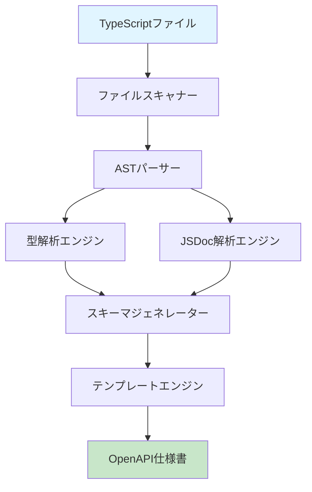
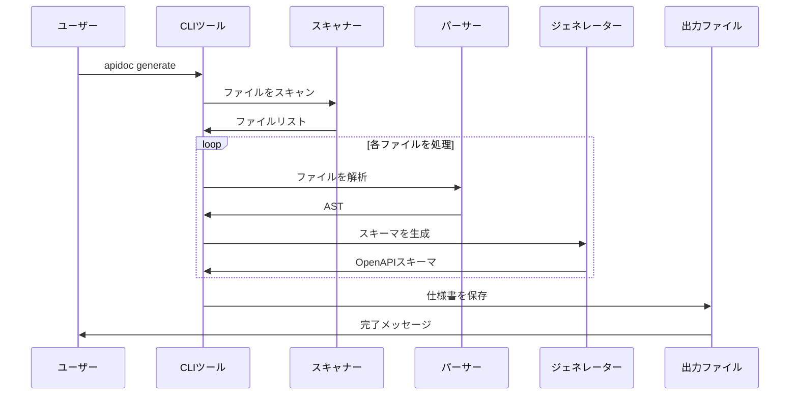
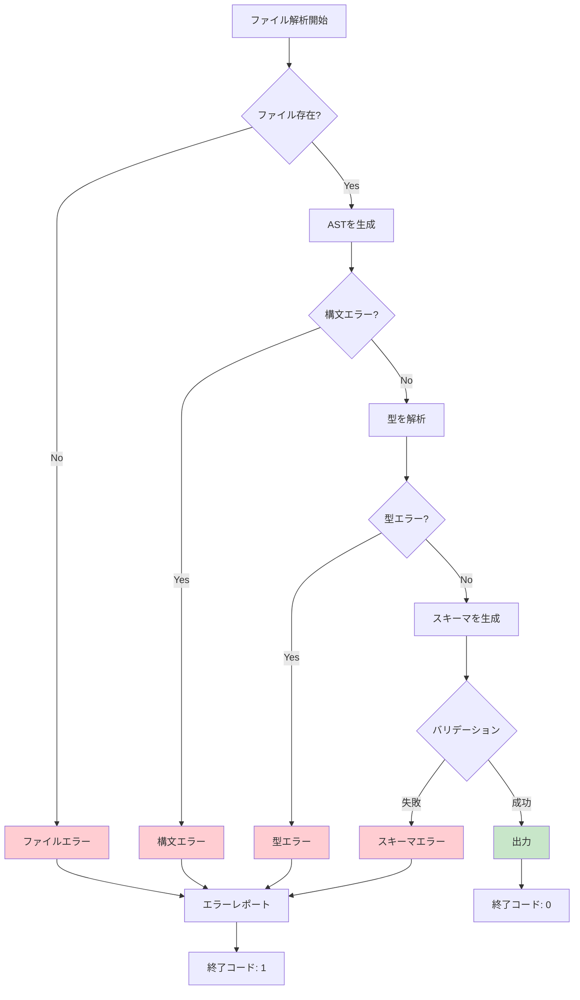
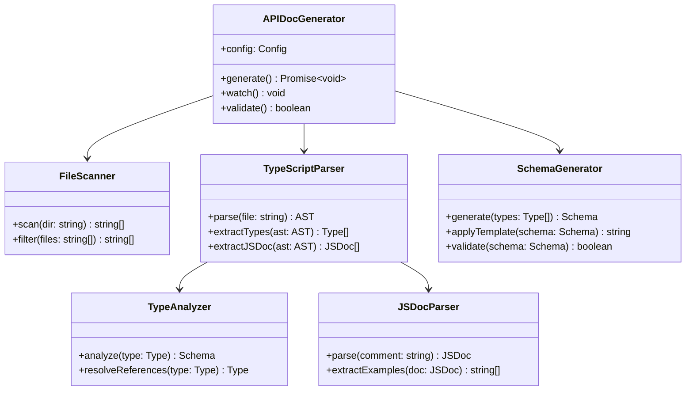
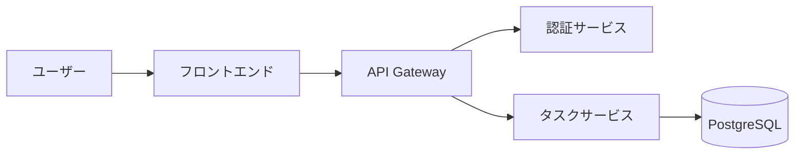

# 第5章: プロジェクト説明の書き方

## この章で学ぶこと

プロジェクト説明は、READMEの中で最も重要な部分の一つです。訪問者が最初に目にする情報であり、プロジェクトへの興味を引き出し、理解を促進する役割を担います。

この章では、以下の内容を学びます：

- プロジェクトの概要を明確に伝える方法（What、Why、Who）
- 主要な機能を効果的に説明する技術
- スクリーンショットや図解を活用した視覚的コミュニケーション
- 実践的なユースケースの提示方法

適切なプロジェクト説明により、次のような効果が得られます：

1. **迅速な理解**: 訪問者が1分以内にプロジェクトの価値を理解できる
2. **ターゲットの明確化**: 誰のためのプロジェクトかが明確になる
3. **適切な期待設定**: プロジェクトができること・できないことが明確になる
4. **コントリビューションの促進**: プロジェクトの方向性が理解され、貢献しやすくなる

### なぜプロジェクト説明が重要か

GitHubやGitLabでプロジェクトを公開した際、訪問者は平均10〜30秒程度でプロジェクトの評価を行うと一般的に言われています。この短い時間の中で、プロジェクトの価値を伝えられなければ、訪問者は離脱してしまいます。

明確なプロジェクト説明は次の役割を果たします：

- **意思決定の支援**: 利用者が「このプロジェクトを使うべきか」を判断できる
- **学習コストの削減**: プロジェクトの全体像を理解してから詳細に進める
- **コミュニティの形成**: 目的に共感する人が集まりやすくなる
- **メンテナンスの効率化**: 質問や誤解が減り、サポートコストが下がる

### 前提知識

この章を理解するには、以下の知識があると望ましいです：

- Markdownの基本的な構文（見出し、リスト、リンク、画像）
- READMEの基本的な構成（第4章の内容）
- プロジェクトの目的と対象読者の理解

それでは、効果的なプロジェクト説明の書き方を段階的に学んでいきましょう。

---

## プロジェクトの概要：What、Why、Who

プロジェクト説明の核心は、「What（何か）」「Why（なぜか）」「Who（誰のためか）」の3つの問いに答えることです。これらを明確にすることで、訪問者は迅速にプロジェクトの価値を理解できます。

### What: プロジェクトが何であるかを説明する

「What」は、プロジェクトの本質を1〜2文で簡潔に説明する部分です。技術的な詳細よりも、プロジェクトが提供する価値や解決する問題に焦点を当てます。

#### 効果的な「What」の書き方

**基本構造:**

```
[プロジェクト名] は、[対象読者] が [目的] を達成するための [種類] です。
```

**❌ 悪い例: 技術的すぎる説明**

```markdown
# MyApp

Node.js、Express、PostgreSQLを使用したWebアプリケーションフレームワークです。
RESTful APIを提供し、JWT認証を実装しています。
```

この例の問題点：
- 技術スタックは書かれているが、何のためのアプリケーションかわからない
- 利用者にとっての価値が不明確
- 他の類似プロジェクトとの違いが見えない

**✅ 良い例: 価値に焦点を当てた説明**

```markdown
# MyApp

MyAppは、小規模チームがプロジェクトタスクを視覚的に管理するためのオープンソースのタスクボードアプリケーションです。カンバン方式でタスクを管理し、チームの生産性を向上させます。
```

この例の良い点：
- 「小規模チーム」という対象が明確
- 「タスクの視覚的管理」という目的が明確
- 「カンバン方式」で具体的な方法論を示している
- 技術的詳細は後回しにして、価値を優先している

#### プロジェクトの種類を明示する

訪問者が素早く理解できるように、プロジェクトの種類を明示することが重要です。

**一般的なプロジェクトの種類:**

- **ライブラリ**: 特定の機能を提供するコードの集合（例: 日付処理、バリデーション）
- **フレームワーク**: アプリケーション開発の基盤となる構造（例: Webフレームワーク）
- **ツール**: 特定のタスクを実行するアプリケーション（例: CLIツール、ビルドツール）
- **アプリケーション**: エンドユーザーが直接使用するソフトウェア（例: Webアプリ、デスクトップアプリ）
- **テンプレート/ボイラープレート**: プロジェクトの開始点となる雛形
- **プラグイン/拡張機能**: 既存のツールやアプリケーションに機能を追加するもの

**例: ライブラリの場合**

```markdown
# date-formatter

date-formatterは、JavaScriptで日付をフォーマットするための軽量ライブラリです。
依存関係ゼロで、わずか2KBのサイズです。
```

**例: CLIツールの場合**

```markdown
# config-validator

config-validatorは、設定ファイル（JSON、YAML）のスキーマ検証を行うCLIツールです。
CI/CDパイプラインに組み込んで、デプロイ前に設定エラーを検出できます。
```

**例: Webアプリケーションの場合**

```markdown
# TeamDash

TeamDashは、リモートチームのためのダッシュボードアプリケーションです。
チームメンバーの現在の作業状況、進捗、ブロッカーを一目で確認できます。
```

#### 一行説明と詳細説明の使い分け

プロジェクト説明は、2段階の情報提供が効果的です。

**第1段階: 一行説明（エレベーターピッチ）**

最初の一文で、プロジェクトの本質を伝えます。この一文は以下の特徴を持つべきです：

- 20〜30語程度の長さ
- 専門用語を最小限に
- プロジェクトの最大の価値を表現

**第2段階: 詳細説明（2〜3段落）**

一行説明の後に、以下の情報を追加します：

- プロジェクトが解決する問題
- 主要な特徴（3〜5点）
- 他の類似プロジェクトとの違い（オプション）

**実践例:**

```markdown
# APIDoc Generator

**一行説明:**
APIDoc Generatorは、TypeScriptのソースコードから自動的にAPI仕様書を生成するツールです。

**詳細説明:**
APIDoc Generatorは、手動でのAPI仕様書作成の手間を削減し、コードと仕様書の同期を保つことを目的としています。TypeScriptの型定義とJSDocコメントから、OpenAPI 3.0形式の仕様書を自動生成します。

主な特徴：
- TypeScriptの型情報から正確な仕様書を生成
- JSDocコメントから説明やサンプルを抽出
- CI/CDに組み込んで自動更新が可能
- Swagger UIで即座にプレビュー可能

従来のツールと異なり、型定義を直接解析するため、型と仕様書の不整合が発生しません。
```

### Why: なぜこのプロジェクトが必要かを説明する

「Why」は、プロジェクトが存在する理由、解決しようとしている問題を説明します。これにより、訪問者は「このプロジェクトは自分の問題を解決できるか」を判断できます。

#### 問題の明確化

効果的な「Why」は、具体的な問題から始まります。

**基本構造:**

```markdown
## なぜAPIDoc Generatorなのか

多くの開発チームは、API仕様書の作成と維持に以下の課題を抱えています：

- **仕様書とコードの不一致**: 手動で仕様書を更新するため、コードとの同期が取れなくなる
- **作成の手間**: 新しいエンドポイントを追加するたびに仕様書も手動で更新する必要がある
- **レビューの困難さ**: コードレビューと仕様書レビューが別々になり、整合性の確認が難しい

APIDoc Generatorは、これらの問題をソースコードからの自動生成によって解決します。
```

この例の良い点：
- 具体的な問題を箇条書きで明示
- 問題が開発チームの実際の痛みである
- 解決方法を簡潔に提示

#### 既存の解決策との違い

既に類似のプロジェクトが存在する場合、なぜ新しいプロジェクトが必要なのかを説明することが重要です。

**❌ 悪い例: 他プロジェクトを批判する**

```markdown
## なぜこのプロジェクトか

既存のツールXは遅すぎて使い物になりません。
ツールYは機能が不足しており、実用的ではありません。
```

この例の問題点：
- 他のプロジェクトを不当に批判している
- 具体的な根拠が示されていない
- ネガティブなトーンでコミュニティに悪印象を与える

**✅ 良い例: ポジティブに差別化を説明する**

```markdown
## 既存ツールとの違い

API仕様書生成ツールは複数存在しますが、APIDoc Generatorは以下の点で差別化されています：

| 特徴 | APIDoc Generator | ツールA | ツールB |
|------|------------------|---------|---------|
| TypeScript型解析 | ○ | × | ○ |
| 増分ビルド | ○ | × | × |
| カスタムテンプレート | ○ | ○ | × |
| CI/CD統合 | ○ | ○ | ○ |

特に、増分ビルド機能により、大規模プロジェクトでも数秒で仕様書を更新できます。
```

この例の良い点：
- 比較表で客観的に違いを示している
- 具体的な特徴で差別化している
- ポジティブなトーンを保っている
- 最大の強み（増分ビルド）を明確に示している

#### モチベーションの共有

オープンソースプロジェクトの場合、プロジェクト作成の背景やモチベーションを共有すると、共感を得やすくなります。

**例:**

```markdown
## プロジェクトの背景

このプロジェクトは、私たちのチームが直面していた実際の課題から生まれました。

あるプロジェクトで、APIエンドポイントが50を超えた頃、手動での仕様書更新が破綻しました。
コードは正しく動作しているのに、仕様書が古いために、フロントエンドチームとバックエンドチームの間で誤解が生じていました。

既存のツールも試しましたが、TypeScriptの高度な型（Union型、Intersection型など）を正しく処理できず、手動での補正が必要でした。

「コードが真実なら、コードから仕様書を生成すればいい」という考えから、APIDoc Generatorが誕生しました。
```

この例の良い点：
- 実際の経験に基づいている
- 具体的な数値（50エンドポイント）で状況を説明
- 既存ツールの制約を客観的に説明
- プロジェクトの哲学を明確にしている

### Who: 誰のためのプロジェクトかを説明する

「Who」は、プロジェクトの対象読者を明確にします。これにより、訪問者は「このプロジェクトは自分に適しているか」を判断できます。

#### ターゲットユーザーの明確化

**基本的なアプローチ:**

```markdown
## 対象読者

このプロジェクトは以下のような方に適しています：

- TypeScriptでAPIを開発しているバックエンドエンジニア
- API仕様書の維持に課題を感じているチーム
- OpenAPI形式の仕様書を自動生成したい開発者
- CI/CDパイプラインでドキュメントを自動更新したい組織
```

#### スキルレベルの明示

プロジェクトの利用に必要なスキルレベルを明示することで、適切な期待を設定できます。

**例: 初心者向けプロジェクト**

```markdown
## 必要な前提知識

このプロジェクトは、以下の知識を持つ方を対象としています：

- **必須**: JavaScriptの基本的な知識
- **推奨**: Node.jsの基本的な使い方
- **不要**: TypeScriptの深い知識（基本的な型定義が読めれば十分です）

初めてAPIを開発する方でも、チュートリアルに従えば30分で最初の仕様書を生成できます。
```

**例: 上級者向けプロジェクト**

```markdown
## 前提条件

このフレームワークは、以下の経験を持つ開発者を対象としています：

- Kubernetesでのアプリケーションデプロイ経験
- マイクロサービスアーキテクチャの理解
- 分散システムのトレーシングとモニタリングの知識

このフレームワークは、複雑な分散システムを構築する経験豊富な開発者向けです。
基本的なWebアプリケーション開発には、より軽量なフレームワークをお勧めします。
```

#### 非対象ユーザーの明示

時には、「このプロジェクトが適していない人」を明示することも有効です。これにより、不適切な期待を防ぎ、サポートコストを削減できます。

**例:**

```markdown
## このプロジェクトが適していない場合

以下のような場合、他の選択肢を検討することをお勧めします：

- **JavaScriptではなくPython/Rubyを使用している**: 言語固有のツールをご利用ください
- **小規模プロジェクト（エンドポイント10未満）**: 手動での仕様書作成の方が効率的な場合があります
- **OpenAPI形式が不要**: よりシンプルなMarkdownベースのドキュメント生成ツールが適しています
```

#### ユースケースによる対象読者の明確化

具体的なユースケースを示すことで、対象読者が自分に当てはまるかを判断しやすくなります。

**例:**

```markdown
## 典型的なユースケース

### ユースケース1: スタートアップのバックエンドチーム

**状況**:
チームは3人、APIエンドポイントは30程度。
迅速な開発が求められ、ドキュメント作成に時間をかけられない。

**解決方法**:
APIDoc GeneratorをCI/CDに組み込み、コードをプッシュするたびに自動的に仕様書を更新。
フロントエンドチームは常に最新の仕様書を参照できる。

### ユースケース2: エンタープライズの開発チーム

**状況**:
複数のマイクロサービスを運用し、それぞれにAPIがある。
仕様書の統一と品質管理が課題。

**解決方法**:
各マイクロサービスにAPIDoc Generatorを導入し、統一された形式で仕様書を生成。
カスタムテンプレートで企業の標準に準拠した仕様書を自動生成。
```

### 3つの要素を統合した完全な例

ここまで学んだ「What」「Why」「Who」を統合した完全な例を示します。

```markdown
# APIDoc Generator

> TypeScriptコードから自動的にOpenAPI仕様書を生成するCLIツール

## 概要

APIDoc Generatorは、TypeScriptで書かれたAPIサーバーのソースコードから、OpenAPI 3.0形式のAPI仕様書を自動生成するツールです。型定義とJSDocコメントを解析し、正確で最新の仕様書を維持します。

### 主な特徴

- **型安全**: TypeScriptの型定義から正確な仕様書を生成
- **自動同期**: コードと仕様書の不一致を防止
- **高速**: 増分ビルドにより大規模プロジェクトでも数秒で更新
- **カスタマイズ可能**: テンプレートで出力形式を柔軟に調整
- **CI/CD対応**: ビルドパイプラインに簡単に統合

## なぜAPIDoc Generatorなのか

### 解決する問題

API開発において、仕様書の維持は継続的な課題です：

1. **手動更新の負担**: 新しいエンドポイントやパラメータを追加するたびに仕様書も更新が必要
2. **同期の困難**: コードは変更されたが仕様書が古いままになりがち
3. **レビューの手間**: コードと仕様書を別々にレビューし、整合性を確認する必要がある
4. **初期コスト**: 新しいAPIを開発する際、仕様書を一から作成する手間がかかる

### 解決方法

APIDoc Generatorは、「コードが真実」という原則に基づき、ソースコードから仕様書を自動生成します：

```typescript
/**
 * ユーザーを作成します
 * @param name ユーザー名（1-50文字）
 * @param email メールアドレス
 */
export async function createUser(
  name: string,
  email: string
): Promise<User> {
  // ...
}
```

このコードから、以下のOpenAPI仕様が自動生成されます：

```yaml
paths:
  /users:
    post:
      summary: ユーザーを作成します
      requestBody:
        content:
          application/json:
            schema:
              type: object
              properties:
                name:
                  type: string
                  description: ユーザー名（1-50文字）
                email:
                  type: string
                  description: メールアドレス
```

### 既存ツールとの違い

複数のAPI仕様書生成ツールが存在しますが、APIDoc Generatorは以下の点で優れています：

- **TypeScriptファースト**: TS専用に最適化され、高度な型（Union、Intersection、Genericsなど）を正確に処理
- **増分ビルド**: 変更されたファイルのみを処理し、大規模プロジェクトでも高速
- **ゼロ設定**: 基本的な使用では設定ファイル不要で、すぐに開始できる

## 対象読者

このツールは以下のような方に最適です：

- TypeScriptでREST APIを開発しているバックエンドエンジニア
- API仕様書の手動維持に課題を感じているチーム
- OpenAPI形式の仕様書が必要なプロジェクト
- CI/CDでドキュメントを自動化したい組織

### 前提知識

- **必須**: TypeScriptの基本的な知識（型定義の読み書き）
- **推奨**: OpenAPIの基本的な理解
- **推奨**: Node.jsとnpmの使用経験

### このツールが適していない場合

以下の場合は、他の選択肢を検討してください：

- **GraphQL API**: GraphQLには専用のツール（GraphQL Code Generatorなど）が適しています
- **非TypeScriptプロジェクト**: 各言語専用のツールをご利用ください
- **極小規模プロジェクト**: エンドポイント数個の場合、手動作成の方が効率的な場合があります

## クイックスタート

```bash
# インストール
npm install -g apidoc-generator

# プロジェクトディレクトリで実行
apidoc generate ./src --output ./docs/api.yaml

# Swagger UIでプレビュー
apidoc serve ./docs/api.yaml
```

詳細なセットアップ方法は[インストールガイド](./docs/installation.md)をご覧ください。
```

この例の優れた点：
- 冒頭で一行説明を提供し、素早い理解を促進
- 「What」で主な特徴を箇条書きで明示
- 「Why」で具体的な問題と解決方法を説明
- コード例で実際の動作を示している
- 「Who」で対象読者と非対象読者を明確化
- クイックスタートで最初の一歩を示している

---

## 主要な機能の説明

プロジェクトの概要を説明した後は、主要な機能を詳しく説明します。機能説明は、読者がプロジェクトの能力と限界を理解するために重要です。

### 機能の優先順位付け

すべての機能を平等に扱うのではなく、優先順位を付けて説明します。

#### 機能の分類

機能は一般的に以下のように分類できます：

1. **コア機能**: プロジェクトの存在理由となる機能（3-5個）
2. **主要機能**: 重要だが必須ではない機能（5-10個）
3. **補助機能**: あると便利な機能（制限なし）

**✅ 良い例: 優先順位を明確にした機能説明**

```markdown
## 機能

### コア機能

#### 1. TypeScript型解析

TypeScriptの型定義を直接解析し、正確なスキーマを生成します。

```typescript
type User = {
  id: string;
  name: string;
  email: string;
  role: 'admin' | 'user' | 'guest';
};
```

上記の型定義から、以下のOpenAPIスキーマが生成されます：

```yaml
User:
  type: object
  properties:
    id:
      type: string
    name:
      type: string
    email:
      type: string
    role:
      type: string
      enum: [admin, user, guest]
```

#### 2. JSDocコメント解析

JSDocコメントから説明、例、バリデーションルールを抽出します。

```typescript
/**
 * ユーザーを検索します
 *
 * @param query 検索クエリ（最小3文字）
 * @param limit 結果の最大件数（デフォルト: 20）
 * @returns 検索結果のユーザーリスト
 *
 * @example
 * const users = await searchUsers('john', 10);
 */
```

#### 3. 増分ビルド

変更されたファイルのみを処理し、ビルド時間を最小化します。

- 初回ビルド: 約5秒（100ファイル）
- 増分ビルド: 約0.5秒（変更ファイル1-2個）

### 主要機能

- **カスタムテンプレート**: Handlebarsテンプレートで出力をカスタマイズ
- **複数形式対応**: YAML、JSON、HTML形式で出力
- **バリデーション**: 生成された仕様書の妥当性を自動検証
- **マルチプロジェクト**: モノレポでの複数プロジェクトに対応
- **プラグインシステム**: カスタムロジックを追加可能

### 補助機能

- **VS Code拡張**: エディタ内でリアルタイムプレビュー
- **ウォッチモード**: ファイル変更を監視して自動再生成
- **統計レポート**: APIエンドポイントの統計情報を出力
- **差分表示**: バージョン間の仕様変更を視覚化
```

この例の良い点：
- コア機能を最も詳しく説明している
- 各機能にコード例や具体的な数値を提供
- 主要機能と補助機能を区別している
- 読者が重要な情報から順に理解できる

### 機能説明のベストプラクティス

#### 1. 具体例を含める

抽象的な説明だけでなく、具体例を示すことで理解を促進します。

**❌ 悪い例: 抽象的すぎる**

```markdown
## 高度なフィルタリング機能

強力なクエリ言語により、複雑な条件でデータをフィルタリングできます。
```

**✅ 良い例: 具体例を含む**

```markdown
## 高度なフィルタリング機能

直感的なクエリ言語で、複雑な条件でのフィルタリングが可能です。

### 基本的なフィルタリング

```javascript
// 名前が"John"で始まるユーザーを検索
users.filter({ name: { startsWith: 'John' } })

// 年齢が25歳以上30歳未満のユーザー
users.filter({ age: { gte: 25, lt: 30 } })
```

### 複合条件

```javascript
// AND条件
users.filter({
  role: 'admin',
  status: 'active',
  lastLogin: { gte: '2026-01-01' }
})

// OR条件
users.filter({
  $or: [
    { role: 'admin' },
    { role: 'moderator' }
  ]
})
```

### ネストした条件

```javascript
// ユーザーの投稿が10以上で、最新の投稿が1週間以内
users.filter({
  'posts.count': { gte: 10 },
  'posts.latest.createdAt': { gte: '7d' }
})
```
```

#### 2. ビフォー・アフターを示す

機能がどのように問題を解決するかを、ビフォー・アフターで示します。

**例:**

```markdown
## 自動エラー処理

### 従来の方法

APIエンドポイントごとにエラーハンドリングを記述する必要がありました：

```typescript
app.get('/users/:id', async (req, res) => {
  try {
    const user = await getUserById(req.params.id);
    if (!user) {
      return res.status(404).json({ error: 'User not found' });
    }
    res.json(user);
  } catch (error) {
    console.error(error);
    res.status(500).json({ error: 'Internal server error' });
  }
});
```

### APIDoc Generatorを使用した場合

デコレータでエラーハンドリングを宣言的に定義：

```typescript
@Get('/users/:id')
@Returns(200, User)
@Returns(404, 'User not found')
async getUser(@Param('id') id: string): Promise<User> {
  return await getUserById(id);
  // エラーは自動的に適切なステータスコードに変換される
}
```

エラーハンドリングが自動化され、コードが簡潔になります。
```

#### 3. 制限事項を明記する

機能の限界や制約を正直に記載することで、適切な期待を設定します。

**例:**

```markdown
## TypeScript型解析

### サポートされている型

- プリミティブ型: `string`, `number`, `boolean`, `null`, `undefined`
- 配列型: `string[]`, `Array<number>`
- オブジェクト型: `{ name: string; age: number }`
- Union型: `string | number`
- Intersection型: `A & B`
- ジェネリクス: `Promise<T>`, `Array<T>`
- リテラル型: `'admin' | 'user'`

### 現在サポートされていない型

以下の型は現在サポートされていません（将来のバージョンで対応予定）：

- **Conditional Types**: `T extends U ? X : Y`
- **Mapped Types**: `{ [K in keyof T]: T[K] }`
- **Template Literal Types**: `` `${T}_${U}` ``

これらの型を使用している場合、手動で型を指定する必要があります：

```typescript
/**
 * @schema { type: 'string', pattern: '^[a-z]+_[0-9]+$' }
 */
type CustomType = `${string}_${number}`;
```
```

この例の良い点：
- サポートされている機能を明確にリストアップ
- サポートされていない機能も正直に記載
- 回避策（手動での型指定）を提供
- 将来の対応予定を示して期待を管理

#### 4. パフォーマンス特性を示す

パフォーマンスが重要な機能では、具体的な数値や条件を示します。

**注意**: 実際に測定した場合のみ具体的な数値を記載してください。測定していない場合は、「想定されるケース」として記載します。

**例: 実測データがある場合**

```markdown
## パフォーマンス

以下は、開発者のローカル環境（MacBook Pro 2021, M1 Pro）での実測値です：

| プロジェクトサイズ | 初回ビルド | 増分ビルド |
|-------------------|-----------|-----------|
| 小規模（20ファイル） | 1.2秒 | 0.2秒 |
| 中規模（100ファイル） | 4.8秒 | 0.5秒 |
| 大規模（500ファイル） | 18.3秒 | 1.1秒 |

**測定環境:**
- MacBook Pro 2021, M1 Pro
- メモリ: 16GB
- Node.js: v20.10.0
- TypeScript: v5.3.3

実際のパフォーマンスは、プロジェクトの複雑さや環境によって異なります。
```

**例: 実測データがない場合**

```markdown
## パフォーマンス特性

パフォーマンスは以下の要因に影響されます：

- **ファイル数**: ファイルが多いほどビルド時間が長くなります
- **型の複雑さ**: ネストが深い型やジェネリクスは処理時間が増加します
- **コメント量**: JSDocコメントが多いと解析時間が増えます

### 最適化のヒント

一般的に、以下の方法でビルド時間を短縮できます：

1. **増分ビルドの活用**: `--incremental`フラグを使用
2. **不要なファイルの除外**: `.apidocignore`で除外設定
3. **型の簡略化**: 過度に複雑な型は避ける

大規模プロジェクト（数百ファイル）でも、増分ビルドでは通常数秒以内に完了することが期待されます。
```

#### 5. 使用例を段階的に示す

基本的な使用例から高度な使用例へと段階的に示します。

**例:**

```markdown
## 使用例

### レベル1: 基本的な使用

最もシンプルな使い方：

```bash
# デフォルト設定で仕様書を生成
apidoc generate
```

これにより、`./src`ディレクトリから`./docs/api.yaml`が生成されます。

### レベル2: オプションの指定

入力・出力を指定：

```bash
# 特定のディレクトリから生成
apidoc generate ./src/api --output ./docs/openapi.yaml

# JSON形式で出力
apidoc generate --format json
```

### レベル3: 設定ファイルの使用

複雑な設定には設定ファイルを使用：

```javascript
// apidoc.config.js
module.exports = {
  input: './src/api',
  output: './docs/api.yaml',
  format: 'yaml',
  template: './templates/custom.hbs',
  exclude: ['**/*.test.ts', '**/*.spec.ts'],
  openapi: {
    info: {
      title: 'My API',
      version: '1.0.0',
      description: 'My awesome API'
    },
    servers: [
      { url: 'https://api.example.com', description: 'Production' },
      { url: 'https://staging-api.example.com', description: 'Staging' }
    ]
  }
};
```

```bash
# 設定ファイルを使用
apidoc generate --config apidoc.config.js
```

### レベル4: プログラマティックな使用

Node.jsスクリプトから直接使用：

```typescript
import { APIDocGenerator } from 'apidoc-generator';

const generator = new APIDocGenerator({
  input: './src/api',
  output: './docs/api.yaml'
});

// 生成
await generator.generate();

// 監視モード
generator.watch((event) => {
  console.log(`仕様書が更新されました: ${event.file}`);
});
```

### レベル5: CI/CD統合

GitHub Actionsでの自動生成：

```yaml
name: Generate API Docs

on:
  push:
    branches: [main]

jobs:
  generate-docs:
    runs-on: ubuntu-latest
    steps:
      - uses: actions/checkout@v3
      - uses: actions/setup-node@v3
        with:
          node-version: '20'

      - name: Install dependencies
        run: npm ci

      - name: Generate API docs
        run: npx apidoc generate

      - name: Deploy to GitHub Pages
        uses: peaceiris/actions-gh-pages@v3
        with:
          github_token: ${{ secrets.GITHUB_TOKEN }}
          publish_dir: ./docs
```
```

この例の良い点：
- 最も簡単な使い方から始めている
- 各レベルで新しい概念を1つずつ導入
- 実践的なCI/CD統合例まで提供
- 読者が自分のレベルに合った使い方を選べる

### 機能の比較表

複数の選択肢や設定がある場合、比較表が効果的です。

**例:**

```markdown
## 出力形式

APIDoc Generatorは複数の出力形式をサポートしています：

| 形式 | ファイル拡張子 | 用途 | サイズ | 可読性 |
|------|---------------|------|--------|--------|
| YAML | `.yaml` | OpenAPI仕様書の標準形式 | 小 | 高 |
| JSON | `.json` | プログラムでの処理に適している | 中 | 中 |
| HTML | `.html` | ブラウザでの閲覧に適している | 大 | 最高 |
| Markdown | `.md` | ドキュメントサイトに組み込みやすい | 小 | 高 |

### 推奨用途

- **YAML**: デフォルトの選択。OpenAPIツールとの互換性が高い
- **JSON**: プログラムから読み込む場合やAPIとして提供する場合
- **HTML**: エンドユーザー向けのドキュメントサイト
- **Markdown**: GitHub、GitLab、Bitbucketでの表示
```

### 機能のグループ化

関連する機能をグループ化して説明することで、理解しやすくなります。

**例:**

```markdown
## 機能一覧

### コード解析機能

| 機能 | 説明 |
|------|------|
| TypeScript型解析 | 型定義から正確なスキーマを生成 |
| JSDoc解析 | コメントから説明や例を抽出 |
| デコレータサポート | ルーティングデコレータから情報を取得 |
| Import解析 | 外部型の参照を追跡 |

### 出力機能

| 機能 | 説明 |
|------|------|
| 複数形式対応 | YAML、JSON、HTML、Markdown |
| カスタムテンプレート | Handlebarsで出力をカスタマイズ |
| 分割出力 | タグごとに別ファイルに分割 |
| バージョン管理 | 複数バージョンの仕様書を同時生成 |

### 開発者体験

| 機能 | 説明 |
|------|------|
| 増分ビルド | 変更ファイルのみを処理 |
| ウォッチモード | ファイル変更を監視して自動再生成 |
| VS Code拡張 | エディタ内プレビュー |
| CLIコマンド | シンプルで覚えやすいコマンド |

### CI/CD統合

| 機能 | 説明 |
|------|------|
| ゼロ設定 | 基本的な使用では設定不要 |
| Exit Code | エラー時は非ゼロで終了 |
| バリデーション | 生成された仕様書の妥当性チェック |
| 差分検出 | 仕様変更を検出してPRに通知 |
```

---

## スクリーンショット・図解の活用

視覚的な要素は、文字だけでは伝えにくい情報を効果的に伝えます。特に、ユーザーインターフェースを持つアプリケーションや、複雑なアーキテクチャを持つシステムでは、スクリーンショットや図解が不可欠です。

### スクリーンショットの効果的な使用

#### いつスクリーンショットを使うべきか

スクリーンショットは以下の場合に特に効果的です：

1. **UIの外観を示す**: Webアプリ、デスクトップアプリ、モバイルアプリ
2. **操作手順を説明する**: 複雑な設定や操作フロー
3. **出力結果を示す**: CLIツールの実行結果、レポート、ダッシュボード
4. **問題と解決を視覚化**: バグの再現手順、修正前後の比較

#### スクリーンショットのベストプラクティス

**1. 高品質な画像を使用する**

- **解像度**: Retina対応のために2倍の解像度で撮影
- **形式**: PNGを推奨（UIの場合）、写真的な画像の場合はJPEG
- **圧縮**: TinyPNGなどで適度に圧縮してファイルサイズを削減

**2. 適切なサイズにする**

```markdown
<!-- Markdownでの画像サイズ指定 -->


<!-- HTMLでの指定（より細かい制御） -->

```

**3. 代替テキストを適切に記載する**

代替テキストは、視覚障害を持つユーザーやネットワークの問題で画像が表示されない場合に重要です。

**❌ 悪い例:**

```markdown


```

**✅ 良い例:**

```markdown


```

**4. 注釈を追加する**

複雑なUIでは、重要な部分に注釈を追加します。

```markdown
## メイン画面


**画面の構成:**
1. **ナビゲーションバー（上部）**: プロジェクト切り替え、検索、ユーザーメニュー
2. **サイドバー（左側）**: タスクのフィルタリングとグループ化
3. **カンバンボード（中央）**: タスクカードを「未着手」「進行中」「完了」に分類
4. **詳細パネル（右側）**: 選択したタスクの詳細情報

各タスクカードには、タイトル、担当者、期日、優先度が表示されます。
```

#### 実践例: Webアプリケーションの場合

```markdown
# TaskFlow - チーム向けタスク管理アプリ

## 機能紹介

### カンバンボード

直感的なドラッグ&ドロップでタスクを管理できます。


タスクカードをドラッグして、別のカラムにドロップするだけで状態を変更できます。

### タスク詳細

タスクをクリックすると、右側に詳細パネルが表示されます。


詳細パネルでは以下の操作が可能です：
- タスクの説明を編集
- 担当者を変更
- 期日と優先度を設定
- コメントを追加
- チェックリストの管理

### フィルタリングとソート

サイドバーから、様々な条件でタスクをフィルタリングできます。


### ダークモード

目に優しいダークモードに対応しています。

<div style="display: flex; gap: 10px;">
  
  
</div>
```

#### 実践例: CLIツールの場合

CLIツールでは、ターミナルの出力をスクリーンショットではなく、コードブロックで示すことが一般的です。ただし、カラー出力や複雑な出力の場合は、スクリーンショットが効果的です。

```markdown
# apidoc-generator - API仕様書生成ツール

## 実行例

### 基本的な使用

```bash
$ apidoc generate

🚀 API仕様書を生成しています...

📂 入力: ./src/api
📝 出力: ./docs/api.yaml

✓ TypeScriptファイルをスキャン (0.3s)
✓ 型定義を解析 (1.2s)
✓ JSDocコメントを解析 (0.5s)
✓ OpenAPI仕様書を生成 (0.8s)

✅ 完了！

📊 統計:
  - エンドポイント: 42
  - スキーマ: 28
  - タグ: 6

🌐 プレビュー: http://localhost:3000
```

カラー出力で見やすく表示されます：


### エラーの表示

エラーが発生した場合は、わかりやすいメッセージを表示します：


```bash
$ apidoc generate

🚀 API仕様書を生成しています...

❌ エラーが発生しました

src/api/users.ts:15:10 - 型エラー
'User'型に'invalidField'プロパティは存在しません

  13 | export async function getUser(id: string): Promise<User> {
  14 |   const user = await fetchUser(id);
> 15 |   user.invalidField = 'value';
     |        ^^^^^^^^^^^^
  16 |   return user;
  17 | }

💡 ヒント: 'User'型の定義を確認してください
```
```

### 図解の効果的な使用

図解は、以下の情報を伝えるのに効果的です：

1. **アーキテクチャ**: システムの構成要素と関係
2. **データフロー**: データがどのように流れるか
3. **プロセス**: 処理の流れや手順
4. **関係性**: エンティティ間の関係

#### テキストベースの図解: Mermaid

Mermaidは、Markdown内にテキストで図を記述できるツールです。GitHubやGitLabなどで自動的にレンダリングされます。

**メリット:**
- バージョン管理が容易
- 差分が明確
- メンテナンスが簡単
- ツール不要で編集可能

**デメリット:**
- 表現力が限定的
- 複雑な図は作りにくい
- レイアウトの細かい調整ができない

**実践例: システムアーキテクチャ図**

```markdown
## アーキテクチャ

APIDoc Generatorは、以下のアーキテクチャで動作します：



**コンポーネントの説明:**

1. **ファイルスキャナー**: プロジェクト内のTypeScriptファイルを検索
2. **ASTパーサー**: TypeScriptコンパイラAPIでASTを生成
3. **型解析エンジン**: 型定義からスキーマを抽出
4. **JSDoc解析エンジン**: コメントから説明や例を抽出
5. **スキーマジェネレーター**: OpenAPIスキーマを生成
6. **テンプレートエンジン**: カスタムテンプレートを適用
7. **出力**: OpenAPI仕様書（YAML/JSON）
```

**実践例: シーケンス図**

```markdown
## API仕様書生成の流れ



このシーケンスは以下のステップで実行されます：

1. ユーザーがCLIコマンドを実行
2. プロジェクト内のTypeScriptファイルをスキャン
3. 各ファイルを順次解析
4. 型情報とJSDocコメントからスキーマを生成
5. OpenAPI形式で仕様書を出力
```

**実践例: フロー図**

```markdown
## エラーハンドリング

エラーは以下のフローで処理されます：



各エラーは、ファイル名、行番号、エラーメッセージとともに出力されます。
```

**実践例: クラス図**

```markdown
## 内部構造

主要なクラスの関係は以下の通りです：


```

#### 画像ベースの図解

複雑な図や、細かいレイアウト調整が必要な場合は、専用ツールで作成した画像を使用します。

**推奨ツール:**

1. **Excalidraw**: 手書き風の図、簡単な操作
2. **draw.io (diagrams.net)**: 本格的な図、多様なテンプレート
3. **Figma**: デザイン重視の図、チームコラボレーション
4. **Lucidchart**: エンタープライズ向け、豊富な機能

**例:**

```markdown
## システム全体像


システムは以下のコンポーネントで構成されています：

- **フロントエンド**: React SPA
- **API Gateway**: Kong
- **認証サービス**: Auth0
- **ユーザーサービス**: Node.js + PostgreSQL
- **タスクサービス**: Node.js + PostgreSQL
- **通知サービス**: Node.js + Redis + SendGrid
```

#### 図解のベストプラクティス

**1. シンプルに保つ**

図が複雑すぎると、理解が難しくなります。一つの図には一つの概念を示します。

**❌ 悪い例: 1つの図に詰め込みすぎ**

```markdown
<!-- システムアーキテクチャ、データフロー、デプロイメント、
     ネットワーク構成をすべて1つの図に含める -->
```

**✅ 良い例: 目的ごとに図を分ける**

```markdown
## アーキテクチャ

### システム構成

[システムの主要コンポーネントを示す図]

### データフロー

[データがどのように流れるかを示す図]

### デプロイメント

[どのようにデプロイされるかを示す図]
```

**2. 一貫したスタイルを使用する**

- 同じ色スキームを使用
- 同じアイコンやシンボルを使用
- 同じフォントとサイズを使用

**3. 説明を添える**

図だけでなく、テキストでの説明も追加します。

```markdown
## データフロー



**フローの説明:**

1. ユーザーがフロントエンドでタスクを作成
2. フロントエンドがAPI Gatewayにリクエスト送信
3. API Gatewayが認証サービスでトークン検証
4. 認証成功後、タスクサービスにリクエスト転送
5. タスクサービスがPostgreSQLにデータ保存
6. 結果をフロントエンドに返却
```

### GIFアニメーションの活用

動的な操作やアニメーションを示す場合、GIFアニメーションが効果的です。

**使用例:**
- UIの操作フロー
- アニメーション効果
- インタラクティブな機能
- リアルタイム更新

**作成ツール:**
- **LICEcap**: シンプルなスクリーンレコーダー（Windows/Mac）
- **Kap**: Mac専用、高品質
- **ScreenToGif**: Windows専用、編集機能豊富

**ベストプラクティス:**

1. **短く保つ**: 5〜10秒程度
2. **ファイルサイズを最適化**: 2MB以下を目標
3. **ループを考慮**: 自然にループするように撮影
4. **重要な部分を強調**: カーソルの動きを明確に

**例:**

```markdown
## ドラッグ&ドロップでタスク移動

タスクカードを別のカラムにドラッグ&ドロップすることで、状態を変更できます。


操作は以下の通りです：
1. タスクカードをクリックしてホールド
2. 目的のカラムまでドラッグ
3. ドロップすると自動的に保存される
```

---

## ユースケースの提示

ユースケースは、プロジェクトが実際にどのように使われるかを示すことで、読者が自分の状況に当てはめて考えることができます。

### 効果的なユースケースの構成

ユースケースは以下の要素を含むべきです：

1. **シナリオ**: 具体的な状況設定
2. **課題**: ユーザーが直面している問題
3. **解決方法**: プロジェクトを使った解決方法
4. **結果**: 得られた効果

#### ユースケースのテンプレート

```markdown
### ユースケース名

**背景:**
[具体的な状況設定]

**課題:**
[ユーザーが直面している問題]

**解決方法:**
[プロジェクトを使ってどのように解決するか]

**結果:**
[得られた効果や改善]

**コード例:**
[実際の使用例]
```

### 実践例: 複数のユースケース

```markdown
## ユースケース

### ユースケース1: スタートアップの迅速なAPI開発

**背景:**
スタートアップのバックエンドチーム（3人）は、MVP（Minimum Viable Product）を3ヶ月で完成させる必要があります。限られたリソースで、API開発とドキュメント作成を並行して進める必要があります。

**課題:**
- API仕様書の手動作成に時間を取られ、開発が遅れる
- 仕様書とコードが不一致になり、フロントエンドチームとの齟齬が発生
- 仕様変更のたびに複数の場所を更新する必要がある

**解決方法:**
APIDoc Generatorを導入し、TypeScriptコードから自動的に仕様書を生成。CI/CDパイプラインに組み込み、コードプッシュ時に自動更新。

```typescript
// src/api/users.ts

/**
 * 新しいユーザーを作成します
 *
 * @param name ユーザー名（2-50文字）
 * @param email メールアドレス
 * @returns 作成されたユーザー情報
 *
 * @example
 * const user = await createUser('John Doe', 'john@example.com');
 */
export async function createUser(
  name: string,
  email: string
): Promise<User> {
  // 実装
}
```

```yaml
# .github/workflows/api-docs.yml
name: Generate API Docs
on: [push]
jobs:
  generate:
    runs-on: ubuntu-latest
    steps:
      - uses: actions/checkout@v3
      - run: npm ci
      - run: npx apidoc generate
      - uses: peaceiris/actions-gh-pages@v3
        with:
          github_token: ${{ secrets.GITHUB_TOKEN }}
          publish_dir: ./docs
```

**結果:**
- API仕様書の作成時間が**ゼロ**に（自動生成）
- コードと仕様書の不一致がなくなり、フロントエンドチームとのコミュニケーションが改善
- 開発速度が向上し、予定通りMVPを完成

---

### ユースケース2: エンタープライズのマイクロサービス管理

**背景:**
大手企業の開発部門（50人以上）は、20以上のマイクロサービスを運用しています。各サービスは異なるチームが担当し、サービス間のAPI連携が複雑です。

**課題:**
- サービスごとに異なる仕様書形式が使われ、統一されていない
- 他チームのAPIを利用する際、仕様書が古かったり不完全だったりする
- API変更の影響範囲を把握するのが困難

**解決方法:**
全マイクロサービスにAPIDoc Generatorを導入し、OpenAPI形式で統一。各サービスの仕様書を集約したポータルサイトを構築。

```javascript
// apidoc.config.js（全サービス共通設定）
module.exports = {
  input: './src/api',
  output: './docs/openapi.yaml',
  template: './templates/enterprise-template.hbs',
  openapi: {
    info: {
      title: process.env.SERVICE_NAME,
      version: process.env.SERVICE_VERSION,
      contact: {
        name: 'API Support Team',
        email: 'api-support@company.com'
      }
    },
    servers: [
      {
        url: `https://api.company.com/${process.env.SERVICE_NAME}`,
        description: 'Production'
      }
    ],
    tags: require('./api-tags.json')
  },
  plugins: [
    'enterprise-auth-plugin',
    'api-versioning-plugin',
    'deprecation-tracker-plugin'
  ]
};
```

**結果:**
- 全サービスの仕様書が統一されたOpenAPI形式に
- API変更を自動的にトラッキングし、影響を受けるチームに通知
- サービス間の依存関係が可視化され、アーキテクチャの改善に貢献
- 新入社員のオンボーディング時間が50%短縮

---

### ユースケース3: オープンソースプロジェクトのコントリビューター支援

**背景:**
人気のオープンソースライブラリ（月間100万ダウンロード）は、多くのコントリビューターからPRを受け取ります。しかし、APIの変更が含まれるPRでは、仕様書の更新が抜けることが頻繁にありました。

**課題:**
- PRレビュー時に仕様書の更新漏れを指摘する必要があり、レビューコストが高い
- 手動更新のため、仕様書の品質にばらつきがある
- コントリビューターにとって、仕様書更新がハードルになっている

**解決方法:**
APIDoc Generatorを導入し、CIパイプラインで仕様書を自動生成。PR時に仕様書の差分も自動的に表示。

```yaml
# .github/workflows/pr-check.yml
name: PR Check
on: [pull_request]
jobs:
  api-docs-diff:
    runs-on: ubuntu-latest
    steps:
      - uses: actions/checkout@v3
        with:
          fetch-depth: 0

      - name: Generate API docs (base)
        run: |
          git checkout ${{ github.base_ref }}
          npx apidoc generate --output ./docs/base.yaml

      - name: Generate API docs (PR)
        run: |
          git checkout ${{ github.head_ref }}
          npx apidoc generate --output ./docs/pr.yaml

      - name: Compare API docs
        run: npx apidoc diff ./docs/base.yaml ./docs/pr.yaml

      - name: Post comment
        uses: actions/github-script@v6
        with:
          script: |
            const diff = require('./docs/diff.json');
            const comment = generateDiffComment(diff);
            github.rest.issues.createComment({
              issue_number: context.issue.number,
              owner: context.repo.owner,
              repo: context.repo.repo,
              body: comment
            });
```

**結果:**
- 仕様書更新漏れがゼロに
- PRレビュー時間が30%短縮
- API変更の影響がPR上で可視化され、破壊的変更の早期発見が可能に
- コントリビューターの満足度向上

---

### ユースケース4: APIファーストな開発フロー

**背景:**
モバイルアプリ開発会社は、フロントエンドとバックエンドを並行開発する必要があります。従来は、バックエンドが完成するまでフロントエンドがモックAPIを使用していました。

**課題:**
- モックAPIと実際のAPIの仕様が異なることがあり、統合時に問題が発生
- API仕様の変更がフロントエンドチームに伝わりにくい
- フロントエンドの開発開始がバックエンドに依存

**解決方法:**
TypeScriptで型定義とJSDocコメントだけを先に作成し、APIDoc Generatorで仕様書を生成。フロントエンドチームはその仕様書に基づいてモックサーバーを構築。

```typescript
// src/api/users.ts（実装前に型定義とコメントだけ作成）

/**
 * ユーザー情報
 */
export type User = {
  /** ユーザーID */
  id: string;
  /** ユーザー名 */
  name: string;
  /** メールアドレス */
  email: string;
  /** アカウント作成日時 */
  createdAt: string;
};

/**
 * ユーザー一覧を取得します
 *
 * @param limit 取得件数（デフォルト: 20、最大: 100）
 * @param offset オフセット（デフォルト: 0）
 * @returns ユーザーのリスト
 *
 * @example
 * // 最初の20件を取得
 * const users = await listUsers(20, 0);
 *
 * // 次の20件を取得
 * const moreUsers = await listUsers(20, 20);
 */
export async function listUsers(
  limit: number = 20,
  offset: number = 0
): Promise<User[]> {
  // TODO: 実装
  throw new Error('Not implemented');
}
```

フロントエンドチームは、生成された仕様書を使ってモックサーバーを構築：

```typescript
// frontend/mock-server.ts
import { createMockServer } from 'mock-api-server';
import openApiSpec from '../docs/api.yaml';

const server = createMockServer(openApiSpec, {
  baseUrl: 'http://localhost:3001',
  generateExamples: true
});

server.start();
```

**結果:**
- フロントエンドとバックエンドの並行開発が可能に
- API仕様の合意が開発開始前に取れる
- モックAPIと実APIの不一致がなくなり、統合時の問題が減少
- プロジェクト全体の開発期間が2週間短縮
```

### ペルソナベースのユースケース

対象読者ごとにペルソナを設定し、ユースケースを提示する方法も効果的です。

```markdown
## 誰のためのツールか

### ペルソナ1: 急成長中のスタートアップの開発者

**プロフィール:**
- 名前: 田中太郎
- 役割: バックエンドエンジニア（チーム3人）
- 経験: 3年
- 技術スタック: TypeScript, Node.js, Express, PostgreSQL

**目標:**
- 迅速にAPIを開発し、MVPを市場に投入する
- 限られたリソースで品質を保つ
- フロントエンドチームとスムーズに連携する

**課題:**
- 仕様書作成に時間をかけられない
- 仕様書とコードの同期が取れない
- 手動作業を減らして開発に集中したい

**APIDoc Generatorの使い方:**
```bash
# プロジェクトルートで実行
npm install --save-dev apidoc-generator

# package.jsonに追加
{
  "scripts": {
    "docs": "apidoc generate",
    "docs:watch": "apidoc generate --watch"
  }
}

# 開発中は監視モードで実行
npm run docs:watch
```

**得られる価値:**
- 仕様書作成時間がゼロになり、開発に集中できる
- コードをプッシュすると自動的に仕様書が更新される
- フロントエンドチームは常に最新の仕様を参照できる

---

### ペルソナ2: 大企業のテックリード

**プロフィール:**
- 名前: 佐藤花子
- 役割: テックリード（チーム15人）
- 経験: 10年
- 技術スタック: マイクロサービス、Kubernetes、複数言語

**目標:**
- 複数のマイクロサービスのAPI仕様を統一する
- チーム間のコミュニケーションを改善する
- API変更の影響範囲を可視化する

**課題:**
- 各チームが独自の方法で仕様書を作成している
- API変更が他チームに伝わらない
- 仕様書の品質がチームによってばらつく

**APIDoc Generatorの使い方:**
```javascript
// 企業標準の設定を作成
// config/apidoc-enterprise.js
module.exports = {
  extends: '@company/apidoc-config',
  template: '@company/apidoc-template',
  plugins: [
    '@company/apidoc-auth',
    '@company/apidoc-versioning',
    '@company/apidoc-compliance'
  ],
  validation: {
    strictMode: true,
    requireExamples: true,
    requireSecurity: true
  }
};
```

各マイクロサービスで使用：
```bash
npm install --save-dev apidoc-generator @company/apidoc-config
npx apidoc generate --config @company/apidoc-enterprise
```

**得られる価値:**
- 全マイクロサービスの仕様書が統一された形式に
- API変更を自動的にトラッキングし、関係チームに通知
- 社内コンプライアンス要件（認証、データ保護など）を自動チェック
- 新しいチームメンバーのオンボーディングが容易に

---

### ペルソナ3: OSSメンテナー

**プロフィール:**
- 名前: Kim Lee
- 役割: OSSライブラリのメインメンテナー
- 経験: 7年
- プロジェクト: 月間50万ダウンロードのTypeScriptライブラリ

**目標:**
- コントリビューターがAPIを理解しやすくする
- PRレビューの負担を減らす
- ドキュメントの品質を一定に保つ

**課題:**
- コントリビューターが仕様書の更新を忘れる
- 手動更新のため、仕様書の品質にばらつき
- PRレビュー時に仕様書の確認に時間がかかる

**APIDoc Generatorの使い方:**
```yaml
# .github/workflows/docs.yml
name: Documentation
on:
  pull_request:
    paths:
      - 'src/**/*.ts'
  push:
    branches: [main]

jobs:
  generate-and-check:
    runs-on: ubuntu-latest
    steps:
      - uses: actions/checkout@v3

      - name: Generate docs
        run: npx apidoc generate

      - name: Check for breaking changes
        if: github.event_name == 'pull_request'
        run: |
          npx apidoc diff \
            --base origin/${{ github.base_ref }} \
            --head HEAD \
            --fail-on-breaking

      - name: Comment PR
        if: github.event_name == 'pull_request'
        uses: actions/github-script@v6
        with:
          script: |
            // API変更の差分をPRにコメント
```

**得られる価値:**
- 仕様書の更新漏れがなくなる
- API変更が破壊的かどうかを自動判定
- PRレビュー時にAPI変更が可視化される
- コントリビューターの負担が軽減
```

### 業界別ユースケース

業界ごとに異なる使い方や課題があることを示すことも効果的です。

```markdown
## 業界別の活用例

### Fintech（金融テクノロジー）

**特有の要件:**
- 厳格なセキュリティ要件
- 詳細な監査ログ
- コンプライアンスチェック

**活用方法:**
```javascript
module.exports = {
  plugins: [
    'pci-dss-validator',      // PCI DSS準拠チェック
    'gdpr-validator',         // GDPR準拠チェック
    'audit-log-generator'     // 監査ログ生成
  ],
  security: {
    requireAuth: true,
    requireEncryption: true,
    sensitiveDataMasking: true
  }
};
```

**効果:**
- セキュリティ要件の自動チェック
- 監査対応時間の短縮
- コンプライアンス違反の早期発見

---

### E-commerce（電子商取引）

**特有の要件:**
- 高トラフィックへの対応
- 多言語対応
- バージョン管理（後方互換性）

**活用方法:**
```javascript
module.exports = {
  output: './docs',
  versioning: {
    enabled: true,
    versions: ['v1', 'v2', 'v3'],
    deprecation: {
      warnAfter: '6months',
      removeAfter: '12months'
    }
  },
  i18n: {
    locales: ['en', 'ja', 'zh', 'ko'],
    fallback: 'en'
  }
};
```

**効果:**
- 複数バージョンのAPIを並行維持
- 非推奨APIの計画的な廃止
- 多言語での仕様書提供

---

### Healthcare（ヘルスケア）

**特有の要件:**
- HIPAA準拠
- 医療データの取り扱い
- 高い可用性要件

**活用方法:**
```javascript
module.exports = {
  plugins: [
    'hipaa-validator',        // HIPAA準拠チェック
    'phi-detector'            // PHI（個人健康情報）検出
  ],
  validation: {
    strictMode: true,
    requireDataClassification: true,
    requireRetentionPolicy: true
  }
};
```

**効果:**
- HIPAA準拠の自動検証
- 個人健康情報の適切な取り扱い確認
- データ保持ポリシーの文書化
```

---

## プロジェクト説明のチェックリスト

効果的なプロジェクト説明を書くためのチェックリストです。

### 概要セクション

- [ ] プロジェクト名が明確で覚えやすい
- [ ] 一行説明（エレベーターピッチ）がある
- [ ] 一行説明は20〜30語程度で簡潔
- [ ] プロジェクトの種類（ライブラリ、ツール、アプリケーションなど）が明記されている
- [ ] 対象読者が明確になっている
- [ ] 主な価値提案が最初の段落で示されている

### What（何か）

- [ ] プロジェクトが何をするものか明確に説明されている
- [ ] 技術的詳細よりも価値に焦点を当てている
- [ ] 主要な特徴が3〜5点にまとめられている
- [ ] 抽象的な説明だけでなく、具体例が含まれている

### Why（なぜか）

- [ ] プロジェクトが解決する問題が明確に説明されている
- [ ] 問題が具体的で、読者が共感できる
- [ ] 既存の解決策との違いが説明されている（該当する場合）
- [ ] 他プロジェクトを批判せず、ポジティブに差別化されている
- [ ] プロジェクトの背景やモチベーションが共有されている（オプション）

### Who（誰のためか）

- [ ] 対象読者が明確に定義されている
- [ ] 必要なスキルレベルが明示されている
- [ ] 前提知識が列挙されている
- [ ] このプロジェクトが適していない場合も説明されている（オプション）
- [ ] ペルソナまたはユースケースで具体化されている

### 機能説明

- [ ] 機能が優先順位付けされている（コア、主要、補助）
- [ ] 各機能に具体例が含まれている
- [ ] コード例が動作する実際のコードである
- [ ] 制限事項や未サポートの機能が正直に記載されている
- [ ] ビフォー・アフターで効果が示されている（該当する場合）
- [ ] パフォーマンス特性が適切に説明されている（該当する場合）
- [ ] 使用例が段階的に示されている（基本→高度）

### 視覚的要素

- [ ] スクリーンショットや図解が適切に使用されている
- [ ] すべての画像に適切な代替テキストがある
- [ ] 画像サイズが最適化されている
- [ ] 図解がシンプルで理解しやすい
- [ ] Mermaidなどのテキストベースの図が活用されている（該当する場合）
- [ ] GIFアニメーションが効果的に使用されている（該当する場合）
- [ ] 図に説明テキストが添えられている

### ユースケース

- [ ] 実践的なユースケースが2〜4個提示されている
- [ ] 各ユースケースに背景、課題、解決方法、結果が含まれている
- [ ] ユースケースが具体的で、読者が自分の状況に当てはめられる
- [ ] コード例や設定例が含まれている
- [ ] ペルソナが設定されている（オプション）
- [ ] 業界別の活用例が示されている（該当する場合）

### 全体的な品質

- [ ] トーンが誠実で正確である
- [ ] 検証していない情報を事実として書いていない
- [ ] 専門用語が適切に説明されている
- [ ] 文章が明確で読みやすい
- [ ] 冗長な説明がなく、簡潔である
- [ ] 誤字脱字がない
- [ ] リンクが正しく動作する
- [ ] 全体の長さが適切である（長すぎず、短すぎず）

### アクセシビリティ

- [ ] すべての画像に代替テキストがある
- [ ] 色だけに頼らず、テキストでも情報を提供している
- [ ] 見出し構造が適切である（h1, h2, h3...の順序）
- [ ] リンクテキストが説明的である（「こちら」ではなく「インストールガイド」など）

---

## 次のステップ

この章では、効果的なプロジェクト説明の書き方を学びました。プロジェクトの概要（What、Why、Who）、主要な機能の説明方法、視覚的要素の活用、そしてユースケースの提示方法まで、包括的にカバーしました。

次の章では、「セットアップ手順の明確化」について学びます。読者が実際にプロジェクトを使い始めるための、わかりやすく確実なセットアップ手順の書き方を詳しく解説します。

### さらに学ぶためのリソース

- [GitHub Guide: About READMEs](https://docs.github.com/en/repositories/managing-your-repositorys-settings-and-features/customizing-your-repository/about-readmes)
- [Make a README](https://www.makeareadme.com/)
- [Readme Driven Development](https://tom.preston-werner.com/2010/08/23/readme-driven-development.html)
- [Mermaid Documentation](https://mermaid.js.org/)

---

## チェックリスト

この章で学んだ内容を確認しましょう：

- [ ] プロジェクトの概要をWhat、Why、Whoの観点から説明できる
- [ ] 効果的な一行説明（エレベーターピッチ）を書ける
- [ ] 機能を優先順位付けして説明できる
- [ ] 具体例とコード例を含めて機能を説明できる
- [ ] 制限事項を正直に記載できる
- [ ] スクリーンショットや図解を適切に使用できる
- [ ] Mermaidでテキストベースの図を作成できる
- [ ] 実践的なユースケースを提示できる
- [ ] 対象読者とペルソナを明確にできる
- [ ] プロジェクト説明全体のチェックリストを活用できる
