# 第12章 アーキテクチャ図の作成

## この章で学ぶこと

アーキテクチャ図は、システムの構造や構成要素の関係を視覚的に表現する強力なツールです。適切に作成されたアーキテクチャ図は、新しいチームメンバーのオンボーディングを加速し、設計判断の議論を促進し、システムの全体像を共有するための共通言語となります。

この章では以下を学びます：

- アーキテクチャ図の目的と効果的な活用方法
- C4モデルによる段階的な抽象度の表現
- Mermaid.jsを使ったテキストベースの図の作成
- 読者と目的に応じた適切な抽象度の選択
- 保守可能で更新しやすい図の作成方法

前提知識として、基本的なシステム設計の概念（クライアント-サーバーモデル、データベース、APIなど）を理解していることを想定していますが、図の作成自体は初心者でも始められます。

## なぜアーキテクチャ図が重要か

### 複雑さを可視化する

現代のソフトウェアシステムは複雑です。マイクロサービス、サードパーティAPI、複数のデータストア、キャッシュ層、CDN、ロードバランサーなど、多数の構成要素が相互に作用します。これらの関係を文章だけで説明するのは困難であり、図による視覚化が不可欠です。

### 共通言語を提供する

開発者、アーキテクト、プロダクトマネージャー、経営陣など、異なる背景を持つステークホルダーが同じシステムについて議論する際、アーキテクチャ図は共通の理解の基盤となります。

### 設計判断を促進する

システムの構造を視覚化することで、潜在的な問題点（単一障害点、循環依存、過度な結合など）が明らかになり、より良い設計判断を下せます。

### オンボーディングを加速する

新しいチームメンバーがシステム全体を理解するのに、適切なアーキテクチャ図があれば数時間で済むところ、図がなければ数週間かかることもあります。

## アーキテクチャ図の種類と目的

### システムコンテキスト図

システムとその外部依存関係（ユーザー、外部システム）を示します。最も高い抽象度で、非技術者にも理解可能です。

**目的：**
- システムの境界を明確にする
- 主要なユーザーと外部システムを特定する
- システムの目的を一目で理解できるようにする

### コンテナ図

システム内の主要な実行単位（Webアプリ、APIサーバー、データベースなど）と技術スタックを示します。

**目的：**
- デプロイ単位を明確にする
- 技術選択を示す
- システムの高レベルな構造を理解する

### コンポーネント図

特定のコンテナ内の主要なコンポーネントと責務を示します。

**目的：**
- 内部構造を詳細に説明する
- 責務の分離を明確にする
- 開発者が作業対象を理解する

### コード図

クラス図、シーケンス図など、実装レベルの詳細を示します。

**目的：**
- 実装の詳細を説明する
- 複雑なロジックを可視化する
- リファクタリングの計画を立てる

## C4モデルの基礎

C4モデルは、Simon Brown氏によって提唱されたソフトウェアアーキテクチャの視覚化手法です。4つの抽象度レベル（Context、Container、Component、Code）を使って、段階的にシステムを説明します。

### なぜC4モデルか

従来のアーキテクチャ図には、以下のような問題がありました：

- 抽象度が不明確で、何を表しているのか分かりにくい
- 一つの図に詰め込みすぎて複雑になる
- 一貫性がなく、プロジェクトごとに表記法が異なる

C4モデルは、これらの問題を解決するための体系的なアプローチを提供します。

### Level 1: System Context

**対象読者：** 全員（非技術者を含む）

システムを一つの箱として表し、それを取り巻くユーザーと外部システムを示します。

**含めるべき要素：**
- 対象システム（1つ）
- ユーザーの種類（複数可）
- 外部システム（複数可）
- 主要な関係性

**含めないべき要素：**
- 技術的な詳細
- 内部構造
- 実装の詳細

#### 実例：ECサイトのシステムコンテキスト図

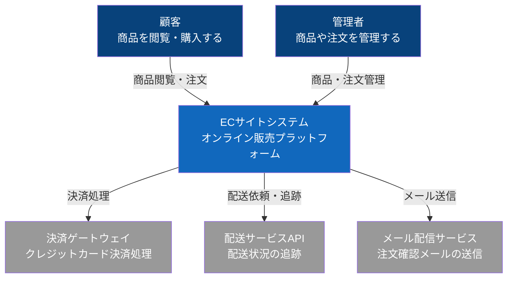

この図から以下が理解できます：

- 2種類のユーザー（顧客と管理者）がシステムを利用
- 3つの外部サービスと連携
- システムの境界が明確
- 技術的な詳細は含まれていない

### Level 2: Container

**対象読者：** 技術者（開発者、アーキテクト、運用担当者）

システムを構成する主要な実行単位（コンテナ）を示します。ここでの「コンテナ」は、Dockerコンテナに限らず、Webアプリケーション、モバイルアプリ、データベース、ファイルストレージなど、個別に実行可能な単位を指します。

**含めるべき要素：**
- アプリケーション（Webアプリ、モバイルアプリなど）
- APIサーバー
- データストア（データベース、キャッシュなど）
- 使用技術（Node.js、PostgreSQL、Redisなど）
- コンテナ間の通信方法

**含めないべき要素：**
- 内部のクラスや関数
- 詳細な実装ロジック

#### 実例：ECサイトのコンテナ図

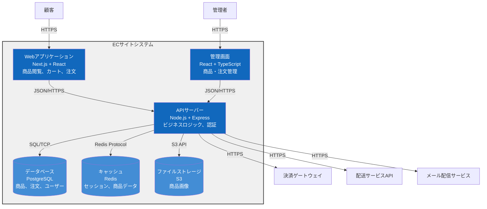

この図から以下が理解できます：

- 3つのアプリケーションコンテナ（Webアプリ、管理画面、APIサーバー）
- 3つのデータストア（PostgreSQL、Redis、S3）
- 各コンテナの技術スタック
- 通信プロトコル（HTTPS、SQL、Redis Protocolなど）
- システムのデプロイ構成

### Level 3: Component

**対象読者：** 開発者、アーキテクト

特定のコンテナ内の主要なコンポーネント（モジュール、サービス、コントローラーなど）を示します。

**含めるべき要素：**
- 主要なクラス、モジュール、サービス
- 責務の説明
- コンポーネント間の依存関係
- 主要なインターフェース

**含めないべき要素：**
- すべてのクラス（重要なものに絞る）
- メソッドレベルの詳細
- 実装の細かいロジック

#### 実例：APIサーバーのコンポーネント図

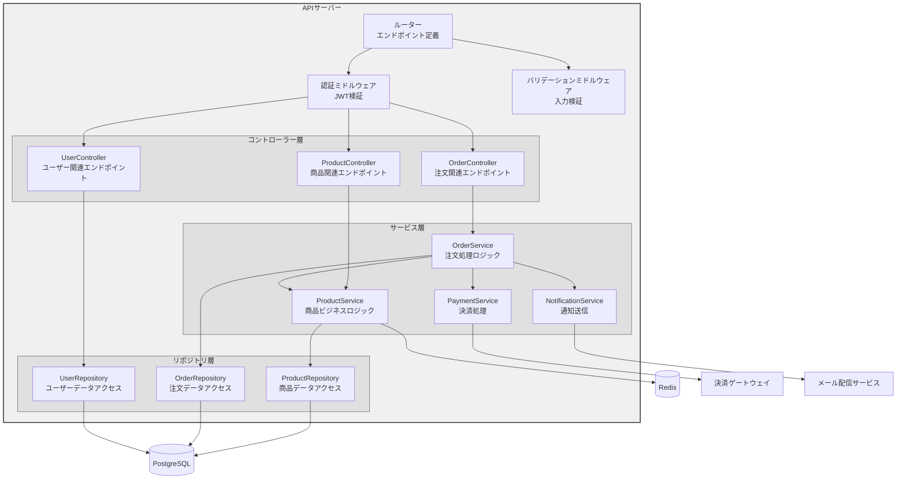

この図から以下が理解できます：

- 3層アーキテクチャ（コントローラー、サービス、リポジトリ）
- 各コンポーネントの責務
- ミドルウェアによる横断的関心事の処理
- サービス間の依存関係
- 外部システムとの統合ポイント

### Level 4: Code

**対象読者：** 開発者

クラス図、シーケンス図など、実装レベルの詳細を示します。C4モデルでは、このレベルは通常IDEやコード生成ツールに任せることを推奨しています。

**推奨される使用場面：**
- 複雑なアルゴリズムの説明
- デザインパターンの実装
- 重要な処理フローの可視化

#### 実例：注文処理のシーケンス図

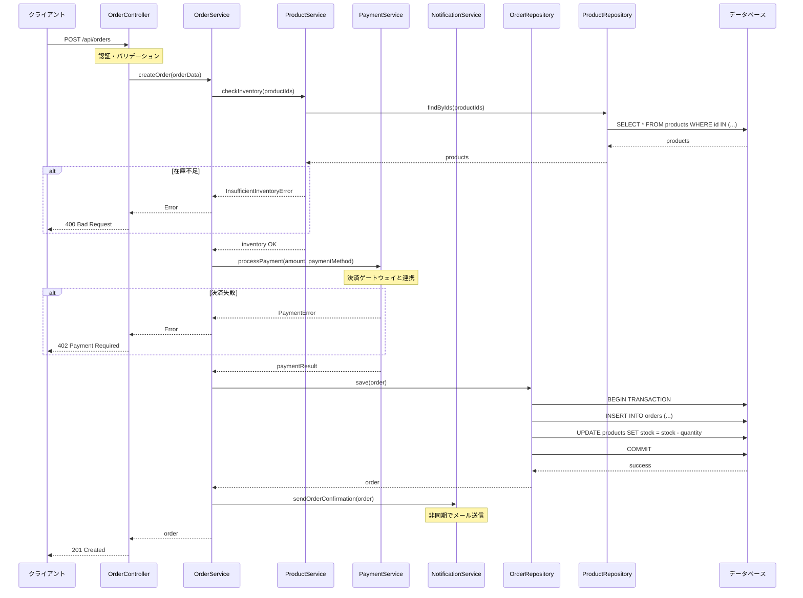

このシーケンス図から以下が理解できます：

- 注文作成の処理フロー
- 各コンポーネントの役割と責務
- エラーハンドリングのパターン
- トランザクション境界
- 同期処理と非同期処理の区別

## 適切な抽象度の選択

アーキテクチャ図を作成する際、最も重要な判断の一つが抽象度の選択です。対象読者と目的に応じて、適切なレベルを選ぶ必要があります。

### 読者別の推奨レベル

| 読者 | 推奨レベル | 目的 |
|------|----------|------|
| 経営陣、非技術者 | Level 1 (Context) | システムの価値と範囲を理解する |
| プロダクトマネージャー | Level 1-2 (Context, Container) | システムの境界と主要構成を理解する |
| 新しい開発者 | Level 1-2 (Context, Container) | システム全体像を把握する |
| 実装担当者 | Level 2-3 (Container, Component) | 作業対象の詳細を理解する |
| アーキテクト | Level 1-3 (すべて) | システム設計を評価・改善する |
| レビュアー | Level 3-4 (Component, Code) | 実装の妥当性を確認する |

### 目的別の推奨レベル

**オンボーディング：**
1. Level 1で全体像を把握
2. Level 2で技術スタックと構成を理解
3. Level 3で担当領域の詳細を学ぶ

**設計レビュー：**
1. Level 1でシステム境界を確認
2. Level 2で技術選択を評価
3. Level 3で設計パターンを検討

**障害対応：**
1. Level 2で問題の所在を特定
2. Level 3で影響範囲を分析
3. Level 4で原因を調査

### 一つの図に詰め込みすぎない

よくある間違いは、一つの図にあまりにも多くの情報を詰め込むことです。

#### 悪い例：情報過多の図

```
[図が複雑すぎて何を表しているのか不明確]
- Level 1-3の情報が混在
- 技術的な詳細と高レベルの概念が混ざっている
- 矢印が多すぎて追えない
- 色分けやグループ化がない
```

#### 良い例：段階的な説明

複数の図を用意し、段階的に詳細度を上げます：

1. **Context図：** システムの境界と外部依存
2. **Container図：** 主要な実行単位と技術スタック
3. **Component図（Frontend）：** Webアプリの内部構造
4. **Component図（Backend）：** APIサーバーの内部構造
5. **Sequence図：** 重要な処理フローの詳細

この方式により、読者は必要な抽象度の図を選んで参照できます。

## Mermaid.jsによる図の作成

### なぜMermaidか

Mermaid.jsは、テキストベースで図を作成できるツールです。以下の利点があります：

**バージョン管理との相性：**
- Gitで変更履歴を追跡可能
- diffで変更内容を確認できる
- マージコンフリクトを解決しやすい

**保守性：**
- コードと同じリポジトリで管理
- IDEで編集可能
- 一貫したスタイルを維持しやすい

**ツールサポート：**
- GitHub、GitLab、Zenn、Notionなど多くのプラットフォームがネイティブサポート
- プレビューしながら編集可能
- 自動レンダリング

**学習コスト：**
- シンプルな記法
- ドキュメントが充実
- コード例が豊富

### Mermaid基本記法

#### グラフ（Graph）

システム構成図、フロー図に使用します。

**基本構文：**

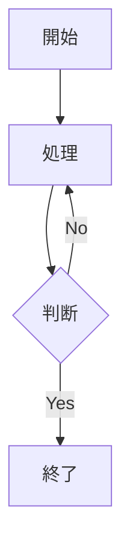

**方向の指定：**

- `TD` または `TB`: 上から下（Top to Down / Top to Bottom）
- `BT`: 下から上（Bottom to Top）
- `LR`: 左から右（Left to Right）
- `RL`: 右から左（Right to Left）

**ノードの形状：**

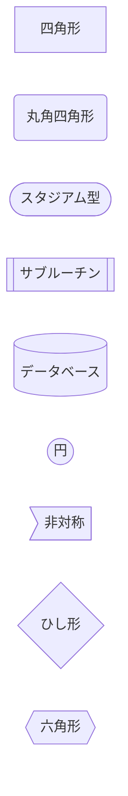

**線の種類：**

```mermaid
graph LR
    A -->|通常の矢印| B
    B -.->|点線の矢印| C
    C ==>|太い矢印| D
    D ---|線（矢印なし)| E
    E -.-|点線（矢印なし)| F
    F ===|太い線（矢印なし)| G
```

**スタイリング：**

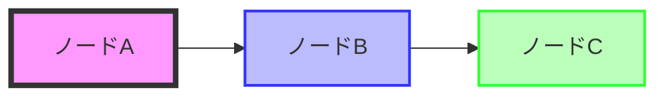

#### サブグラフ（Subgraph）

関連するノードをグループ化します。

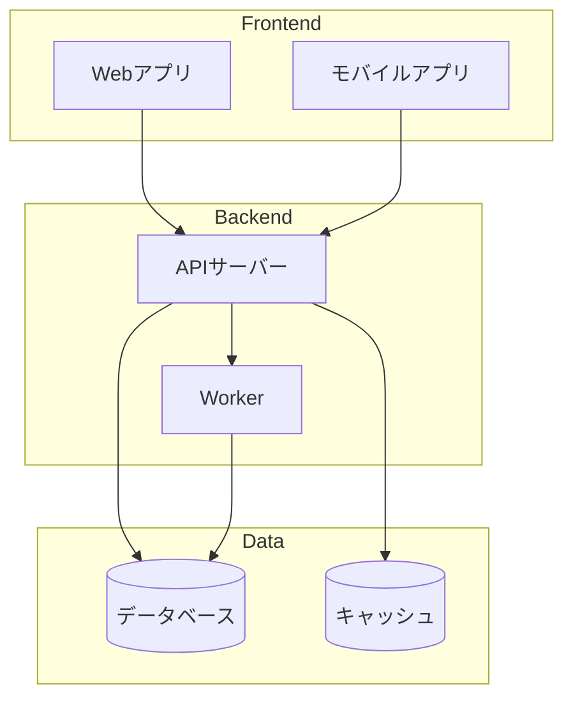

#### シーケンス図（Sequence Diagram）

時系列での相互作用を示します。

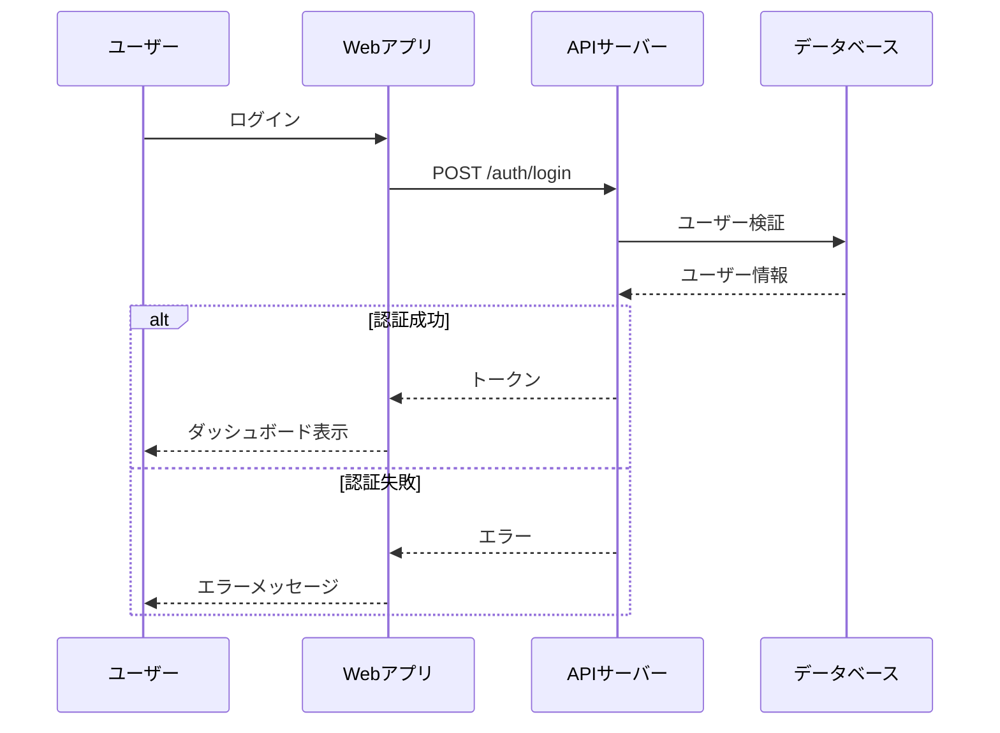

**主要な記法：**

- `participant`: 参加者の定義
- `->>`: 同期呼び出し
- `-->>`: 応答
- `->>+`: アクティベート
- `->>-`: デアクティベート
- `Note over A, B`: ノート
- `alt / else / end`: 条件分岐
- `loop`: ループ
- `par`: 並列処理

#### クラス図（Class Diagram）

クラス構造と関係を示します。

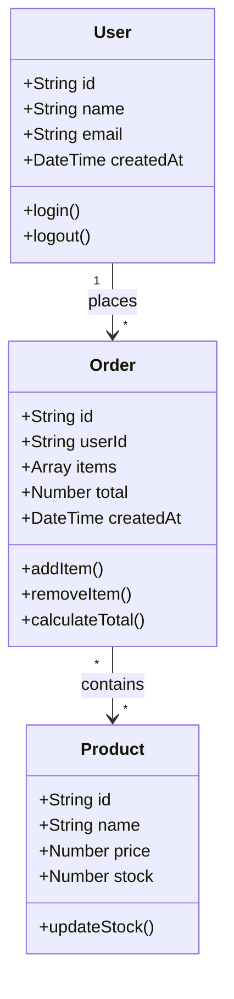

**関係性の種類：**

- `<|--`: 継承（Inheritance）
- `*--`: コンポジション（Composition）
- `o--`: 集約（Aggregation）
- `-->`: 関連（Association）
- `..>`: 依存（Dependency）
- `..|>`: 実現（Realization）

#### 状態図（State Diagram）

状態遷移を示します。

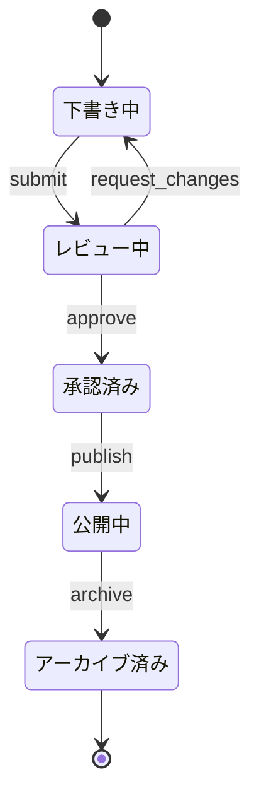

#### ER図（Entity Relationship Diagram）

データベーススキーマを示します。

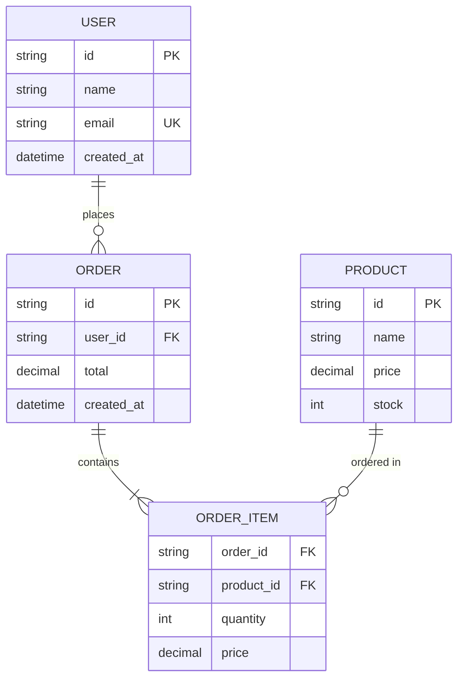

**カーディナリティ：**

- `||--||`: 1対1
- `||--o{`: 1対多
- `}o--o{`: 多対多

### 実践的なMermaid活用例

#### 例1：マイクロサービスアーキテクチャ

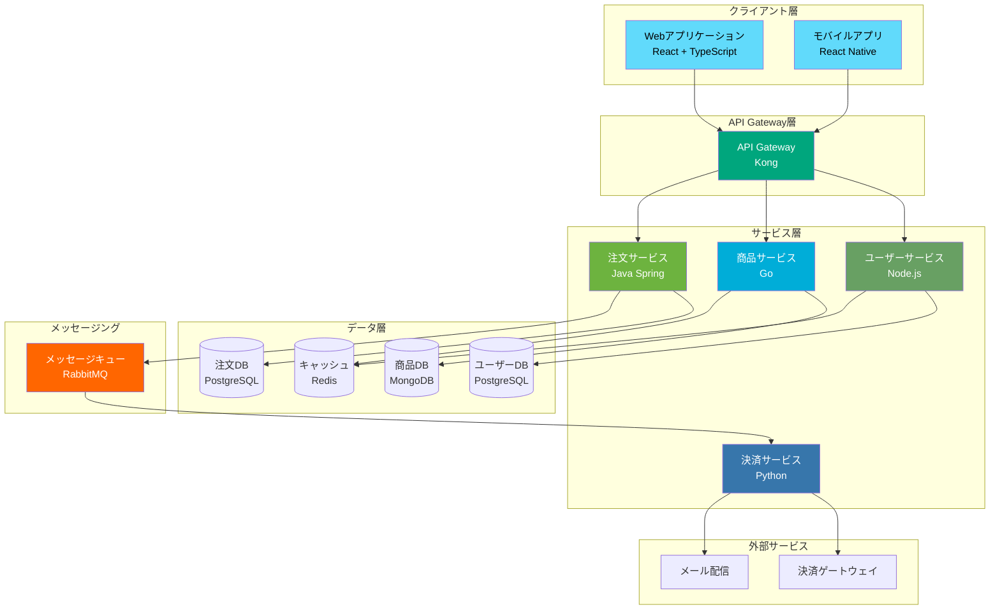

#### 例2：イベント駆動アーキテクチャ

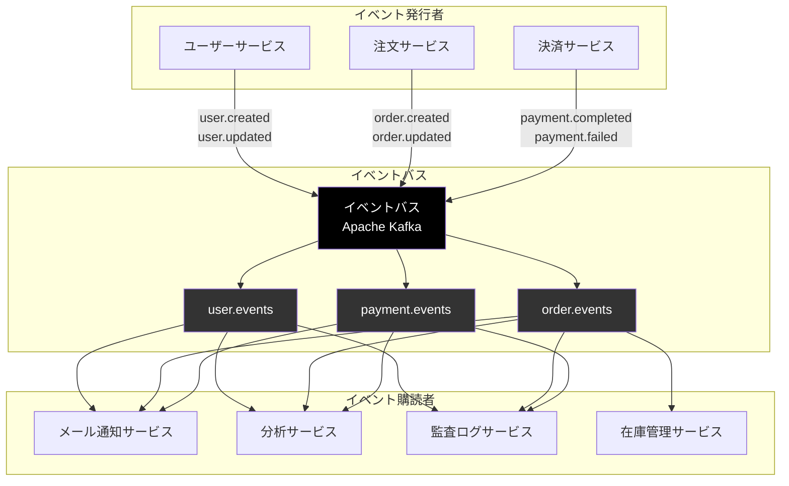

#### 例3：CI/CDパイプライン

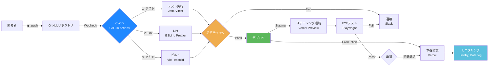

#### 例4：認証・認可フロー

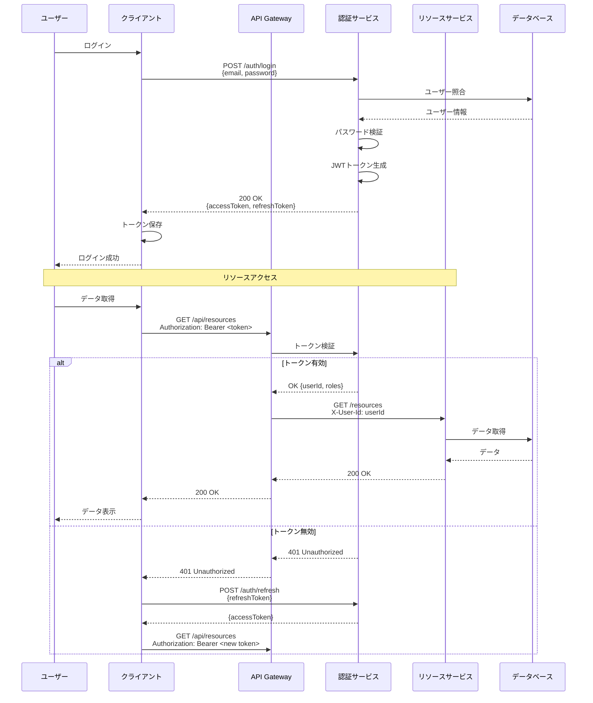

#### 例5：データフロー図

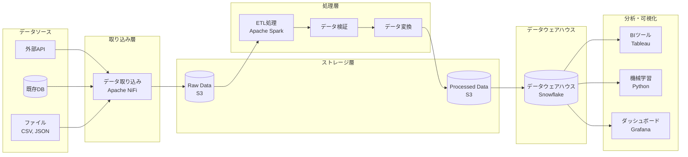

## アーキテクチャ図作成のベストプラクティス

### 1. 明確な目的を持つ

図を作成する前に、以下を明確にします：

- **読者は誰か？** （開発者、PM、経営陣など）
- **何を伝えたいか？** （全体構成、技術選択、処理フローなど）
- **どのレベルの詳細度か？** （Context、Container、Componentなど）

### 2. 一貫した記法を使う

プロジェクト全体で一貫した記法とスタイルを使用します。

**推奨される一貫性：**

```markdown
# プロジェクトのアーキテクチャ図記法ガイド

## 色の使い分け
- ブルー系: 自社開発のアプリケーション
- グレー系: 外部サービス・API
- 青系: データストア
- オレンジ系: メッセージング・イベント

## ノードの形状
- 四角形: アプリケーション・サービス
- 円柱: データベース・ストレージ
- 円: ユーザー・外部アクター

## 線の種類
- 実線: 同期通信
- 点線: 非同期通信
- 太線: 主要なデータフロー
```

### 3. ラベルを明確にする

各要素に以下を含めます：

- **名前：** 何であるか
- **役割：** 何をするか
- **技術：** 何で実装されているか（必要に応じて）

#### 悪い例：情報不足

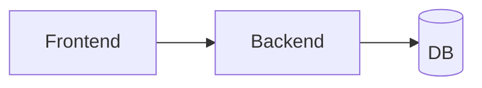

#### 良い例：明確なラベル

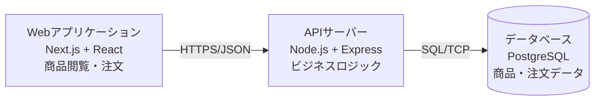

### 4. グループ化とレイヤリング

関連する要素をグループ化し、階層構造を明確にします。

```mermaid
graph TB
    subgraph "プレゼンテーション層"
        direction LR
        Web[Webアプリ]
        Mobile[モバイルアプリ]
        Admin[管理画面]
    end

    subgraph "API層"
        Gateway[API Gateway]
    end

    subgraph "ビジネスロジック層"
        direction LR
        Service1[ユーザーサービス]
        Service2[商品サービス]
        Service3[注文サービス]
    end

    subgraph "データ層"
        direction LR
        DB1[(ユーザーDB)]
        DB2[(商品DB)]
        DB3[(注文DB)]
    end

    Web --> Gateway
    Mobile --> Gateway
    Admin --> Gateway

    Gateway --> Service1
    Gateway --> Service2
    Gateway --> Service3

    Service1 --> DB1
    Service2 --> DB2
    Service3 --> DB3
```

### 5. 複雑さを管理する

一つの図に含める要素は5-10個程度に抑えます。

**複雑すぎる場合の対処法：**

1. **抽象度を上げる：** 詳細をまとめて一つの要素にする
2. **分割する：** 複数の図に分ける
3. **フォーカスする：** 重要な部分だけを示す
4. **階層化する：** 概要図と詳細図を用意する

### 6. 双方向の関係を明確にする

矢印の方向で、データや制御の流れを示します。

```mermaid
graph LR
    Client[クライアント]
    Server[サーバー]

    Client -->|リクエスト| Server
    Server -->|レスポンス| Client
```

または、双方向の場合：

```mermaid
graph LR
    Client[クライアント]
    Server[サーバー]

    Client <-->|WebSocket<br/>双方向通信| Server
```

### 7. 凡例を追加する

記号や色の意味が自明でない場合、凡例を追加します。

```mermaid
graph TB
    subgraph 凡例
        direction LR
        A1[自社開発]
        A2[外部サービス]
        A3[(データストア)]

        style A1 fill:#1168bd,color:#fff
        style A2 fill:#999,color:#fff
        style A3 fill:#438dd5,color:#fff
    end

    subgraph システム構成
        direction TB
        App[Webアプリ]
        API[APIサーバー]
        DB[(PostgreSQL)]
        S3[AWS S3]

        App --> API
        API --> DB
        API --> S3

        style App fill:#1168bd,color:#fff
        style API fill:#1168bd,color:#fff
        style DB fill:#438dd5,color:#fff
        style S3 fill:#999,color:#fff
    end
```

### 8. 更新日時を記録する

図が古くなっていないか判断できるよう、作成日・更新日を記録します。

```markdown
# システムアーキテクチャ

最終更新: 2026-01-28

[アーキテクチャ図]

## 変更履歴

- 2026-01-28: Redisキャッシュ層を追加
- 2026-01-15: マイクロサービス化（注文サービス分離）
- 2025-12-01: 初版作成
```

### 9. リアルタイム性を考慮する

頻繁に変更される部分は、詳細度を下げるか、自動生成を検討します。

**自動生成が推奨される図：**
- クラス図（IDEやツールから生成）
- ER図（データベースマイグレーションから生成）
- 依存関係図（静的解析ツールから生成）

**手動管理が推奨される図：**
- システムコンテキスト図（変更頻度が低い）
- コンテナ図（デプロイ構成の変更時のみ）
- 重要な処理フローのシーケンス図

### 10. コードと一緒に管理する

アーキテクチャ図はコードと同じリポジトリで管理します。

**推奨されるディレクトリ構成：**

```
project/
├── docs/
│   ├── architecture/
│   │   ├── 01-context.md          # Level 1: Context図
│   │   ├── 02-container.md        # Level 2: Container図
│   │   ├── 03-component-api.md    # Level 3: APIサーバーのコンポーネント図
│   │   ├── 03-component-web.md    # Level 3: Webアプリのコンポーネント図
│   │   └── 04-flows.md            # Level 4: 重要な処理フロー
│   ├── adr/                       # Architecture Decision Records
│   └── api/                       # API仕様書
├── src/
└── README.md
```

## アーキテクチャ図の種類別ガイド

### システムコンテキスト図

**目的：** システムの境界と外部依存関係を示す

**含めるべき要素：**
- 対象システム（1つ）
- ユーザーの種類（複数可）
- 外部システム（API、サービスなど）
- 主要な相互作用

**含めないべき要素：**
- 技術的な詳細
- 内部構造
- プロトコルやデータ形式

**テンプレート：**

```mermaid
graph TB
    User1[ユーザータイプ1<br/>説明]
    User2[ユーザータイプ2<br/>説明]

    System[システム名<br/>システムの目的]

    External1[外部システム1<br/>役割]
    External2[外部システム2<br/>役割]

    User1 -->|主要な操作| System
    User2 -->|主要な操作| System
    System -->|連携内容| External1
    System -->|連携内容| External2

    style System fill:#1168bd,color:#ffffff
    style User1 fill:#08427b,color:#ffffff
    style User2 fill:#08427b,color:#ffffff
    style External1 fill:#999999,color:#ffffff
    style External2 fill:#999999,color:#ffffff
```

### コンテナ図

**目的：** システムを構成する主要な実行単位と技術スタックを示す

**含めるべき要素：**
- Webアプリケーション
- モバイルアプリ
- APIサーバー
- データベース
- キャッシュ
- ファイルストレージ
- 使用技術
- 通信プロトコル

**テンプレート：**

```mermaid
graph TB
    User[ユーザー]

    subgraph System[システム名]
        App[アプリケーション名<br/>技術スタック<br/>役割]
        API[APIサーバー名<br/>技術スタック<br/>役割]
        DB[(データベース名<br/>技術<br/>保存データ)]
        Cache[(キャッシュ名<br/>技術<br/>保存データ)]
    end

    External[外部サービス]

    User -->|プロトコル| App
    App -->|プロトコル| API
    API -->|プロトコル| DB
    API -->|プロトコル| Cache
    API -->|プロトコル| External
```

### コンポーネント図

**目的：** 特定のコンテナ内の主要なコンポーネントを示す

**含めるべき要素：**
- 主要なモジュール、クラス、サービス
- 責務の説明
- コンポーネント間の依存関係
- 外部システムとの統合ポイント

**テンプレート：**

```mermaid
graph TB
    subgraph Container[コンテナ名]
        subgraph Layer1[レイヤー1名]
            Component1[コンポーネント1<br/>責務]
            Component2[コンポーネント2<br/>責務]
        end

        subgraph Layer2[レイヤー2名]
            Component3[コンポーネント3<br/>責務]
            Component4[コンポーネント4<br/>責務]
        end

        subgraph Layer3[レイヤー3名]
            Component5[コンポーネント5<br/>責務]
        end
    end

    External1[外部システム1]
    External2[外部システム2]

    Component1 --> Component3
    Component2 --> Component4
    Component3 --> Component5
    Component4 --> Component5
    Component4 --> External1
    Component3 --> External2
```

### シーケンス図

**目的：** 時系列での相互作用を示す

**含めるべき要素：**
- 主要な参加者（ユーザー、システム、コンポーネント）
- 処理の流れ
- 同期・非同期の区別
- 条件分岐
- エラーハンドリング

**テンプレート：**

```mermaid
sequenceDiagram
    participant Actor as アクター
    participant System1 as システム1
    participant System2 as システム2
    participant Database as データベース

    Actor->>System1: アクション
    System1->>System2: リクエスト
    System2->>Database: データ取得
    Database-->>System2: データ

    alt 成功パス
        System2-->>System1: 成功レスポンス
        System1-->>Actor: 成功結果
    else 失敗パス
        System2-->>System1: エラー
        System1-->>Actor: エラーメッセージ
    end
```

### データフロー図

**目的：** データの流れと変換を示す

**含めるべき要素：**
- データソース
- データ処理ステップ
- データストア
- データの変換
- データの出力先

**テンプレート：**

```mermaid
graph LR
    subgraph Source[データソース]
        S1[ソース1]
        S2[ソース2]
    end

    subgraph Processing[処理]
        P1[処理1<br/>変換内容]
        P2[処理2<br/>変換内容]
    end

    subgraph Storage[ストレージ]
        D1[(ストレージ1)]
        D2[(ストレージ2)]
    end

    subgraph Output[出力]
        O1[出力1]
        O2[出力2]
    end

    S1 --> P1
    S2 --> P1
    P1 --> D1
    P1 --> P2
    P2 --> D2
    D1 --> O1
    D2 --> O2
```

### デプロイ図

**目的：** インフラストラクチャとデプロイ構成を示す

**含めるべき要素：**
- クラウドプロバイダー・リージョン
- ネットワーク構成
- サーバー・コンテナ
- ロードバランサー
- データベース
- セキュリティグループ・ファイアウォール

**テンプレート：**

```mermaid
graph TB
    subgraph Cloud[クラウドプロバイダー]
        subgraph Region[リージョン]
            subgraph AZ1[Availability Zone 1]
                App1[アプリケーション1]
                DB1[(データベース<br/>Primary)]
            end

            subgraph AZ2[Availability Zone 2]
                App2[アプリケーション2]
                DB2[(データベース<br/>Replica)]
            end

            LB[ロードバランサー]
            CDN[CDN]
        end
    end

    Internet[インターネット]

    Internet --> CDN
    CDN --> LB
    LB --> App1
    LB --> App2
    App1 --> DB1
    App2 --> DB1
    DB1 -.レプリケーション.-> DB2
```

## 実践例：実際のプロジェクトでの活用

### ケーススタディ1：新機能の設計レビュー

**背景：**
ECサイトに「お気に入り機能」を追加する際、設計レビューのためにアーキテクチャ図を作成しました。

**Level 1: 機能のコンテキスト**

```mermaid
graph TB
    Customer[顧客<br/>商品をお気に入り登録]

    System[ECサイト<br/>お気に入り機能]

    ProductCatalog[商品カタログ<br/>商品情報の取得]
    Recommendation[レコメンドエンジン<br/>お気に入りに基づく推薦]

    Customer -->|お気に入り登録・閲覧| System
    System -->|商品情報取得| ProductCatalog
    System -->|お気に入りデータ送信| Recommendation

    style System fill:#1168bd,color:#ffffff
    style Customer fill:#08427b,color:#ffffff
    style ProductCatalog fill:#999999,color:#ffffff
    style Recommendation fill:#999999,color:#ffffff
```

**Level 2: 技術的な実装**

```mermaid
graph TB
    Browser[ブラウザ]

    subgraph "お気に入り機能"
        FavoriteUI[お気に入りUI<br/>React Component]
        APIEndpoint[新規エンドポイント<br/>POST /api/favorites<br/>GET /api/favorites<br/>DELETE /api/favorites/:id]
        FavoriteService[FavoriteService<br/>ビジネスロジック]
        FavoriteRepo[FavoriteRepository<br/>データアクセス]
        FavoriteDB[(favorites テーブル<br/>user_id, product_id)]
    end

    ProductService[既存: ProductService]
    Cache[(既存: Redis)]

    Browser --> FavoriteUI
    FavoriteUI --> APIEndpoint
    APIEndpoint --> FavoriteService
    FavoriteService --> FavoriteRepo
    FavoriteService --> ProductService
    FavoriteRepo --> FavoriteDB
    FavoriteService --> Cache

    style FavoriteUI fill:#61dafb,color:#000
    style APIEndpoint fill:#68a063,color:#fff
    style FavoriteService fill:#68a063,color:#fff
    style FavoriteRepo fill:#68a063,color:#fff
    style FavoriteDB fill:#438dd5,color:#fff
```

**Level 3: お気に入り登録のフロー**

```mermaid
sequenceDiagram
    participant User as ユーザー
    participant UI as お気に入りUI
    participant API as APIエンドポイント
    participant Service as FavoriteService
    participant ProductSvc as ProductService
    participant Repo as FavoriteRepository
    participant Cache as Redis
    participant DB as データベース

    User->>UI: お気に入りボタンクリック
    UI->>UI: 楽観的UI更新

    UI->>API: POST /api/favorites<br/>{productId}
    API->>Service: addFavorite(userId, productId)

    Service->>ProductSvc: checkProductExists(productId)
    ProductSvc-->>Service: true

    Service->>Repo: findDuplicate(userId, productId)
    Repo->>DB: SELECT
    DB-->>Repo: null

    alt 重複なし
        Repo-->>Service: null
        Service->>Repo: save(favorite)
        Repo->>DB: INSERT
        DB-->>Repo: favorite
        Repo-->>Service: favorite

        Service->>Cache: invalidate(userId:favorites)

        Service-->>API: favorite
        API-->>UI: 201 Created
        UI-->>User: 登録成功表示
    else 既に登録済み
        Repo-->>Service: existing favorite
        Service-->>API: 409 Conflict
        API-->>UI: エラー
        UI->>UI: UI をロールバック
        UI-->>User: 既に登録済みメッセージ
    end
```

この3つのレベルの図により、非技術者は機能の目的を、開発者は実装の詳細を、それぞれ理解できます。

### ケーススタディ2：パフォーマンス問題の調査

**背景：**
APIのレスポンスタイムが遅いという報告を受け、問題箇所を特定するためにデータフローを可視化しました。

**現状のアーキテクチャ（問題あり）**

```mermaid
graph LR
    Client[クライアント]
    API[APIサーバー]
    DB[(データベース)]

    Client -->|1. リクエスト| API
    API -->|2. クエリ1<br/>ユーザー取得| DB
    DB -->|3. ユーザー| API
    API -->|4. クエリ2<br/>注文一覧| DB
    DB -->|5. 注文一覧<br/>N件| API
    API -->|6. N回のクエリ<br/>各注文の商品詳細| DB
    DB -->|7. N回のレスポンス| API
    API -->|8. レスポンス<br/>合計遅延: 500-1000ms| Client

    style API fill:#d9534f,color:#fff
    style DB fill:#d9534f,color:#fff
```

**問題点：**
- N+1クエリ問題（注文ごとに商品情報を取得）
- キャッシュ未使用
- データベースクエリが最適化されていない

**改善後のアーキテクチャ**

```mermaid
graph LR
    Client[クライアント]
    API[APIサーバー]
    Cache[(Redis)]
    DB[(データベース)]

    Client -->|1. リクエスト| API
    API -->|2. キャッシュ確認| Cache

    alt キャッシュヒット
        Cache -->|3. キャッシュデータ| API
        API -->|4. レスポンス<br/>遅延: 10-20ms| Client
    else キャッシュミス
        Cache -->|3. なし| API
        API -->|4. JOINクエリ1回<br/>ユーザー+注文+商品| DB
        DB -->|5. 全データ| API
        API -->|6. キャッシュ保存| Cache
        API -->|7. レスポンス<br/>遅延: 50-100ms| Client
    end

    style API fill:#5cb85c,color:#fff
    style Cache fill:#5cb85c,color:#fff
    style DB fill:#5bc0de,color:#fff
```

**改善内容：**
- Redisキャッシュの導入
- JOINクエリでN+1問題を解決
- レスポンスタイムを90%削減

シーケンス図により問題箇所が明確になり、改善策の議論がスムーズに進みました。

### ケーススタディ3：マイクロサービス移行計画

**背景：**
モノリシックなアプリケーションをマイクロサービスに段階的に移行する計画を立てる際、移行ステップをアーキテクチャ図で可視化しました。

**フェーズ1: 現状（モノリス）**

```mermaid
graph TB
    Client[クライアント]

    subgraph Monolith[モノリスアプリケーション]
        UserModule[ユーザーモジュール]
        ProductModule[商品モジュール]
        OrderModule[注文モジュール]
        PaymentModule[決済モジュール]
    end

    DB[(共有データベース)]

    Client --> Monolith
    Monolith --> DB

    UserModule -.-> ProductModule
    ProductModule -.-> OrderModule
    OrderModule -.-> PaymentModule

    style Monolith fill:#d9534f,color:#fff
```

**フェーズ2: 認証サービスの分離**

```mermaid
graph TB
    Client[クライアント]
    Gateway[API Gateway]

    AuthService[認証サービス<br/>独立]

    subgraph Monolith[モノリスアプリケーション]
        ProductModule[商品モジュール]
        OrderModule[注文モジュール]
        PaymentModule[決済モジュール]
    end

    AuthDB[(認証DB)]
    MainDB[(メインDB)]

    Client --> Gateway
    Gateway --> AuthService
    Gateway --> Monolith

    AuthService --> AuthDB
    Monolith --> MainDB
    Monolith -.認証確認.-> AuthService

    style AuthService fill:#5cb85c,color:#fff
    style Monolith fill:#f0ad4e,color:#fff
```

**フェーズ3: 商品サービスの分離**

```mermaid
graph TB
    Client[クライアント]
    Gateway[API Gateway]

    AuthService[認証サービス]
    ProductService[商品サービス<br/>独立]

    subgraph Monolith[モノリスアプリケーション]
        OrderModule[注文モジュール]
        PaymentModule[決済モジュール]
    end

    AuthDB[(認証DB)]
    ProductDB[(商品DB)]
    MainDB[(メインDB)]

    Client --> Gateway
    Gateway --> AuthService
    Gateway --> ProductService
    Gateway --> Monolith

    AuthService --> AuthDB
    ProductService --> ProductDB
    Monolith --> MainDB
    Monolith -.商品情報取得.-> ProductService

    style AuthService fill:#5cb85c,color:#fff
    style ProductService fill:#5cb85c,color:#fff
    style Monolith fill:#f0ad4e,color:#fff
```

**フェーズ4: 完全なマイクロサービス化**

```mermaid
graph TB
    Client[クライアント]
    Gateway[API Gateway]

    AuthService[認証サービス]
    ProductService[商品サービス]
    OrderService[注文サービス]
    PaymentService[決済サービス]

    AuthDB[(認証DB)]
    ProductDB[(商品DB)]
    OrderDB[(注文DB)]

    PaymentGateway[決済ゲートウェイ]

    Client --> Gateway
    Gateway --> AuthService
    Gateway --> ProductService
    Gateway --> OrderService
    Gateway --> PaymentService

    AuthService --> AuthDB
    ProductService --> ProductDB
    OrderService --> OrderDB
    OrderService --> ProductService
    OrderService --> PaymentService
    PaymentService --> PaymentGateway

    style AuthService fill:#5cb85c,color:#fff
    style ProductService fill:#5cb85c,color:#fff
    style OrderService fill:#5cb85c,color:#fff
    style PaymentService fill:#5cb85c,color:#fff
```

各フェーズのアーキテクチャ図により、移行の影響範囲とリスクを評価し、段階的な計画を立てることができました。

## よくある間違いと対策

### 間違い1: 抽象度が混在している

**問題：**
一つの図に高レベルの概念と低レベルの実装詳細が混在している。

**悪い例：**

```mermaid
graph TB
    User[ユーザー]
    WebApp[Webアプリ]
    LoginController[LoginController]
    UserService[UserService]
    validatePassword[validatePassword関数]
    Database[(PostgreSQL)]

    User --> WebApp
    WebApp --> LoginController
    LoginController --> UserService
    UserService --> validatePassword
    validatePassword --> Database
```

この図では、システムレベル（ユーザー、Webアプリ）、コンポーネントレベル（コントローラー、サービス）、コードレベル（関数）が混在しています。

**良い例：**

複数の図に分割します。

**Level 2: Container図**

```mermaid
graph TB
    User[ユーザー]
    WebApp[Webアプリケーション<br/>React]
    API[APIサーバー<br/>Node.js]
    Database[(PostgreSQL)]

    User --> WebApp
    WebApp --> API
    API --> Database

    style WebApp fill:#1168bd,color:#fff
    style API fill:#1168bd,color:#fff
    style Database fill:#438dd5,color:#fff
```

**Level 3: APIサーバーのコンポーネント図**

```mermaid
graph TB
    subgraph API[APIサーバー]
        LoginController[LoginController<br/>認証エンドポイント]
        UserService[UserService<br/>ユーザービジネスロジック]
        UserRepo[UserRepository<br/>データアクセス]
    end

    Database[(PostgreSQL)]

    LoginController --> UserService
    UserService --> UserRepo
    UserRepo --> Database
```

### 間違い2: 情報過多

**問題：**
一つの図に詰め込みすぎて、理解が困難になっている。

**対策：**

1. **フォーカスする：** 伝えたいメッセージに関連する要素だけを含める
2. **分割する：** 複数の図に分ける（機能別、レイヤー別など）
3. **抽象化する：** 詳細をまとめて一つの要素にする

### 間違い3: ラベルが不明確

**問題：**
何を表しているのか、何をしているのかが分からない。

**悪い例：**

```mermaid
graph LR
    A[Service1] --> B[Service2] --> C[DB]
```

**良い例：**

```mermaid
graph LR
    A[ユーザーサービス<br/>Node.js<br/>ユーザー管理]
    B[通知サービス<br/>Python<br/>メール・プッシュ通知]
    C[(ユーザーDB<br/>PostgreSQL<br/>ユーザー情報)]

    A -->|ユーザーイベント| B
    A -->|CRUD操作| C
```

### 間違い4: 古い情報

**問題：**
図が更新されず、実際のシステムと乖離している。

**対策：**

1. **更新日を明記する**
2. **CI/CDに図の検証を組み込む**（可能な場合）
3. **定期的なレビュー**（月次、四半期など）
4. **重要な変更時に更新する**（新機能、アーキテクチャ変更など）

### 間違い5: 一貫性のない記法

**問題：**
プロジェクト内で図の記法がバラバラで、理解しにくい。

**対策：**

1. **記法ガイドを作成する**（色、形状、線の意味）
2. **テンプレートを用意する**
3. **レビューで一貫性をチェックする**

## ツールとワークフロー

### Mermaid Live Editor

オンラインでMermaid図を作成・プレビューできます。

URL: https://mermaid.live/

**使い方：**
1. コードを入力
2. リアルタイムでプレビュー
3. PNG/SVGでエクスポート
4. URLで共有

### VS Code拡張機能

**推奨拡張機能：**

1. **Mermaid Preview**
   - エディタ内でプレビュー
   - リアルタイム更新

2. **Markdown Preview Mermaid Support**
   - Markdownプレビューで図を表示

3. **Draw.io Integration**
   - より複雑な図を作成する場合

### GitHubでの表示

GitHubはMermaidをネイティブサポートしています。

````markdown
```mermaid
graph TD
    A[Start] --> B[End]
```
````

コミット時に自動的にレンダリングされます。

### ドキュメントサイトとの統合

**VitePress：**

```markdown
```mermaid
graph TD
    A --> B
```
```

**Docusaurus：**

```bash
npm install @docusaurus/theme-mermaid
```

```js
// docusaurus.config.js
module.exports = {
  markdown: {
    mermaid: true,
  },
  themes: ['@docusaurus/theme-mermaid'],
};
```

**MkDocs：**

```bash
pip install mkdocs-mermaid2-plugin
```

```yaml
# mkdocs.yml
plugins:
  - mermaid2
```

### バージョン管理のベストプラクティス

**コミットメッセージの例：**

```
docs: update architecture diagram to reflect Redis cache layer

- Add Redis cache between API server and database
- Update container diagram (Level 2)
- Add caching sequence diagram (Level 4)
```

**Pull Requestでの活用：**

新機能や大きな変更をレビューする際、アーキテクチャ図を含めると理解が促進されます。

```markdown
## 変更内容

お気に入り機能を追加しました。

## アーキテクチャ変更

### 追加されたコンポーネント

```mermaid
graph TB
    FavoriteService[FavoriteService]
    FavoriteRepo[FavoriteRepository]
    FavoriteDB[(favorites テーブル)]

    FavoriteService --> FavoriteRepo
    FavoriteRepo --> FavoriteDB
```

### 影響範囲

- 新規テーブル: `favorites`
- 新規エンドポイント: `/api/favorites`
- 既存への影響: なし
```

## アーキテクチャ図と他のドキュメントの連携

### ADRとの連携

Architecture Decision Records（ADR）で設計判断を記録する際、アーキテクチャ図を含めることで、コンテキストが明確になります。

**例：ADR-005: Redisキャッシュの導入**

```markdown
# ADR-005: Redisキャッシュの導入

## Status

Accepted

## Context

APIのレスポンスタイムが遅く（平均500ms）、ユーザー体験に影響しています。

### 現状のアーキテクチャ

```mermaid
graph LR
    API[APIサーバー] -->|毎回クエリ| DB[(PostgreSQL)]
```

頻繁にアクセスされるデータ（商品情報、ユーザープロフィール）も
毎回データベースから取得しています。

## Decision

Redisをキャッシュ層として導入します。

### 新しいアーキテクチャ

```mermaid
graph LR
    API[APIサーバー]
    Cache[(Redis)]
    DB[(PostgreSQL)]

    API -->|1. キャッシュ確認| Cache
    Cache -.->|ヒット| API
    API -->|2. ミス時| DB
    DB --> API
    API -->|3. 保存| Cache
```

## Consequences

### 良い点

- レスポンスタイムの改善（期待: 500ms → 50ms）
- データベース負荷の削減
- スケーラビリティの向上

### 悪い点

- インフラコストの増加（月額 $30-50）
- キャッシュ戦略の管理が必要
- データ整合性の考慮が必要

## 実装計画

フェーズ1で商品情報、フェーズ2でユーザー情報をキャッシュ化。
```

### API仕様書との連携

API仕様書で、エンドポイントの内部処理を説明する際、シーケンス図を含めます。

**例：注文作成API**

```markdown
## POST /api/orders

注文を作成します。

### 処理フロー

```mermaid
sequenceDiagram
    participant Client
    participant API
    participant OrderService
    participant PaymentService
    participant DB

    Client->>API: POST /api/orders
    API->>OrderService: createOrder()
    OrderService->>PaymentService: processPayment()
    PaymentService-->>OrderService: success
    OrderService->>DB: save order
    DB-->>OrderService: order
    OrderService-->>API: order
    API-->>Client: 201 Created
```

### リクエスト

```json
{
  "items": [
    {"productId": "prod_123", "quantity": 2}
  ],
  "paymentMethod": "credit_card"
}
```

### レスポンス

```json
{
  "id": "order_789",
  "status": "pending",
  "total": 2000
}
```
```

### READMEとの連携

READMEの「アーキテクチャ」セクションで、システムの全体像を示します。

```markdown
# プロジェクト名

## アーキテクチャ

### システム構成

```mermaid
graph TB
    User[ユーザー]
    Web[Webアプリ<br/>Next.js]
    API[APIサーバー<br/>Node.js]
    DB[(PostgreSQL)]

    User --> Web
    Web --> API
    API --> DB
```

詳細は [docs/architecture/](./docs/architecture/) を参照してください。

- [システムコンテキスト](./docs/architecture/01-context.md)
- [コンテナ図](./docs/architecture/02-container.md)
- [コンポーネント図](./docs/architecture/03-components.md)
```

## 高度なテクニック

### 動的な図の生成

コードから図を自動生成することで、常に最新の状態を保てます。

**例：依存関係図の自動生成**

```typescript
// scripts/generate-dependency-diagram.ts
import { Project } from 'ts-morph';
import fs from 'fs';

const project = new Project({
  tsConfigFilePath: 'tsconfig.json',
});

const sourceFiles = project.getSourceFiles();
const dependencies: { from: string; to: string }[] = [];

sourceFiles.forEach(file => {
  const filePath = file.getFilePath();
  const imports = file.getImportDeclarations();

  imports.forEach(imp => {
    const modulePath = imp.getModuleSpecifierValue();
    if (modulePath.startsWith('./') || modulePath.startsWith('../')) {
      dependencies.push({
        from: filePath,
        to: modulePath,
      });
    }
  });
});

// Mermaid形式で出力
let mermaid = 'graph TD\n';
dependencies.forEach(dep => {
  mermaid += `  ${dep.from} --> ${dep.to}\n`;
});

fs.writeFileSync('docs/architecture/dependencies.md', `
# 依存関係図

\`\`\`mermaid
${mermaid}
\`\`\`
`);
```

### インタラクティブな図

Mermaid.jsは、クリックイベントをサポートしています。

```mermaid
graph TD
    A[ユーザー管理]
    B[商品管理]
    C[注文管理]

    A --> C
    B --> C

    click A "https://github.com/org/repo/tree/main/src/users" "ユーザーサービスのコード"
    click B "https://github.com/org/repo/tree/main/src/products" "商品サービスのコード"
    click C "https://github.com/org/repo/tree/main/src/orders" "注文サービスのコード"
```

### テーマのカスタマイズ

Mermaidのテーマをカスタマイズして、ブランドカラーに合わせます。

```javascript
%%{init: {'theme':'base', 'themeVariables': {
  'primaryColor':'#1168bd',
  'primaryTextColor':'#fff',
  'primaryBorderColor':'#0d47a1',
  'lineColor':'#333',
  'secondaryColor':'#438dd5',
  'tertiaryColor':'#f0f0f0'
}}}%%

graph TD
    A[Start] --> B[End]
```

### 大規模システムの可視化

非常に大きなシステムの場合、複数の図を階層的に管理します。

```
docs/architecture/
├── README.md                    # 概要とナビゲーション
├── 01-context.md               # Level 1: 全体像
├── 02-container.md             # Level 2: コンテナ
├── 03-components/
│   ├── README.md
│   ├── api-server.md           # APIサーバーのコンポーネント
│   ├── web-app.md              # Webアプリのコンポーネント
│   └── worker.md               # Workerのコンポーネント
├── 04-flows/
│   ├── README.md
│   ├── user-registration.md    # ユーザー登録フロー
│   ├── order-creation.md       # 注文作成フロー
│   └── payment-processing.md   # 決済処理フロー
└── 05-deployment/
    ├── README.md
    ├── production.md            # 本番環境
    └── staging.md               # ステージング環境
```

**docs/architecture/README.md:**

```markdown
# アーキテクチャドキュメント

## ナビゲーション

### 1. システムの全体像を理解したい
→ [システムコンテキスト図](./01-context.md)

### 2. 技術スタックを知りたい
→ [コンテナ図](./02-container.md)

### 3. 特定のコンポーネントの詳細を知りたい
→ [コンポーネント図](./03-components/)

### 4. 処理フローを理解したい
→ [フロー図](./04-flows/)

### 5. デプロイ構成を知りたい
→ [デプロイ図](./05-deployment/)

## 最終更新

- 2026-01-28: Redisキャッシュ層を追加
- 2026-01-15: マイクロサービス化対応
```

## チェックリスト

この章で学んだことを確認しましょう。

### アーキテクチャ図の基本

- [ ] アーキテクチャ図の目的を理解している
- [ ] 適切な抽象度を選択できる
- [ ] C4モデルの4つのレベルを説明できる
- [ ] 読者に応じて適切な図を選べる

### C4モデル

- [ ] Level 1（Context）の図を作成できる
- [ ] Level 2（Container）の図を作成できる
- [ ] Level 3（Component）の図を作成できる
- [ ] Level 4（Code）の必要性を判断できる

### Mermaid.js

- [ ] 基本的なグラフを作成できる
- [ ] シーケンス図を作成できる
- [ ] サブグラフでグループ化できる
- [ ] スタイリングを適用できる
- [ ] GitHubやドキュメントサイトで表示できる

### ベストプラクティス

- [ ] 一つの図に詰め込みすぎない
- [ ] 明確なラベルをつける
- [ ] 一貫した記法を使う
- [ ] 更新日を記録する
- [ ] コードと一緒に管理する

### 実践

- [ ] 実際のプロジェクトで図を作成した
- [ ] 設計レビューで図を活用した
- [ ] ADRやAPI仕様書と連携させた
- [ ] チームで記法を統一した

## 次のステップ

アーキテクチャ図の作成方法を学んだので、次の章では「設計判断の記録」について学びます。

アーキテクチャ図は「システムがどうなっているか」を示しますが、「なぜそうなっているか」を説明するのがArchitecture Decision Records（ADR）です。第13章と第14章で、設計判断を記録し、チームで共有する方法を学びます。

### 関連リソース

**C4モデル：**
- 公式サイト: https://c4model.com/
- Simon Brownの講演: https://www.youtube.com/c4model

**Mermaid.js：**
- 公式ドキュメント: https://mermaid.js.org/
- Live Editor: https://mermaid.live/
- GitHubでの使用: https://github.blog/2022-02-14-include-diagrams-markdown-files-mermaid/

**ツール：**
- Structurizr（C4モデル専用ツール）: https://structurizr.com/
- PlantUML（代替のテキストベース図ツール）: https://plantuml.com/
- Draw.io（ビジュアルエディタ）: https://app.diagrams.net/

**書籍：**
- 『Software Architecture for Developers』 Simon Brown
- 『Fundamentals of Software Architecture』 Mark Richards, Neal Ford

アーキテクチャ図は、チーム全体でシステムを理解し、より良い設計判断を下すための強力なツールです。継続的に更新し、進化するシステムの姿を正確に反映させましょう。
