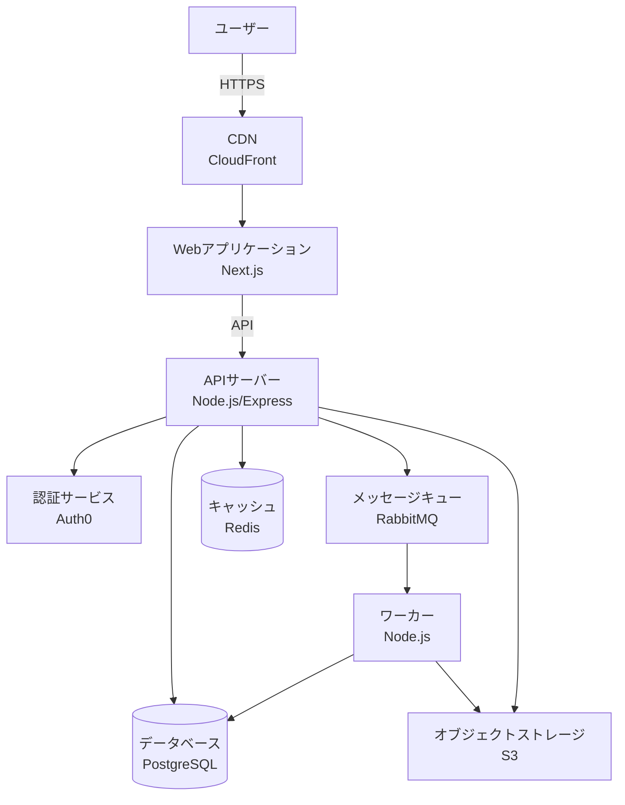

# 第17章: ドキュメント管理戦略

## この章で学ぶこと

ドキュメントを書くだけでは不十分です。適切な場所に配置し、適切にバージョン管理し、チーム全体で維持可能な体制を構築することが重要です。

この章では、以下のトピックを扱います:

- ドキュメントの配置場所の決定（リポジトリ構造、外部サービス）
- ドキュメントのバージョニング戦略
- 更新責任とワークフロー
- ドキュメントの種類別の管理方法
- ツールとインフラの選択

ドキュメントは書いた時点で価値を持ちますが、適切に管理されなければ急速に陳腐化し、むしろ混乱の元になります。この章では、持続可能なドキュメント管理の戦略を学びます。

## 前提知識

- 第1章で学んだドキュメントの種類
- Git/GitHubの基本操作
- プロジェクトのディレクトリ構造の理解

---

## 1. ドキュメントの配置場所

### 1.1 配置場所の選択基準

ドキュメントをどこに配置するかは、以下の要素を考慮して決定します:

**考慮すべき要素:**

1. **アクセス性**: 誰がどこからアクセスするか
2. **更新頻度**: コードと同時に更新するか
3. **閲覧体験**: Markdownで十分か、検索機能が必要か
4. **バージョン管理**: コードのバージョンと連動させるか
5. **権限管理**: 公開範囲をどう制御するか

### 1.2 コードリポジトリ内での配置

多くの場合、ドキュメントはコードと同じリポジトリに配置するのが最適です。

**推奨されるディレクトリ構造:**

```
project/
├── README.md                 # プロジェクトのエントリーポイント
├── CONTRIBUTING.md           # 貢献ガイドライン
├── LICENSE                   # ライセンス
├── CHANGELOG.md             # 変更履歴
│
├── docs/                    # ドキュメントのメインディレクトリ
│   ├── README.md           # docsディレクトリの案内
│   │
│   ├── getting-started/    # 入門ドキュメント
│   │   ├── installation.md
│   │   ├── quick-start.md
│   │   └── configuration.md
│   │
│   ├── guides/             # ガイド・チュートリアル
│   │   ├── user-guide.md
│   │   ├── admin-guide.md
│   │   └── troubleshooting.md
│   │
│   ├── api/                # API仕様書
│   │   ├── README.md
│   │   ├── rest-api.md
│   │   ├── graphql.md
│   │   └── openapi.yaml
│   │
│   ├── architecture/       # アーキテクチャドキュメント
│   │   ├── overview.md
│   │   ├── system-design.md
│   │   ├── data-model.md
│   │   └── diagrams/
│   │
│   ├── adr/                # Architecture Decision Records
│   │   ├── README.md
│   │   ├── 0001-database-choice.md
│   │   ├── 0002-authentication.md
│   │   └── template.md
│   │
│   └── development/        # 開発者向けドキュメント
│       ├── setup.md
│       ├── coding-standards.md
│       ├── testing.md
│       └── deployment.md
│
├── src/                    # ソースコード
└── tests/                  # テストコード
```

**この構造の利点:**

- コードとドキュメントが同じ場所にある
- プルリクエストでコードとドキュメントを同時にレビュー可能
- ブランチ/タグごとにドキュメントのバージョンが管理される
- ローカルでもアクセス可能

**docs/README.md の例:**

```markdown
# ドキュメント

このディレクトリには、プロジェクトの各種ドキュメントが含まれています。

## ドキュメントの種類

### 入門ガイド

- [インストール](getting-started/installation.md)
- [クイックスタート](getting-started/quick-start.md)
- [設定](getting-started/configuration.md)

### 利用ガイド

- [ユーザーガイド](guides/user-guide.md)
- [管理者ガイド](guides/admin-guide.md)
- [トラブルシューティング](guides/troubleshooting.md)

### API仕様

- [REST API](api/rest-api.md)
- [GraphQL API](api/graphql.md)
- [OpenAPI仕様](api/openapi.yaml)

### アーキテクチャ

- [システム概要](architecture/overview.md)
- [システム設計](architecture/system-design.md)
- [データモデル](architecture/data-model.md)

### 設計判断記録

- [ADR一覧](adr/)

### 開発者向け

- [開発環境セットアップ](development/setup.md)
- [コーディング規約](development/coding-standards.md)
- [テスト戦略](development/testing.md)
- [デプロイ手順](development/deployment.md)

## ドキュメントの更新

ドキュメントの更新方法については、[CONTRIBUTING.md](../CONTRIBUTING.md)を参照してください。
```

### 1.3 ルートレベルのドキュメント

リポジトリのルートに配置すべきドキュメント:

**README.md**
- プロジェクトの最も重要なドキュメント
- 新しい訪問者が最初に見るファイル
- プロジェクトの概要、インストール方法、基本的な使い方を記載

**CONTRIBUTING.md**
- 貢献方法のガイドライン
- プルリクエストのプロセス
- コーディング規約
- コミットメッセージの規約

**LICENSE**
- ライセンス情報
- OSSの場合は必須

**CHANGELOG.md**
- バージョンごとの変更履歴
- ユーザーが変更内容を追跡できるようにする

**SECURITY.md**
- セキュリティポリシー
- 脆弱性の報告方法

例:

```markdown
# CONTRIBUTING.md

# 貢献ガイドライン

このプロジェクトへの貢献を検討していただき、ありがとうございます。

## 開発プロセス

1. Issueを作成して提案内容を議論
2. フォークしてブランチを作成
3. コードとドキュメントを更新
4. テストを追加・実行
5. プルリクエストを作成

## ドキュメントの更新

コードを変更する場合、関連するドキュメントも同時に更新してください:

- APIを変更した場合: `docs/api/` を更新
- 新機能を追加した場合: `docs/guides/` を更新
- アーキテクチャに影響する場合: `docs/architecture/` を更新
- 重要な設計判断の場合: `docs/adr/` にADRを追加

## コミットメッセージ

Conventional Commits形式を使用:

```
<type>(<scope>): <subject>

<body>

<footer>
```

例:
```
feat(api): add user authentication endpoint

POST /api/auth/login エンドポイントを追加。
JWT トークンベースの認証を実装。

Closes #123
```

## プルリクエスト

- 小さく、レビューしやすい単位に分割
- ドキュメントの更新を含める
- テストを含める
- CI/CDが通ることを確認
```

### 1.4 モノレポの場合の配置

モノレポでは、全体のドキュメントとパッケージごとのドキュメントを分けて管理します:

```
monorepo/
├── README.md                    # モノレポ全体の説明
├── docs/                        # 全体のドキュメント
│   ├── architecture/           # システム全体のアーキテクチャ
│   └── adr/                    # 全体に関わるADR
│
├── packages/
│   ├── api/
│   │   ├── README.md          # apiパッケージの説明
│   │   ├── docs/              # apiパッケージ固有のドキュメント
│   │   │   ├── endpoints.md
│   │   │   └── openapi.yaml
│   │   └── src/
│   │
│   ├── web/
│   │   ├── README.md          # webパッケージの説明
│   │   ├── docs/              # webパッケージ固有のドキュメント
│   │   │   ├── components.md
│   │   │   └── routing.md
│   │   └── src/
│   │
│   └── shared/
│       ├── README.md          # sharedパッケージの説明
│       └── src/
│
└── tools/                      # 開発ツール
```

**モノレポのルートREADME.md:**

```markdown
# プロジェクト名

モノレポの全体説明

## パッケージ構成

このリポジトリは以下のパッケージで構成されています:

- [`packages/api`](packages/api/README.md) - バックエンドAPI
- [`packages/web`](packages/web/README.md) - フロントエンドWebアプリケーション
- [`packages/shared`](packages/shared/README.md) - 共通ライブラリ

## ドキュメント

- [システムアーキテクチャ](docs/architecture/overview.md)
- [設計判断記録](docs/adr/)
- [開発ガイド](docs/development/)

## 開発環境セットアップ

モノレポ全体のセットアップ方法...

各パッケージの詳細は、それぞれのREADMEを参照してください。
```

### 1.5 外部ドキュメントサービスの利用

リポジトリ内のMarkdownだけでは不十分な場合、外部のドキュメントサービスを併用することも検討します。

**外部サービスの例:**

| サービス | 特徴 | 適用ケース |
|---------|-----|-----------|
| GitHub Pages | 無料、Jekyllサポート | 静的サイトとして公開したい場合 |
| GitBook | 美しいUI、検索機能 | ユーザー向けドキュメント |
| Docusaurus | React製、多機能 | 大規模なドキュメントサイト |
| Read the Docs | Sphinxサポート | Pythonプロジェクト |
| Notion | 柔軟、コラボレーション | 内部ドキュメント |
| Confluence | エンタープライズ向け | 大規模組織 |

**GitHub Pages + Docusaurusの例:**

```
project/
├── docs/                    # Docusaurusのソース
│   ├── docs/               # ドキュメントのMarkdown
│   │   ├── getting-started/
│   │   ├── guides/
│   │   └── api/
│   ├── blog/               # ブログ（リリースノート等）
│   ├── src/                # カスタムページ
│   ├── static/             # 静的ファイル（画像等）
│   ├── docusaurus.config.js
│   └── package.json
│
├── src/                     # アプリケーションのソースコード
└── README.md               # リポジトリの基本情報
```

**docusaurus.config.js の例:**

```javascript
// @ts-check

/** @type {import('@docusaurus/types').Config} */
const config = {
  title: 'プロジェクト名',
  tagline: 'プロジェクトの説明',
  url: 'https://your-project.github.io',
  baseUrl: '/your-project/',
  organizationName: 'your-org',
  projectName: 'your-project',

  presets: [
    [
      'classic',
      /** @type {import('@docusaurus/preset-classic').Options} */
      ({
        docs: {
          sidebarPath: require.resolve('./sidebars.js'),
          editUrl: 'https://github.com/your-org/your-project/tree/main/docs/',
        },
        blog: {
          showReadingTime: true,
          editUrl: 'https://github.com/your-org/your-project/tree/main/docs/',
        },
        theme: {
          customCss: require.resolve('./src/css/custom.css'),
        },
      }),
    ],
  ],

  themeConfig:
    /** @type {import('@docusaurus/preset-classic').ThemeConfig} */
    ({
      navbar: {
        title: 'プロジェクト名',
        items: [
          {
            type: 'doc',
            docId: 'getting-started/installation',
            position: 'left',
            label: 'ドキュメント',
          },
          {to: '/blog', label: 'ブログ', position: 'left'},
          {
            href: 'https://github.com/your-org/your-project',
            label: 'GitHub',
            position: 'right',
          },
        ],
      },
      footer: {
        style: 'dark',
        links: [
          {
            title: 'ドキュメント',
            items: [
              {
                label: '入門ガイド',
                to: '/docs/getting-started/installation',
              },
              {
                label: 'API仕様',
                to: '/docs/api/rest-api',
              },
            ],
          },
          {
            title: 'コミュニティ',
            items: [
              {
                label: 'GitHub',
                href: 'https://github.com/your-org/your-project',
              },
              {
                label: 'Issues',
                href: 'https://github.com/your-org/your-project/issues',
              },
            ],
          },
        ],
      },
    }),
};

module.exports = config;
```

**外部サービスを使う場合の考慮事項:**

✅ **利点:**
- 美しいUI、検索機能、バージョン切り替えなど高機能
- 公開ドキュメントとして見栄えが良い
- 複数バージョンの並行公開が容易

❌ **欠点:**
- セットアップとメンテナンスのコスト
- ビルド・デプロイのプロセスが必要
- オフラインでは閲覧できない

**推奨される使い分け:**

| ドキュメントの種類 | 配置場所 | 理由 |
|------------------|---------|-----|
| README | リポジトリルート | 最初に見られるべき |
| CONTRIBUTING | リポジトリルート | 貢献者がすぐ見つけられる |
| アーキテクチャ | リポジトリ内 docs/ | コードと密接に関連 |
| ADR | リポジトリ内 docs/adr/ | コードの履歴と連動 |
| API仕様（開発者向け） | リポジトリ内 docs/api/ | コードと同時に更新 |
| ユーザーガイド（公開） | 外部サービス | 一般ユーザー向け、検索性重視 |
| チュートリアル（公開） | 外部サービス | 一般ユーザー向け、見た目重視 |

### 1.6 Wikiの利用

GitHubのWiki機能は、軽量なドキュメントには便利ですが、注意点もあります。

**Wikiの特徴:**

✅ **利点:**
- セットアップ不要
- Webブラウザから編集可能
- 検索機能がある

❌ **欠点:**
- コードと同じプルリクエストフローでレビューできない
- 別のGitリポジトリとして管理される
- ブランチ・タグと連動しない
- ローカル編集が煩雑

**Wikiの推奨用途:**

- 頻繁に更新される情報（FAQ、トラブルシューティング）
- 暫定的なメモ
- コミュニティ貢献による情報

**Wikiを避けるべきケース:**

- コードと密接に関連するドキュメント
- バージョン管理が重要なドキュメント
- 正式なAPI仕様書

---

## 2. バージョン管理戦略

### 2.1 ドキュメントとコードの同期

ドキュメントをコードと同じリポジトリで管理する最大の利点は、バージョンの同期が自動的に行われることです。

**基本原則:**

1. **コードとドキュメントは同じコミットで更新する**
2. **プルリクエストには必ずドキュメントの更新を含める**
3. **ブランチ戦略はコードと同じにする**

**実践例:**

```bash
# 機能追加のブランチを作成
git checkout -b feature/add-user-api

# コードを編集
vim src/api/users.ts

# ドキュメントも同時に編集
vim docs/api/rest-api.md

# 両方を同じコミットでコミット
git add src/api/users.ts docs/api/rest-api.md
git commit -m "feat(api): add user creation endpoint

- Add POST /api/users endpoint
- Update API documentation with new endpoint
- Add request/response examples"

# プルリクエストを作成
gh pr create --title "Add user creation API" --body "..."
```

**プルリクエストのチェックリスト:**

```markdown
## チェックリスト

- [ ] コードの変更を実装した
- [ ] テストを追加した
- [ ] ドキュメントを更新した
  - [ ] API仕様書（該当する場合）
  - [ ] README（該当する場合）
  - [ ] ADR（設計判断を伴う場合）
  - [ ] CHANGELOG（ユーザーに影響する場合）
- [ ] CI/CDが通っている
```

### 2.2 バージョンタグとドキュメント

リリース時にタグを打つことで、各バージョンのドキュメントが自動的に保存されます。

**タグの付け方:**

```bash
# バージョン1.0.0をリリース
git tag -a v1.0.0 -m "Release version 1.0.0"
git push origin v1.0.0
```

**特定バージョンのドキュメントを参照:**

```markdown
# 現在の開発版のドキュメント
https://github.com/your-org/your-project/blob/main/docs/api/rest-api.md

# v1.0.0のドキュメント
https://github.com/your-org/your-project/blob/v1.0.0/docs/api/rest-api.md

# v2.0.0のドキュメント
https://github.com/your-org/your-project/blob/v2.0.0/docs/api/rest-api.md
```

**READMEでバージョンを明示:**

```markdown
# プロジェクト名

> このドキュメントはバージョン 2.0.0 に対応しています。
> 他のバージョンのドキュメントは [リリース一覧](https://github.com/your-org/your-project/releases) から参照してください。

## インストール

```bash
# 最新版
npm install your-package

# 特定バージョン
npm install your-package@2.0.0
```
```

### 2.3 CHANGELOGの管理

CHANGELOGは、バージョンごとの変更内容を記録する重要なドキュメントです。

**CHANGELOG.mdのフォーマット（Keep a Changelog）:**

```markdown
# Changelog

All notable changes to this project will be documented in this file.

The format is based on [Keep a Changelog](https://keepachangelog.com/en/1.0.0/),
and this project adheres to [Semantic Versioning](https://semver.org/spec/v2.0.0.html).

## [Unreleased]

### Added
- 開発中の新機能

### Changed
- 既存機能の変更

### Deprecated
- 非推奨になった機能

### Removed
- 削除された機能

### Fixed
- バグ修正

### Security
- セキュリティ関連の修正

## [2.0.0] - 2026-01-28

### Added
- GraphQL APIサポート
- ユーザー認証機能（JWT）
- リアルタイム通知機能（WebSocket）

### Changed
- **破壊的変更**: REST API のエンドポイントを `/api/v2/` に変更
- データベースをPostgreSQLに移行
- パフォーマンス改善: APIレスポンス時間が平均50%短縮

### Deprecated
- `/api/v1/` エンドポイント（2026年6月30日に削除予定）

### Removed
- レガシーな認証システム（Basic認証）

### Fixed
- ユーザープロファイル更新時のバリデーションエラー (#123)
- タイムゾーン処理のバグ (#145)

### Security
- 依存パッケージのセキュリティアップデート
- CSRF保護の強化

## [1.5.0] - 2026-01-15

### Added
- ユーザープロファイル編集機能
- 管理者ダッシュボード

### Fixed
- ログイン時のセッション管理の問題 (#98)

## [1.0.0] - 2025-12-01

### Added
- 初回リリース
- ユーザー登録・ログイン機能
- 基本的なCRUD API

[Unreleased]: https://github.com/your-org/your-project/compare/v2.0.0...HEAD
[2.0.0]: https://github.com/your-org/your-project/compare/v1.5.0...v2.0.0
[1.5.0]: https://github.com/your-org/your-project/compare/v1.0.0...v1.5.0
[1.0.0]: https://github.com/your-org/your-project/releases/tag/v1.0.0
```

**CHANGELOGの更新タイミング:**

1. **プルリクエスト時**: `[Unreleased]` セクションに追加
2. **リリース時**: `[Unreleased]` を新バージョンに変換

**自動生成の利用:**

CHANGELOGは手動で書くこともできますが、コミットメッセージから自動生成するツールも利用できます:

```bash
# conventional-changelog を使った自動生成
npm install -g conventional-changelog-cli

# CHANGELOGを生成
conventional-changelog -p angular -i CHANGELOG.md -s
```

ただし、自動生成されたCHANGELOGは機械的なので、ユーザーにとって分かりやすくなるように手動で編集することをおすすめします。

### 2.4 APIバージョニングとドキュメント

APIのバージョニング戦略とドキュメントの管理は密接に関連します。

**一般的なAPIバージョニング戦略:**

1. **URLパスバージョニング**: `/api/v1/users`, `/api/v2/users`
2. **ヘッダーバージョニング**: `Accept: application/vnd.api+json; version=1`
3. **クエリパラメータ**: `/api/users?version=1`

**推奨: URLパスバージョニング**

最もシンプルで分かりやすく、ドキュメント化も容易です。

**ドキュメントの構成例:**

```
docs/
└── api/
    ├── README.md           # API全体の概要
    ├── v1/                 # v1のドキュメント
    │   ├── overview.md
    │   ├── authentication.md
    │   ├── users.md
    │   └── openapi.yaml
    └── v2/                 # v2のドキュメント
        ├── overview.md
        ├── authentication.md
        ├── users.md
        ├── graphql.md      # v2で追加
        └── openapi.yaml
```

**docs/api/README.md:**

```markdown
# API Documentation

## 利用可能なバージョン

### v2 (現行版)

- **ベースURL**: `https://api.example.com/v2`
- **ステータス**: 現行版、推奨
- **ドキュメント**: [v2ドキュメント](v2/overview.md)
- **リリース日**: 2026-01-28

**主な特徴:**
- GraphQL サポート
- 改善された認証システム（JWT）
- パフォーマンス向上

### v1 (非推奨)

- **ベースURL**: `https://api.example.com/v1`
- **ステータス**: 非推奨（2026-06-30に削除予定）
- **ドキュメント**: [v1ドキュメント](v1/overview.md)
- **リリース日**: 2025-12-01

**移行ガイド**: [v1からv2への移行](migration-v1-to-v2.md)

## バージョン選択のガイドライン

- 新規プロジェクト: **v2を使用してください**
- 既存プロジェクト: できるだけ早くv2に移行してください

## サポートポリシー

- メジャーバージョンは最低6ヶ月間サポートされます
- 非推奨の通知は削除の6ヶ月前に行います
- セキュリティ修正は現行版と直前のバージョンに提供されます
```

**移行ガイドの例（migration-v1-to-v2.md）:**

```markdown
# v1からv2への移行ガイド

## 概要

このガイドでは、API v1からv2への移行手順を説明します。

## 主な変更点

### 1. ベースURLの変更

**v1:**
```
https://api.example.com/v1
```

**v2:**
```
https://api.example.com/v2
```

### 2. 認証方式の変更

**v1: Basic認証**
```bash
curl -u username:password https://api.example.com/v1/users
```

**v2: JWT認証**
```bash
# ログインしてトークンを取得
TOKEN=$(curl -X POST https://api.example.com/v2/auth/login \
  -H "Content-Type: application/json" \
  -d '{"username":"user","password":"pass"}' \
  | jq -r .token)

# トークンを使ってAPIを呼び出し
curl -H "Authorization: Bearer $TOKEN" \
  https://api.example.com/v2/users
```

### 3. レスポンス形式の変更

**v1:**
```json
{
  "id": 123,
  "name": "John Doe",
  "created": "2026-01-28T12:00:00Z"
}
```

**v2:**
```json
{
  "data": {
    "id": "user_123",
    "type": "user",
    "attributes": {
      "name": "John Doe",
      "createdAt": "2026-01-28T12:00:00Z"
    }
  }
}
```

## 移行手順

### ステップ1: v2エンドポイントにアクセス可能か確認

```bash
curl https://api.example.com/v2/health
```

### ステップ2: 認証システムの更新

1. JWT認証を実装
2. ログインエンドポイントを呼び出し
3. トークンを保存

### ステップ3: APIクライアントの更新

1. ベースURLを `/v2` に変更
2. レスポンスパースロジックを更新
3. エラーハンドリングを更新

### ステップ4: テスト

1. 本番環境と同じデータで動作確認
2. エッジケースのテスト

## サポート

質問や問題がある場合は、[GitHub Issues](https://github.com/your-org/your-project/issues) で報告してください。
```

### 2.5 ブランチ戦略とドキュメント

コードのブランチ戦略とドキュメントの管理も連動させます。

**Git Flowを使う場合:**

```
main              # プロダクション（リリース済み）
  ├── docs/       # リリース済みドキュメント
  │
develop           # 開発版
  ├── docs/       # 開発中のドキュメント
  │
feature/xxx       # 機能ブランチ
  ├── docs/       # 機能に関するドキュメント更新
```

**推奨プラクティス:**

1. **機能ブランチ**: コードとドキュメントを同時に更新
2. **developブランチ**: 次リリースのドキュメント
3. **mainブランチ**: 現在リリースされているバージョンのドキュメント
4. **リリース**: developからmainにマージ時、CHANGELOGを更新

**例: 新機能追加のワークフロー**

```bash
# 1. developブランチから機能ブランチを作成
git checkout develop
git checkout -b feature/graphql-api

# 2. コードとドキュメントを更新
# - src/graphql/ にコードを追加
# - docs/api/v2/graphql.md にドキュメントを追加
# - docs/api/v2/overview.md を更新してGraphQLを追記

git add src/graphql/ docs/api/v2/
git commit -m "feat(api): add GraphQL API support

- Implement GraphQL server with Apollo
- Add user and post queries
- Add comprehensive GraphQL documentation"

# 3. developにマージ
git checkout develop
git merge feature/graphql-api

# 4. リリース準備
git checkout -b release/v2.0.0

# CHANGELOGを更新
vim CHANGELOG.md
git add CHANGELOG.md
git commit -m "chore: prepare release v2.0.0"

# 5. mainにマージしてタグを打つ
git checkout main
git merge release/v2.0.0
git tag -a v2.0.0 -m "Release version 2.0.0"
git push origin main --tags

# 6. developにもマージ
git checkout develop
git merge main
```

---

## 3. 更新責任とワークフロー

### 3.1 ドキュメント更新の責任者

ドキュメントの更新責任を明確にすることが重要です。

**推奨される責任分担:**

| ドキュメントの種類 | 主担当 | 更新タイミング | レビュー |
|------------------|--------|--------------|---------|
| README | プロジェクトリード | 機能追加時 | チームレビュー |
| CONTRIBUTING | プロジェクトリード | プロセス変更時 | チームレビュー |
| API仕様書 | API実装者 | API変更時（同じPR） | テックリード |
| アーキテクチャ図 | アーキテクト | 設計変更時 | チーム全体 |
| ADR | 設計判断者 | 重要な判断時 | 関係者全員 |
| ユーザーガイド | PM/テクニカルライター | 機能追加時 | ユーザー代表 |
| コードコメント | コード実装者 | コード変更時（同じコミット） | コードレビュアー |

**原則: コードを変更した人がドキュメントも更新する**

これが最も効率的で、情報の鮮度が保たれます。

### 3.2 ドキュメント更新のワークフロー

**基本フロー:**

```
1. コード変更の計画
   ↓
2. 影響するドキュメントを特定
   ↓
3. コードとドキュメントを同時に編集
   ↓
4. コードとドキュメントを同じコミットで保存
   ↓
5. プルリクエスト作成（チェックリストでドキュメント更新を確認）
   ↓
6. コードレビューとドキュメントレビュー
   ↓
7. マージ
```

**プルリクエストテンプレートでドキュメント更新を強制:**

`.github/pull_request_template.md`:

```markdown
## 変更内容

<!-- 変更内容の説明 -->

## 影響範囲

- [ ] ユーザー向け機能（CHANGELOGに追記）
- [ ] API変更（API仕様書を更新）
- [ ] 設定変更（設定ドキュメントを更新）
- [ ] アーキテクチャ変更（アーキテクチャドキュメントを更新）

## ドキュメント更新チェックリスト

- [ ] README（該当する場合）
- [ ] API仕様書（該当する場合）
- [ ] アーキテクチャドキュメント（該当する場合）
- [ ] ADR（重要な設計判断の場合）
- [ ] CHANGELOG（ユーザーに影響する場合）
- [ ] コードコメント（複雑なロジックの場合）
- [ ] ユーザーガイド（該当する場合）

## テスト

- [ ] 新しいテストを追加した
- [ ] 既存のテストが通る
- [ ] ドキュメントの例が動作することを確認した

## レビュアーへの注意事項

<!-- レビュー時に特に注意してほしい点 -->
```

### 3.3 定期的なドキュメントレビュー

コードの変更と同時に更新するだけでなく、定期的にドキュメント全体をレビューすることも重要です。

**四半期ごとのドキュメント棚卸し:**

```markdown
# ドキュメント棚卸しチェックリスト

## Q1 2026 ドキュメントレビュー

### README.md
- [ ] プロジェクトの説明が最新か
- [ ] インストール手順が動作するか
- [ ] サンプルコードが動作するか
- [ ] リンクが切れていないか
- [ ] バッジ（CI、カバレッジ等）が正しいか

### API仕様書
- [ ] すべてのエンドポイントがドキュメント化されているか
- [ ] 非推奨のエンドポイントがマークされているか
- [ ] サンプルリクエスト/レスポンスが最新か
- [ ] 認証方法が正しいか

### アーキテクチャドキュメント
- [ ] システム構成図が最新か
- [ ] 新しいコンポーネントが追加されているか
- [ ] 技術スタックの変更が反映されているか

### ADR
- [ ] 最近の設計判断がADRとして記録されているか
- [ ] ADRの索引が最新か

### ユーザーガイド
- [ ] 新機能が追加されているか
- [ ] スクリーンショットが最新か
- [ ] FAQ が最新か

### CHANGELOG
- [ ] リリースがすべて記録されているか
- [ ] 非推奨・削除された機能が明記されているか

## アクション項目

- [ ] READMEの例を最新バージョンに更新 (@alice)
- [ ] GraphQL APIのドキュメントを追加 (@bob)
- [ ] アーキテクチャ図にRedisキャッシュレイヤーを追加 (@charlie)
- [ ] 認証フローのスクリーンショットを更新 (@diana)

## 次回レビュー予定日

2026年4月15日
```

**自動チェックの導入:**

```yaml
# .github/workflows/docs-check.yml
name: Documentation Check

on:
  pull_request:
    paths:
      - 'src/**'
      - 'docs/**'

jobs:
  check-docs:
    runs-on: ubuntu-latest
    steps:
      - uses: actions/checkout@v3

      - name: Check if docs are updated
        run: |
          # src/ が変更されているのに docs/ が変更されていない場合は警告
          if git diff --name-only origin/main | grep -q '^src/' && \
             ! git diff --name-only origin/main | grep -q '^docs/'; then
            echo "::warning::src/ has changes but docs/ has not been updated"
            echo "Please consider updating the documentation"
          fi

      - name: Check for broken links
        uses: gaurav-nelson/github-action-markdown-link-check@v1
        with:
          use-quiet-mode: 'yes'
          folder-path: 'docs/'

      - name: Check API examples
        run: |
          # API仕様書内のcurlコマンドを実行して動作確認（テスト環境）
          # 実装例は省略
```

### 3.4 ドキュメントの所有権（CODEOWNERS）

GitHubのCODEOWNERS機能を使って、ドキュメントの所有者を明確にできます。

**CODEOWNERS ファイル:**

```
# CODEOWNERS

# デフォルト: すべてのファイル
* @tech-lead @team-leads

# READMEとCONTRIBUTING
/README.md @project-lead @tech-lead
/CONTRIBUTING.md @project-lead

# API仕様書
/docs/api/ @backend-team @tech-lead

# フロントエンドドキュメント
/docs/frontend/ @frontend-team

# インフラドキュメント
/docs/infrastructure/ @devops-team

# ADR: テックリード必須
/docs/adr/ @tech-lead

# ユーザーガイド: PMとテクニカルライター
/docs/guides/ @product-manager @technical-writer

# セキュリティドキュメント
/SECURITY.md @security-team @tech-lead
```

CODEOWNERSを設定すると:

- 該当ファイルの変更があるプルリクエストには、自動的に所有者がレビュアーとして追加される
- 所有者の承認がないとマージできないように設定できる

---

## 4. ドキュメントの種類別の管理方法

### 4.1 README.md

**配置:** リポジトリルート

**更新頻度:** 高（機能追加、インストール手順変更時）

**管理方法:**

- プロジェクトの最も重要なドキュメントとして扱う
- 変更はチーム全体でレビュー
- 実際に動作することを確認してからマージ

**ベストプラクティス:**

```markdown
# プロジェクト名

<!-- バッジ -->
[](https://github.com/org/repo/actions)
[](LICENSE)
[](https://github.com/org/repo/releases)

<!-- 簡潔な説明 -->
プロジェクトの1行説明

<!-- 目次 -->
## 目次

- [概要](#概要)
- [主な機能](#主な機能)
- [インストール](#インストール)
- [使い方](#使い方)
- [ドキュメント](#ドキュメント)
- [貢献](#貢献)
- [ライセンス](#ライセンス)

## 概要

詳細な説明...

<!-- 以降のセクション -->
...

<!-- 最後に他のドキュメントへのリンク -->
## ドキュメント

詳細なドキュメントは [docs/](docs/) ディレクトリを参照してください:

- [API仕様](docs/api/)
- [アーキテクチャ](docs/architecture/)
- [ユーザーガイド](docs/guides/)
```

### 4.2 API仕様書

**配置:** `docs/api/`

**更新頻度:** 高（API変更時、毎回）

**管理方法:**

- コードとドキュメントを同じプルリクエストで更新
- OpenAPI仕様の場合は自動生成を検討
- バージョンごとにディレクトリを分ける

**OpenAPI仕様からドキュメント生成:**

```yaml
# docs/api/v2/openapi.yaml
openapi: 3.0.0
info:
  title: User API
  version: 2.0.0
  description: ユーザー管理API
servers:
  - url: https://api.example.com/v2
    description: 本番環境
  - url: https://api-staging.example.com/v2
    description: ステージング環境

paths:
  /users:
    get:
      summary: ユーザー一覧取得
      description: 登録されているユーザーの一覧を取得します
      parameters:
        - name: page
          in: query
          description: ページ番号
          schema:
            type: integer
            default: 1
        - name: limit
          in: query
          description: 1ページあたりの件数
          schema:
            type: integer
            default: 20
            maximum: 100
      responses:
        '200':
          description: 成功
          content:
            application/json:
              schema:
                type: object
                properties:
                  data:
                    type: array
                    items:
                      $ref: '#/components/schemas/User'
                  pagination:
                    $ref: '#/components/schemas/Pagination'
    post:
      summary: ユーザー作成
      requestBody:
        required: true
        content:
          application/json:
            schema:
              $ref: '#/components/schemas/CreateUserRequest'
      responses:
        '201':
          description: 作成成功
          content:
            application/json:
              schema:
                $ref: '#/components/schemas/User'

components:
  schemas:
    User:
      type: object
      properties:
        id:
          type: string
          example: user_123
        name:
          type: string
          example: John Doe
        email:
          type: string
          format: email
          example: john@example.com
        createdAt:
          type: string
          format: date-time
          example: 2026-01-28T12:00:00Z

    CreateUserRequest:
      type: object
      required:
        - name
        - email
      properties:
        name:
          type: string
          minLength: 1
          maxLength: 50
        email:
          type: string
          format: email

    Pagination:
      type: object
      properties:
        page:
          type: integer
        limit:
          type: integer
        total:
          type: integer
```

**Swagger UIでの表示:**

```bash
# Swagger UIを起動
npx @redocly/cli preview-docs docs/api/v2/openapi.yaml
```

**自動生成スクリプト:**

```json
// package.json
{
  "scripts": {
    "docs:api": "redocly build-docs docs/api/v2/openapi.yaml -o docs/api/v2/index.html",
    "docs:api:serve": "redocly preview-docs docs/api/v2/openapi.yaml"
  }
}
```

### 4.3 アーキテクチャドキュメント

**配置:** `docs/architecture/`

**更新頻度:** 中（アーキテクチャ変更時）

**管理方法:**

- 大きなアーキテクチャ変更時に更新
- Mermaidで図を管理（バージョン管理しやすい）
- 抽象度を適切に保つ

**ファイル構成:**

```
docs/architecture/
├── README.md              # アーキテクチャドキュメントの索引
├── overview.md            # システム全体の概要
├── system-context.md      # C4モデル レベル1: システムコンテキスト
├── containers.md          # C4モデル レベル2: コンテナ
├── components.md          # C4モデル レベル3: コンポーネント
├── data-model.md          # データモデル
├── security.md            # セキュリティアーキテクチャ
└── diagrams/              # 画像ファイル（必要な場合）
```

**overview.md の例:**

```markdown
# システムアーキテクチャ概要

## システム構成



## 主要コンポーネント

### Webアプリケーション
- **技術**: Next.js 14 (App Router)
- **ホスティング**: Vercel
- **役割**: ユーザーインターフェース、SSR

### APIサーバー
- **技術**: Node.js 20 + Express 4
- **ホスティング**: AWS ECS (Fargate)
- **役割**: ビジネスロジック、データ操作

### データベース
- **技術**: PostgreSQL 15
- **ホスティング**: AWS RDS
- **役割**: 永続データ保存

### キャッシュ
- **技術**: Redis 7
- **ホスティング**: AWS ElastiCache
- **役割**: セッション管理、キャッシュ

## 詳細ドキュメント

- [システムコンテキスト図](system-context.md)
- [コンテナ図](containers.md)
- [データモデル](data-model.md)
- [セキュリティ](security.md)
```

### 4.4 ADR（Architecture Decision Records）

**配置:** `docs/adr/`

**更新頻度:** 低（重要な設計判断時のみ）

**管理方法:**

- 通し番号で管理（0001, 0002, ...）
- 一度書いたら変更しない（新しいADRで上書き）
- テンプレートを使って統一感を持たせる

**ファイル構成:**

```
docs/adr/
├── README.md                           # ADR索引
├── template.md                         # ADRテンプレート
├── 0001-use-postgresql.md             # 最初のADR
├── 0002-adopt-graphql.md              # 2番目のADR
├── 0003-authentication-strategy.md    # 3番目のADR
└── 0004-supersede-0002-graphql.md     # ADR 0002を上書き
```

**template.md:**

```markdown
# ADR-XXXX: [タイトル]

## Status

[Proposed | Accepted | Deprecated | Superseded by ADR-YYYY]

## Context

なぜこの決定が必要なのか。背景、問題、制約条件を記述。

## Decision

どのような決定を下したか。具体的に記述。

## Consequences

この決定によって何が良くなるのか、何が悪くなるのか。トレードオフを記述。

### Positive

- 利点1
- 利点2

### Negative

- 欠点1
- 欠点2

### Neutral

- 中立的な影響1

## Alternatives Considered

検討した他の選択肢とそれらを選ばなかった理由。

## References

- 関連するドキュメント、記事、issueなどへのリンク
```

**README.md（ADR索引）:**

```markdown
# Architecture Decision Records (ADR)

このディレクトリには、プロジェクトの重要なアーキテクチャ決定の記録が含まれています。

## ADR一覧

| # | タイトル | ステータス | 日付 |
|---|---------|-----------|------|
| [0001](0001-use-postgresql.md) | データベースにPostgreSQLを採用 | Accepted | 2025-11-15 |
| [0002](0002-adopt-graphql.md) | GraphQL APIの採用 | Superseded by ADR-0004 | 2025-12-01 |
| [0003](0003-authentication-strategy.md) | JWT + Refresh Tokenによる認証 | Accepted | 2025-12-10 |
| [0004](0004-supersede-0002-graphql.md) | GraphQL採用の見送り | Accepted | 2026-01-20 |

## ADRの作成方法

1. [template.md](template.md) をコピー
2. 次の番号を付ける（例: 0005）
3. 内容を記入
4. プルリクエストを作成
5. チームでレビュー
6. マージ

## 参考資料

- [ADRについて](https://adr.github.io/)
```

**実際のADRの例（0001-use-postgresql.md）:**

```markdown
# ADR-0001: データベースにPostgreSQLを採用

## Status

Accepted

## Context

プロジェクトのデータベースを選定する必要がある。以下の要件がある:

- リレーショナルデータモデル
- トランザクション保証（ACID）
- 複雑なクエリのサポート
- JSON型のサポート
- フルテキスト検索
- 多くのホスティングオプション
- アクティブなコミュニティ

チーム内にはPostgreSQLの経験者が3名、MySQLの経験者が2名いる。

## Decision

データベースとしてPostgreSQL 15を採用する。

## Consequences

### Positive

- **JSONサポート**: JSONB型により柔軟なスキーマ設計が可能
- **フルテキスト検索**: 全文検索機能がビルトイン
- **拡張性**: PostGISなど豊富な拡張機能
- **パフォーマンス**: 複雑なクエリでも高速
- **信頼性**: ACID保証、MVCC
- **ホスティング**: AWS RDS、Azure Database、Google Cloud SQLなど多くの選択肢
- **ツール**: pgAdmin、DBeaver、Posticoなど充実

### Negative

- **学習コスト**: MySQLに慣れているメンバーは学習が必要
- **シンプルさ**: MySQLに比べると設定項目が多く複雑
- **レプリケーション**: MySQLに比べると設定がやや複雑

### Neutral

- **ライセンス**: PostgreSQLライセンス（非常に寛容）
- **コスト**: マネージドサービスのコストはMySQLと同程度

## Alternatives Considered

### MySQL

**選ばなかった理由:**
- JSON サポートが PostgreSQL に劣る
- フルテキスト検索の機能が限定的
- 複雑なクエリのパフォーマンスが劣る傾向

**利点:**
- チームメンバーの経験が多い
- よりシンプル

### MongoDB

**選ばなかった理由:**
- トランザクションサポートが弱い（当時）
- リレーショナルなデータモデルが要件
- SQL の方がチームの経験が豊富

**利点:**
- スキーマレス
- 水平スケーリングが容易

## References

- [PostgreSQL公式ドキュメント](https://www.postgresql.org/docs/)
- [Issue #15: データベース選定](https://github.com/org/repo/issues/15)
- [Why Postgres?](https://www.postgresql.org/about/)
```

### 4.5 コードコメント・ドキュメントコメント

**配置:** コードファイル内

**更新頻度:** 高（コード変更時、毎回）

**管理方法:**

- コードとコメントを同じコミットで更新
- コードレビューでコメントもレビュー
- 不要なコメントは削除

**ベストプラクティス:**

```typescript
// ✅ 良い例: Whyを説明するコメント

/**
 * ユーザーを作成します
 *
 * @param name - ユーザー名（1-50文字）
 * @param email - メールアドレス（一意制約）
 * @returns 作成されたユーザー
 * @throws {ValidationError} バリデーションエラー
 * @throws {DuplicateEmailError} メールアドレスが既に登録されている
 *
 * @example
 * ```typescript
 * const user = await createUser('John Doe', 'john@example.com');
 * console.log(user.id); // user_abc123
 * ```
 */
export async function createUser(name: string, email: string): Promise<User> {
  // 入力バリデーション
  if (name.length < 1 || name.length > 50) {
    throw new ValidationError('Name must be 1-50 characters');
  }

  // メールアドレスの重複チェック
  const existing = await db.users.findOne({ email });
  if (existing) {
    throw new DuplicateEmailError(email);
  }

  // ユーザーID生成
  // 注: セキュリティのため予測不可能なIDを使用
  // UUID v4ではなくNanoidを使う理由: より短く、URLフレンドリー
  const id = nanoid(12);

  // ユーザー作成
  const user = await db.users.create({
    id,
    name,
    email,
    createdAt: new Date(),
  });

  // 監査ログに記録
  // GDPR対応のため、ユーザー作成を記録
  await auditLog.record({
    action: 'user.created',
    userId: id,
    timestamp: new Date(),
  });

  return user;
}
```

```typescript
// ❌ 悪い例: Whatを説明するだけのコメント

// ユーザーを作成する関数
export async function createUser(name: string, email: string): Promise<User> {
  // nameとemailをチェック
  if (name.length < 1 || name.length > 50) {
    throw new ValidationError('Name must be 1-50 characters');
  }

  // データベースから既存ユーザーを検索
  const existing = await db.users.findOne({ email });

  // 既存ユーザーがいたらエラー
  if (existing) {
    throw new DuplicateEmailError(email);
  }

  // IDを生成
  const id = nanoid(12);

  // ユーザーを作成
  const user = await db.users.create({
    id,
    name,
    email,
    createdAt: new Date(),
  });

  // ログを記録
  await auditLog.record({
    action: 'user.created',
    userId: id,
    timestamp: new Date(),
  });

  // ユーザーを返す
  return user;
}
```

**管理のポイント:**

- コードが変更されたら、コメントも同時に更新
- コードで明らかなことは書かない
- Whyを説明する
- 複雑なアルゴリズムや非自明なロジックにはコメント必須

---

## 5. ツールとインフラの選択

### 5.1 ドキュメント執筆ツール

**Markdown エディタ:**

| ツール | 特徴 | おすすめ度 |
|-------|-----|----------|
| VS Code | 拡張機能豊富、プレビュー | ★★★★★ |
| Typora | WYSIWYGライク | ★★★★☆ |
| Obsidian | リンク・グラフビュー | ★★★☆☆ |
| Notion | コラボレーション | ★★★☆☆ |

**推奨: VS Code**

理由:
- コードとドキュメントを同じエディタで編集可能
- Markdown プレビューがビルトイン
- 拡張機能が豊富（Markdown All in One、Markdown Lint等）
- Git統合

**VS Code の推奨拡張機能:**

```json
// .vscode/extensions.json
{
  "recommendations": [
    "yzhang.markdown-all-in-one",
    "DavidAnson.vscode-markdownlint",
    "bierner.markdown-mermaid",
    "shd101wyy.markdown-preview-enhanced",
    "streetsidesoftware.code-spell-checker"
  ]
}
```

### 5.2 ドキュメント生成ツール

**APIドキュメント:**

| ツール | 対象 | 特徴 |
|-------|-----|-----|
| Swagger UI | OpenAPI | インタラクティブなAPI Explorer |
| Redoc | OpenAPI | 美しい静的ドキュメント |
| TypeDoc | TypeScript | TSDoc コメントから生成 |
| JSDoc | JavaScript | JSDoc コメントから生成 |
| SwiftDoc | Swift | Swift コメントから生成 |

**サイトジェネレータ:**

| ツール | 特徴 | 学習コスト |
|-------|-----|----------|
| Docusaurus | React製、高機能 | 中 |
| VitePress | Vue製、高速 | 低 |
| MkDocs | Python製、シンプル | 低 |
| GitBook | 商用サービス | 低 |
| Nextra | Next.js製 | 中 |

### 5.3 ドキュメント品質チェックツール

**リンクチェック:**

```yaml
# .github/workflows/docs-check.yml
name: Documentation Check

on:
  pull_request:
    paths:
      - 'docs/**'
      - '*.md'

jobs:
  link-check:
    runs-on: ubuntu-latest
    steps:
      - uses: actions/checkout@v3

      - name: Check links
        uses: gaurav-nelson/github-action-markdown-link-check@v1
        with:
          use-quiet-mode: 'yes'
          config-file: '.markdown-link-check.json'
```

**マークダウンリント:**

```yaml
# .markdownlint.json
{
  "default": true,
  "MD013": {
    "line_length": 120,
    "code_blocks": false,
    "tables": false
  },
  "MD033": false,
  "MD041": false
}
```

```yaml
# .github/workflows/lint.yml
name: Lint

on:
  pull_request:
    paths:
      - '**.md'

jobs:
  markdown-lint:
    runs-on: ubuntu-latest
    steps:
      - uses: actions/checkout@v3

      - name: Markdown Lint
        uses: actionshub/markdownlint@main
```

**スペルチェック:**

```yaml
# .github/workflows/spellcheck.yml
name: Spell Check

on:
  pull_request:
    paths:
      - 'docs/**'
      - '*.md'

jobs:
  spellcheck:
    runs-on: ubuntu-latest
    steps:
      - uses: actions/checkout@v3

      - name: Check spelling
        uses: streetsidesoftware/cspell-action@v2
        with:
          config: '.cspell.json'
```

```json
// .cspell.json
{
  "version": "0.2",
  "language": "en,ja",
  "words": [
    "PostgreSQL",
    "GraphQL",
    "TypeScript",
    "Docusaurus"
  ],
  "ignorePaths": [
    "node_modules",
    "dist",
    "build"
  ]
}
```

### 5.4 ドキュメント検索

**GitHub内検索:**

GitHubのリポジトリ内検索は基本的な検索には十分です。

```
# ドキュメント内で "authentication" を検索
path:docs authentication

# Markdown ファイル内で "API" を検索
extension:md API

# タイトルで検索
in:file authentication path:docs
```

**Algolia DocSearch（Docusaurus等）:**

Docusaurusを使っている場合、Algolia DocSearchを統合できます。

```javascript
// docusaurus.config.js
module.exports = {
  themeConfig: {
    algolia: {
      apiKey: 'YOUR_API_KEY',
      indexName: 'YOUR_INDEX_NAME',
      appId: 'YOUR_APP_ID',
      contextualSearch: true,
    },
  },
};
```

### 5.5 ドキュメント管理のCICD

**自動デプロイ:**

```yaml
# .github/workflows/deploy-docs.yml
name: Deploy Documentation

on:
  push:
    branches:
      - main
    paths:
      - 'docs/**'

jobs:
  deploy:
    runs-on: ubuntu-latest
    steps:
      - uses: actions/checkout@v3

      - name: Setup Node.js
        uses: actions/setup-node@v3
        with:
          node-version: '20'
          cache: 'npm'
          cache-dependency-path: 'docs/package-lock.json'

      - name: Install dependencies
        working-directory: docs
        run: npm ci

      - name: Build documentation
        working-directory: docs
        run: npm run build

      - name: Deploy to GitHub Pages
        uses: peaceiris/actions-gh-pages@v3
        with:
          github_token: ${{ secrets.GITHUB_TOKEN }}
          publish_dir: ./docs/build
```

**APIドキュメント自動生成:**

```yaml
# .github/workflows/api-docs.yml
name: Generate API Documentation

on:
  push:
    branches:
      - main
    paths:
      - 'src/**/*.ts'

jobs:
  generate-docs:
    runs-on: ubuntu-latest
    steps:
      - uses: actions/checkout@v3

      - name: Setup Node.js
        uses: actions/setup-node@v3
        with:
          node-version: '20'

      - name: Install dependencies
        run: npm ci

      - name: Generate TypeDoc
        run: npx typedoc --out docs/api-reference src/index.ts

      - name: Commit changes
        run: |
          git config --local user.name "github-actions[bot]"
          git config --local user.email "github-actions[bot]@users.noreply.github.com"
          git add docs/api-reference
          git diff --quiet && git diff --staged --quiet || \
            git commit -m "docs: update API reference documentation"
          git push
```

---

## 6. 実践例: プロジェクトのドキュメント管理

### 6.1 小規模プロジェクト（1-3人）

**構成:**

```
project/
├── README.md              # すべての情報をここに集約
├── CONTRIBUTING.md        # シンプルな貢献ガイド
├── docs/
│   ├── api.md            # API仕様
│   └── architecture.md   # アーキテクチャ
└── src/
```

**特徴:**

- ドキュメントは最小限
- READMEに多くの情報を集約
- 外部ツール不要

### 6.2 中規模プロジェクト（4-10人）

**構成:**

```
project/
├── README.md
├── CONTRIBUTING.md
├── docs/
│   ├── README.md
│   ├── getting-started/
│   ├── guides/
│   ├── api/
│   │   ├── rest.md
│   │   └── openapi.yaml
│   ├── architecture/
│   │   ├── overview.md
│   │   └── diagrams/
│   └── adr/
│       ├── README.md
│       └── 0001-*.md
├── src/
└── .github/
    ├── CODEOWNERS
    └── workflows/
        └── docs-check.yml
```

**特徴:**

- 明確なディレクトリ構造
- ADRによる設計判断の記録
- CI/CDによるドキュメント品質チェック
- CODEOWNERS による責任の明確化

### 6.3 大規模プロジェクト（11人以上）

**構成:**

```
project/
├── README.md
├── CONTRIBUTING.md
├── docs/                          # Docusaurusソース
│   ├── docs/
│   │   ├── getting-started/
│   │   ├── guides/
│   │   ├── api-reference/        # TypeDocで自動生成
│   │   ├── architecture/
│   │   └── adr/
│   ├── blog/                      # リリースノート
│   ├── src/
│   │   └── pages/
│   ├── static/
│   ├── docusaurus.config.js
│   └── package.json
├── src/
└── .github/
    ├── CODEOWNERS
    ├── ISSUE_TEMPLATE/
    ├── PULL_REQUEST_TEMPLATE.md
    └── workflows/
        ├── docs-check.yml
        ├── deploy-docs.yml
        └── api-docs.yml
```

**特徴:**

- Docusaurusによる公開ドキュメントサイト
- TypeDocによるAPI リファレンスの自動生成
- ブログによるリリースノート
- 充実したCI/CD
- 厳密な品質チェック

### 6.4 モノレポの場合

**構成:**

```
monorepo/
├── README.md                      # モノレポ全体の説明
├── docs/                          # 全体のドキュメント
│   ├── architecture/             # システム全体のアーキテクチャ
│   └── adr/                      # 全体に関わるADR
│
├── packages/
│   ├── api/
│   │   ├── README.md
│   │   ├── docs/
│   │   │   ├── endpoints.md
│   │   │   └── openapi.yaml
│   │   └── src/
│   │
│   ├── web/
│   │   ├── README.md
│   │   ├── docs/
│   │   │   ├── components.md
│   │   │   └── routing.md
│   │   └── src/
│   │
│   └── shared/
│       ├── README.md
│       └── src/
│
├── .github/
│   ├── CODEOWNERS               # パッケージごとの所有者
│   └── workflows/
│       └── docs-check.yml
│
└── website/                      # 統合ドキュメントサイト
    ├── docs/
    │   ├── overview.md
    │   ├── packages/
    │   │   ├── api.md           # packages/api/docs/ からインポート
    │   │   ├── web.md           # packages/web/docs/ からインポート
    │   │   └── shared.md
    │   └── architecture/         # docs/architecture/ からインポート
    └── docusaurus.config.js
```

**CODEOWNERS:**

```
# モノレポのCODEOWNERS

# デフォルト
* @tech-lead

# 全体ドキュメント
/docs/ @tech-lead @architects

# APIパッケージ
/packages/api/ @backend-team
/packages/api/docs/ @backend-team @tech-writer

# Webパッケージ
/packages/web/ @frontend-team
/packages/web/docs/ @frontend-team @tech-writer

# 統合ドキュメントサイト
/website/ @tech-writer @tech-lead
```

---

## 7. トラブルシューティング

### 7.1 ドキュメントが更新されない

**問題:**

- コードは更新されるが、ドキュメントが古いまま
- プルリクエストにドキュメントの更新が含まれない

**解決策:**

1. **プルリクエストテンプレートにチェックリストを追加**

```markdown
## ドキュメント更新チェックリスト

- [ ] README（該当する場合）
- [ ] API仕様書（該当する場合）
- [ ] CHANGELOG（ユーザーに影響する場合）
```

2. **CI/CDで警告を出す**

```yaml
# docs/ が更新されていない場合に警告
- name: Check if docs are updated
  run: |
    if git diff --name-only origin/main | grep -q '^src/' && \
       ! git diff --name-only origin/main | grep -q '^docs/'; then
      echo "::warning::src/ has changes but docs/ has not been updated"
    fi
```

3. **CODEOWNERSでドキュメント担当者を明確にする**

4. **定期的なドキュメント棚卸し（四半期ごと）**

### 7.2 ドキュメントが分散している

**問題:**

- Wiki、Notion、Confluence、リポジトリ内と複数の場所に分散
- どこを見ればいいか分からない

**解決策:**

1. **ドキュメントの配置ルールを決める**

```markdown
# ドキュメント配置ルール

## リポジトリ内（docs/）
- コードと密接に関連するドキュメント
- API仕様書
- アーキテクチャドキュメント
- ADR

## Notion
- 議事録
- ブレインストーミング
- 暫定的なメモ

## Confluence
- プロジェクト全体のドキュメント
- 複数リポジトリにまたがる情報

## Wiki
- FAQ
- トラブルシューティング
```

2. **READMEから他のドキュメントへリンク**

```markdown
# ドキュメント

- [技術ドキュメント](docs/) - このリポジトリ内
- [プロジェクト全体のドキュメント](https://wiki.example.com) - Wiki
- [議事録・メモ](https://notion.so/...) - Notion
```

3. **できるだけリポジトリ内に集約する**

### 7.3 ドキュメントのバージョンが分からない

**問題:**

- ドキュメントがどのバージョンに対応しているか不明
- 古いバージョンのドキュメントが見つからない

**解決策:**

1. **ドキュメントにバージョンを明記**

```markdown
# API仕様書 v2.0

> このドキュメントはバージョン 2.0.0 に対応しています。
```

2. **Gitタグを活用**

```bash
# 特定バージョンのドキュメントを参照
https://github.com/org/repo/blob/v2.0.0/docs/api/rest.md
```

3. **Docusaurusのバージョニング機能を使う**

```bash
# Docusaurusでバージョンを作成
npm run docusaurus docs:version 2.0.0
```

### 7.4 ドキュメントが長すぎて読まれない

**問題:**

- 1つのファイルが長大で読みにくい
- 必要な情報が見つからない

**解決策:**

1. **ドキュメントを分割**

```
# Before
docs/guide.md (10,000行)

# After
docs/
├── getting-started.md (500行)
├── user-guide.md (1,000行)
├── admin-guide.md (800行)
└── advanced-topics.md (1,200行)
```

2. **目次を追加**

```markdown
# 目次

- [インストール](#インストール)
- [基本的な使い方](#基本的な使い方)
- [詳細設定](#詳細設定)
```

3. **要約を最初に書く（TL;DR）**

```markdown
# ドキュメントタイトル

## TL;DR

- 3行で要約1
- 3行で要約2
- 3行で要約3

## 詳細

...
```

---

## 8. チェックリスト

この章で学んだドキュメント管理戦略を実践するためのチェックリストです。

### ドキュメントの配置

- [ ] ドキュメントの配置場所を決定した（リポジトリ内 or 外部サービス）
- [ ] ディレクトリ構造を整理した（docs/ 配下に適切なサブディレクトリ）
- [ ] ルートレベルのドキュメント（README、CONTRIBUTING等）を配置した
- [ ] モノレポの場合、全体とパッケージごとのドキュメントを分けた

### バージョン管理

- [ ] コードとドキュメントを同じコミットで更新している
- [ ] リリース時にタグを打っている
- [ ] CHANGELOGを管理している
- [ ] APIバージョニング戦略を決めた
- [ ] バージョンごとのドキュメントにアクセス可能

### 更新責任とワークフロー

- [ ] ドキュメント更新の責任者を明確にした
- [ ] プルリクエストテンプレートにドキュメント更新チェックリストを追加した
- [ ] CODEOWNERSでドキュメントの所有者を設定した
- [ ] 定期的なドキュメントレビューをスケジュールした

### ドキュメントの種類別管理

- [ ] README.mdを適切に管理している
- [ ] API仕様書をコードと同期している
- [ ] アーキテクチャドキュメントを整備した
- [ ] ADRで設計判断を記録している
- [ ] コードコメントを適切に書いている

### ツールとインフラ

- [ ] ドキュメント執筆ツールを決めた
- [ ] 必要に応じてドキュメント生成ツールを導入した
- [ ] CI/CDでドキュメント品質をチェックしている
- [ ] ドキュメント検索を実装した（必要な場合）
- [ ] ドキュメントの自動デプロイを設定した（外部サービス利用時）

---

## 9. 次のステップ

第17章では、ドキュメントの配置、バージョン管理、更新責任など、ドキュメントを持続的に管理するための戦略を学びました。

次の第18章「チームでのドキュメント運用」では、これらの管理戦略を実際にチームで運用するための文化づくり、レビュープロセス、持続可能な戦略について学びます。

**次章で学ぶこと:**

- ドキュメント文化の醸成
- ドキュメントレビューのプロセス
- チーム全体でのコミットメント
- テンプレートの活用
- 継続的な改善

**関連リソース:**

- [Keep a Changelog](https://keepachangelog.com/)
- [Semantic Versioning](https://semver.org/)
- [ADR GitHub Organization](https://adr.github.io/)
- [Docusaurus](https://docusaurus.io/)
- [C4 Model](https://c4model.com/)

ドキュメントは書いて終わりではありません。適切に管理し、チーム全体で維持することで、長期的な価値を生み出します。
