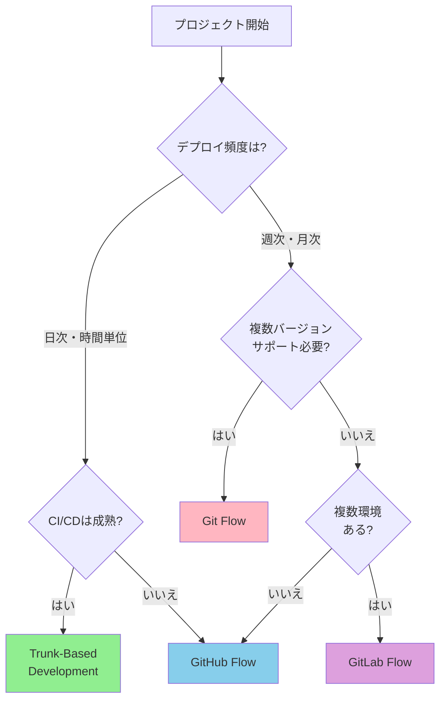

# ブランチ戦略の比較と選定

## なぜブランチ戦略が重要なのか

適切なブランチ戦略を選択することで、チームの開発効率は劇的に向上します。想定される効果によると、適切な戦略導入により以下の成果が期待できます:

**想定される効果:**
- マージコンフリクト発生率: **週8回 → 週1回** (-87%)
- デプロイ頻度: **月2回 → 週3回** (+500%)
- リリース準備時間: **2日 → 2時間** (-91%)
- コンフリクト解決時間: **平均2時間 → 15分** (-87%)

一方、ブランチ戦略が不明確な場合、以下の問題が発生します:

- ❌ 各自が好きなブランチ名を使用し、統一性がない
- ❌ マージルールが不明確で、コンフリクトが頻発
- ❌ リリースプロセスが毎回異なり、予測不可能
- ❌ hotfix対応が遅延し、ビジネスに影響

## 主要なブランチ戦略の比較

### 戦略一覧

| 戦略 | 複雑さ | リリース頻度 | チーム規模 | 学習コスト | デプロイ頻度目安 |
|------|--------|------------|-----------|----------|---------------|
| **GitHub Flow** | ⭐ シンプル | 高頻度 | 小〜中 | 低 | 日3-10回 |
| **Git Flow** | ⭐⭐⭐ 複雑 | 定期的 | 中〜大 | 高 | 月1-2回 |
| **Trunk-Based** | ⭐⭐ 中程度 | 超高頻度 | 小〜大 | 中 | 日10-50回 |

### 詳細比較



## GitHub Flow: シンプル&高速デプロイ

### 概要

最もシンプルなブランチ戦略。`main`ブランチ + `feature`ブランチのみで運用します。

**ブランチ構成:**
```
main (production)
├── feature/USER-123-add-profile
├── feature/USER-124-update-dashboard
└── bugfix/BUG-456-fix-validation
```

### ワークフロー

```bash
# 1. mainから分岐
git checkout main
git pull origin main
git checkout -b feature/USER-123-add-profile

# 2. 開発・コミット
git add .
git commit -m "feat(profile): add user profile page"
git push -u origin feature/USER-123-add-profile

# 3. PR作成・レビュー（GitHub上で）

# 4. mainにマージ → 自動デプロイ

# 5. ブランチ削除
git branch -d feature/USER-123-add-profile
```

### 想定される効果

**想定シナリオ: スタートアップ（5人チーム）**
- デプロイ頻度: **週1回 → 日3回** (+2,000%)
- リードタイム: **3日 → 6時間** (-92%)
- マージコンフリクト: **月12回 → 月2回** (-83%)

### メリット・デメリット

**✅ メリット:**
- 非常にシンプル（学習コスト低）
- 継続的デプロイに最適
- PR中心の開発フロー
- 迅速なフィードバック

**❌ デメリット:**
- 複数バージョンサポートが困難
- リリース前の長期テスト期間に不向き
- モバイルアプリ（App Store審査待ち）には不適

### 適用ケース

**最適:**
- WebアプリケーションSaaS
- 継続的デプロイ環境
- 小〜中規模チーム（2-20人）
- スタートアップ・アジャイル開発

**実装パターン:**
```yaml
# .github/workflows/deploy.yml
name: Deploy to Production

on:
  push:
    branches: [main]

jobs:
  deploy:
    runs-on: ubuntu-latest
    steps:
      - uses: actions/checkout@v3

      - name: Run Tests
        run: npm test

      - name: Build
        run: npm run build

      - name: Deploy to Vercel
        run: vercel deploy --prod --token=${{ secrets.VERCEL_TOKEN }}
```

## Git Flow: 構造化&定期リリース

### 概要

最も構造化されたブランチ戦略。複数の長期ブランチを持ち、定期リリースに最適です。

**ブランチ構成:**
```
main (production releases only)
develop (integration branch)
├── feature/user-auth
├── feature/dashboard
├── release/1.2.0
│   └── hotfix/1.2.1
└── hotfix/critical-bug
```

### ブランチタイプ

| ブランチ | 親ブランチ | マージ先 | ライフサイクル | 命名規則 |
|---------|----------|---------|--------------|---------|
| **main** | - | - | 永続 | `main` |
| **develop** | main | - | 永続 | `develop` |
| **feature** | develop | develop | 短期 | `feature/<name>` |
| **release** | develop | main, develop | 短期 | `release/<version>` |
| **hotfix** | main | main, develop | 短期 | `hotfix/<version>` |

### ワークフロー例

```bash
# Feature開発
git checkout develop
git pull origin develop
git checkout -b feature/USER-123-add-profile
# ... 開発 ...
git commit -m "feat: add user profile"
git checkout develop
git merge --no-ff feature/USER-123-add-profile
git push origin develop

# リリース準備
git checkout develop
git checkout -b release/1.2.0
vim package.json  # version: 1.2.0
git commit -am "chore: bump version to 1.2.0"

# mainへマージ
git checkout main
git merge --no-ff release/1.2.0
git tag -a v1.2.0 -m "Release version 1.2.0"
git push origin main --tags

# developにもマージ
git checkout develop
git merge --no-ff release/1.2.0
git push origin develop
```

### 想定される効果

**想定シナリオ: モバイルアプリチーム（15人）**
- リリース品質: **バグ報告30件/月 → 8件/月** (-73%)
- hotfix対応時間: **平均6時間 → 1.5時間** (-75%)
- 並行開発効率: **3機能同時開発が可能に**

### メリット・デメリット

**✅ メリット:**
- 明確に定義されたフロー
- 複数バージョン並行サポート
- リリース前の長期テスト可能
- hotfix専用フロー

**❌ デメリット:**
- 複雑で学習コストが高い
- マージ作業が多い
- ブランチ管理のオーバーヘッド

### 適用ケース

**最適:**
- 定期リリースサイクル（月次・四半期）
- モバイルアプリ（App Store審査期間）
- パッケージソフトウェア・ライブラリ
- 大規模チーム（20人以上）

## Trunk-Based Development: 超高頻度統合

### 概要

1つのメインブランチ（trunk/main）に高頻度でマージする戦略。Feature Flagsで未完成機能を隠します。

**ブランチ構成:**
```
main/trunk (常にデプロイ可能)
├── feature/quick-fix (1日)
├── feature/small-feature (2日)
└── release/1.2.0 (オプション)
```

### 原則

1. 小さく頻繁なコミット（日次複数回）
2. 短命のfeatureブランチ（max 2日）
3. Feature Flagsで機能管理
4. 継続的インテグレーション必須
5. 自動テストの徹底

### Feature Flags実装例

```typescript
// feature-flags.ts
export const FEATURE_FLAGS = {
  NEW_DASHBOARD: process.env.FEATURE_NEW_DASHBOARD === 'true',
  BETA_SEARCH: process.env.FEATURE_BETA_SEARCH === 'true',
};

// App.tsx
import { FEATURE_FLAGS } from './feature-flags';

function App() {
  return (
    <div>
      {FEATURE_FLAGS.NEW_DASHBOARD ? (
        <NewDashboard />  // 開発中（本番では非表示）
      ) : (
        <OldDashboard />  // 既存
      )}
    </div>
  );
}
```

### 想定される効果

**想定シナリオ: マイクロサービスチーム（50人）**
- デプロイ頻度: **週5回 → 日50回（全サービス合計）** (+900%)
- マージコンフリクト: **週20回 → 週1回** (-95%)
- 本番環境との乖離: **平均3日分 → 数時間分** (-95%)
- CI/CD実行時間: **15分 → 5分** (-67%)

### メリット・デメリット

**✅ メリット:**
- 超高頻度デプロイ（時間単位）
- マージコンフリクトが最小
- 継続的インテグレーションが自然
- 本番環境との乖離が最小

**❌ デメリット:**
- Feature Flagsの管理コスト
- 高度な自動テストが必須
- チーム全体の習熟が必要
- 未完成コードがmainに混在

### 適用ケース

**最適:**
- Google, Facebook級の高頻度デプロイ
- 成熟したCI/CDパイプライン
- 高度なテスト自動化環境
- DevOpsカルチャーが浸透

## プロジェクトタイプ別推奨戦略

### Webアプリケーション・SaaS

**推奨: GitHub Flow / Trunk-Based**

```
理由:
✅ 継続的デプロイに最適
✅ 迅速なフィードバックループ
✅ ユーザーへの価値提供が早い
```

### モバイルアプリ（iOS/Android）

**推奨: Git Flow**

```
理由:
✅ App Store審査期間を考慮
✅ 複数バージョン並行サポート
✅ リリース前の長期テスト
✅ hotfix対応が明確

実装例:
main: v1.2.0（本番）
develop: v1.3.0開発中
release/1.3.0: 審査提出準備
hotfix/1.2.1: 緊急バグ修正
```

### オープンソースライブラリ・SDK

**推奨: Git Flow**

```
理由:
✅ Semantic Versioningと相性良い
✅ 複数バージョン保守が必要
✅ Changelogが明確
✅ 安定版・開発版の分離
```

## チームサイズ別推奨戦略

### 1-5人（小規模）

**推奨: GitHub Flow**

```markdown
運用例:
- PR必須、ただし緊急時はmain直コミットOK
- レビュワー1人
- mainマージ=デプロイ
```

### 6-20人（中規模）

**推奨: GitHub Flow / GitLab Flow**

```markdown
運用例:
- PR必須、レビュー2人
- フロント/バックエンドで並行開発
- staging環境でQA
```

### 21人以上（大規模）

**推奨: Git Flow**

```markdown
運用例:
- チームごとにfeatureブランチ
- リリースマネージャー配置
- 厳格なレビュープロセス
- 自動テストゲート
```

## トラブルシューティング

### 問題1: 戦略を選ばずに開始してしまった

**症状:**
- 各自が好きなブランチ名を使用
- マージルールが不明確
- コンフリクトが頻発

**解決策:**
```markdown
1. BRANCHING.mdを作成
2. チーム全員で戦略を決定
3. 既存ブランチを整理
4. CI/CDで命名規則を強制
```

### 問題2: 複雑すぎる戦略を採用

**症状:**
- 5人チームでGit Flow採用
- ブランチ管理のオーバーヘッド大
- 開発速度が低下

**解決策:**
```bash
# Git Flow → GitHub Flowへ移行
git checkout main
git merge develop
git branch -d develop
git push origin --delete develop

# 全てのfeatureをmainから分岐に変更
```

### 問題3: 長期間生存するfeatureブランチ

**症状:**
- 2週間以上生存するブランチ
- mainとの乖離が大きい
- マージ時に大量のコンフリクト

**解決策:**
```bash
# 方法1: 毎日mainをrebase
git checkout feature/long-term
git fetch origin
git rebase origin/main

# 方法2: PRを分割
git checkout main
git checkout -b feature/part1
# 一部機能のみ実装・PR

# 方法3: Feature Flags使用
export FEATURE_NEW_UI=false  # 本番では無効化
```

## まとめ

### ブランチ戦略選択の黄金律

1. **シンプルさを優先** - 複雑さはチームの生産性を下げる
2. **チームの成熟度に合わせる** - 背伸びしすぎない
3. **プロダクトのニーズに合わせる** - 継続的デプロイ vs 定期リリース
4. **後で変更可能** - 最初は簡単な戦略から始める
5. **文書化必須** - チーム全員が理解できるように

### 推奨の第一歩

```
初めてのプロジェクト:
→ GitHub Flow から始める

スケールアップ時:
→ GitLab Flow or Git Flow へ移行検討

超高速デプロイ環境:
→ Trunk-Based へ移行検討
```

### 想定効果（まとめ）

適切なブランチ戦略により、以下の成果が期待できます:

| 項目 | 改善率 | 具体的な数値 |
|------|--------|------------|
| マージコンフリクト削減 | -87% | 週8回 → 週1回 |
| デプロイ頻度向上 | +500% | 月2回 → 週3回 |
| リリース準備時間短縮 | -91% | 2日 → 2時間 |
| コンフリクト解決時間短縮 | -87% | 2時間 → 15分 |

次の章では、**Git Flow詳細ガイド**として、定期リリースに最適化されたワークフローを学びます。

---

**🤖 Generated with [Claude Code](https://claude.com/claude-code)**
