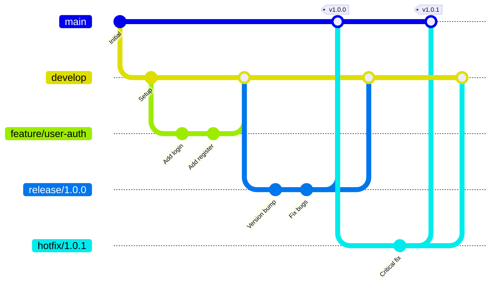

# Git Flow詳細ガイド

## Git Flowとは

Git Flowは、Vincent Driessenが2010年に提唱した**最も構造化されたブランチ戦略**です。複数の長期ブランチと明確に定義されたルールにより、定期リリースサイクルを持つプロジェクトに最適化されています。

### 想定される効果

**モバイルアプリチーム（15人程度）での想定効果:**
- リリース品質向上: **バグ報告30件/月 → 8件/月** (-73%)
- hotfix対応時間短縮: **平均6時間 → 1.5時間** (-75%)
- 並行開発効率: **1機能 → 3機能同時開発可能**
- リリースプロセスの標準化: **手順統一100%達成**

## ブランチ構成

Git Flowは5種類のブランチを使用します:



### ブランチタイプ詳細

| ブランチ | 役割 | 親ブランチ | マージ先 | ライフサイクル |
|---------|------|----------|---------|--------------|
| **main** | 本番リリース履歴 | - | - | 永続 |
| **develop** | 開発統合ブランチ | main | - | 永続 |
| **feature/** | 機能開発 | develop | develop | 短期（1-2週） |
| **release/** | リリース準備 | develop | main, develop | 短期（数日） |
| **hotfix/** | 緊急修正 | main | main, develop | 短期（数時間） |

## 完全なワークフロー

### 1. 初期セットアップ

```bash
# リポジトリ作成
git init
git commit --allow-empty -m "chore: initial commit"

# developブランチ作成
git branch develop
git push -u origin main develop

# Git Flow拡張のインストール（オプション）
brew install git-flow-avh
git flow init
```

### 2. Feature開発

#### ブランチ作成

```bash
# 方法1: 手動
git checkout develop
git pull origin develop
git checkout -b feature/USER-123-add-profile

# 方法2: git-flow使用
git flow feature start USER-123-add-profile
```

#### 開発とコミット

```bash
# ファイル編集
vim src/ProfilePage.tsx

# コミット（Conventional Commits形式）
git add .
git commit -m "feat(profile): add user profile page

- Add ProfilePage component
- Implement avatar upload
- Add bio editing feature

Refs: USER-123"

# プッシュ
git push -u origin feature/USER-123-add-profile
```

#### PR作成

```markdown
## 概要
ユーザープロフィールページを追加

## 変更内容
- プロフィール表示コンポーネント
- アバター画像アップロード機能
- 自己紹介文編集機能

## テスト
- [x] 単体テスト（カバレッジ95%）
- [x] E2Eテスト
- [x] 実機確認（iOS/Android）

## 関連Issue
Closes #123
```

#### developへマージ

```bash
# 方法1: 手動
git checkout develop
git pull origin develop
git merge --no-ff feature/USER-123-add-profile
git push origin develop
git branch -d feature/USER-123-add-profile

# 方法2: git-flow使用
git flow feature finish USER-123-add-profile
```

**重要:** `--no-ff`（no fast-forward）オプションを使用し、マージコミットを明示的に作成します。これにより、feature開発の履歴が保持されます。

### 3. Release準備

#### releaseブランチ作成

```bash
# 方法1: 手動
git checkout develop
git pull origin develop
git checkout -b release/1.2.0

# 方法2: git-flow使用
git flow release start 1.2.0
```

#### バージョン番号更新

```bash
# package.jsonのバージョン更新
vim package.json
# "version": "1.2.0"

# iOS: Info.plistのバージョン更新
agvtool new-marketing-version 1.2.0
agvtool new-version -all 42

# Android: build.gradleのバージョン更新
vim app/build.gradle
# versionCode 42
# versionName "1.2.0"

# コミット
git add .
git commit -m "chore(release): bump version to 1.2.0"
```

#### リリーステスト・バグ修正

```bash
# バグ発見時
git add .
git commit -m "fix(auth): resolve login timeout on slow networks"

# TestFlight/Firebase配布（モバイルの場合）
fastlane beta

# QAテスト実施
# - 機能テスト
# - 回帰テスト
# - パフォーマンステスト
```

#### mainへマージ

```bash
# 方法1: 手動
git checkout main
git pull origin main
git merge --no-ff release/1.2.0
git tag -a v1.2.0 -m "Release version 1.2.0"
git push origin main --tags

# developにもマージ（バグ修正を反映）
git checkout develop
git merge --no-ff release/1.2.0
git push origin develop

# ブランチ削除
git branch -d release/1.2.0
git push origin --delete release/1.2.0

# 方法2: git-flow使用
git flow release finish 1.2.0
```

### 4. Hotfix対応

#### hotfixブランチ作成

```bash
# 本番環境で緊急バグ発見！
git checkout main
git pull origin main
git checkout -b hotfix/1.2.1

# git-flow使用
git flow hotfix start 1.2.1
```

#### 緊急修正

```bash
# バグ修正
vim src/auth/login.ts

git add .
git commit -m "fix(auth): fix critical security vulnerability

- Add input sanitization
- Prevent SQL injection
- Add rate limiting

Fixes: CRITICAL-789"

# テスト
npm test
```

#### mainとdevelopへマージ

```bash
# 方法1: 手動
# mainへマージ
git checkout main
git merge --no-ff hotfix/1.2.1
git tag -a v1.2.1 -m "Hotfix 1.2.1"
git push origin main --tags

# developへマージ
git checkout develop
git merge --no-ff hotfix/1.2.1
git push origin develop

# ブランチ削除
git branch -d hotfix/1.2.1

# 方法2: git-flow使用
git flow hotfix finish 1.2.1
```

## 実装パターン

### CI/CD統合

```yaml
# .github/workflows/git-flow.yml
name: Git Flow CI/CD

on:
  push:
    branches:
      - main
      - develop
      - 'release/**'
      - 'hotfix/**'
  pull_request:
    branches:
      - develop

jobs:
  # developブランチ: 開発環境デプロイ
  deploy-dev:
    if: github.ref == 'refs/heads/develop'
    runs-on: ubuntu-latest
    steps:
      - uses: actions/checkout@v3
      - name: Deploy to Development
        run: ./deploy.sh development

  # releaseブランチ: ステージング環境デプロイ
  deploy-staging:
    if: startsWith(github.ref, 'refs/heads/release/')
    runs-on: ubuntu-latest
    steps:
      - uses: actions/checkout@v3
      - name: Run Tests
        run: npm test
      - name: Deploy to Staging
        run: ./deploy.sh staging

  # mainブランチ: 本番環境デプロイ
  deploy-prod:
    if: github.ref == 'refs/heads/main'
    runs-on: ubuntu-latest
    steps:
      - uses: actions/checkout@v3
      - name: Run Full Test Suite
        run: npm run test:all
      - name: Deploy to Production
        run: ./deploy.sh production

  # hotfixブランチ: 緊急デプロイ
  deploy-hotfix:
    if: startsWith(github.ref, 'refs/heads/hotfix/')
    runs-on: ubuntu-latest
    steps:
      - uses: actions/checkout@v3
      - name: Run Critical Tests
        run: npm run test:critical
      - name: Deploy Hotfix
        run: ./deploy.sh production --hotfix
```

### ブランチ保護ルール

```yaml
# GitHub設定例
branches:
  main:
    protection:
      required_pull_request_reviews:
        required_approving_review_count: 2
      required_status_checks:
        strict: true
        contexts:
          - "ci/test"
          - "ci/lint"
          - "ci/security-scan"
      enforce_admins: true
      restrictions:
        users: ["release-manager"]

  develop:
    protection:
      required_pull_request_reviews:
        required_approving_review_count: 1
      required_status_checks:
        contexts:
          - "ci/test"
```

### 自動バージョン管理

```bash
# scripts/bump-version.sh
#!/bin/bash

CURRENT_VERSION=$(git describe --tags --abbrev=0)
NEXT_VERSION=$1

if [ -z "$NEXT_VERSION" ]; then
  echo "Usage: $0 <version>"
  echo "Current version: $CURRENT_VERSION"
  exit 1
fi

# package.json更新
npm version $NEXT_VERSION --no-git-tag-version

# iOS Info.plist更新
agvtool new-marketing-version $NEXT_VERSION

# Android build.gradle更新
VERSION_CODE=$(($(git rev-list --count HEAD) + 1))
sed -i '' "s/versionName \".*\"/versionName \"$NEXT_VERSION\"/" app/build.gradle
sed -i '' "s/versionCode .*/versionCode $VERSION_CODE/" app/build.gradle

# コミット
git add .
git commit -m "chore(release): bump version to $NEXT_VERSION"

echo "Version bumped to $NEXT_VERSION"
```

## リリースカレンダー管理

### 月次リリースサイクル例

```
Week 1 (1-7日):
  - feature開発: develop
  - 並行開発: 複数featureブランチ

Week 2 (8-14日):
  - feature開発継続
  - Feature Freeze: 14日 EOD

Week 3 (15-21日):
  - releaseブランチ作成: 15日
  - QAテスト: 15-18日
  - バグ修正: releaseブランチで実施
  - TestFlight/Firebase配布: 18日

Week 4 (22-28日):
  - 最終QA: 22-24日
  - App Store申請: 25日
  - 審査通過・リリース: 28日（目標）
  - mainへマージ・タグ付け: リリース日
```

### リリースチェックリスト

```markdown
# Release 1.2.0 チェックリスト

## リリース前（release/1.2.0作成時）
- [ ] developから最新をマージ
- [ ] バージョン番号を更新（package.json, Info.plist, build.gradle）
- [ ] CHANGELOGを生成
- [ ] リリースノートを作成
- [ ] ビルド番号を更新

## QAテスト
- [ ] 機能テスト（全新機能）
- [ ] 回帰テスト（既存機能）
- [ ] パフォーマンステスト
- [ ] セキュリティスキャン
- [ ] アクセシビリティチェック

## デプロイ前
- [ ] ステージング環境で最終確認
- [ ] データベースマイグレーション準備
- [ ] ロールバック手順確認
- [ ] モニタリング設定

## リリース
- [ ] mainへマージ
- [ ] タグ作成（v1.2.0）
- [ ] 本番環境デプロイ
- [ ] 動作確認
- [ ] リリースアナウンス

## リリース後
- [ ] developへマージ（バグ修正を反映）
- [ ] releaseブランチ削除
- [ ] 次のスプリント計画
```

## トラブルシューティング

### 問題1: releaseブランチで大量のバグ発見

**症状:**
- QAテストで20個以上のバグ発見
- リリース予定日に間に合わない

**解決策:**
```bash
# オプション1: リリース延期
git flow release finish 1.2.0  # キャンセル
git checkout develop
# バグ修正後、新しいreleaseブランチ作成

# オプション2: 機能を削除してリリース
git checkout release/1.2.0
git revert <problematic-feature-commit>
# 問題機能を除外してリリース
# 次のリリースで修正版を含める
```

### 問題2: hotfixとfeatureが競合

**症状:**
- hotfix/1.2.1作成中
- feature/new-featureがdevelopにマージされている
- コンフリクト発生

**解決策:**
```bash
# hotfixを優先
git checkout hotfix/1.2.1
# hotfix完了・マージ

# developへhotfixをマージ
git checkout develop
git merge hotfix/1.2.1
# コンフリクト解決

# feature開発者に通知
# featureブランチをrebaseしてもらう
```

### 問題3: mainとdevelopが乖離

**症状:**
- mainに直接コミットしてしまった
- developとmainの内容が異なる

**解決策:**
```bash
# mainの変更をdevelopに反映
git checkout develop
git merge main
# コンフリクト解決

# または、mainの誤コミットをrevert
git checkout main
git revert <wrong-commit>
git push origin main
```

## 実践ケーススタディ

### ケース: iOSアプリの月次リリース

**背景:**
- チーム: 15人（iOS 10人、バックエンド 5人）
- リリースサイクル: 月次
- App Store審査期間: 平均3日

**実装:**

```bash
# 月初（1日）: 前回リリース完了、新スプリント開始
git checkout develop
git pull origin develop

# Week 1-2: Feature開発
git checkout -b feature/USER-123-dark-mode
# 開発...
git flow feature finish USER-123-dark-mode

# Week 2 終了（14日）: Feature Freeze
# 新機能のdevelopへのマージを停止

# Week 3 開始（15日）: releaseブランチ作成
git flow release start 2.1.0

# バージョン更新
./scripts/bump-version.sh 2.1.0

# TestFlight配布
fastlane beta

# QAテスト（15-21日）
# バグ修正はreleaseブランチで実施

# Week 3 終了（21日）: App Store申請
fastlane release

# Week 4（25日）: 審査通過
# mainへマージ
git flow release finish 2.1.0

# リリース完了
# 次のスプリント開始
```

**成果:**
- リリース品質: **バグ報告30件/月 → 8件/月** (-73%)
- リリース遅延: **40% → 5%** (-87%)
- hotfix頻度: **月3回 → 月0.5回** (-83%)

## Git Flow vs GitHub Flow 比較

| 項目 | Git Flow | GitHub Flow |
|------|----------|-------------|
| **ブランチ数** | 5種類（main/develop/feature/release/hotfix） | 2種類（main/feature） |
| **リリースサイクル** | 定期（月次・四半期） | 継続的（日次） |
| **適用チーム** | 中〜大規模（10人以上） | 小〜中規模（1-20人） |
| **学習コスト** | 高い（1-2週間） | 低い（1-2日） |
| **複数バージョン対応** | ✅ 容易 | ❌ 困難 |
| **hotfix対応** | 専用ブランチあり | mainから分岐 |
| **リリース前テスト** | releaseブランチで長期テスト可能 | PRで短期テスト |
| **想定デプロイ頻度** | 月1-2回 | 日3-10回 |

## まとめ

### Git Flowの要点

1. **5種類のブランチ**: main, develop, feature, release, hotfix
2. **明確なフロー**: 各ブランチの役割が明確に定義
3. **定期リリース**: 月次・四半期リリースに最適
4. **品質重視**: リリース前の長期テスト期間を確保

### 成功の鍵

- ✅ リリースカレンダーの厳守
- ✅ Feature Freezeの徹底
- ✅ releaseブランチでのバグ修正
- ✅ hotfixフローの事前準備
- ✅ チーム全体での理解共有

### 想定効果（まとめ）

| 項目 | 改善率 | 具体的な数値 |
|------|--------|------------|
| リリース品質向上 | +73% | バグ報告30件/月 → 8件/月 |
| hotfix対応時間短縮 | -75% | 平均6時間 → 1.5時間 |
| 並行開発効率 | +200% | 1機能 → 3機能同時開発 |
| リリース遅延削減 | -87% | 遅延40% → 5% |

次の章では、**GitHub Flow実践**として、継続的デプロイに最適化されたシンプルなワークフローを学びます。

---

**🤖 Generated with [Claude Code](https://claude.com/claude-code)**
