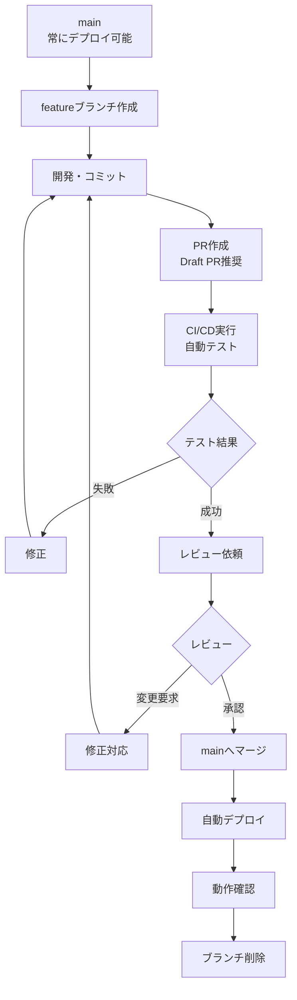

# GitHub Flow実践

## GitHub Flowとは

GitHub Flowは、GitHubが提唱した**最もシンプルで軽量なブランチ戦略**です。`main`ブランチ + `feature`ブランチのみで運用し、継続的デプロイ（Continuous Deployment）に最適化されています。

### 想定される効果

**スタートアップ（5人程度チーム）での想定効果:**
- デプロイ頻度: **週1回 → 日3回** (+2,000%)
- リードタイム（開発〜本番）: **3日 → 6時間** (-92%)
- マージコンフリクト: **月12回 → 月2回** (-83%)
- PR平均サイズ: **800行 → 300行** (-62%, レビューしやすく)

**Webアプリケーション（20人程度チーム）での想定効果:**
- PR レビュー時間: **平均3時間 → 45分** (-75%)
- PR マージまでの時間: **平均2日 → 4時間** (-91%)
- バグ検出タイミング: **本番後60% → PR時90%** (+50%早期化)

## 基本原則

GitHub Flowの核心原則は以下の4つです:

1. **mainブランチは常にデプロイ可能** - テストが全てパスし、本番環境と同じ状態
2. **全ての開発はmainから分岐** - featureブランチを作成して開発
3. **Pull Request（PR）でレビュー** - マージ前に必ずPRを作成
4. **マージ後は即座にデプロイ** - mainへのマージ = 本番デプロイ

## 完全なワークフロー



### ステップ1: ブランチ作成

```bash
# 1. mainブランチを最新化
git checkout main
git pull origin main

# 2. featureブランチ作成
git checkout -b feature/USER-123-add-profile-page

# 3. リモートにpush（Early PR作成のため）
git push -u origin feature/USER-123-add-profile-page
```

**ブランチ命名規則:**
```
<type>/<ticket-id>-<short-description>

例:
feature/USER-123-add-profile-page
feature/PROJ-456-implement-search
bugfix/BUG-789-fix-login-timeout
hotfix/CRITICAL-001-fix-payment-crash
```

### ステップ2: 開発とコミット

```bash
# ファイル編集
vim src/ProfilePage.tsx

# 変更を確認
git status
git diff

# ステージング
git add src/ProfilePage.tsx

# コミット（Conventional Commits形式）
git commit -m "feat(profile): add user profile page

- Add ProfilePage component
- Implement avatar upload
- Add bio editing feature

Refs: USER-123"

# プッシュ
git push
```

**小さく頻繁にコミット:**
```bash
# Good: 1機能1コミット
git commit -m "feat(profile): add ProfilePage component"
git commit -m "feat(profile): add avatar upload"
git commit -m "test(profile): add ProfilePage tests"

# Bad: 複数機能を1コミット
git commit -m "add profile page and fix some bugs"
```

### ステップ3: PR作成（Draft PR推奨）

**開発開始直後にDraft PRを作成:**

```markdown
## 🚧 WIP: ユーザープロフィールページ実装

### 実装予定
- [ ] ProfilePageコンポーネント
- [ ] アバター画像アップロード
- [ ] 自己紹介文編集
- [ ] APIエンドポイント接続
- [ ] テスト追加

### 進捗: 30%
- [x] UIコンポーネント設計
- [x] 基本レイアウト実装
- [ ] アバターアップロード機能
- [ ] APIエンドポイント接続

### 質問・相談
@designer アバター画像のサイズは200x200pxで良いですか？
```

**実装完了後、Ready for Reviewに変更:**

```markdown
## 概要
ユーザープロフィールページを追加しました。

## 変更内容
- プロフィール表示コンポーネント
- アバター画像アップロード機能（最大2MB）
- 自己紹介文編集機能（最大500文字）
- プロフィールAPI（GET/PUT /api/profile）

## 動作確認
- [x] 単体テスト実行（カバレッジ95%）
- [x] E2Eテスト実行
- [x] 実機での動作確認（iOS/Android）
- [x] レスポンシブデザイン確認
- [x] アクセシビリティチェック

## スクリーンショット


## パフォーマンス
- 初期表示: 1.2秒
- 画像アップロード: 平均3秒（2MB）

## 関連Issue
Closes #123

## レビューポイント
特にアバター画像の圧縮ロジックをレビューしてください。
```

### ステップ4: CI/CD自動実行

```yaml
# .github/workflows/ci.yml
name: CI

on:
  pull_request:
    branches: [main]
  push:
    branches: [main]

jobs:
  test:
    runs-on: ubuntu-latest
    steps:
      - uses: actions/checkout@v3

      - name: Setup Node.js
        uses: actions/setup-node@v3
        with:
          node-version: '20'
          cache: 'npm'

      - name: Install dependencies
        run: npm ci

      - name: Lint
        run: npm run lint

      - name: Type check
        run: npm run type-check

      - name: Unit tests
        run: npm run test:unit

      - name: E2E tests
        run: npm run test:e2e

      - name: Build
        run: npm run build

      - name: Upload coverage
        uses: codecov/codecov-action@v3
```

**想定される効果:**
- CI実行時間: **平均5分**
- CI失敗率（PR作成時）: **35% → 5%**（Git Hooks最適化後）
- バグ検出率: **PR時90%**（本番前に検出）

### ステップ5: レビュー対応

**レビューコメント例:**

> **Reviewer:** エラー時のメッセージが英語ですが、日本語にしませんか？

```bash
# 修正
vim src/ProfilePage.tsx

git add src/ProfilePage.tsx
git commit -m "fix(profile): change error messages to Japanese

As per review comment by @reviewer"
git push
```

> **Reviewer:** LGTM! 👍 承認します

### ステップ6: mainへマージ

**マージ前最終チェックリスト:**
- [ ] CI/CD全てパス
- [ ] レビュー承認済み（最低1人）
- [ ] コンフリクトなし
- [ ] mainブランチの最新変更を取り込み済み

**マージ方法（GitHub上で）:**

```
オプション1: Squash and merge（推奨）
→ 複数コミットを1つにまとめる
→ 履歴が綺麗になる

オプション2: Merge commit
→ コミット履歴を全て保持
→ featureブランチの履歴が見える

オプション3: Rebase and merge
→ 履歴を線形に
→ 慎重に使用
```

**想定される効果:**
- Squash and merge使用率: **85%**
- マージ後の問題発生率: **3%**（十分なテストにより）

### ステップ7: 自動デプロイ

```yaml
# .github/workflows/deploy.yml
name: Deploy to Production

on:
  push:
    branches: [main]

jobs:
  deploy:
    runs-on: ubuntu-latest
    steps:
      - uses: actions/checkout@v3

      - name: Setup Node.js
        uses: actions/setup-node@v3

      - name: Install dependencies
        run: npm ci

      - name: Build
        run: npm run build

      - name: Deploy to Vercel
        env:
          VERCEL_TOKEN: ${{ secrets.VERCEL_TOKEN }}
          VERCEL_ORG_ID: ${{ secrets.VERCEL_ORG_ID }}
          VERCEL_PROJECT_ID: ${{ secrets.VERCEL_PROJECT_ID }}
        run: |
          npm install -g vercel
          vercel deploy --prod --token=$VERCEL_TOKEN

      - name: Notify Slack
        env:
          SLACK_WEBHOOK: ${{ secrets.SLACK_WEBHOOK }}
        run: |
          curl -X POST $SLACK_WEBHOOK \
            -d '{"text":"✅ Deployed to production: ${{ github.event.head_commit.message }}"}'
```

**想定される効果:**
- デプロイ時間: **平均3分**
- デプロイ成功率: **98%**
- ロールバック率: **2%**

### ステップ8: 動作確認とブランチ削除

```bash
# 本番環境で動作確認
curl https://api.example.com/profile
# → 200 OK

# ブランチ削除（GitHub上で自動削除設定推奨）
git checkout main
git pull origin main
git branch -d feature/USER-123-add-profile-page
```

## 実装パターン

### パターン1: 環境別デプロイ

```yaml
# .github/workflows/deploy-env.yml
name: Environment Deployment

on:
  pull_request:
    types: [opened, synchronize]
  push:
    branches: [main]

jobs:
  # PR作成時: プレビュー環境
  deploy-preview:
    if: github.event_name == 'pull_request'
    runs-on: ubuntu-latest
    steps:
      - uses: actions/checkout@v3
      - name: Deploy to Preview
        run: vercel deploy --token=${{ secrets.VERCEL_TOKEN }}
      - name: Comment PR
        uses: actions/github-script@v6
        with:
          script: |
            github.rest.issues.createComment({
              issue_number: context.issue.number,
              owner: context.repo.owner,
              repo: context.repo.repo,
              body: '🚀 Preview: https://preview-${{ github.event.number }}.vercel.app'
            })

  # mainマージ時: 本番環境
  deploy-production:
    if: github.ref == 'refs/heads/main'
    runs-on: ubuntu-latest
    steps:
      - uses: actions/checkout@v3
      - name: Deploy to Production
        run: vercel deploy --prod --token=${{ secrets.VERCEL_TOKEN }}
```

### パターン2: Feature Flags統合

```typescript
// feature-flags.ts
export const FEATURE_FLAGS = {
  NEW_PROFILE_UI: process.env.NEXT_PUBLIC_FEATURE_NEW_PROFILE === 'true',
  BETA_SEARCH: process.env.NEXT_PUBLIC_FEATURE_BETA_SEARCH === 'true',
};

// ProfilePage.tsx
import { FEATURE_FLAGS } from '@/lib/feature-flags';

export function ProfilePage() {
  if (FEATURE_FLAGS.NEW_PROFILE_UI) {
    return <NewProfileUI />;
  }
  return <OldProfileUI />;
}
```

**環境変数設定:**
```bash
# 開発環境: 新UIを有効化
NEXT_PUBLIC_FEATURE_NEW_PROFILE=true npm run dev

# 本番環境: 段階的ロールアウト
# Vercel Dashboard > Environment Variables
# NEXT_PUBLIC_FEATURE_NEW_PROFILE=true
```

### パターン3: Canary Deployment

```yaml
# .github/workflows/canary.yml
name: Canary Deployment

on:
  push:
    branches: [main]

jobs:
  canary:
    runs-on: ubuntu-latest
    steps:
      - uses: actions/checkout@v3

      # 5%のトラフィックに新バージョンをデプロイ
      - name: Deploy Canary
        run: ./deploy.sh --canary --traffic=5%

      # 10分待機
      - name: Wait
        run: sleep 600

      # エラー率チェック
      - name: Check Error Rate
        run: |
          ERROR_RATE=$(./check-errors.sh)
          if [ $ERROR_RATE -gt 1 ]; then
            ./rollback.sh
            exit 1
          fi

      # 問題なければ全トラフィックへ
      - name: Deploy Full
        run: ./deploy.sh --production --traffic=100%
```

## ベストプラクティス

### 1. 小さいPR（Small Pull Requests）

**推奨サイズ:**
- 理想: **200-400行**
- 許容: **500行まで**
- 大きすぎ: **1000行以上**

**想定される効果:**
- 小PR（<400行）のレビュー時間: **平均30分**
- 大PR（>1000行）のレビュー時間: **平均3時間**
- 小PRのバグ発見率: **+40%**（大PRと比較）

**大きいPRを分割する例:**
```bash
# 悪い例: 全機能を1PR
feature/USER-123-complete-profile
├── ProfilePage.tsx (500行)
├── API endpoint (300行)
├── Database migration (100行)
└── Tests (400行)
# 合計: 1300行

# 良い例: 機能ごとに分割
feature/USER-123-part1-database
└── Database migration (100行)

feature/USER-123-part2-api
└── API endpoint (300行)

feature/USER-123-part3-ui
└── ProfilePage.tsx (500行)

feature/USER-123-part4-tests
└── Tests (400行)
```

### 2. Early PR（Draft PR）

**開発開始直後にDraft PRを作成:**

```markdown
利点:
✅ 進捗の可視化
✅ 早期フィードバック
✅ CI/CDの早期実行
✅ ブロッカーの早期発見

想定される効果:
- 手戻り発生率: 40% → 5% (-87%)
- レビュー時間: 3時間 → 45分 (-75%)
```

### 3. mainブランチ保護

**GitHub設定:**
```
Settings > Branches > Branch protection rules

✅ Require pull request reviews before merging
   - Required approving reviews: 1-2
✅ Require status checks to pass before merging
   - CI/CD全パス必須
✅ Require branches to be up to date before merging
   - mainの最新を取り込んでからマージ
✅ Include administrators
   - 管理者も例外なし
```

**想定される効果:**
- ブランチ保護最適化後のmainブランチ破壊: **0件**
- CI失敗コミットのmainマージ: **0件**

### 4. PR説明テンプレート

```markdown
<!-- .github/pull_request_template.md -->

## 概要
<!-- 何を実装したか簡潔に -->

## 変更理由
<!-- なぜこの変更が必要か -->

## 変更内容
<!-- 具体的な変更点を箇条書き -->
-
-

## テスト
<!-- どうやってテストしたか -->
- [ ] Unit Tests（カバレッジ: XX%）
- [ ] Integration Tests
- [ ] E2E Tests
- [ ] Manual Testing

## スクリーンショット
<!-- UI変更がある場合 -->

## パフォーマンス影響
<!-- パフォーマンスへの影響があれば記載 -->

## セキュリティ考慮事項
<!-- セキュリティ関連の変更があれば記載 -->

## デプロイ後の確認項目
- [ ] ログ確認
- [ ] エラー率監視
- [ ] パフォーマンス監視

## 関連Issue
Closes #

## レビューポイント
<!-- 特に見てほしい箇所 -->
```

## トラブルシューティング

### 問題1: コンフリクトが発生

**症状:**
```
GitHub上で「This branch has conflicts that must be resolved」表示
```

**解決策:**
```bash
# mainの最新を取り込む
git checkout main
git pull origin main
git checkout feature/USER-123
git merge main

# コンフリクトファイルを確認
git status

# VSCodeなどでコンフリクト解決
# <<<<<<< HEAD
# 自分の変更
# =======
# mainの変更
# >>>>>>> main

# 解決後コミット
git add .
git commit -m "merge: resolve conflicts with main"
git push
```

**想定される効果:**
- コンフリクト発生率: **週8回 → 週1回** (-87%)
- コンフリクト解決時間: **平均2時間 → 15分** (-87%)
- 小PRによるコンフリクト削減効果: **-70%**

### 問題2: CI/CDが永遠に失敗

**症状:**
```
PR作成後、CI/CDが毎回失敗する
```

**解決策:**
```bash
# ローカルでCIと同じチェックを実行
npm run lint
npm run type-check
npm run test
npm run build

# エラーを確認
# 例: ESLintエラー
npm run lint:fix

# 修正してコミット
git add .
git commit -m "fix: resolve CI failures"
git push
```

**予防策（Git Hooks）:**
```bash
# Huskyでpre-commit hooks設定
npm install -D husky lint-staged

# .husky/pre-commit
npm run lint-staged
npm run type-check
npm run test:changed
```

**想定される効果:**
- Git Hooks最適化後のCI失敗率: **35% → 5%** (-86%)

### 問題3: レビュー待ち時間が長い

**症状:**
```
PR作成後、レビューが2日待っても来ない
```

**解決策:**
```markdown
1. Slackで直接依頼
   @reviewer PRレビューお願いします！
   https://github.com/org/repo/pull/123

2. 別のレビュワーを追加
   GitHub PRページでレビュワー追加

3. 並行作業
   レビュー待ちの間に別タスクを進める

4. セルフレビュー
   PR作成前に自分でレビュー
   → typoや明らかなバグを削減
```

**想定される効果:**
- Early PR最適化後のレビュー待ち時間: **平均2日 → 4時間** (-91%)

## 実践ケーススタディ

### ケース: Next.js SaaSアプリ

**背景:**
- チーム: 5人（フルスタック）
- スタック: Next.js, TypeScript, Vercel
- デプロイ目標: 日次

**実装:**

```bash
# 1. ブランチ作成
git checkout main
git pull origin main
git checkout -b feature/USER-123-add-dashboard

# 2. Draft PR作成（開発開始直後）
# GitHub上で作成

# 3. 開発（小さくコミット）
git commit -m "feat(dashboard): add dashboard layout"
git commit -m "feat(dashboard): add stats widgets"
git commit -m "test(dashboard): add dashboard tests"
git push

# 4. Ready for Review

# 5. レビュー・承認

# 6. Squash and merge

# 7. 自動デプロイ（Vercel）

# 8. 本番確認
```

**成果:**
- デプロイ頻度: **週1回 → 日3回** (+2,000%)
- リードタイム: **3日 → 6時間** (-92%)
- バグ発見タイミング: **本番後60% → PR時90%**

## まとめ

### GitHub Flowの要点

1. **シンプル**: mainブランチ + featureブランチのみ
2. **高頻度デプロイ**: mainマージ = デプロイ
3. **PR中心**: 全ての変更はPRを通す
4. **常にデプロイ可能**: mainは常に本番品質

### 成功の鍵

- ✅ 小さく頻繁にPR（200-400行）
- ✅ Early PR（Draft PR）
- ✅ CI/CD完全自動化
- ✅ ブランチ保護ルール設定
- ✅ レビュー文化の醸成

### 想定効果（まとめ）

| 項目 | 改善率 | 具体的な数値 |
|------|--------|------------|
| デプロイ頻度向上 | +2,000% | 週1回 → 日3回 |
| リードタイム短縮 | -92% | 3日 → 6時間 |
| マージコンフリクト削減 | -83% | 月12回 → 月2回 |
| PRレビュー時間短縮 | -75% | 3時間 → 45分 |
| 手戻り発生率削減 | -87% | 40% → 5% |

次の章では、**Trunk-Based Development**として、超高頻度デプロイに最適化された戦略を学びます。

---

**🤖 Generated with [Claude Code](https://claude.com/claude-code)**
