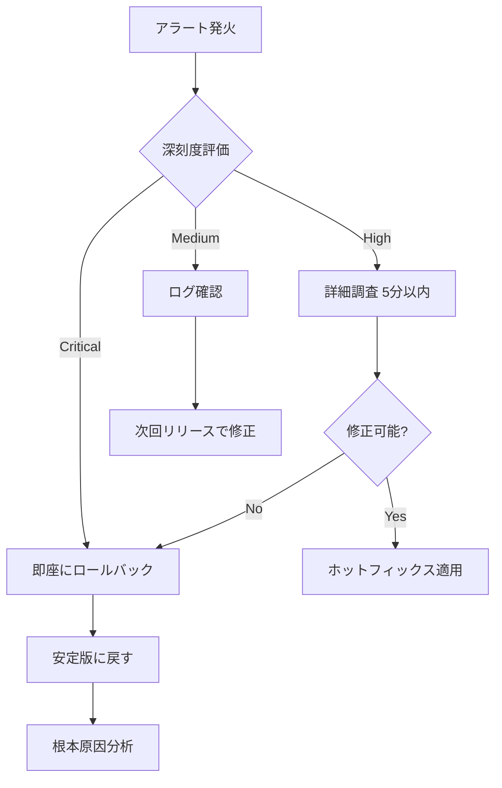

# リリース後モニタリング：本番品質の継続的監視

## リリース後監視の重要性

リリース後の監視は、本番環境での実際の品質を確認する最終段階です。テスト環境では発見できなかった問題や、実トラフィックでのみ顕在化する問題を早期に検知します。

## 監視すべき主要メトリクス

### 1. エラー率

```promql
# エラー率の監視（Prometheus Query）
sum(rate(http_requests_total{status=~"5.."}[5m])) /
sum(rate(http_requests_total[5m])) * 100

# アラート: エラー率が1%を超えた場合
alert: HighErrorRate
expr: error_rate > 1
for: 5m
```

### 2. レスポンスタイム

```promql
# 95パーセンタイルのレスポンスタイム
histogram_quantile(0.95,
  rate(http_request_duration_seconds_bucket[5m])
)

# アラート: レスポンスタイムが2秒を超えた場合
alert: SlowResponse
expr: response_time_95th > 2
for: 10m
```

### 3. リクエスト数

```promql
# リクエスト数のトレンド
sum(rate(http_requests_total[5m]))

# アラート: トラフィックが急減（問題の兆候）
alert: TrafficDropped
expr: (
  sum(rate(http_requests_total[5m])) /
  sum(rate(http_requests_total[5m] offset 1h))
) < 0.5
for: 10m
```

### 4. データベースパフォーマンス

```promql
# データベースクエリ時間
histogram_quantile(0.95,
  rate(db_query_duration_seconds_bucket[5m])
)

# データベース接続プール使用率
db_connections_active / db_connections_max * 100
```

## 監視ダッシュボードの構成

### リリース直後ダッシュボード（初動24時間用）

```markdown
## リリース監視ダッシュボード

### 重要指標（上部、大きく表示）
- エラー率（リアルタイム）
- 95パーセンタイルレスポンスタイム
- リクエスト数（前日比）
- Critical エラー数

### 詳細メトリクス（中段）
- エンドポイント別エラー率
- データベースクエリ時間
- キャッシュヒット率
- 外部API呼び出し成功率

### インフラメトリクス（下段）
- CPU使用率
- メモリ使用率
- ディスクI/O
- ネットワーク帯域幅
```

### Grafana設定例

```json
{
  "dashboard": {
    "title": "リリース後監視",
    "tags": ["release", "production"],
    "refresh": "30s",
    "panels": [
      {
        "title": "エラー率",
        "type": "stat",
        "targets": [{
          "expr": "sum(rate(http_requests_total{status=~\"5..\"}[5m])) / sum(rate(http_requests_total[5m])) * 100"
        }],
        "fieldConfig": {
          "thresholds": {
            "steps": [
              {"value": 0, "color": "green"},
              {"value": 0.5, "color": "yellow"},
              {"value": 1, "color": "red"}
            ]
          }
        }
      }
    ]
  }
}
```

## 段階的リリースと監視

### カナリアリリース

```yaml
# カナリアリリース設定例
apiVersion: v1
kind: Service
metadata:
  name: app-service
spec:
  type: LoadBalancer
  selector:
    app: myapp
---
# カナリア（新バージョン）- 10%のトラフィック
apiVersion: apps/v1
kind: Deployment
metadata:
  name: app-canary
spec:
  replicas: 1
  selector:
    matchLabels:
      app: myapp
      version: v2.0
---
# 安定版 - 90%のトラフィック
apiVersion: apps/v1
kind: Deployment
metadata:
  name: app-stable
spec:
  replicas: 9
  selector:
    matchLabels:
      app: myapp
      version: v1.9
```

### 監視項目と判定基準

```typescript
interface CanaryMetrics {
  errorRate: number;
  p95ResponseTime: number;
  requestCount: number;
}

interface RolloutDecision {
  proceed: boolean;
  percentage: number;
  reason: string;
}

function evaluateCanaryRollout(
  canaryMetrics: CanaryMetrics,
  stableMetrics: CanaryMetrics
): RolloutDecision {
  // エラー率の比較
  if (canaryMetrics.errorRate > stableMetrics.errorRate * 1.2) {
    return {
      proceed: false,
      percentage: 0,
      reason: 'カナリアのエラー率が安定版より20%以上高い'
    };
  }

  // レスポンスタイムの比較
  if (canaryMetrics.p95ResponseTime > stableMetrics.p95ResponseTime * 1.5) {
    return {
      proceed: false,
      percentage: 0,
      reason: 'カナリアのレスポンスタイムが50%以上遅い'
    };
  }

  // 問題なければ次の段階へ
  return {
    proceed: true,
    percentage: 50, // 10% → 50%
    reason: 'メトリクス正常、50%へ拡大'
  };
}
```

## ログ分析

### エラーログの監視

```typescript
// Elasticsearchでのエラーログクエリ
const errorQuery = {
  query: {
    bool: {
      must: [
        { term: { level: 'ERROR' } },
        { range: { '@timestamp': { gte: 'now-5m' } } }
      ]
    }
  },
  aggs: {
    error_types: {
      terms: { field: 'error_type.keyword' }
    }
  }
};

// 新しいエラータイプの検出
const newErrorsAlert = (currentErrors, baselineErrors) => {
  const newErrors = currentErrors.filter(
    error => !baselineErrors.includes(error.type)
  );

  if (newErrors.length > 0) {
    alertTeam({
      severity: 'warning',
      message: `新しいエラータイプ検出: ${newErrors.map(e => e.type).join(', ')}`
    });
  }
};
```

### ユーザー行動の分析

```sql
-- ユーザーのファネル分析（リリース前後比較）
SELECT
  date,
  COUNT(DISTINCT user_id) as total_users,
  COUNT(DISTINCT CASE WHEN step = 'search' THEN user_id END) as searched,
  COUNT(DISTINCT CASE WHEN step = 'add_to_cart' THEN user_id END) as added_cart,
  COUNT(DISTINCT CASE WHEN step = 'checkout' THEN user_id END) as checked_out
FROM user_events
WHERE date >= '2026-03-15'  -- リリース日
GROUP BY date
ORDER BY date;
```

## インシデント対応フロー

### 問題検出からロールバックまで



### ロールバック基準

```markdown
## 即座にロールバックする条件

### Critical（即座実行）
- エラー率が5%を超える
- サービス停止（5xx エラーが連続）
- データ整合性の問題検出
- セキュリティインシデント発生

### High（15分以内に判断）
- エラー率が2%を超える
- レスポンスタイムが通常の2倍以上
- 重要機能が動作不能
- ユーザーからの問い合わせ急増

### Medium（1時間以内に判断）
- エラー率が1%を超える
- 一部機能の不具合
- 軽微なUIの問題
```

## 本番品質レポート

### リリース後24時間レポート

```markdown
# リリース後24時間レポート - v2.0

**リリース日時**: 2026-03-15 02:00 JST
**レポート作成**: 2026-03-16 02:00 JST

## サマリー
✅ リリース成功 - 重大な問題なし

## メトリクス比較

| 指標 | リリース前 | リリース後 | 変化 |
|------|----------|----------|------|
| エラー率 | 0.3% | 0.4% | +0.1% ↗️ |
| P95レスポンス | 1.5s | 1.6s | +0.1s ↗️ |
| リクエスト数 | 1.2M/day | 1.25M/day | +4% ↗️ |
| コンバージョン率 | 3.2% | 3.5% | +0.3% ↗️ |

## 検出された問題

### 解決済み
1. **決済完了メールの遅延**
   - 検出: 3/15 08:30
   - 解決: 3/15 09:15
   - 原因: メールキューの設定ミス
   - 対応: キューワーカー数を増やす

### 監視中
1. **検索APIのレスポンス時間増加**
   - 現状: 1.8s（基準2s未満）
   - 対策: インデックス再構築を計画

## カナリアロールアウトスケジュール

- 3/15 02:00: 10% ✅
- 3/15 06:00: 25% ✅
- 3/15 12:00: 50% ✅
- 3/15 18:00: 100% ✅

## 次のアクション
- [ ] 検索インデックス最適化（3/17）
- [ ] メール送信監視強化（3/16）
- [ ] RCAレポート作成（3/18）
```

### 7日後の振り返りレポート

```markdown
# リリース後7日間レポート - v2.0

## 総評
✅ リリース成功 - KPI向上を確認

## KPI達成状況

| KPI | 目標 | 実績 | 達成 |
|-----|------|------|------|
| エラー率 | <1% | 0.5% | ✅ |
| コンバージョン率 | +5% | +9% | ✅ |
| レスポンスタイム | <2s | 1.7s | ✅ |
| ユーザー満足度 | >4.0 | 4.3 | ✅ |

## 発見されたバグ

- 本番限定バグ: 3件（すべてLow）
- ホットフィックス: 1件適用

## 学んだこと

### 良かったこと
- カナリアリリースにより安全な展開
- 監視ダッシュボードで早期問題検知

### 改善点
- メールキューの負荷テスト不足
- 本番データでの検索性能確認不足

### 次回への提案
- 本番相当データでの性能テスト強化
- 外部サービス（メール）の監視強化
```

## まとめ

リリース後の監視は、本番環境での品質を保証する最後の砦です。エラー率、レスポンスタイム、リクエスト数などの主要メトリクスをリアルタイムで監視し、問題の早期検知と迅速な対応が期待されます。

カナリアリリースによる段階的展開と、明確なロールバック基準により、リスクを最小化できます。リリース後のレポートで学びを文書化し、継続的な改善につなげることが推奨されます。

次章では、バグトラッキングツールの活用方法について解説します。
