# アーキテクチャ図 - システムの可視化

## アーキテクチャ図の重要性

アーキテクチャ図は、システムの構造、コンポーネント間の関係、データフロー、技術スタックを視覚的に表現する重要なドキュメントです。適切に作成されたアーキテクチャ図は、以下のメリットをもたらします：

- **チーム内のコミュニケーション円滑化**: 新規メンバーのオンボーディング時間を短縮し、共通理解を促進
- **設計判断の記録**: アーキテクチャの意思決定プロセスと理由を文書化
- **問題の早期発見**: システムのボトルネックや潜在的な問題を視覚的に特定
- **保守性の向上**: システムの全体像を把握し、変更影響範囲を正確に予測

## Mermaid記法によるアーキテクチャ図

Mermaidは、テキストベースで図を作成できるツールです。GitHubやZennで直接レンダリングされ、バージョン管理との親和性が高いことが特徴です。

### システム構成図（フローチャート）

システム全体のコンポーネントと通信経路を表現します。

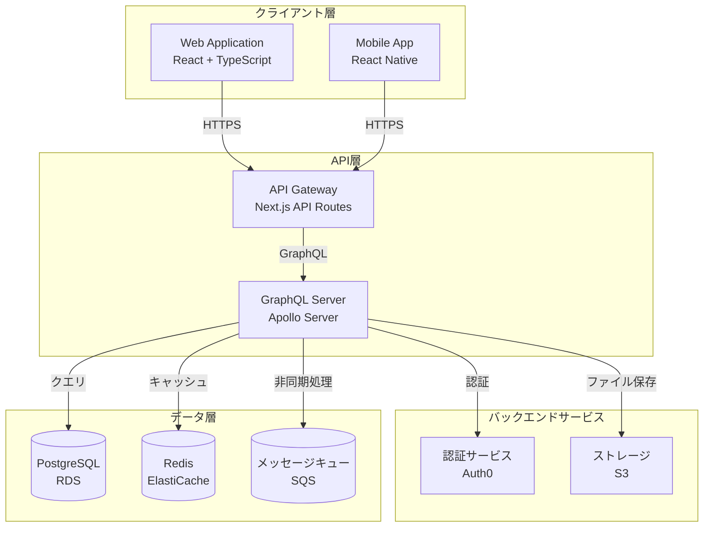

### シーケンス図

ユーザー操作からシステム応答までの時系列処理フローを表現します。

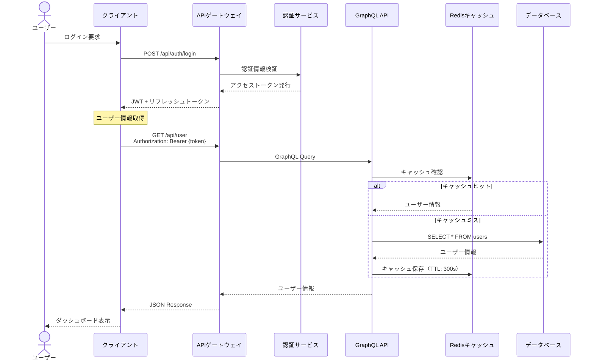

### ER図（エンティティ関係図）

データベーススキーマとテーブル間のリレーションシップを表現します。

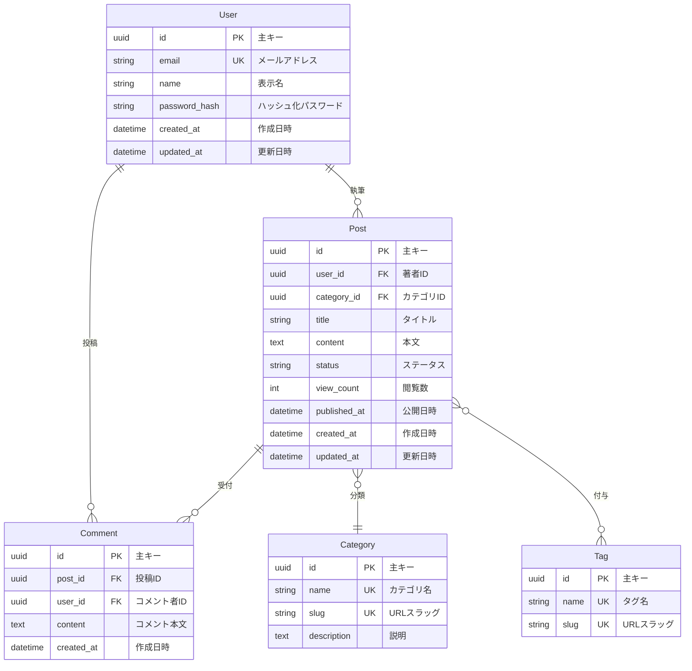

### 状態遷移図

ワークフローやステータス管理を表現します。

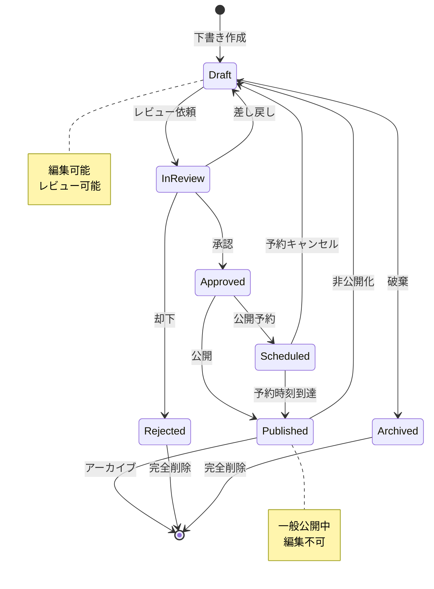

### ガントチャート（プロジェクト管理）

プロジェクトのタイムラインとタスク依存関係を表現します。

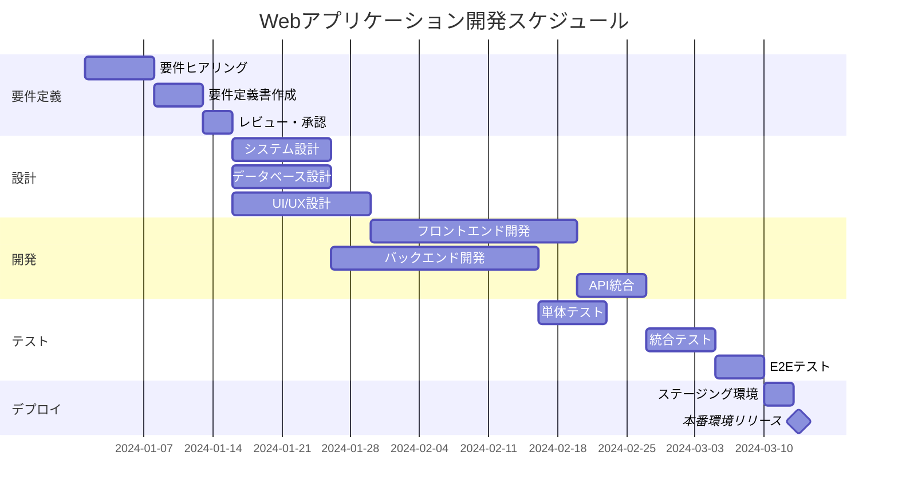

### クラス図（TypeScript）

オブジェクト指向設計におけるクラス構造を表現します。

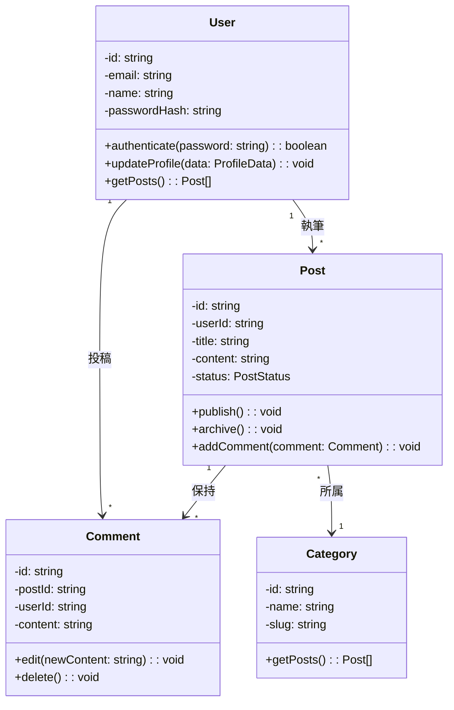

## C4モデルによるアーキテクチャ設計

C4モデルは、ソフトウェアアーキテクチャを4つの抽象度レベルで表現するフレームワークです。

### Level 1: システムコンテキスト図

システム全体と外部システム・ユーザーの関係を表現します。

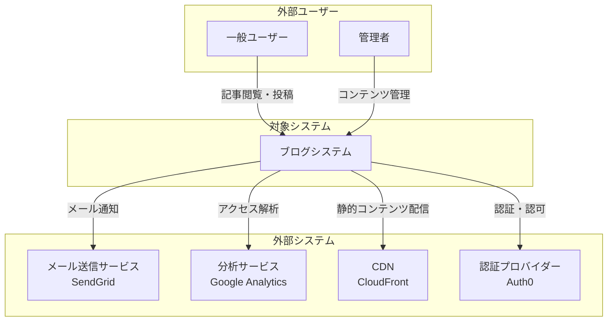

### Level 2: コンテナ図

システム内の主要なアプリケーション・データストアを表現します。

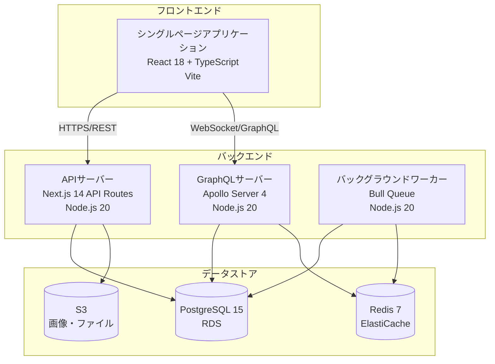

### Level 3: コンポーネント図

各コンテナ内の主要コンポーネントを表現します。

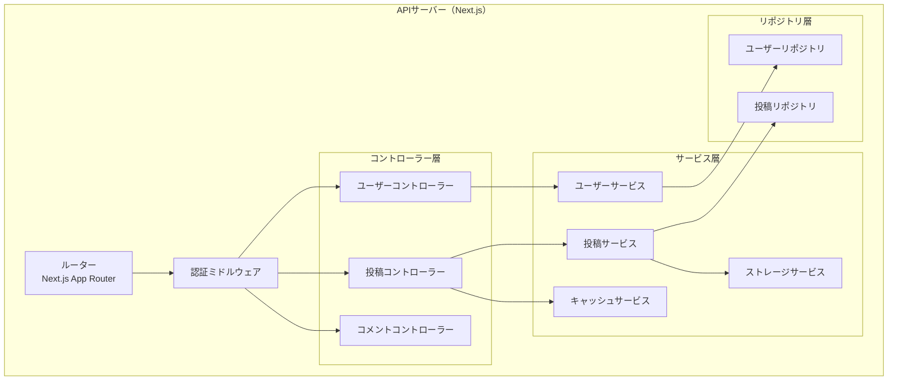

## PlantUML活用

PlantUMLは、より高度なダイアグラム作成が可能なツールです。

### PlantUMLによるシーケンス図

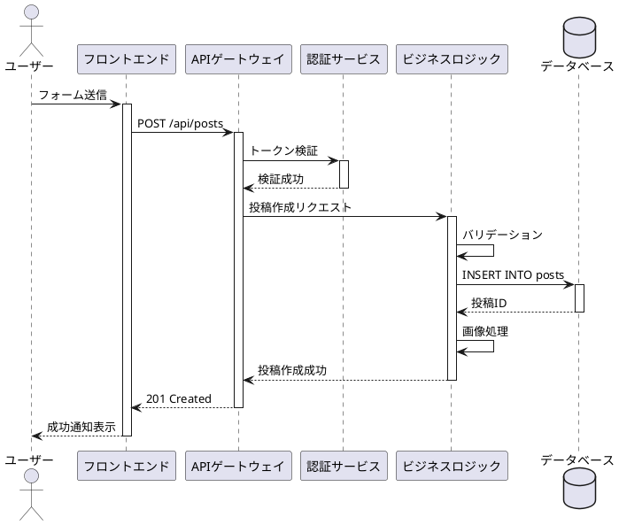

### PlantUMLによるコンポーネント図

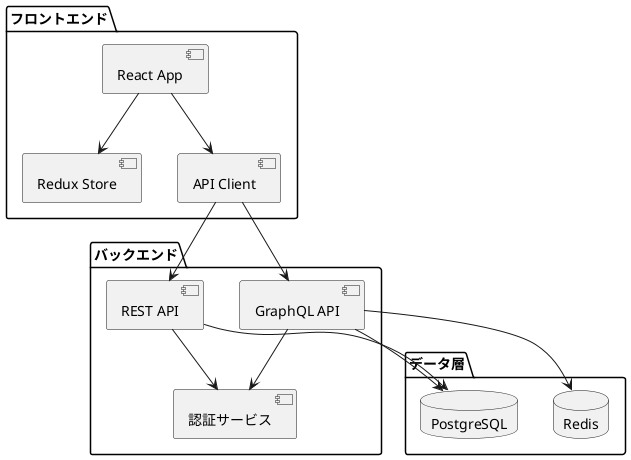

## ADR（Architecture Decision Record）

ADRは、アーキテクチャに関する重要な意思決定を記録するドキュメント形式です。

### ADRテンプレート

```markdown
# ADR-001: GraphQLの採用

## ステータス
承認済み

## コンテキスト
現在のRESTful APIでは、以下の課題が存在します：
- オーバーフェッチング：必要以上のデータを取得
- アンダーフェッチング：複数リクエストが必要
- APIバージョン管理の複雑さ
- フロントエンド開発の柔軟性不足

## 決定事項
次期システムでは、GraphQLを採用します。
- Apollo Server 4を使用
- スキーマファーストアプローチ
- DataLoaderによるN+1問題対策
- GraphQL Code Generatorで型安全性確保

## 結果
期待される効果：
- クライアント側で必要なデータのみ取得可能
- 型安全性によるバグ削減
- 開発速度の向上

考慮すべき点：
- 学習コストの発生
- キャッシュ戦略の複雑化
- クエリの複雑性管理

## 代替案
1. RESTful API継続
   - メリット: 既存ナレッジ活用
   - デメリット: 上記課題の継続

2. gRPC採用
   - メリット: 高性能
   - デメリット: ブラウザ対応の複雑さ

## 参考文献
- [GraphQL公式ドキュメント](https://graphql.org/)
- [Apollo Server Documentation](https://www.apollographql.com/docs/apollo-server/)
```

### ADRファイル構成例

```
docs/
└── architecture/
    ├── decisions/
    │   ├── 0001-use-graphql.md
    │   ├── 0002-adopt-microservices.md
    │   ├── 0003-database-selection.md
    │   └── 0004-cache-strategy.md
    └── diagrams/
        ├── system-context.mmd
        ├── container-diagram.mmd
        └── component-diagram.mmd
```

## ドキュメントの自動生成

### TypeDocによるAPI自動ドキュメント化

TypeScriptプロジェクトでは、TypeDocを使用してコードから自動的にドキュメントを生成できます。

```typescript
/**
 * ユーザー情報を管理するサービスクラス
 *
 * @remarks
 * このクラスは、ユーザーの作成、更新、削除、検索機能を提供します。
 * すべてのメソッドは認証済みユーザーのみが使用できます。
 *
 * @example
 * ```typescript
 * const userService = new UserService(userRepository);
 * const user = await userService.findById('user-123');
 * ```
 */
export class UserService {
  /**
   * ユーザーサービスのコンストラクタ
   *
   * @param userRepository - ユーザーデータアクセス用リポジトリ
   */
  constructor(private readonly userRepository: UserRepository) {}

  /**
   * IDでユーザーを検索
   *
   * @param id - ユーザーID
   * @returns ユーザーオブジェクト、見つからない場合はnull
   * @throws {ValidationError} IDが不正な形式の場合
   * @throws {DatabaseError} データベースアクセスエラー
   *
   * @example
   * ```typescript
   * const user = await userService.findById('user-123');
   * if (user) {
   *   console.log(user.name);
   * }
   * ```
   */
  async findById(id: string): Promise<User | null> {
    // 実装
  }
}
```

### JSDocによるドキュメント化

JavaScriptプロジェクトでは、JSDocを使用します。

```javascript
/**
 * 投稿を管理するサービスクラス
 * @class
 */
class PostService {
  /**
   * 新規投稿を作成
   * @param {Object} data - 投稿データ
   * @param {string} data.title - 投稿タイトル
   * @param {string} data.content - 投稿本文
   * @param {string} data.userId - 著者ID
   * @returns {Promise<Post>} 作成された投稿オブジェクト
   * @throws {ValidationError} バリデーションエラー
   */
  async createPost({ title, content, userId }) {
    // 実装
  }
}
```

## Draw.io / diagrams.net活用

Draw.ioは、ブラウザベースのダイアグラム作成ツールです。VSCode拡張機能を使用すれば、エディタ内で直接編集できます。

### 推奨される活用シーン

1. **インフラ構成図**: AWS、GCP、Azureのアイコンライブラリを活用
2. **ネットワーク図**: ファイアウォール、ロードバランサーなどの配置
3. **デプロイメント図**: CI/CDパイプライン、環境構成
4. **ワイヤーフレーム**: UI/UXの初期設計

### VSCode拡張機能設定

```json
{
  "hediet.vscode-drawio.theme": "atlas",
  "hediet.vscode-drawio.customFonts": ["Noto Sans JP"],
  "hediet.vscode-drawio.exportFormats": [
    {
      "format": "png",
      "scale": 2
    },
    {
      "format": "svg"
    }
  ]
}
```

## アーキテクチャドキュメントのベストプラクティス

### 1. バージョン管理との統合

すべてのアーキテクチャ図は、コードと同じリポジトリで管理することを推奨します。

```
project/
├── docs/
│   ├── architecture/
│   │   ├── README.md
│   │   ├── diagrams/
│   │   │   ├── system-context.mmd
│   │   │   ├── container-diagram.mmd
│   │   │   └── sequence-diagrams/
│   │   │       ├── user-authentication.mmd
│   │   │       └── post-creation.mmd
│   │   └── decisions/
│   │       └── adr/
│   └── api/
└── src/
```

### 2. 定期的な更新プロセス

アーキテクチャ図は、システム変更時に必ず更新します。

```markdown
## アーキテクチャドキュメント更新チェックリスト

- [ ] 新規サービス追加時、システムコンテキスト図を更新
- [ ] データベーススキーマ変更時、ER図を更新
- [ ] API変更時、シーケンス図を更新
- [ ] 重要な技術選定時、ADRを作成
- [ ] 四半期ごとに全体レビュー実施
```

### 3. レイヤー別のドキュメント化

システムを複数の視点で文書化することを推奨します。

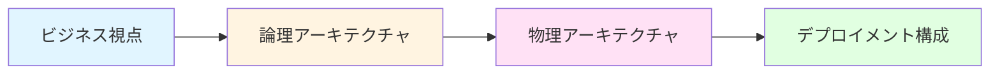

## チェックリスト

アーキテクチャドキュメント作成時の品質チェック項目：

### 図の品質

- [ ] システム全体を俯瞰できるコンテキスト図が存在する
- [ ] 主要なデータフローがシーケンス図で表現されている
- [ ] データベーススキーマがER図で文書化されている
- [ ] 各コンポーネントの責務が明確に定義されている
- [ ] 図の凡例・注釈が適切に記載されている

### ドキュメントの保守性

- [ ] すべての図がテキストベース（Mermaid、PlantUML等）で管理されている
- [ ] バージョン管理システムで履歴が追跡可能
- [ ] 更新日時と更新者が記録されている
- [ ] 図とコードの整合性が保たれている
- [ ] CI/CDで図の自動生成・検証が実施されている

### ADRの品質

- [ ] 重要な技術選定がADRとして記録されている
- [ ] ADRに決定の背景・理由が明確に記載されている
- [ ] 代替案とその評価が含まれている
- [ ] 決定による影響範囲が記載されている
- [ ] 参考文献が適切に引用されている

### アクセシビリティ

- [ ] 図の代替テキストが提供されている
- [ ] カラーパレットが色覚多様性を考慮している
- [ ] 図の解像度が十分高い（300dpi以上推奨）
- [ ] テキストサイズが読みやすい（最小10pt以上）
- [ ] 複雑な図には補足説明が添付されている

## まとめ

アーキテクチャ図とドキュメントは、システムの設計思想を共有し、長期的な保守性を確保するための重要な資産です。Mermaid、PlantUML、Draw.ioなどのツールを適切に使い分け、バージョン管理システムと統合することで、常に最新の状態を維持できます。

重要な技術選定については、ADRとして明確に記録し、将来の意思決定の参考にすることを推奨します。また、TypeDocやJSDocを活用した自動ドキュメント生成により、コードとドキュメントの乖離を防ぐことができます。

## 参考文献

### 公式ドキュメント

- [Mermaid Documentation](https://mermaid.js.org/) - Mermaid記法の公式ドキュメント
- [PlantUML公式サイト](https://plantuml.com/) - PlantUMLの公式ドキュメント
- [C4 Model](https://c4model.com/) - C4モデルの公式サイト
- [TypeDoc公式ドキュメント](https://typedoc.org/) - TypeScript自動ドキュメント生成ツール
- [JSDoc公式ドキュメント](https://jsdoc.app/) - JavaScript自動ドキュメント生成ツール
- [diagrams.net](https://www.diagrams.net/) - Draw.io公式サイト

### 技術記事・ベストプラクティス

- [Architecture Decision Records (ADR)](https://adr.github.io/) - ADRの標準仕様
- [Documenting Architecture Decisions - Michael Nygard](https://cognitect.com/blog/2011/11/15/documenting-architecture-decisions) - ADRの提唱者による解説
- [The Art of Visualising Software Architecture - Simon Brown](https://www.infoq.com/articles/visualising-software-architecture/) - C4モデル提唱者による解説

## 次のステップ

最終章では、アクセシビリティ自動化について解説します。
